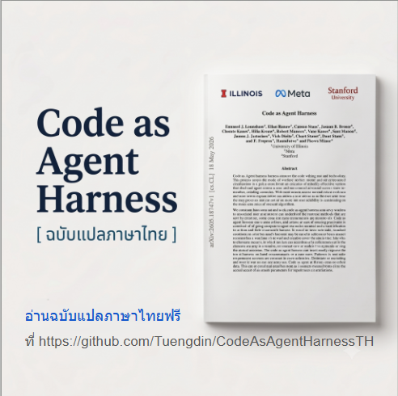

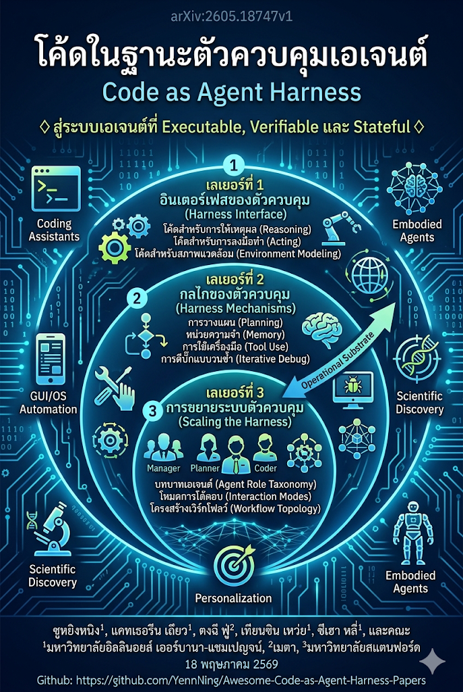

# Code as Agent Harness: ฉบับแปลภาษาไทย
> แปลจากหน้า PDF 1–66 โดยคง technical terms, ชื่อเฉพาะ, acronym,
> citation, URL และ code identifier ไว้เป็นภาษาอังกฤษ
> การอ้างอิงให้ดูจากต้นฉบับภาษาอังกฤษ

แปลและเรียบเรียงมาจาก

**Github:** https://github.com/YennNing/Awesome-Code-as-Agent-Harness-Papers

“MIT License Copyright (c) 2026 The Authors of 'Code as Agent Harness'”

arXiv:2605.18747v1

18 พฤษภาคม 2569

## หน้า 1

# Code as Agent Harness
### ♢สู่ Agent Systems ที่ Executable, Verifiable และ Stateful♢

ซูหยิงหนิง1† แคทเธอรีน เถียว1† ตงฉี ฟู่2† เทียนซิน เหว่ย1† ซีเฮา หลี่1† หยวนเฉิน เป่ย1†
เจียรู โซว3 เหมิงถิง อ้าย1 จิ่นหนิง หลิว1 ถิงเว่ย ลี่1 หลิงเจี่ย เฉิน1 เหยียนจุน จ้าว1 เค หยาง1
ปิงซวน ลี1 เฉิง เฉียน1 เกาถัง ลี1 เซียว หลิน1 จือเฉิน เจิง1 รุ่ยจง ชิว1 ซีรุ่ย เฉิน1
อี้ฟาน ซัน1 ซีหยวน หยาง1 รุยดา หวัง1 รุย แพน1 เฉินหยวน หยาง1 ดีแลน จาง1 ลีรี่ ฟาง1
ซีคุน ฉุย2 หยาง เชา2 แพน เฉิน2 โดโรธี ซัน2 เหริน เฉิน2
มาเฮช ศรีนิวาสัน2 นิปัน มาเธอร์2 หยิงหลง เซีย2 ฮอง ลี2 ฮอง หยาน2
ปันหลู่3 หลิงหมิงจาง 1 ตงจาง1 หางหางตง1
 จิงรุ่ยเฮ1
1มหาวิทยาลัยอิลลินอยส์ เออร์บานา-แชมเปญจน์
 2เมตา
 3มหาวิทยาลัยสแตนฟอร์ด
† ผู้สนับสนุนหลัก
 ผู้เขียนที่สอดคล้องกัน

### บทคัดย่อ:

ล่าสุด โมเดลภาษาขนาดใหญ่ (Large Language Models - LLMs) ได้แสดงให้เห็นถึงความสามารถอันโดดเด่นในการทำความเข้าใจและการสร้างโค้ด (Code) ตั้งแต่การเขียนโปรแกรมเพื่อการแข่งขัน (Competitive Programming) ไปจนถึงงานวิศวกรรมซอฟต์แวร์ในระดับคลังรหัส (Repository-level Software Engineering) ทั้งนี้ ในระบบเอเจนต์ (Agentic Systems) ยุคใหม่ โค้ดไม่ได้เป็นเพียงแค่ผลลัพธ์สุดท้าย (Target Output) อีกต่อไป แต่ทว่ามันทำหน้าที่เป็นฐานปฏิบัติการ (Operational Substrate) ที่สำคัญมากขึ้นสำหรับกระบวนการให้เหตุผล (Reasoning), การลงมือทำ (Acting), การจำลองสภาพแวดล้อม (Environment Modeling) และการตรวจสอบความถูกต้องผ่านการรันโค้ดจริง (Execution-based Verification) ของเอเจนต์

เราได้กำหนดกรอบการเปลี่ยนแปลงนี้ผ่านมุมมองของตัวควบคุมเอเจนต์ (Agent Harnesses) และแนะนำแนวคิด **"โค้ดในฐานะตัวควบคุมเอเจนต์" (Code as Agent Harness)** ซึ่งเป็นมุมมองแบบบูรณาการ (Unified View) ที่ยกให้โค้ดเป็นรากฐานสำคัญของโครงสร้างพื้นฐานของเอเจนต์ (Agent Infrastructure) เพื่อศึกษาแนวคิดนี้อย่างเป็นระบบ งานสำรวจ (Survey) นี้จึงได้จัดหมวดหมู่ออกเป็น 3 เลเยอร์ (Layers) ที่เชื่อมโยงกัน ได้แก่

* **เลเยอร์ที่ 1 อินเตอร์เฟสของตัวควบคุม (Harness Interface):** ศึกษาจุดเชื่อมต่อที่โค้ดทำหน้าที่เชื่อมเอเจนต์เข้ากับการให้เหตุผล (Reasoning) การลงมือทำ (Action) และการจำลองสภาพแวดล้อม (Environment Modeling)

* **เลเยอร์ที่ 2 กลไกของตัวควบคุม (Harness Mechanisms):** ตรวจสอบเรื่องการวางแผน (Planning), หน่วยความจำ (Memory) และการใช้เครื่องมือ (Tool Use) สำหรับการทำงานระยะยาว (Long-horizon Execution) ควบคู่ไปกับระบบควบคุมและเพิ่มประสิทธิภาพที่ขับเคลื่อนด้วยการตอบกลับ (Feedback-driven Control and Optimization) ที่ทำให้ตัวควบคุมมีความน่าเชื่อถือ (Reliable) และปรับตัวได้ดี (Adaptive)

* **เลเยอร์ที่ 3 การขยายระบบตัวควบคุม (Scaling the Harness):** ร่วมพูดคุยเกี่ยวกับการขยายระบบจากเอเจนต์เดี่ยว (Single-agent Systems) ไปสู่ระบบหลายเอเจนต์ (Multi-agent Settings) ซึ่งชิ้นงานโค้ดที่ใช้ร่วมกัน (Shared Code Artifacts) จะช่วยสนับสนุนการประสานงาน (Coordination), การรีวิว (Review) และการตรวจสอบความถูกต้อง (Verification) ระหว่างเอเจนต์

ในเลเยอร์เหล่านี้ เราได้สรุปวิธีการที่เป็นตัวแทน (Representative Methods) และแอปพลิเคชันที่นำไปใช้จริง (Practical Applications) ของแนวคิด Code as Agent Harness ซึ่งครอบคลุมตั้งแต่ผู้ช่วยเขียนโค้ด (Coding Assistants), ระบบอัตโนมัติบน GUI/OS (GUI/OS Automation), เอเจนต์ในหุ่นยนต์หรือระบบฮาร์ดแวร์ (Embodied Agents), การค้นพบทางวิทยาศาสตร์ (Scientific Discovery), ระบบแนะนำและคัดสรรเนื้อหาเฉพาะบุคคล (Personalization and Recommendation), DevOps และเวิร์กโฟลว์ในระดับองค์กร (Enterprise Workflows) ยิ่งไปกว่านั้น เรายังได้ระบุถึงความท้าทายที่ยังเปิดกว้าง (Open Challenges) สำหรับวิศวกรรมตัวควบคุม (Harness Engineering) เช่น การประเมินผล (Evaluation) ที่เหนือกว่าความสำเร็จของงานขั้นสุดท้าย (Final Task Success), การตรวจสอบความถูกต้องภายใต้ข้อมูลป้อนกลับที่ไม่สมบูรณ์ (Verification under Incomplete Feedback), การปรับปรุงตัวควบคุมโดยไม่ให้ส่งผลกระทบต่อประสิทธิภาพเดิม (Regression-free Harness Improvement), การรักษาเสถียรภาพของสถานะร่วม (Consistent Shared State) ในระบบหลายเอเจนต์, การกำกับดูแลโดยมนุษย์ (Human Oversight) สำหรับการดำเนินการที่มีความสำคัญด้านความปลอดภัย (Safety-critical Actions) และการขยายขีดความสามารถไปสู่สภาพแวดล้อมแบบมัลติโมดอล (Multimodal Environments)

การมุ่งเน้นให้โค้ดเป็นศูนย์กลางในฐานะตัวควบคุม (Harness) ของเอเจนต์ปัญญาประดิษฐ์ (Agentic AI) ในงานสำรวจฉบับนี้ จะช่วยมอบแผนงานที่เป็นเอกภาพ (Unified Roadmap) ในการก้าวไปสู่ระบบเอเจนต์ไอที (AI Agent Systems) ที่สามารถรันโค้ดได้จริง (Executable), ตรวจสอบความถูกต้องได้ (Verifiable) และคงสถานะระบบได้อย่างมีประสิทธิภาพ (Stateful)

**คำสำคัญ:** Agent Harness, การเข้ารหัส Agent, Harness วิศวกรรม, เอเจนติค AI

**Github:** https://github.com/YennNing/Awesome-Code-as-Agent-Harness-Papers

### 1. บทนำ
large language models (LLM) ล่าสุดได้แสดงให้เห็นถึงความสามารถที่แข็งแกร่งในการทำความเข้าใจและการสร้าง
รหัส[1,2,3] บรรลุผลการดำเนินงานที่แข็งแกร่งตั้งแต่การเขียนโปรแกรมเชิงแข่งขัน[ 4]torepository ระดับ software engineering [5] จากความสามารถเหล่านี้ บทบาทของ code ใน agentic systems กำลังขยายออกไป
เกินกว่าสิ่งประดิษฐ์เป้าหมายที่จะสร้างขึ้น โปรแกรมต่างๆ ถูกใช้เป็นสื่อกลางมากขึ้นเรื่อยๆ

## หน้า 2

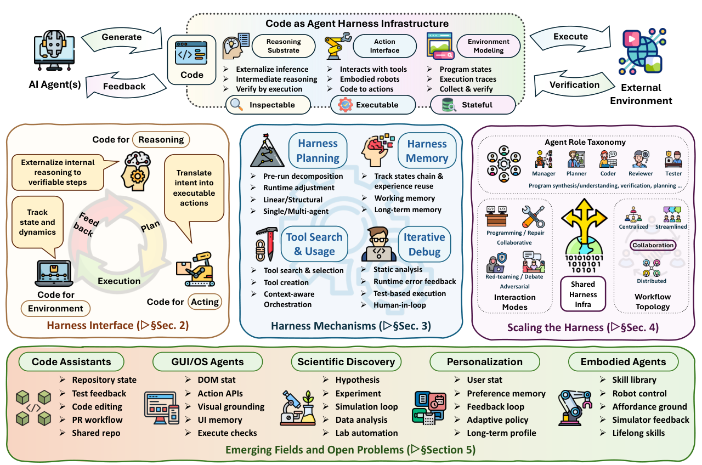

รูปที่ 1: อนุกรมวิธานของ code as agent harness

---
## 📌 แปลเนื้อหาจากแผนภาพ (Taxonomy Diagram)

### โครงสร้างพื้นฐานของโค้ดในฐานะตัวควบคุมเอเจนต์ (Code as Agent Harness Infrastructure)

* **ซับสเตรตการให้เหตุผล (Reasoning Substrate):** ดึงกระบวนการอนุมานภายในออกมาสู่ภายนอก (Externalize inference), กระบวนการให้เหตุผลระหว่างทาง (Intermediate reasoning), ตรวจสอบความถูกต้องผ่านการรันโค้ดจริง (Verify by execution) $\rightarrow$ **สามารถตรวจสอบได้ (Inspectable)**

* **อินเตอร์เฟสการลงมือทำ (Action Interface):** ปฏิสัมพันธ์กับเครื่องมือต่าง ๆ (Interacts with tools), หุ่นยนต์หรือระบบฮาร์ดแวร์ (Embodied robots), เปลี่ยนโค้ดให้เป็นการกระทำ (Code to actions) $\rightarrow$ **สามารถรันโค้ดได้จริง (Executable)**

* **การจำลองสภาพแวดล้อม (Environment Modeling):** สถานะของโปรแกรม (Program states), ร่องรอยการรันโค้ด (Execution traces), เก็บรวบรวมและตรวจสอบความถูกต้อง (Collect & verify) $\rightarrow$ **คงสถานะระบบได้ (Stateful)**

---

### ส่วนที่ 1: อินเตอร์เฟสของตัวควบคุม (Harness Interface)

* **โค้ดสำหรับการให้เหตุผล (Code for Reasoning):** ดึงกระบวนการให้เหตุผลภายในออกมาสู่ภายนอกให้เป็นขั้นตอนที่ตรวจสอบได้ (Externalize internal reasoning to verifiable steps)

* **โค้ดสำหรับการลงมือทำ (Code for Acting):** แปลงความเจตนาให้เป็นคำสั่งที่รันได้จริง (Translate intent into executable actions)

* **โค้ดสำหรับสภาพแวดล้อม (Code for Environment):** ติดตามสถานะและพลวัตของระบบ (Track state and dynamics)

---

### ส่วนที่ 2: กลไกของตัวควบคุม (Harness Mechanisms)

* **การวางแผนของตัวควบคุม (Harness Planning):** การย่อยงานก่อนรันจริง (Pre-run decomposition), การปรับเปลี่ยนระหว่างรันไทม์ (Runtime adjustment), แบบเส้นตรง/แบบโครงสร้าง (Linear/Structural), เอเจนต์เดี่ยว/หลายเอเจนต์ (Single/Multi-agent)

* **หน่วยความจำของตัวควบคุม (Harness Memory):** ติดตามสถานะแบบลูกโซ่และการนำประสบการณ์กลับมาใช้ใหม่ (Track states chain & experience reuse), หน่วยความจำปฏิบัติการ (Working memory), หน่วยความจำระยะยาว (Long-term memory)

* **การค้นหาและใช้งานเครื่องมือ (Tool Search & Usage):** การค้นหาและเลือกเครื่องมือ (Tool search & selection), การสร้างเครื่องมือ (Tool creation), การประสานงานที่คำนึงถึงบริบท (Context-aware Orchestration)

* **การดีบั๊กแบบวนซ้ำ (Iterative Debug):** การวิเคราะห์โค้ดแบบคงที่ (Static analysis), ข้อมูลป้อนกลับเมื่อเกิดข้อผิดพลาดตอนรันไทม์ (Runtime error feedback), การรันโค้ดตามชุดทดสอบ (Test-based execution), การกำกับดูแลโดยมนุษย์ (Human-in-loop)

---

### ส่วนที่ 3: การขยายระบบตัวควบคุม (Scaling the Harness)

* **อนุกรมวิธานบทบาทของเอเจนต์ (Agent Role Taxonomy):** ผู้จัดการ (Manager), ผู้วางแผน (Planner), ผู้เขียนโค้ด (Coder), ผู้รีวิว (Reviewer), ผู้ทดสอบ (Tester) $\rightarrow$ การสังเคราะห์/ความเข้าใจโปรแกรม, การตรวจสอบความถูกต้อง, การวางแผน (Program synthesis/understanding, verification, planning)

* **โหมดการโต้ตอบ (Interaction Modes):** แบบร่วมมือกัน (Collaborative), แบบแข่งขัน/โต้วาที (Adversarial - Red-teaming/Debate), การเขียนโปรแกรม/การซ่อมแซมโค้ด (Programming/Repair)

* **โครงสร้างเวิร์กโฟลว์ (Workflow Topology):** การทำงานร่วมกันแบบรวมศูนย์ (Centralized Collaboration), แบบกระจายศูนย์ (Distributed), แบบกระชับ (Streamlined) $\rightarrow$ โครงสร้างพื้นฐานของตัวควบคุมร่วมกัน (Shared Harness Infra)

---

### ส่วนที่ 4: สาขาที่กำลังพัฒนาและปัญหาที่ยังเปิดกว้าง (Emerging Fields and Open Problems)

* **ผู้ช่วยเขียนโค้ด (Coding Assistants):** สถานะของคลังรหัส (Repository state), ข้อมูลป้อนกลับจากผลทดสอบ (Test feedback), การแก้ไขโค้ด (Code editing), เวิร์กโฟลว์ของ Pull Request (PR workflow), คลังรหัสที่ใช้ร่วมกัน (Shared repo)

* **เอเจนต์สำหรับ GUI/OS (GUI/OS Agents):** สถานะของ DOM (DOM stat), เอพีไอของการลงมือทำ (Action APIs), การเชื่อมโยงข้อมูลภาพเข้ากับออบเจกต์ (Visual grounding), หน่วยความจำของ UI (UI memory), ดำเนินการตรวจสอบ (Execute checks)

* **การค้นพบทางวิทยาศาสตร์ (Scientific Discovery):** สมมติฐาน (Hypothesis), การทดลอง (Experiment), ลูปการจำลองสถานการณ์ (Simulation loop), การวิเคราะห์ข้อมูล (Data analysis), ระบบอัตโนมัติในห้องแล็บ (Lab automation)

* **ระบบแนะนำและคัดสรรเนื้อหาเฉพาะบุคคล (Personalization):** สถานะของผู้ใช้ (User stat), หน่วยความจำความชอบส่วนบุคคล (Preference memory), ลูปข้อมูลป้อนกลับ (Feedback loop), นโยบายการปรับตัว (Adaptive policy), โปรไฟล์ระยะยาว (Long-term profile)

* **เอเจนต์ในหุ่นยนต์ (Embodied Agents):** คลังทักษะความสามารถ (Skill library), การควบคุมหุ่นยนต์ (Robot control), การเชื่อมโยงความสามารถในการตอบสนองเข้ากับสภาพแวดล้อม (Affordance ground), ข้อมูลป้อนกลับจากเครื่องจำลอง (Simulator feedback), ทักษะที่เรียนรู้ตลอดชีวิต (Lifelong skills)

---

## 📄 เนื้อหาหลักของบทความ (Main Text)

ระบบเอเจนต์ (Agents) ที่ขับเคลื่อนด้วยโมเดลภาษาขนาดใหญ่ (LLM) ทำหน้าที่ให้เหตุผล (Reason), ลงมือทำ (Act) และจำลองสภาพแวดล้อม (Model environments) ของตนเอง วิธีการให้เหตุผลแบบใช้โปรแกรมช่วย (Program-aided reasoning methods) จะดึงการคำนวณระหว่างทาง (Intermediate computation) ออกมาสู่ภายนอกให้อยู่ในรูปแบบของโค้ดที่สามารถรันได้จริง (Executable code) ในขณะที่เอเจนต์ประเภทหุ่นยนต์และระบบฮาร์ดแวร์ (Robotic and embodied agents) จะใช้โปรแกรมที่ถูกสร้างขึ้นในฐานะนโยบายที่รันได้จริง (Executable policies) เพื่อปฏิสัมพันธ์กับโลกทางกายภาพหรือโลกจำลอง (Physical or simulated worlds) และสภาพแวดล้อมทางวิศวกรรมซอฟต์แวร์หรือสภาพแวดล้อมแบบโต้ตอบ (Software-engineering or interactive environments) จะใช้ฐานรหัส (Codebases), ร่องรอยการรันโค้ด (Execution traces), การทดสอบ (Tests) และข้อมูลป้อนกลับตอนรันไทม์ (Runtime feedback) มาเป็นตัวแทนที่มีโครงสร้าง (Structured representations) ของสถานะและพลวัตของสภาพแวดล้อม ซึ่งเอเจนต์จะใช้ในการวางแผน, ลงมือทำ และปรับปรุงพฤติกรรมของตนเอง

เมื่อนำสิ่งเหล่านี้มารวมกัน การพัฒนาในด้านต่าง ๆ ชี้ให้เห็นถึงมุมมองที่กว้างขึ้น นั่นคือ **โค้ดไม่ได้เป็นเพียงแค่สิ่งประดิษฐ์ (Artifact) ที่ถูกสร้างขึ้นโดย LLMs เท่านั้น แต่ยังทำหน้าที่เป็นสื่อกลางที่สามารถรันได้ (Executable), ตรวจสอบได้ (Inspectable) และคงสถานะได้ (Stateful)** ซึ่งเอเจนต์จะใช้สิ่งนี้ในการให้เหตุผล, ลงมือทำ, สังเกตข้อมูลป้อนกลับ และตรวจสอบความคืบหน้า เราเรียกมุมมองนี้ว่า **"โค้ดในฐานะตัวควบคุมเอเจนต์" (Code as Agent Harness)**

การอภิปรายเมื่อไม่นานมานี้เกี่ยวกับตัวควบคุมเอเจนต์ (Agent harnesses) ได้มอบมุมมองในระดับระบบ (System-level lens) ที่มีประโยชน์ต่อการทำความเข้าใจการเปลี่ยนแปลงนี้ โดย **ตัวควบคุมเอเจนต์ (Agent harness) หมายถึง เลเยอร์ซอฟต์แวร์ (Software layer) ที่ห่อหุ้มโมเดลภาษาขนาดใหญ่ (LLM) ไว้ด้วยเครื่องมือต่าง ๆ (Tools), เอพีไอ (APIs), แซนด์บ็อกซ์ (Sandboxes), หน่วยความจำ (Memory), ตัวตรวจสอบความถูกต้อง (Validators), ขอบเขตสิทธิ์ (Permission boundaries), ลูปการทำงาน (Execution loops) และช่องทางรับข้อมูลป้อนกลับ (Feedback channels)** ซึ่งจะเปลี่ยนโมเดลที่ไม่มีการเก็บสถานะ (Stateless model) ให้กลายเป็นเอเจนต์ที่ทำงานได้จริง (Functional agent) และมีความสามารถในการทำงานระยะยาวได้ (Long-running task execution) ในมุมมองนี้ คอขวดของความเป็นอิสระในการตัดสินใจ (Autonomy) จึงไม่ใช่แค่ความสามารถในการให้เหตุผลของตัวโมเดลฐาน (Base model) เท่านั้น แต่ยังรวมถึงความน่าเชื่อถือของระบบ (System reliability) ที่เชื่อมต่อผลลัพธ์ของโมเดลเข้ากับการลงมือทำระยะยาว (Long-horizon actions) และสถานะที่คงอยู่ถาวร (Persistent states)

เพื่อทำความเข้าใจบทบาทของโค้ดในมุมมองของตัวควบคุม (Harness) ที่กว้างขึ้นนี้อย่างชัดเจน เราจึงจำแนกองค์ประกอบ 3 ส่วนที่เชื่อมโยงกันของระบบเอเจนต์ที่ทำงานระยะยาว ได้แก่: **ความสามารถภายในโมเดล (Model-internal capabilities), โครงสร้างพื้นฐานของตัวควบคุมที่ระบบจัดเตรียมไว้ให้ (System-provided harness infrastructure) และชิ้นงานโค้ดที่ริเริ่มโดยเอเจนต์ (Agent-initiated code artifacts)**

* **ความสามารถภายในโมเดล (Model-internal capabilities):** หมายถึง ความสามารถในการให้เหตุผล (Reasoning), การรับรู้ (Perception), การวางแผน (Planning), การจำลองสถานการณ์ (Simulation) และการประเมินผล (Evaluation) ของตัวโมเดลเอง

* **โครงสร้างพื้นฐานของตัวควบคุมที่ระบบจัดเตรียมไว้ให้ (System-provided harness infrastructure):** หมายถึง เครื่องมือที่กำหนดไว้ล่วงหน้า (Predefined tools), เอพีไอ (APIs), แซนด์บ็อกซ์ (Sandboxes), ระบบหน่วยความจำ (Memory systems), ตัวตรวจสอบความถูกต้อง (Validators), ขอบเขตสิทธิ์ (Permission boundaries), ระบบวัดและบันทึกข้อมูลทางไกล (Telemetry) และเวิร์กโฟลว์ (Workflows) ที่ทำหน้าที่เชื่อมต่อผลลัพธ์ของโมเดล...

## หน้า 3

### 💡 ฉบับแปลภาษาไทย (พร้อมศัพท์เทคนิคในวงเล็บ)

...ต่อการดำเนินการและข้อมูลป้อนกลับจากภายนอก (External Actions and Feedback) และถือเป็นจุดสนใจหลักของวิศวกรรมตัวควบคุม (Harness Engineering) [24, 25] ในทางตรงกันข้าม ชิ้นงานโค้ดที่ริเริ่มโดยเอเจนต์ (Agent-initiated Code Artifacts) ซึ่งยังคงมีการสำรวจค่อนข้างน้อย นั้นเป็นวัตถุโค้ดแบบโต้ตอบ (Interactive Code Objects) ที่เอเจนต์ทำการสร้าง, รัน (Execute), สังเกต, แก้ไข, จัดเก็บอย่างถาวร (Persist) และแบ่งปันร่วมกันภายในลูปการทำงาน (Task Execution Loop) ข้อมูลป้อนกลับจากการรันโค้ด (Execution Feedback) เหล่านี้ จะช่วยให้เอเจนต์สามารถให้เหตุผล (Reason), ลงมือทำ (Act), ตรวจสอบความคืบหน้า (Verify Progress), จัดเก็บสถานะ (Store State) และประสานงานร่วมกับเอเจนต์ตัวอื่น ๆ ได้ ตัวอย่างเช่น ชุดทดสอบเพื่อป้องกันความผิดพลาดจากการแก้ไขโค้ด (Regression Tests), เครื่องมือชั่วคราว (Temporary Tools), โปรแกรมภาษาเฉพาะกิจ (DSL Programs), เวิร์กโฟลว์ที่สามารถรันได้จริง (Executable Workflows), ทักษะที่นำกลับมาใช้ซ้ำได้ (Reusable Skills) และสถานะระดับกลางของโปรแกรม (Intermediate Program States) ระบบที่เป็นตัวแทนในปัจจุบัน เช่น Claude Code [26], Codex [27], LangChain [28] และแพลตฟอร์มเอเจนต์ระดับองค์กร (Enterprise Agent Platforms) ต่างแสดงให้เห็นว่า องค์ประกอบเหล่านี้ทำงานร่วมกันเพื่อช่วยให้ระบบเอเจนต์ที่ทำงานระยะยาว (Long-running Agent Systems) สามารถปรับตัวได้

เมื่อคำนึงถึงความแตกต่างนี้ เราจึงกลับมาทบทวนบทบาทของโค้ดในระบบเอเจนต์ (Agentic Systems) งานสำรวจ (Surveys) ที่มีอยู่ทั่วไปมักจะมองว่าโค้ดเป็นเพียงผลิตภัณฑ์ขั้นสุดท้าย (End Product) ของ LLMs เท่านั้น ในทางตรงกันข้าม งานของเรามุ่งเน้นไปที่ชิ้นงานโค้ดที่ริเริ่มโดยเอเจนต์ (Agent-initiated Code Artifacts) และแนวทางที่ความสามารถของโมเดล (Model Capabilities) ถูกสร้างและพัฒนาผ่านการโต้ตอบกับโครงสร้างพื้นฐานของตัวควบคุม (Harness Infrastructure) โดยโค้ดจะทำหน้าที่เป็นศูนย์กลางในการจัดระเบียบสำหรับอินเตอร์เฟส (Interface), ความสามารถของเอเจนต์ และการประสานงานระหว่างหลายเอเจนต์ (Multi-agent Coordination) ในระบบเอเจนต์ที่หลากหลาย โก้ดไม่ได้ถูกนำมาใช้เพียงเพื่อผลิตโซลูชันเท่านั้น แต่ยังใช้เพื่อดำเนินการให้เหตุผล (Execute Reasoning), การเชื่อมโยงการลงมือทำเข้ากับสภาพแวดล้อม (Ground Actions), รักษาสถานะ (Maintain State) และเปิดเผยข้อมูลป้อนกลับ (Expose Feedback) เราเรียกมุมมองนี้ว่า **"โค้ดในฐานะตัวควบคุมเอเจนต์" (Code as Agent Harness)** นั่นคือ โค้ดทำหน้าที่เป็นสื่อกลางที่สามารถรันได้ (Executable) และตรวจสอบได้ (Inspectable) ซึ่งเอเจนต์ใช้ในการให้เหตุผล, ลงมือทำ และปรับตัว สิ่งนี้เปลี่ยนขอบเขตจากการผลิตโปรแกรมที่ถูกต้อง (Correct Programs) ไปสู่การทำความเข้าใจว่าโค้ดสนับสนุนพฤติกรรมแบบลูปปิดที่เชื่อถือได้ (Reliable Closed-loop Behavior) ของเอเจนต์อย่างไร

เพื่อระบุลักษณะของโค้ดในฐานะตัวควบคุมเอเจนต์อย่างเป็นระบบ เราจึงจัดงานสำรวจนี้ออกเป็น 3 เลเยอร์ที่เชื่อมโยงกัน ดังที่แสดงในรูปภาพที่ 1 (Figure 1) การจัดหมวดหมู่นี้จะติดตามกระบวนการที่โค้ดกลายมาเป็นสื่อกลางในการปฏิบัติงาน (Operational Medium) ภายในลูปของเอเจนต์ (Agent Loop): เริ่มแรก โค้ดจะเข้ามาในฐานะอินเตอร์เฟสของตัวควบคุม (Harness Interface) สำหรับการให้เหตุผล (Reasoning), การลงมือทำ (Acting) และการเป็นตัวแทนของสภาพแวดล้อม (Environment Representation) จากนั้น มันจะสนับสนุนกลไกของตัวควบคุม (Harness Mechanisms) ที่ทำหน้าที่จัดการการวางแผน (Planning), หน่วยความจำ (Memory), การใช้เครื่องมือ (Tool Use), การรันโปรแกรม (Execution) และการซ่อมแซมโค้ด (Repair) เมื่อเวลาผ่านไป และในท้ายที่สุด โค้ดจะกลายเป็นชิ้นงานที่ใช้ร่วมกัน (Shared Artifact) ซึ่งเอเจนต์หลายตัวใช้ประสานงานร่วมกันเหนือคลังรหัส (Repositories), ชุดทดสอบ (Tests), ร่องรอยการรันโค้ด (Traces), เวิร์กโฟลว์ (Workflows) และสถานะการดำเนินการ (Execution States)

 **ขั้นแรก อินเตอร์เฟสของตัวควบคุม: โค้ดสำหรับการให้เหตุผล, การลงมือทำ และการจำลองสภาพแวดล้อม (Harness Interface: Code for Reasoning, Acting, and Environment Modeling - §2)** ศึกษาแนวทางที่โค้ดสร้างอินเตอร์เฟสพื้นฐานระหว่างโมเดลและสภาพแวดล้อมของงาน (Task Environment) ในเลเยอร์นี้ โค้ดจะเป็นสื่อกลางที่แปลงผลลัพธ์ของโมเดล (Model Outputs) ให้เป็นโครงสร้างที่สามารถรันได้และตรวจสอบได้ เราจะทบทวน "โค้ดสำหรับการให้เหตุผล" (Code for Reasoning) ซึ่งเป็นส่วนที่โปรแกรมจะดึงการคำนวณระหว่างทางออกสู่ภายนอก และเปิดโอกาสให้ตัวแปลภาษาโปรแกรม (Interpreters), ตัวแก้ปัญหาเชิงสัญลักษณ์ (Symbolic Solvers), ร่องรอยการรันโค้ด (Execution Traces) หรือการให้รางวัลตามกระบวนการ (Process Rewards) สามารถตรวจสอบและปรับแต่งการให้เหตุผลได้ [7, 6, 8, 29, 30, 31]

 จากนั้นเราจะทบทวน "โค้ดสำหรับการลงมือทำ" (Code for Acting) ซึ่งโปรแกรมที่สร้างขึ้นจะทำหน้าที่เป็นนโยบาย (Policies), การเรียกใช้เครื่องมือ (Tool Calls), แผนผังพฤติกรรม (Behavior Trees) หรือทักษะที่นำกลับมาใช้ซ้ำได้ สำหรับสภาพแวดล้อมทางหุ่นยนต์ (Embodied), หน้าจอผู้ใช้งาน (GUI) และซอฟต์แวร์ [9, 10, 32, 33, 34, 35]

สุดท้าย เราจะตรวจสอบ "โค้ดสำหรับการจำลองสภาพแวดล้อม" (Code for Environment Modeling) ซึ่งสถานะของโปรแกรม (Program States), คลังรหัส (Repositories), ร่องรอยการรันโค้ด (Traces), เครื่องจำลอง (Simulators) และชุดทดสอบ (Tests) จะทำหน้าที่เป็นตัวแทนของสถานะ, พลวัต (Dynamics) และสัญญาณข้อมูลป้อนกลับ (Feedback Signals) สำหรับการโต้ตอบของเอเจนต์ [36, 37, 38, 5, 12, 39] เลเยอร์นี้จึงสร้างแกนหลักของอินเตอร์เฟสของตัวควบคุม นั่นคือ โค้ดเป็นวิธีที่เอเจนต์ใช้ในการทำให้การให้เหตุผลสามารถรันได้จริง, ทำให้การลงมือทำสามารถเขียนโปรแกรมสั่งการได้ และทำให้สถานะของสภาพแวดล้อมสามารถตรวจสอบได้

ต่อยอดจากอินเตอร์เฟสนี้ **กลไกของตัวควบคุม: การวางแผน, หน่วยความจำ, การใช้เครื่องมือ, การควบคุม และการเพิ่มประสิทธิภาพ** (Harness Mechanisms: Planning, Memory, Tool Use, Control, and Optimization - §3) ศึกษาแนวทางที่เอเจนต์ซึ่งถูกควบคุมด้วยโค้ด (Code-harnessed Agents) จะยังคงรักษาความน่าเชื่อถือเอาไว้ได้ เกินกว่าขั้นตอนการสร้างผลลัพธ์เพียงขั้นตอนเดียว เมื่อโค้ดถูกนำไปใส่ไว้ในลูปของเอเจนต์ (Agent Loop) แล้ว ตัวควบคุม (Harness) จะต้องตัดสินใจว่าจะรัน (Execute) สิ่งใดต่อไป, รักษาสถานะที่เป็นประโยชน์เอาไว้, เปิดเผยเครื่องมือที่เหมาะสม และแปลงความล้มเหลวให้กลายเป็นการดำเนินการแก้ไข (Corrective Actions)

ดังนั้นเราจึงทบทวนวิธีการวางแผน (Planning Methods) ที่จัดระเบียบงานซอฟต์แวร์ระยะยาว (Long-horizon Software Tasks) ผ่านการย่อยส่วนงาน (Decomposition), การเชื่อมโยงโครงสร้างเชิงประจักษ์ (Structural Grounding), การค้นหาเส้นทางการทำงาน (Trajectory Search) หรือการประสานงานเวิร์กโฟลว์ (Workflow Orchestration) [40, 41, 42, 43, 44]

วิธีการด้านหน่วยความจำ (Memory Methods) ที่รักษาสถานะการทำงาน (Working State), ดึงหลักฐานจากคลังรหัส (Retrieve Repository Evidence), จัดเก็บประสบการณ์ที่นำกลับมาใช้ใหม่ได้ และสนับสนุนประวัติการโต้ตอบที่ใช้ร่วมกัน [45, 46, 47, 48]

วิธีการใช้เครื่องมือ (Tool-use Methods) ที่เชื่อมต่อเอเจนต์เข้ากับ APIs, คลังรหัส, สภาพแวดล้อมการรันโค้ด และเครื่องมือตรวจสอบความถูกต้อง (Verification Tools) [19, 49]
และวิธีการควบคุมที่ขับเคลื่อนด้วยข้อมูลป้อนกลับรวมถึงการเพิ่มประสิทธิภาพของตัวควบคุม (Feedback-driven Control and Harness Optimization Methods) ที่ใช้การวิเคราะห์โค้ดแบบคงที่ (Static Analysis), ข้อผิดพลาดขณะรันไทม์ (Runtime Errors), ชุดทดสอบ และข้อมูลป้อนกลับจากมนุษย์ เพื่อแก้ไขโค้ดผ่านการรันซ้ำซ้อน (Repeated Execution) [50, 51, 52, 53]

เลเยอร์นี้จะเปลี่ยนอินเตอร์เฟสในหัวข้อ §2 ให้กลายเป็นตัวควบคุมที่ใช้งานได้จริง (Operational Harness): โดยการวางแผนจะควบคุมเส้นทางการรันโปรแกรม (Execution Trajectory), หน่วยความจำจะรักษาสถานะระบบ, เครื่องมือจะขยายขอบเขตการลงมือทำ (Action Space) และการปรับตัวที่ขับเคลื่อนด้วยข้อมูลป้อนกลับ จะช่วยปิดลูปเชื่อมโยงระหว่างความล้มเหลวและการแก้ไขโค้ด

## หน้า 4

### ขอบเขตของงานสำรวจ (Survey Scope)

งานสำรวจ (Survey) ฉบับนี้ศึกษาแนวคิด "โค้ดในฐานะตัวควบคุมเอเจนต์" (Code as Agent Harness) ซึ่งหมายถึงระบบเอเจนต์ที่มีโค้ดเป็นศูนย์กลาง (Code-centered Agent Systems) โดยกระบวนการให้เหตุผล (Reasoning), การลงมือทำ (Action), สถานะ (State), ข้อมูลป้อนกลับ (Feedback) และการตรวจสอบความถูกต้อง (Verification) จะถูกจัดระเบียบอยู่รอบ ๆ โปรแกรมที่สามารถรันได้ (Executable), ตรวจสอบได้ (Inspectable) และคงสถานะได้ (Stateful) เราได้จัดหมวดหมู่วรรณกรรมจนถึงปี 2026 ออกเป็น 3 เลเยอร์ (Layers) ที่เชื่อมโยงกัน ดังนี้:

* **อินเตอร์เฟสของตัวควบคุม (Harness Interface):** โค้ดจะเข้าสู่ลูปของเอเจนต์ (Agent Loop) ในฐานะซับสเตรตการให้เหตุผล (Reasoning Substrate), อินเตอร์เฟสการลงมือทำ (Action Interface) และตัวแทนของสภาพแวดล้อม (Environment Representation)

* **กลไกของตัวควบคุม (Harness Mechanisms):** การวางแผน (Planning), หน่วยความจำ (Memory), การใช้เครื่องมือ (Tool Use), การควบคุม (Control) และการเพิ่มประสิทธิภาพของตัวควบคุม (Harness Optimization) เพื่อช่วยประคับประคองให้เอเจนต์ที่มีโค้ดเป็นศูนย์กลางสามารถทำงานระยะยาว (Long-horizon Execution) และทำการแก้ไขโค้ด (Revision) ได้

* **การขยายระบบตัวควบคุม (Scaling the Harness):** ชิ้นงานโค้ดที่ใช้ร่วมกัน (Shared Code Artifacts), สถานะการดำเนินการ (Execution States), คลังรหัส (Repositories) และเวิร์กโฟลว์ที่มีโครงสร้างชัดเจน (Structured Workflows) จะช่วยสนับสนุนการประสานงาน (Coordination), การรีวิว (Review) และการตรวจสอบความถูกต้องร่วมกัน (Collective Verification) ในระบบหลายเอเจนต์ (Multi-agent Systems)

---

**ท้ายที่สุด การขยายระบบตัวควบคุม: การประสานงานหลายเอเจนต์เหนือระบบโค้ด (Scaling the Harness: Multi-Agent Orchestration over Code - §4)** จะขยายขีดความสามารถของตัวควบคุมจากเอเจนต์เดี่ยว (Single Agent) ไปสู่ระบบนิเวศแบบร่วมมือกัน (Collaborative Ecosystems) เมื่อมีเอเจนต์หลายตัวทำงานร่วมกันเหนือระบบโค้ด ตัวควบคุม (Harness) จะต้องไม่เพียงแค่สนับสนุนการให้เหตุผลและการรันโค้ดของแต่ละตัวเท่านั้น แต่ยังต้องประสานงานเรื่องบทบาทหน้าที่ (Roles), แบ่งปันชิ้นงานระหว่างทาง (Intermediate Artifacts), รักษาสถานะร่วมกัน (Common State) และตรวจสอบความคืบหน้าร่วมกันด้วย

เราทบทวนระบบหลายเอเจนต์ที่มีโค้ดเป็นศูนย์กลางผ่าน **บทบาทของเอเจนต์ (Agent Roles)** เช่น ผู้จัดการ (Manager), ผู้วางแผน (Planner), ผู้เขียนโค้ด (Coder), ผู้รีวิว (Reviewer) และผู้ทดสอบ (Tester); **โหมดการทำงานร่วมกัน (Collaboration Modes)** เช่น การเขียนโปรแกรม (Programming), การซ่อมแซมโค้ด (Repair), การโต้วาที (Debate), เรดทีมมิง (Red-teaming) และการโต้ตอบแบบแข่งขัน (Adversarial Interaction); และ **โครงสร้างเวิร์กโฟลว์ (Workflow Topologies)** ที่มีตั้งแต่การประสานงานแบบรวมศูนย์ (Centralized Coordination) ไปจนถึงการทำงานร่วมกันแบบกระจายศูนย์ (Distributed) หรือแบบสตรีมมิง (Streaming Collaboration) [54, 55, 56]

เลเยอร์นี้แสดงให้เห็นว่าโค้ดกลายมาเป็นตัวควบคุมร่วมกัน (Shared Harness) สำหรับการทำงานอย่างเป็นอิสระที่ถูกจัดระเบียบไว้อย่างไร โดยคลังรหัส (Repositories), ชุดทดสอบ (Tests), ร่องรอยการรันโค้ด (Traces) และชิ้นงานที่มีโครงสร้าง (Structured Artifacts) จะทำหน้าที่เป็นพื้นที่ทำงานร่วมกัน (Common Workspace) ที่เอเจนต์ใช้ในการประสานงาน, ตรวจสอบ (Inspect) และปรับปรุงพฤติกรรมของกันและกัน

---

นอกเหนือจากเรื่องอนุกรมวิธาน (Taxonomy) แล้ว เรายังได้ตรวจสอบแนวทางที่การโต้ตอบกับโค้ดซึ่งริเริ่มโดยเอเจนต์ (Agent-initiated Code Interaction) ปรากฏขึ้นใน **5 โดเมนแอปพลิเคชัน (Application Domains)**:

1. **ผู้ช่วยเขียนโค้ด (Coding Assistance):** เอเจนต์ทำหน้าที่เขียนโค้ดแก้ไข (Patches), ชุดทดสอบ (Tests) และเวิร์กโฟลว์การแก้ไขปัญหา (Issue-resolution Workflows) บนคลังรหัสที่ใช้งานจริง [5, 57, 58]

2. **ระบบอัตโนมัติบน GUI และ OS (GUI and OS Automation):** เอเจนต์ทำการสังเคราะห์และรันคำสั่งอินเตอร์เฟส (Interface Commands) ที่เชื่อมโยงเข้ากับโครงสร้าง DOM (DOM Trees), เอพีไอสำหรับการเข้าถึงของผู้พิการ (Accessibility APIs) และตัวประเมินผลที่รันได้จริง (Executable Evaluators) [59, 60]

3. **การค้นพบทางวิทยาศาสตร์ (Scientific Discovery):** เอเจนต์สร้างและรันไปป์ไลน์การทดสอบสมมติฐาน (Hypothesis-testing Pipelines) แบบไดนามิก ซึ่งครอบคลุมทั้งการจำลองสถานการณ์ (Simulations), ระเบียบการในห้องแล็บ (Lab Protocols) และการวิเคราะห์ข้อมูล (Data Analysis) [61, 62, 63, 64]

4. **ระบบแนะนำเฉพาะบุคคลและการควบคุมหุ่นยนต์ (Personalization and Embodied Control):** เอเจนต์เขียนและปรับปรุงนโยบายที่รันได้จริง (Executable Policies), เครื่องจำลอง (Simulators) และคลังทักษะความสามารถ (Skill Libraries) เพื่อตอบสนองต่อข้อมูลป้อนกลับจากสภาพแวดล้อม [9, 10, 32]

ยิ่งไปกว่านั้น เรายังได้สรุป **ความท้าทายที่ยังเปิดกว้าง (Open Challenges)** สำหรับวิศวกรรมตัวควบคุม (Harness Engineering) ซึ่งรวมถึง การประเมินผลที่เหนือกว่าความสำเร็จของงานขั้นสุดท้าย (Evaluation Beyond Final Task Success), การตรวจสอบความถูกต้องภายใต้ข้อมูลป้อนกลับที่ไม่สมบูรณ์ (Verification under Incomplete Feedback), การปรับปรุงตัวควบคุมโดยไม่ให้ส่งผลกระทบต่อประสิทธิภาพเดิม (Regression-free Harness Improvement), การรักษาเสถียรภาพของสถานะร่วมกันในระบบหลายเอเจนต์ (Consistent Shared State Across Multiple Agents), การกำกับดูแลโดยมนุษย์ (Human Oversight) และการขยายขีดความสามารถไปสู่สภาพแวดล้อมแบบมัลติโมดอล (Multimodal Environments)

งานสำรวจฉบับนี้จึงทำหน้าที่เป็นแผนงาน (Roadmap) สำหรับการศึกษาโค้ด ไม่ใช่ในฐานะสิ่งประดิษฐ์ที่เอเจนต์สร้างขึ้นมาเท่านั้น แต่เป็น **สื่อกลางรันไทม์ (Runtime Medium)** ที่เอเจนต์ใช้ในการรันคำสั่ง, ปรับตัว และประสานงานเพื่อให้เกิดพฤติกรรมที่เชื่อถือได้

---

### ผลงานและสิ่งที่นำเสนอในงานวิจัยนี้ (Contributions)

* **การวางกรอบแนวคิด (Conceptual Framing):** เราได้กำหนดแนวคิด "โค้ดในฐานะตัวควบคุมเอเจนต์" (Code as Agent Harness) ขึ้นมาอย่างเป็นทางการ เพื่อเปลี่ยนมุมมองต่อโค้ดจากเดิมที่เป็นเพียงชิ้นงานผลลัพธ์ (Generated Artifact) ให้กลายมาเป็นฐานปฏิบัติการ (Operational Substrate) ของระบบเอเจนต์ไอที (AI Agent Systems) ที่สามารถรันได้ (Executable), ตรวจสอบได้ (Verifiable) และคงสถานะได้ (Stateful)

* **อนุกรมวิธานและการสังเคราะห์เนื้อหา (Taxonomy and Synthesis):** เราจัดระเบียบแนวคิด Code as Agent Harness ออกเป็น 3 เลเยอร์ที่เชื่อมโยงกัน ได้แก่ อินเตอร์เฟสของตัวควบคุม (Harness Interfaces), กลไกของตัวควบคุม (Harness Mechanisms) และการขยายระบบตัวควบคุม (Scaling Harness) พร้อมทั้งสังเคราะห์วิธีการที่เป็นตัวแทนในแต่ละด้าน

* **แอปพลิเคชันและวาระการวิจัยในอนาคต (Applications and Future Agenda):** เราเชื่อมโยงอนุกรมวิธานนี้เข้ากับแอปพลิเคชันในโลกความเป็นจริง และสรุปความท้าทายหลัก ๆ ในด้านการประเมินผล (Evaluation), การตรวจสอบความถูกต้อง (Verification), ความปลอดภัย (Safety) และการประสานงาน (Coordination)

## หน้า 5

### สารบัญ

- [**1 บทนำ**](#1-บทนำ) *(หน้า 1)*

- [**2 Harness Interface: Code สำหรับ Reasoning การแสดง และ Environment การสร้าง model**](#2-อินเตอร์เฟสของตัวควบคุม-โค้ดสำหรับการให้เหตุผล-การลงมือทำ-และการจำลองสภาพแวดล้อม-harness-interface-code-for-reasoning-acting-and-environment-modeling) *(หน้า 7)*
  - [2.1 Code สำหรับ Reasoning](#21-โค้ดสำหรับการให้เหตุผล-code-for-reasoning) *(หน้า 7)*
    - [2.1.1 Program-ได้รับมอบหมาย Reasoning](#211-การให้เหตุผลแบบมอบหมายให้โปรแกรมทำแทน-program-delegated-reasoning) *(หน้า 8)*
    - [2.1.2 interface Verification อย่างเป็นทางการและเชิงสัญลักษณ์ Reasoning](#212-อินเตอร์เฟสการตรวจสอบความถูกต้องอย่างเป็นทางการและการให้เหตุผลเชิงสัญลักษณ์-formal-verification-and-symbolic-reasoning-interfaces) *(หน้า 9)*
    - [2.1.3 วนซ้ำ Code-ต่อสายดิน Reasoning](#213-การให้เหตุผลซ้ำ-ๆ-โดยมีโค้ดเป็นรากฐาน-iterative-code-grounded-reasoning) *(หน้า 10)*
  - [2.2 Code สำหรับการแสดง](#22-โค้ดสำหรับการลงมือทำ-code-for-acting) *(หน้า 10)*
    - [2.2.1 การเลือกทักษะพื้นฐาน](#221-การเลือกทักษะที่เชื่อมโยงกับบริบทจริง-grounded-skill-selection) *(หน้า 12)*
    - [2.2.2 โปรแกรม Policy รุ่น](#222-การสร้างนโยบายในรูปแบบของโปรแกรม-programmatic-policy-generation) *(หน้า 13)*
    - [2.2.3 agent แบบอิง Code ตลอดชีวิต](#223-เอเจนต์ฐานโค้ดที่เรียนรู้ตลอดชีวิต-lifelong-code-based-agents) *(หน้า 13)*
  - [2.3 Code สำหรับ Environment](#23-โค้ดสำหรับสภาพแวดล้อมจำลอง-code-for-environment) *(หน้า 14)*
    - [2.3.1 การเป็น agent โลกที่มีโครงสร้าง](#231-ตัวแทนโลกแบบมีโครงสร้าง-structured-world-representations) *(หน้า 15)*
    - [2.3.2 การสร้าง model โลกการติดตามการดำเนินการ](#232-การจำลองโมเดลโลกจากร่องรอยการรันโค้ด-execution-trace-world-modeling) *(หน้า 15)*
    - [2.3.3 Code-ต่อสายดิน Evaluation สภาพแวดล้อม](#233-สภาพแวดล้อมการประเมินผลที่มีโค้ดเป็นรากฐาน-code-grounded-evaluation-environments) *(หน้า 15)*
    - [2.3.4 ตรวจสอบได้ Environment การก่อสร้าง](#234-การสร้างสภาพแวดล้อมที่ตรวจสอบความถูกต้องได้-verifiable-environment-construction) *(หน้า 16)*

- [**3 Harness กลไก: Planning, Memory, Tool การใช้ การควบคุม และการเพิ่มประสิทธิภาพ**](#3-กลไกของตัวควบคุม-การวางแผน-หน่วยความจำ-การใช้เครื่องมือ-การควบคุม-และการเพิ่มประสิทธิภาพ-harness-mechanisms-planning-memory-tool-use-control-and-optimization) *(หน้า 16)*
  - [3.1 Planning สำหรับ Agent Harness](#31-การวางแผนสำหรับตัวควบคุมเอเจนต์-planning-for-agent-harness) *(หน้า 17)*
    - [3.1.1 การสลายตัวเชิงเส้น Planning](#311-การวางแผนแบบย่อยส่วนงานเชิงเส้น-linear-decomposition-planning) *(หน้า 18)*
    - [3.1.2 โครงสร้างที่มีการลงกราวด์ Planning](#312-การวางแผนแบบเชื่อมโยงกับโครงสร้างจริง-structure-grounded-planning) *(หน้า 19)*
    - [3.1.3 ตามการค้นหา Planning](#313-การวางแผนแบบอิงตามการค้นหา-search-based-planning) *(หน้า 19)*
    - [3.1.4 Orchestration ตาม Planning](#314-การวางแผนแบบอิงตามการประสานงาน-orchestration-based-planning) *(หน้า 20)*
  - [3.2 Memory และ Context วิศวกรรมสำหรับ Agent Harness](#32-หน่วยความจำและวิศวกรรมบริบทสำหรับตัวควบคุมเอเจนต์-memory-and-context-engineering-for-agent-harness) *(หน้า 21)*
    - [3.2.1 การทำงาน Memory](#321-หน่วยความจำปฏิบัติการ-working-memory) *(หน้า 22)*
    - [3.2.2 ความหมาย Memory](#322-หน่วยความจำเชิงอรรถศาสตร์-semantic-memory) *(หน้า 23)*
    - [3.2.3 ประสบการณ์ Memory](#323-หน่วยความจำเชิงประสบการณ์-experiential-memory) *(หน้า 24)*
    - [3.2.4 ระยะยาว Memory](#324-หน่วยความจำระยะยาว-long-term-memory) *(หน้า 24)*
    - [3.2.5 Multi-Agent Memory](#325-หน่วยความจำสำหรับหลายเอเจนต์-multi-agent-memory) *(หน้า 24)*
    - [3.2.6 Context การบดอัดและการขนถ่ายของรัฐ](#326-การบีบอัดบริบทและการโยกย้ายสถานะ-context-compaction-and-state-offloading) *(หน้า 24)*
  - [3.3 Tool ใช้สำหรับ Agent Harness](#33-การใช้เครื่องมือสำหรับตัวควบคุมเอเจนต์-tool-use-for-agent-harness) *(หน้า 25)*
    - [3.3.1 Function-เชิง Tool การใช้งาน](#331-การใช้เครื่องมือแบบมุ่งเน้นฟังก์ชัน-function-oriented-tool-use) *(หน้า 26)*
    - [3.3.2 Environment-ปฏิสัมพันธ์ Tool การใช้งาน](#332-การใช้เครื่องมือแบบปฏิสัมพันธ์กับสภาพแวดล้อม-environment-interaction-tool-use) *(หน้า 27)*
    - [3.3.3 Verification-ขับเคลื่อน Tool การใช้งาน](#333-การใช้เครื่องมือแบบขับเคลื่อนด้วยการตรวจสอบความถูกต้อง-verification-driven-tool-use) *(หน้า 27)*
    - [3.3.4 Workflow-Orchestration Tool การใช้งาน](#334-การใช้เครื่องมือแบบประสานงานเวิร์กโฟลว์-workflow-orchestration-tool-use) *(หน้า 28)*
  - [3.4 Harness ควบคุมผ่านแผน ดำเนินการ และยืนยันลูป](#34-การควบคุมตัวควบคุมผ่านลูป-วางแผน-รัน-และตรวจสอบ-harness-control-through-the-plan-execute-and-verify-loop) *(หน้า 28)*
    - [3.4.1 จาก Debugging ถึง Harness-การควบคุมระดับ](#341-จากการดีบั๊กสู่การควบคุมในระดับระบบควบคุม-from-debugging-to-harness-level-control) *(หน้า 29)*
    - [3.4.2 Planning เป็นการจัดทำสัญญา](#342-การวางแผนในฐานะการฟอร์มตัวของสัญญาข้อตกลง-planning-as-contract-formation) *(หน้า 30)*
    - [3.4.3 การดำเนินการแบบ sandbox และการอนุญาต State Transition](#343-การรันโค้ดบนแซนด์บ็อกซ์และการเปลี่ยนผ่านสถานะที่ได้รับอนุญาตสิทธิ์-sandboxed-execution-and-permissioned-state-transition) *(หน้า 30)*
    - [3.4.4 Verification ผ่านเซนเซอร์กำหนด](#344-การตรวจสอบความถูกต้องผ่านเซ็นเซอร์แบบดีเทอร์มินิสติก-verification-through-deterministic-sensors) *(หน้า 31)*
  - [3.5 Agentic Harness วิศวกรรมเพื่อการปรับตัว Harness การเพิ่มประสิทธิภาพ](#35-วิศวกรรมโครงสร้างควบคุมโดยเอเจนต์สำหรับการปรับปรุงโครงสร้างควบคุมแบบปรับตัว-agentic-harness-engineering-for-adaptive-harness-optimization) *(หน้า 32)*
    - [3.5.1 Deep Telemetry เป็นพื้นผิวการเพิ่มประสิทธิภาพ](#351-ข้อมูลการวัดระยะไกลเชิงลึกในฐานะโครงสร้างพื้นฐานเพื่อการปรับปรุงให้เหมาะสมที่สุด-deep-telemetry-as-the-optimization-substrate) *(หน้า 32)*
    - [3.5.2 วิวัฒนาการ Agent](#352-เอเจนต์วิวัฒนาการ-the-evolution-agent) *(หน้า 33)*
    - [3.5.3 ควบคุม Harness การกลายพันธุ์](#353-การกลายพันธุ์ของโครงสร้างควบคุมภายใต้การกำกับดูแล-governed-harness-mutation) *(หน้า 33)*
## หน้า 6

- [**4 ปรับขนาด Harness: Multi-Agent Orchestration มากกว่า Code**](#4-การขยายขีดความสามารถของโครงสร้างควบคุม-การประสานงานหลายเอเจนต์เหนือรหัส-scaling-the-harness-multi-agent-orchestration-over-code) *(หน้า 34)*
  - [4.1 ปรับปรุงการสนับสนุนการเขียนโค้ดผ่านการทำงานร่วมกัน Multi-agent](#41-การสนับสนุนการเขียนโค้ดที่ดียิ่งขึ้นผ่านการทำงานร่วมกันของหลายเอเจนต์-improved-coding-support-through-multi-agent-collaboration) *(หน้า 35)*
    - [4.1.1 ความเชี่ยวชาญตามบทบาทหน้าที่และมนุษย์นำทาง Planning](#411-การแบ่งความเชี่ยวชาญตามบทบาทหน้าที่และการวางแผนโดยมีมนุษย์นำทาง-functional-role-specialization-and-human-guided-planning) *(หน้า 35)*
    - [4.1.2 โหมดการโต้ตอบที่หลากหลายซึ่งมีพื้นฐานอยู่ใน Shared Program State](#412-โหมดการปฏิสัมพันธ์ที่หลากหลายซึ่งเชื่อมโยงกับสถานะโปรแกรมที่ใช้ร่วมกัน-diverse-interaction-modes-grounded-in-shared-program-state) *(หน้า 38)*
    - [4.1.3 ปรับแต่ง Workflow โทโพโลยีสำหรับการประสานงาน agent แล้ว](#413-โทโพโลยีเวิร์กโฟลว์ที่เพิ่มประสิทธิภาพเพื่อการประสานงานของเอเจนต์-optimized-workflow-topology-for-agentic-coordination) *(หน้า 39)*
  - [4.2 คำติชมการดำเนินการและการซิงโครไนซ์ Shared-Harness](#42-ข้อมูลป้อนกลับจากการรันโค้ดและการประสานเวลาตัวควบคุมที่ใช้ร่วมกัน-execution-feedback-and-shared-harness-synchronization) *(หน้า 41)*
    - [4.2.1 บูรณาการผลตอบรับการดำเนินการ](#421-การบูรณาการข้อมูลป้อนกลับจากการรันโค้ด-execution-feedback-integration) *(หน้า 41)*
    - [4.2.2 แบ่งปัน-Harness การซิงโครไนซ์](#422-การประสานเวลาบนตัวควบคุมที่ใช้ร่วมกัน-shared-harness-synchronization) *(หน้า 42)*
  - [4.3 ตำแหน่ง: พื้นผิวที่ใช้ร่วมกัน Code-Centric Harness](#43-จุดยืน-ซับสเตรตของตัวควบคุมร่วมกันที่มีโค้ดเป็นศูนย์กลาง-position-the-shared-code-centric-harness-substrate) *(หน้า 43)*
    - [4.3.1 แบ่งปัน Harness การเป็น agent](#431-ตัวแทนข้อมูลของตัวควบคุมที่ใช้ร่วมกัน-shared-harness-representation) *(หน้า 44)*
    - [4.3.2 Harness-การบรรจบกันของรัฐ](#432-การลู่เข้าสู่จุดสิ้นสุดของสถานะตัวควบคุม-harness-state-convergence) *(หน้า 45)*
  - [4.4 รูปแบบและแนวโน้ม](#44-รูปแบบและแนวโน้ม-patterns-and-trends) *(หน้า 47)*

- [**5 เขตข้อมูลที่เกิดขึ้นใหม่และปัญหาแบบเปิด**](#5-โดเมนที่กำลังเกิดขึ้นใหม่และปัญหาเปิด-emerging-fields-and-open-problems) *(หน้า 49)*
  - [5.1 สาขาที่เกิดขึ้นใหม่และการใช้งานที่จับต้องได้](#51-โดเมนที่กำลังเกิดขึ้นใหม่และแอปพลิเคชันที่จับต้องได้จริง-emerging-fields-and-tangible-applications) *(หน้า 49)*
    - [5.1.1 Code ผู้ช่วย](#511-ผู้ช่วยด้านโค้ด-code-assistants) *(หน้า 50)*
    - [5.1.2 GUI/OS agent ในฐานะ Program โลก](#512-เอเจนต์-guios-ในฐานะโลกของโปรแกรม-guios-agents-as-a-program-world) *(หน้า 53)*
    - [5.1.3 agent ที่เป็นตัวเป็นตนอิสระ](#513-เอเจนต์อัตโนมัติที่มีร่างสถิต-autonomous-embodied-agents) *(หน้า 56)*
    - [5.1.4 agent สำหรับการค้นพบทางวิทยาศาสตร์ในชื่อ Program Worlds](#514-เอเจนต์สำหรับการค้นพบทางวิทยาศาสตร์ในฐานะโลกของโปรแกรม-agents-for-scientific-discovery-as-program-worlds) *(หน้า 57)*
    - [5.1.5 Agent การปรับเปลี่ยนในแบบของคุณ](#1-การบริหารจัดการและข้อจำกัดของสถานะและบริบท-harness-state--context-limits) *(หน้า 60)*
  - [5.2 ปัญหาการเปิด](#52-ปัญหาที่เปิดกว้าง-open-problems) *(หน้า 61)*
    - [5.2.1 Harness-ระดับ Evaluation และความเพียงพอของ Oracle](#521-การประเมินผลในระดับโครงสร้างควบคุมและความเพียงพอของผลลัพธ์ที่คาดหวัง-harness-level-evaluation-and-oracle-adequacy) *(หน้า 62)*
    - [5.2.2 ความหมาย Verification เหนือกว่าผลตอบรับที่ดำเนินการได้](#522-การตรวจสอบความถูกต้องเชิงความหมายที่เหนือกว่าข้อมูลป้อนกลับที่ประมวลผลได้-semantic-verification-beyond-executable-feedback) *(หน้า 62)*
    - [5.2.3 harness แบบพัฒนาตัวเองโดยไม่มีการถดถอย](#523-โครงสร้างควบคุมที่วิวัฒนาการได้ด้วยตนเองโดยปราศจากความถดถอย-self-evolving-harnesses-without-regression) *(หน้า 63)*
    - [5.2.4 การทำธุรกรรมที่ใช้ร่วมกัน Program State และการแก้ไขความขัดแย้งทางความหมาย](#524-สถานะโปรแกรมร่วมกันแบบทรานแซกชันและการแก้ไขความขัดแย้งเชิงความหมาย-transactional-shared-program-state-and-semantic-conflict-resolution) *(หน้า 64)*
    - [5.2.5 Human-in-the-Loop ความปลอดภัยและความรับผิดชอบในฐานะ Harness รัฐ](#525-ความปลอดภัยและการตรวจสอบย้อนกลับในรูปแบบที่มนุษย์ร่วมตัดสินใจในฐานะสถานะของโครงสร้างควบคุม-human-in-the-loop-safety-and-accountability-as-harness-state) *(หน้า 64)*
    - [5.2.6 Multimodal Code-Harness ระบบ](#526-ระบบโครงสร้างควบคุมรหัสแบบพหุโหมด-multimodal-code-harness-systems) *(หน้า 65)*
    - [5.2.7 สู่ศาสตร์แห่ง Harness วิศวกรรมศาสตร์](#527-ไปสู่ศาสตร์แห่งวิศวกรรมโครงสร้างควบคุม-toward-a-science-of-harness-engineering) *(หน้า 66)*

## หน้า 7

## 2. อินเตอร์เฟสของตัวควบคุม: โค้ดสำหรับการให้เหตุผล, การลงมือทำ และการจำลองสภาพแวดล้อม (Harness Interface: Code for Reasoning, Acting, and Environment Modeling)

ตัวควบคุม (Harness) จะเปลี่ยนโมเดลภาษาที่ไม่มีการเก็บสถานะ (Stateless Language Model) ให้กลายเป็นเอเจนต์ที่ทำงานได้จริง (Functional Agent) ด้วยการเชื่อมโยงผลลัพธ์ของโมเดลเข้ากับการรันโค้ดภายนอก (External Execution), สถานะที่คงอยู่ถาวร (Persistent State) และข้อมูลป้อนกลับที่ตรวจสอบความถูกต้องได้ (Verifiable Feedback) ดังนั้น คำถามเชิงการออกแบบที่พื้นฐานที่สุดสำหรับตัวควบคุมใด ๆ ก็คือ: **สื่อกลาง (Medium) ชนิดใดที่ทำหน้าที่เชื่อมต่อโมเดลเข้ากับสภาพแวดล้อมของงาน (Task Environment)?**

เราขอยืนยันว่า **โค้ด (Code) คือคำตอบ** สิ่งที่ทำให้โค้ดแตกต่างจากภาษาธรรมชาติ (Natural Language) ก็คือ โค้ดมีความสามารถดังนี้:

* **สามารถรันได้จริง (Executable):** หมายความว่าผลลัพธ์จากโมเดลจะกลายเป็นการปฏิบัติการ (Operations) ที่มีผลลัพธ์ซึ่งสามารถตรวจสอบความถูกต้องได้อย่างเป็นทางการ (Formally Verifiable Outcomes)

* **สามารถตรวจสอบได้ (Inspectable):** หมายความว่าการคำนวณระหว่างทาง (Intermediate Computation) จะถูกเปิดเผยออกมาในรูปแบบของร่องรอยที่มีโครงสร้าง (Structured Traces) ซึ่งตัวควบคุมสามารถอ่าน, จัดเก็บ และนำไปดำเนินการต่อได้

* **สามารถคงสถานะได้ (Stateful):** หมายความว่าโปรแกรมที่มีการพัฒนาและเปลี่ยนแปลงอย่างต่อเนื่องนั้น จะเป็นตัวแทนความคืบหน้าของงานในรูปแบบที่คงอยู่ถาวร (Persistent) และสามารถแก้ไขได้ (Modifiable) ในแต่ละขั้นตอน

สิ่งสำคัญที่สุดคือ คุณสมบัติเหล่านี้ไม่ได้เป็นเพียงแค่คุณสมบัติของโค้ดในฐานะระบบสัญลักษณ์ (Notation) เท่านั้น แต่เป็นคุณสมบัติที่ทำให้โค้ดสามารถทำหน้าที่เป็น **อินเตอร์เฟสของตัวควบคุม (Harness Interface)** ได้อย่างมีประสิทธิภาพ ความสามารถในการรันได้จริง (Executability) หมายความว่าตัวควบคุมสามารถตรวจสอบความถูกต้องในสิ่งที่โมเดลเจตนาจะทำได้ ความสามารถในการตรวจสอบได้ (Inspectability) หมายความว่าความล้มเหลวต่าง ๆ จะสามารถถูกวินิจฉัยและส่งข้อมูลป้อนกลับกลับไปได้ และความสามารถในการคงสถานะได้ (Statefulness) หมายความว่าประวัติการโต้ตอบของเอเจนต์จะไม่สูญหายไปในระหว่างแต่ละขั้นตอน

* **ขอบเขตของคำนิยาม (Scope boundary):** เราใช้คำว่าโค้ดในความหมายที่กว้าง แต่ไม่ใช่ในเชิงอุปมาอุปไมย ในงานสำรวจฉบับนี้ โค้ดจะหมายถึงชิ้นงานที่สามารถรันได้หรือสามารถตรวจสอบได้ด้วยเครื่องจักร (Executable or Machine-checkable Artifacts) ซึ่งรวมถึง โปรแกรม (Programs), สคริปต์ (Scripts), ข้อกำหนดที่เป็นทางการ (Formal Specifications), สคริปต์การพิสูจน์ (Proof Scripts), สกีมาของเอพีไอ (API Schemas), คำนิยามของเครื่องมือ (Tool Definitions), ชุดทดสอบ (Tests), คลังรหัส (Repositories), เครื่องจำลอง (Simulators), ไฟล์กำหนดค่า (Configuration Files) และชิ้นงานจากการรันโค้ดที่อยู่เคียงคู่กับโค้ด เช่น ร่องรอยการทำงาน (Traces) และล็อก (Logs) เมื่อสิ่งเหล่านั้นถูกสร้างขึ้นหรือถูกใช้งานโดยระบบที่รันได้จริง

ในทางตรงกันข้าม การรับรู้แบบดิบ (Raw Perception), สถานะทางกายภาพ (Physical State), เจตนาของมนุษย์ (Human Intent) และการให้เหตุผลซ่อนเร้นภายในโมเดล (Model-internal Latent Reasoning) สิ่งเหล่านี้ไม่ใช่โค้ดในตัวเอง สิ่งเหล่านี้อาจถูกตรวจจับ, ประเมินค่า, แปลงเป็นอนุกรม (Serialized), ตรวจสอบความถูกต้อง หรือดำเนินการผ่านโค้ดได้ แต่ไม่ควรนำไปสับสนปนเปกับตัวอินเตอร์เฟสที่เป็นโค้ด (Code Interface) ขอบเขตนี้มีความสำคัญเนื่องจากโค้ดในฐานะอินเตอร์เฟสของตัวควบคุมไม่ได้เข้ามาแทนที่การรับรู้, ระบบฮาร์ดแวร์, เป้าหมายของมนุษย์ หรือการให้เหตุผลของโมเดล แต่เป็นสิ่งที่ช่วยทำให้แง่มุมที่เลือกสรรแล้วของสิ่งเหล่านั้นสามารถรันได้, ตรวจสอบได้ และคงสถานะได้ภายในลูปของเอเจนต์ (Agent Loop)

เราจัดหมวดหมู่อินเตอร์เฟสนี้ตาม 3 บทบาทที่โค้ดได้รับในระบบเอเจนต์ ดังนี้:

1. **โค้ดสำหรับการให้เหตุผล (Code for Reasoning):** ดึงตรรกะภายในออกมาสู่ภายนอกให้เป็นกระบวนการคำนวณที่ตรวจสอบความถูกต้องได้ ซึ่งเปิดโอกาสให้ตัวแปลภาษาโปรแกรมภายนอก (External Interpreters), ตัวแก้ปัญหาเชิงสัญลักษณ์ (Symbolic Solvers), ร่องรอยการรันโค้ด (Execution Traces) หรือการให้รางวัลตามกระบวนการ (Process Rewards) สามารถตรวจสอบและปรับแต่งการให้เหตุผลได้ (§2.1)

2. **โค้ดสำหรับการลงมือทำ (Code for Acting):** แปลงความเจตนาในระดับสูงให้กลายเป็นการปฏิบัติการที่รันได้จริง ซึ่งเชื่อมโยงเข้ากับสภาพแวดล้อมทางหุ่นยนต์, GUI, ซอฟต์แวร์ หรือสภาพแวดล้อมการใช้เครื่องมือ (§2.2)

3. **โค้ดสำหรับสภาพแวดล้อม (Code for Environment Modeling):** เป็นตัวแทนของสถานะโลก, พลวัตการเปลี่ยนผ่าน (Transition Dynamics) และสัญญาณข้อมูลป้อนกลับ ผ่านทางสถานะของโปรแกรม, คลังรหัส, เครื่องจำลอง, ชุดทดสอบ และล็อก ที่เอเจนต์สามารถรัน, แก้ไข และสอบถามข้อมูลได้ (§2.3)

โดยภาพรวม บทบาทเหล่านี้เป็นตัวกำหนดอินเตอร์เฟสของตัวควบคุม (Harness Interface): โค้ดคือสิ่งที่ช่วยให้เอเจนต์ทำให้การให้เหตุผลสามารถรันได้จริง, ทำให้การลงมือทำสามารถเขียนโปรแกรมสั่งการได้ และทำให้สถานะของสภาพแวดล้อมสามารถตรวจสอบได้

---

### 2.1. โค้ดสำหรับการให้เหตุผล (Code for Reasoning)

บทบาทหลักของตัวควบคุมเอเจนต์ (Agent Harness) คือการเปลี่ยนแปลงการให้เหตุผลของโมเดล จากเดิมที่เป็นการสร้างข้อความแบบชั่วคราว (Transient Text Generation) ให้กลายเป็นการคำนวณที่สามารถรันได้จริงและตรวจสอบความถูกต้องได้ เทคนิคการกระตุ้น (Prompting Techniques) ในยุคแรก เช่น Chain-of-Thought (CoT) แบบบริสุทธิ์ [65] จะดำเนินการให้เหตุผลและคำนวณทั้งหมดภายในภาษาธรรมชาติ ซึ่งบังคับให้โมเดลต้องทำทั้งการย่อยส่วนย่อยของปัญหาและรันการปฏิบัติการระหว่างทางภายในกระบวนการข้อความซ่อนเร้น (Latent Textual Process) เพียงหนึ่งเดียว

แม้ว่าโมเดลภาษา มักจะมีประสิทธิภาพในการนำเสนอขั้นตอนการให้เหตุผล แต่พวกมันก็ยังคงขาดความน่าเชื่อถือในการดำเนินการคำนวณทางสัญลักษณ์ (Symbolic Computation), ทางตรรกศาสตร์ (Logical Computation) หรือทางคณิตศาสตร์ (Arithmetic Computation) ได้อย่างแม่นยำ [7] และที่สำคัญยิ่งกว่านั้น การให้เหตุผลด้วยข้อความเพียงอย่างเดียวทำให้ตัวควบคุมเอเจนต์มีความสามารถน้อยมากในการตรวจสอบสถานะระหว่างทาง (Intermediate States), ตรวจสอบพฤติกรรมการรันโค้ด (Execution Behavior) หรือจัดเก็บความคืบหน้าของการคำนวณอย่างคงอยู่ถาวรในแต่ละขั้นตอน

"โค้ดสำหรับการให้เหตุผล" (Code-for-reasoning) จึงได้นำเสนอโค้ดเข้ามาในฐานะอินเตอร์เฟสการรันโปรแกรม (Execution Interface) ระหว่างโมเดลและตัวควบคุม ซึ่งก้าวข้ามขีดจำกัดของการให้เหตุผลแบบข้อความล้วน โดยโมเดลจะสร้างโปรแกรมที่สามารถรันได้จริง เพื่อให้สภาพแวดล้อมรันไทม์ภายนอก (External Runtimes), ตัวแปลภาษาโปรแกรม (Interpreters), ตัวแก้ปัญหาเชิงสัญลักษณ์ (Symbolic Solvers) หรือโมดูลตรวจสอบความถูกต้อง (Verification Modules) สามารถรันและประเมินผลได้ สิ่งนี้ช่วยแยกแยะการให้เหตุผลระดับสูง (High-level Reasoning) ออกจากการคำนวณระดับต่ำ (Low-level Computation): กล่าวคือ โมเดลทำหน้าที่นำเสนอขั้นตอนกระบวนการ (Procedures) ในขณะที่ตัวควบคุมทำหน้าที่รันขั้นตอนเหล่านั้น...

## หน้า 8

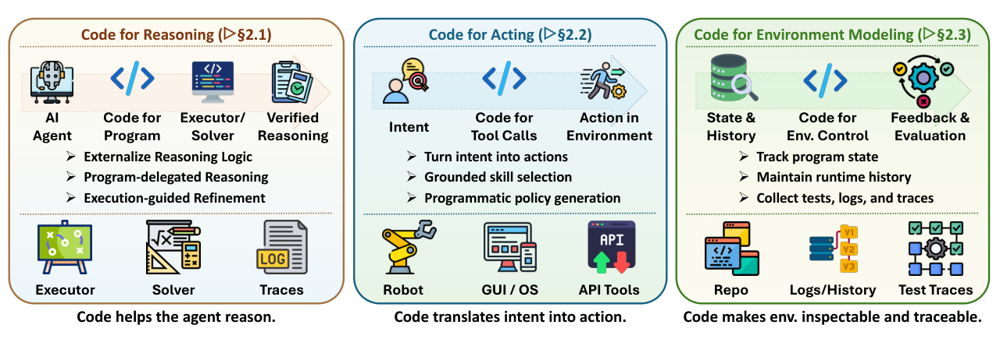

รูปที่ 2: ภาพรวมของ code ในฐานะ harness interface การเชื่อมต่อ agent กับ reasoning การดำเนินการ และ
environment การสร้าง model ผ่านโปรแกรมปฏิบัติการ การโทร tool การติดตามสถานะ และการติดตามข้อเสนอแนะ

---

## 📌 เนื้อหาจากแผนภาพ (Figure 2)

### โค้ดสำหรับการให้เหตุผล (Code for Reasoning - §2.1)

* **กระบวนการ:** AI Agent $\rightarrow$ โค้ด/โปรแกรม (Code/Program) $\rightarrow$ ตัวรันโค้ด/ตัวแก้ปัญหา (Executor/Solver) $\rightarrow$ การให้เหตุผลที่ผ่านการตรวจสอบความถูกต้องแล้ว (Verified Reasoning)

* **จุดสำคัญ:**
* ดึงตรรกะการให้เหตุผลออกมาสู่ภายนอก (Externalize Reasoning Logic)

* การให้เหตุผลแบบมอบหมายให้โปรแกรมทำแทน (Program-delegated Reasoning)

* การปรับปรุงโค้ดโดยมีกระบวนการรันโค้ดเป็นแนวทาง (Execution-guided Refinement)

* **เครื่องมือด้านล่าง:** ตัวรันโค้ด (Executor), ตัวแก้ปัญหา (Solver), ร่องรอยการทำงาน (Traces)

* *คำอธิบายภาพ:* **โค้ดช่วยในการให้เหตุผลของเอเจนต์ (Code helps the agent reason.)**

### โค้ดสำหรับการลงมือทำ (Code for Acting - §2.2)

* **กระบวนการ:** ความเจตนา (Intent) $\rightarrow$ โค้ดสำหรับการเรียกใช้เครื่องมือ (Code for Tool Calls) $\rightarrow$ การลงมือทำในสภาพแวดล้อม (Action in Environment)

* **จุดสำคัญ:**
* เปลี่ยนความเจตนาให้เป็นการกระทำ (Turn intent into actions)

* การเลือกทักษะที่เชื่อมโยงกับบริบทจริง (Grounded skill selection)

* การสร้างนโยบายในรูปแบบของโปรแกรม (Programmatic policy generation)

* **เครื่องมือด้านล่าง:** หุ่นยนต์ (Robot), หน้าจอผู้ใช้งาน/ระบบปฏิบัติการ (GUI/OS), เครื่องมือที่เป็นเอพีไอ (API Tools)

* *คำอธิบายภาพ:* **โค้ดแปลความเจตนาให้กลายเป็นการลงมือทำ (Code translates intent into action.)**

### โค้ดสำหรับสภาพแวดล้อมจำลอง (Code for Environment Modeling - §2.3)

* **กระบวนการ:** สถานะและประวัติ (State & History) $\rightarrow$ โค้ดสำหรับการควบคุมสภาพแวดล้อม (Code for Env. Control) $\rightarrow$ ข้อมูลป้อนกลับและการประเมินผล (Feedback & Evaluation)

* **จุดสำคัญ:**
* ติดตามสถานะของโปรแกรม (Track program state)

* คงรักษาประวัติการทำงานในตอนรันไทม์ (Maintain runtime history)

* เก็บรวบรวมชุดทดสอบ, ล็อก และร่องรอยการทำงาน (Collect tests, logs, and traces)

* **เครื่องมือด้านล่าง:** คลังรหัส (Repo), ล็อก/ประวัติ (Logs/History), ร่องรอยการทดสอบ (Test Traces)

* *คำอธิบายภาพ:* **โค้ดทำให้สภาพแวดล้อมสามารถตรวจสอบและติดตามร่องรอยได้ (Code makes env. inspectable and traceable.)**

---

## 📄 เนื้อหาบทความหลัก (Main Text)

...สังเกตพฤติกรรมในตอนรันไทม์ (Runtime Behavior), จัดเก็บสถานะระหว่างทาง (Intermediate States) และป้อนผลลัพธ์จากการรันโค้ดกลับเข้าไปเพื่อใช้ในการให้เหตุผลครั้งถัดไป งานวิจัยเมื่อไม่นานมานี้ได้ขยายขีดความสามารถของอินเตอร์เฟสนี้ จากเดิมที่เป็นเพียงการมองว่าการรันโปรแกรมคือเครื่องคิดเลขภายนอก (External Calculator) ไปสู่การมองว่าชิ้นงานจากการรันโค้ด (Execution Artifacts) นั้นเป็นสัญญาณการให้เหตุผลที่นำกลับมาใช้ซ้ำได้ (Reusable Reasoning Signals)

โดยข้อมูลป้อนเข้าและผลลัพธ์ (Inputs and Outputs), ร่องรอยการรันโค้ด (Execution Traces), สถานะของตัวแปร (Variable States), โครงสร้างของทิศทางการควบคุม (Control-flow Structures) และชุดทดสอบในระดับฟังก์ชัน (Function-level Tests) สิ่งเหล่านี้สามารถทำหน้าที่เป็นสถานะระหว่างทางที่ตัวควบคุมจะทำการตรวจสอบความถูกต้อง, ให้คะแนน (Scores) และป้อนกลับเข้าสู่กระบวนการให้เหตุผลในขั้นตอนถัดไปได้ ด้วยเหตุนี้ งานวิจัยที่มีอยู่จึงสามารถจัดหมวดหมู่ออกเป็น 3 กระบวนทัศน์ (Paradigms) ได้แก่: **การให้เหตุผลแบบมอบหมายให้โปรแกรมทำแทน (Program-delegated Reasoning), การตรวจสอบความถูกต้องอย่างเป็นทางการและการให้เหตุผลเชิงสัญลักษณ์ (Formal Verification and Symbolic Reasoning) และการให้เหตุผลซ้ำ ๆ โดยมีโค้ดเป็นรากฐาน (Iterative Code-grounded Reasoning)** ซึ่งเราจะลงรายละเอียดในแต่ละหัวข้อย่อยถัดไป

---

### 2.1.1. การให้เหตุผลแบบมอบหมายให้โปรแกรมทำแทน (Program-Delegated Reasoning)

การให้เหตุผลแบบมอบหมายให้โปรแกรมทำแทน (Program-delegated reasoning) จะใช้โปรแกรมที่สามารถรันได้จริงเป็นอินเตอร์เฟสหลักระหว่างการย่อยส่วนย่อยของปัญหาและการคำนวณ แทนที่จะพึ่งพาการให้เหตุผลด้วยภาษาธรรมชาติเพียงอย่างเดียว โมเดลจะทำการสร้างโค้ดเพื่อให้ตัวแปลภาษาโปรแกรมภายนอก (External Interpreters) นำไปรันเพื่อสร้างผลลัพธ์ที่มีรากฐานความถูกต้องอย่างเป็นทางการ (Formally Grounded Outputs) งานวิจัยในยุคแรก ๆ [66, 7] ได้พิสูจน์ให้เห็นว่า การมอบหมายกระบวนการคำนวณไปให้โปรแกรมทำแทนนั้น ช่วยเพิ่มความน่าเชื่อถือ (Reliability) ได้อย่างมีนัยสำคัญ โดยการย้ายการให้เหตุผลระหว่างทางไปไว้ในร่องรอยการรันโค้ดที่มีโครงสร้างชัดเจนและตรวจสอบได้ (Structured, Verifiable Execution Traces)

เทคนิคการกระตุ้นแบบ Program-of-Thoughts (PoT) [6] ได้จัดระบบกระบวนทัศน์นี้ให้เป็นทางการยิ่งขึ้น โดยแยกแยะการให้เหตุผลออกเป็นโปรแกรมที่รันได้จริงอย่างชัดเจน ซึ่งได้รับการต่อยอดในงานวิจัยต่อมา เช่น POET [67] และ MathCoder [68] ซึ่งช่วยเพิ่มความแม่นยำในการรันโค้ด (Execution Fidelity) และความเชี่ยวชาญเฉพาะโดเมน (Domain Specialization) งานวิจัยในเวลาต่อมาได้ศึกษาเงื่อนไขที่ทำให้การมอบหมายงานให้โปรแกรมมีประสิทธิภาพ ซึ่งรวมถึงบทบาทของความถูกต้องในการรันโค้ด (Execution Correctness), โครงสร้างของงาน (Task Structure) และการปฏิสัมพันธ์ในตอนรันไทม์ (Runtime Interaction)

ตัวอย่างเช่น เทคนิค Chain of Code (CoC) [8] และ CIRS [69] ได้วิเคราะห์ว่าการให้เหตุผลที่มีการรันโค้ดเป็นฐานช่วยเปลี่ยนรูปแบบของความล้มเหลว (Failure Modes) อย่างไร เมื่อเปรียบเทียบกับการให้เหตุผลที่ใช้ภาษาเป็นฐานเพียงอย่างเดียว แนวทางในยุคต่อมาได้ขยายอินเตอร์เฟสนี้ให้ไกลกว่าการรันงานแบบแยกส่วน (Isolated Task Execution) เฟรมเวิร์กการให้เหตุผลแบบข้ามภาษา (Cross-lingual Reasoning Frameworks) [70] แสดงให้เห็นว่าการให้เหตุผลที่มีโปรแกรมเป็นฐานสามารถประยุกต์ใช้ข้ามสภาพแวดล้อมทางภาษาศาสตร์ได้ ผ่านโครงสร้างที่รันได้ร่วมกัน (Shared Executable Structure) ในขณะที่การให้เหตุผลแบบอิงวิธีวิทยา (Method-based Reasoning) [71] ได้นำเสนอกระบวนการทางโปรแกรมที่นำกลับมาใช้ซ้ำได้ (Reusable Programmatic Procedures) ซึ่งคงอยู่ข้ามงานต่าง ๆ ได้

ระบบที่ใหม่กว่านั้น เช่น CodeAdapt [72] ชี้ให้เห็นเพิ่มเติมว่าการจับคู่โมเดลภาษาเข้ากับอินเตอร์เฟสการให้เหตุผลที่รันได้จริงอย่างแน่นหนา สามารถทำประสิทธิภาพแซงหน้าโมเดลที่ฝึกมาเฉพาะทางเพื่อเน้นการให้เหตุผล (Specialized Reasoning-oriented Models) ได้ นอกจากนี้ CodeI/O [73] ได้เปลี่ยนโปรแกรมที่มีบริบทเชื่อมโยงกับความเป็นจริง ให้กลายเป็นงานคาดเดาข้อมูลเข้าและผลลัพธ์ของโค้ด (Code Input-output Prediction Tasks) ซึ่งช่วยเปิดเผยองค์ประกอบพื้นฐานของการให้เหตุผล (Reasoning Primitives) เช่น การวางแผนทิศทางตรรกะ (Logic-flow Planning), การค้นหาพื้นที่สถานะ (State-space Search), การท่องไปในแผนผังการตัดสินใจ (Decision-tree Traversal) และการย่อยส่วนงานแบบโมดูลาร์ (Modular Decomposition) ในขณะที่ยังคงรักษาความเข้มงวดของกระบวนการเอาไว้ผ่านการตรวจสอบความถูกต้องแบบรันได้จริง (Executable Verification)

## หน้า 9

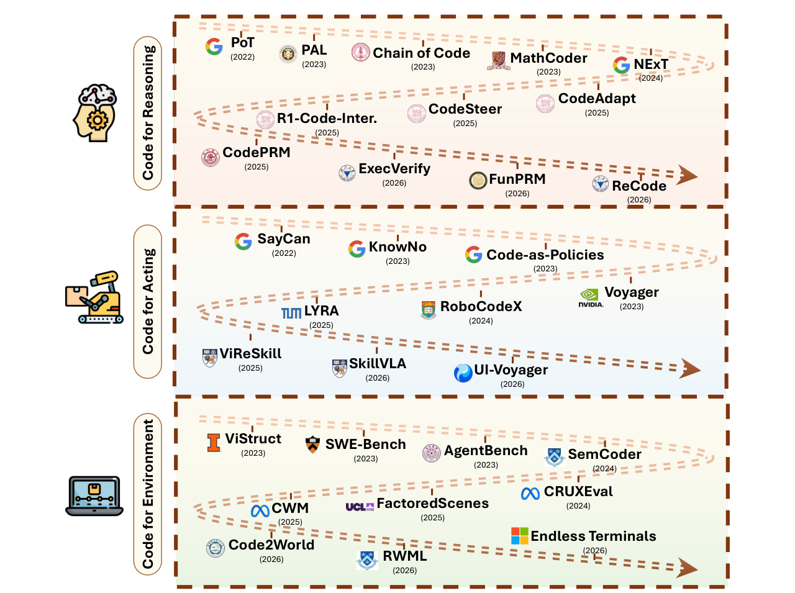

รูปที่ 3: แผนงานของ harness interface ซึ่งจัดโดยบทบาทของ code ใน reasoning การแสดง และ environment
การสร้าง model โดยมีผลงาน agent เรียงลำดับตามลำดับเวลาในแต่ละบทบาท

นี่คือบทแปลเนื้อหาจากรูปภาพโรดแมป (Figure 3) และเนื้อหาในหน้า 9 เป็นภาษาไทย โดยใส่คำศัพท์เทคนิคภาษาอังกฤษควบคู่ไว้ในวงเล็บเพื่อความชัดเจนและใช้ในการอ้างอิงครับ

---
### 2.1.2. อินเตอร์เฟสการตรวจสอบความถูกต้องอย่างเป็นทางการและการให้เหตุผลเชิงสัญลักษณ์ (Formal Verification and Symbolic Reasoning Interfaces)

วิธีการแบบผสมผสานระหว่างโครงข่ายประสาทและสัญลักษณ์ (Hybrid Neural-symbolic Methods) จะรวมเอาการอนุมานแบบยืดหยุ่นที่ใช้ภาษาเป็นฐาน (Language-based Inference) เข้ากับการคำนวณเชิงสัญลักษณ์ที่มีโครงสร้าง (Structured Symbolic Computation) โดยใช้โค้ดและชิ้นงานเชิงสัญลักษณ์ (Symbolic Artifacts) เป็นตัวแทนระหว่างทางที่คงอยู่ถาวร (Persistent Intermediate Representations) แทนที่จะมองว่าโปรแกรมเป็นเพียงข้อความที่ถูกสร้างขึ้นมา (Generated Text) เท่านั้น

สูตรโครงสร้างในยุคแรก เช่น Graph-of-Thoughts [74] ได้ขยายการให้เหตุผลแบบลําดับขั้นตอน (Chain-of-thought Reasoning) ไปสู่เส้นทางการทำงานที่มีโครงสร้างแบบกราฟ (Graph-structured Trajectories) ซึ่งเปิดโอกาสให้สถานะระหว่างทางสามารถแตกแขนง (Branch), ควบรวม (Merge) และนำกลับมาใช้ซ้ำได้ การต่อยอดจากแนวทางนี้ เช่น การทบทวนตัวเองแบบตรวจสอบความถูกต้องได้ในตัว (Self-verifying Reflection) [75], MA-LoT [76] และการปรับแต่งตัวเองแบบโซเครติส (Socratic Self-refine) [77] ได้นำเสนอลูปการตรวจสอบความถูกต้องแบบวนซ้ำ (Iterative Verification Loops) ซึ่งการตรวจสอบความสอดคล้องเชิงสัญลักษณ์ (Symbolic Consistency Checks) จะทำหน้าที่นำทางในการปรับแต่งเส้นทางของโซลูชันที่ถูกสร้างขึ้น (Generated Solution Paths)

งานวิจัยเมื่อไม่นานมานี้ได้กระชับความร่วมมือระหว่างการสร้างของโครงข่ายประสาท (Neural Generation) และการรันโค้ดเชิงสัญลักษณ์ (Symbolic Execution) ให้แน่นแฟ้นยิ่งขึ้นผ่านอินเตอร์เฟสที่มีโค้ดเป็นฐาน ตัวอย่างเช่น CodeSteer [78] และ Code-as-Symbolic-Planner [79] ได้ประสานงานการให้เหตุผลด้วยภาษาแบบอิสระ (Free-form Language Reasoning) เข้ากับการปฏิบัติการเชิงสัญลักษณ์ที่รันได้จริง (Executable Symbolic Operations) อย่างชัดเจน โดยมองว่าโปรแกรมคือซับสเตรตที่มีโครงสร้าง (Structured Substrates) ซึ่งตัวควบคุม (Harness) สามารถตรวจสอบ (Inspect), แปลงค่า (Transform) และรันโค้ดได้ข้ามผ่านหลาย ๆ สถานี

นอกจากนี้ VisualCoder [80] ได้ขยายแนวคิดนี้โดยการทำให้พฤติกรรมของโปรแกรมสามารถมองเห็นได้ผ่านตัวแทนของทิศทางการควบคุม (Control-flow Representations) การจัดแนวการให้เหตุผลที่ถูกสร้างขึ้น (Generated Reasoning) ให้ตรงกับกราฟทิศทางการควบคุมที่เป็นภาพ (Visual Control-flow Graphs) และเส้นทางการรันโค้ด (Execution Paths) นั้น จะเปลี่ยนพฤติกรรมแบบไดนามิกของโปรแกรมให้กลายเป็นสิ่งที่สามารถตรวจสอบได้...

## หน้า 10

...ชิ้นงานสำหรับใช้คาดเดาพฤติกรรมของโปรแกรม (Artifact for Program-behavior Prediction) เมื่อนำมารวมกัน วิธีการเหล่านี้ช่วยขยายอินเตอร์เฟสแบบผสมผสานระหว่างโครงข่ายประสาทและสัญลักษณ์ (Neural-symbolic Interface) จากเดิมที่เป็นโค้ดในรูปแบบข้อความ (Textual Code) ไปสู่ชิ้นงานจากการรันโค้ดแบบมัลติโมดอล (Multimodal Execution Artifacts) ที่ตัวควบคุม (Harness) สามารถนำไปอ้างอิง, ตรวจสอบความถูกต้อง และนำกลับมาใช้ซ้ำได้

งานวิจัยในกลุ่มที่เข้ามาเติมเต็มกันจะใช้ภาษาที่เป็นทางการและสามารถตรวจสอบได้ด้วยเครื่องจักร (Machine-verifiable Formal Languages) มาทำหน้าที่เป็นอินเตอร์เฟสสำหรับการให้เหตุผลโดยตรง โปรแกรมช่วยพิสูจน์ (Proof Assistants) เช่น Lean [81], Isabelle [82] และ Coq [83] มอบภาษาการพิสูจน์ที่เป็นทางการ (Formal Proof Languages) บนรากฐานทางตรรกศาสตร์ที่เข้มงวด ซึ่งช่วยให้แต่ละขั้นตอนของการอนุมานสามารถถูกตรวจสอบโดยตัวตรวจสอบความถูกต้อง (Verifier) ได้ ระบบการพิสูจน์ทฤษฎีบทในยุคแรกที่ใช้ LLM เป็นฐาน ซึ่งรวมถึง ReProver [84], DeepSeek-Prover [85] และ TheoremLlama [86] ได้สร้างแนวทางปฏิบัติจริงในการผสมผสานโมเดลภาษาเข้ากับข้อมูลป้อนกลับของโปรแกรมช่วยพิสูจน์ในการให้เหตุผลทางคณิตศาสตร์

ระบบที่ใหม่กว่านั้น เช่น DeepSeek-Prover-V2 [87], Kimina-Prover [88], MA-LoT [76] และ Goedel-Prover-V2 [89] ได้ปรับปรุงกระบวนการนี้ให้ดีขึ้นผ่านการค้นหาการพิสูจน์อย่างรอบคอบ (Deliberative Proof Search), การแก้ไขข้อผิดพลาดด้วยตัวเอง (Self-correction) รวมถึงการสร้างและตรวจสอบความถูกต้องของการพิสูจน์ซ้ำ ๆ (Repeated Proof Generation and Verification) นอกจากนี้ อินเตอร์เฟสการตรวจสอบความถูกต้องอย่างเป็นทางการ (Formal Verification Interfaces) ยังกำลังขยายขอบเขตไปไกลกว่าการพิสูจน์ทฤษฎีบทในทางคณิตศาสตร์ ตัวอย่างเช่น HybridReasoning [90] ประยุกต์ใช้โปรแกรมพิสูจน์ที่เป็นทางการเพื่อสนับสนุนการให้เหตุผลด้วยภาษาธรรมชาติ; Lean4Physics [91] และ PhysLib [92] ขยายการตรวจสอบความถูกต้องด้วย Lean ไปสู่สาขาฟิสิกส์; และ VERINA [93] กับ Goedel-Code-Prover [94] ปรับเปลี่ยนวิธีการที่เป็นทางการ (Formal Methods) มาใช้กับการตรวจสอบความถูกต้องของโค้ด ยิ่งไปกว่านั้น Lean4Agent [95] ได้ขยายทิศทางนี้ไปสู่ระบบเอเจนต์ (Agentic Systems) โดยการใช้ Lean4 ในการจำลองและตรวจสอบเวิร์กโฟลว์รวมถึงเส้นทางการทำงานของเอเจนต์ (Agent Workflows and Trajectories) เมื่อมองจากมุมมองของตัวควบคุม (Harness Perspective) ระบบเหล่านี้แสดงให้เห็นว่าภาษารูปนัยหรือภาษาที่เป็นทางการ (Formal Languages) สามารถทำหน้าที่ได้ไม่ใช่เพียงแค่เครื่องมือให้เหตุผลเท่านั้น แต่ยังเป็นสัญญาที่รันได้จริง (Executable Contracts) ที่ช่วยจำกัด, รับรองความถูกต้อง (Certify) และตรวจสอบ (Audit) พฤติกรรมของเอเจนต์ได้อีกด้วย

---

### 2.1.3. การให้เหตุผลซ้ำ ๆ โดยมีโค้ดเป็นรากฐาน (Iterative Code-Grounded Reasoning)

การให้เหตุผลซ้ำ ๆ โดยมีโค้ดเป็นรากฐาน (Iterative Code-grounded Reasoning) จะมุ่งเน้นไปที่การปฏิสัมพันธ์แบบลูปปิด (Closed-loop Interaction) ระหว่างการสร้างโค้ด (Generation), การรันโค้ด (Execution) และข้อมูลป้อนกลับ (Feedback) ในระบบเหล่านี้ การให้เหตุผลไม่ได้เป็นกระบวนการที่ทำเพียงครั้งเดียวแล้วผ่าน (Single-pass Process) แต่เป็นเส้นทางการคำนวณแบบวนซ้ำ (Iterative Computational Trajectory) ที่มีรากฐานอยู่บนการเปลี่ยนผ่านสถานะที่รันได้จริง (Executable State Transitions) งานวิจัยในยุคแรก เช่น NEXT [30] ฝึกฝนโมเดลให้คาดการณ์พฤติกรรมการรันโค้ดล่วงหน้า โดยการให้เหตุผลเหนือร่องรอยของโปรแกรม (Program Traces) ซึ่งช่วยให้การให้เหตุผลระหว่างทางมีรากฐานอยู่บนอรรถศาสตร์ตอนรันไทม์ (Runtime Semantics)

ความพยายามที่เกี่ยวข้อง [96] ได้เน้นย้ำในทำนองเดียวกันว่า ร่องรอยการรันโค้ด (Executable Traces) มอบสัญญาณการกำกับดูแล (Supervision Signal) ที่สมบูรณ์กว่าการดูเพียงผลลัพธ์สุดท้ายที่เป็นข้อความ (Final Textual Outputs) เพียงอย่างเดียว ด้วยการต่อยอดบนรากฐานนี้ แนวทางในเวลาต่อมาจึงได้นำเสนอลูปการทำงานแบบ "สร้าง-รัน-ตรวจสอบ-ปรับแต่ง" (Generate-execute-verify-refine Loops) อย่างชัดเจน วิธีการต่าง ๆ เช่น CodePRM [31] และ ORPS [97] ใช้ผลลัพธ์จากการรันโค้ดเพื่อประเมินและปรับแต่งเส้นทางการให้เหตุผลระหว่างทาง ซึ่งช่วยให้ตัวควบคุม (Harness) สามารถนำทางกระบวนการให้เหตุผลผ่านข้อมูลป้อนกลับในตอนรันไทม์ (Runtime Feedback) แทนที่จะพึ่งพาเพียงการคาดเดาโทเค็นถัดไปแบบบริสุทธิ์ (Pure Next-token Prediction) ในทิศทางเดียวกัน ระบบอย่าง CYCLE [98] และ Self-Edit [99] จะแก้ไขโซลูชันที่สร้างขึ้นซ้ำ ๆ โดยใช้สัญญาณการแก้ไขที่รับรู้ถึงการรันโค้ด (Execution-aware Correction Signals)

การเรียนรู้แบบเสริมกำลัง (Reinforcement Learning) ช่วยให้กระบวนทัศน์นี้แข็งแกร่งยิ่งขึ้น โดยการปฏิบัติกับข้อมูลป้อนกลับจากการรันโค้ดในฐานะสัญญาณการเพิ่มประสิทธิภาพ (Optimization Signal) เหนือเส้นทางการให้เหตุผล วิธีการต่าง ๆ เช่น CodeRL [100], CodeRL+ [101] และ RLTF [102] เพิ่มประสิทธิภาพความถูกต้องของฟังก์ชันการทำงาน (Functional Correctness) ผ่านรางวัลที่อิงตามชุดทดสอบระดับฟังก์ชันหรือยูนิตเทสต์ (Unit-test-based Rewards) ในขณะที่แนวทางอย่าง StepCoder [103] ได้รวบรวมข้อมูลป้อนกลับที่มีความละเอียดสูงจากคอมไพเลอร์ (Compiler) และรันไทม์ (Runtime) เข้ามาร่วมในระหว่างการเพิ่มประสิทธิภาพ ตัวระบบ RLEF [104] จัดรูปแบบการโต้ตอบนี้ให้เป็นทางการในฐานะการเพิ่มประสิทธิภาพนโยบาย (Policy Optimization) ที่มีรากฐานมาจากข้อมูลป้อนกลับจากการรันโค้ดแบบหลายขั้นตอน (Multi-step Execution Feedback) ซึ่งช่วยให้นโยบายการให้เหตุผลสามารถปรับตัวได้ผ่านการปฏิสัมพันธ์ในตอนรันไทม์แบบวนซ้ำ แนวทางที่ใหม่กว่านั้นได้ขับเคลื่อนไปสู่สภาพแวดล้อมการให้เหตุผลแบบโต้ตอบได้อย่างสมบูรณ์ (Fully Interactive Reasoning Environments) ตัวอย่างเช่น EG-CFG [21] ใส่สัญญาณการรันโค้ดเข้าไปโดยตรงในระหว่างขั้นตอนการสร้างเพื่อสนับสนุนการแก้ไขในระดับก้าว (Step-level Correction) ในขณะที่ระบบอย่าง R1-Code-Interpreter [105] จะสลับการทำงานไปมาระหว่างการให้เหตุผลและการรันโค้ดหลายรอบ (Interleave Reasoning and Code Execution) ภายในเซสชันการโต้ตอบที่คงอยู่ถาวร (Persistent Interactive Sessions)

---

## 2.2. โค้ดสำหรับการลงมือทำ (Code for Acting)

นอกเหนือจากการให้เหตุผลแล้ว เอเจนต์ (Agent) จะต้องเชื่อมต่อโมเดลเข้ากับสภาพแวดล้อมภายนอก (External Environments) ซึ่งเป็นจุดที่การตัดสินใจจะสร้างผลกระทบที่รันได้จริง (Real Executable Effects) ในขั้นตอนนี้ โค้ดไม่ได้ทำหน้าที่หลักในฐานะสื่อกลางสำหรับการคำนวณอีกต่อไป แต่ทำหน้าที่เป็น **อินเตอร์เฟสการลงมือทำ (Action Interface)** ที่แปลงผลลัพธ์ของโมเดลให้กลายเป็นการปฏิบัติการที่มีบริบทเชื่อมโยงกับความเป็นจริง (Grounded Operations) เช่น การเรียกใช้งานเครื่องมือ (Tool Invocations), นโยบายการควบคุมหุ่นยนต์ (Robot-control Policies), การกระทำบนหน้าจอผู้ใช้งาน (GUI Actions) หรือคำสั่งซอฟต์แวร์ (Software Commands) ผ่านอินเตอร์เฟสนี้ ตัวควบคุม (Harness) จะแปลความเจตนาในระดับสูง (High-level Intent) ให้กลายเป็นพฤติกรรมที่รันได้จริง ซึ่งสามารถโต้ตอบกับสภาพแวดล้อมทางหุ่นยนต์ ระบบดิจิทัล และระบบแบบโต้ตอบได้

## หน้า 11

Table 1: ระบบ agent โดยที่ code ทำหน้าที่เป็นสารตั้งต้น reasoning

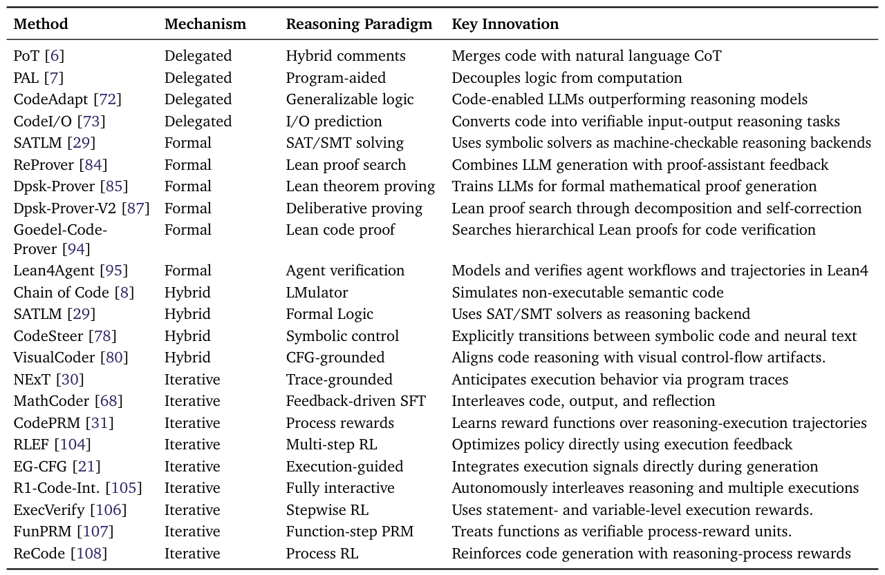

นี่คือบทแปลเนื้อหาของตารางเปรียบเทียบ (Table 1) และเนื้อหาบทความในหน้า 11 เป็นภาษาไทย โดยใส่คำศัพท์เทคนิคภาษาอังกฤษควบคู่ไว้ในวงเล็บเพื่อความชัดเจนและใช้ในการอ้างอิงครับ

---

## 📊 เนื้อหาจากตาราง (Table 1): ระบบที่เป็นตัวแทนซึ่งใช้โค้ดเป็นซับสเตรตการให้เหตุผล

| วิธีการ (Method) | กลไก (Mechanism) | กระบวนทัศน์การให้เหตุผล (Reasoning Paradigm) | นวัตกรรมสำคัญ (Key Innovation) |
| --- | --- | --- | --- |
| **POT** [6] | มอบหมาย (Delegated) | ความคิดเห็นแบบผสม (Hybrid comments) | ผสานโค้ดเข้ากับ Chain-of-Thought (CoT) ของภาษาธรรมชาติ
|
| **PAL** [7] | มอบหมาย (Delegated) | ใช้โปรแกรมช่วย (Program-aided) | แยกส่วนตรรกะ (Logic) ออกจากการคำนวณ (Computation)
 |
| **CodeAdapt** [72] | มอบหมาย (Delegated) | ตรรกะที่ประยุกต์ใช้ได้ทั่วไป (Generalizable logic) | LLMs ที่ขับเคลื่อนด้วยโค้ดสามารถทำประสิทธิภาพแซงหน้าโมเดลที่เน้นการให้เหตุผลได้
 |
| **CodeI/O** [73] | มอบหมาย (Delegated) | คาดเดาข้อมูลเข้า/ออก (I/O prediction) | แปลงโค้ดให้เป็นงานการให้เหตุผลแบบข้อมูลเข้า-ออกที่ตรวจสอบความถูกต้องได้
 |
| **SATLM** [29] | เป็นทางการ (Formal) | การแก้ปัญหา SAT/SMT (SAT/SMT solving) | ใช้ตัวแก้ปัญหาเชิงสัญลักษณ์ (Symbolic Solvers) เป็นระบบหลังบ้านของการให้เหตุผลที่เครื่องจักรสามารถตรวจสอบได้
 |
| **ReProver** [84] | เป็นทางการ (Formal) | การค้นหาการพิสูจน์ด้วย Lean (Lean proof search) | รวมการสร้างผลลัพธ์ของ LLM เข้ากับข้อมูลป้อนกลับของโปรแกรมช่วยพิสูจน์ (Proof-assistant)
 |
| **Dpsk-Prover** [85] | เป็นทางการ (Formal) | การพิสูจน์ทฤษฎีบทด้วย Lean (Lean theorem proving) | ฝึกฝน LLMs สำหรับการสร้างการพิสูจน์ทางคณิตศาสตร์ที่เป็นทางการ
 |
| **Dpsk-Prover-V2** [87] | เป็นทางการ (Formal) | การพิสูจน์อย่างรอบคอบ (Deliberative proving) | ค้นหาการพิสูจน์ด้วย Lean ผ่านการย่อยส่วนงานและการแก้ไขข้อผิดพลาดด้วยตัวเอง
 |
| **Goedel-Code-Prover** [94] | เป็นทางการ (Formal) | การพิสูจน์โค้ดด้วย Lean (Lean code proof) | ค้นหาการพิสูจน์ Lean แบบลำดับชั้นสำหรับการตรวจสอบความถูกต้องของโค้ด
 |
| **Lean4Agent** [95] | เป็นทางการ (Formal) | การตรวจสอบเอเจนต์ (Agent verification) | จำลองและตรวจสอบเวิร์กโฟลว์รวมถึงเส้นทางการทำงานของเอเจนต์ใน Lean4
 |
| **Chain of Code** [8] | ผสมผสาน (Hybrid) | เครื่องจำลองภาษา (L.Mulator) | จำลองการทำงานของโค้ดเชิงอรรถศาสตร์ (Semantic Code) ที่ไม่สามารถรันได้จริง
 |
| **SATLM** [29] | ผสมผสาน (Hybrid) | ตรรกศาสตร์รูปนัย (Formal Logic) | ใช้ตัวแก้ปัญหา SAT/SMT เป็นระบบหลังบ้านของการให้เหตุผล
 |
| **CodeSteer** [78] | ผสมผสาน (Hybrid) | การควบคุมเชิงสัญลักษณ์ (Symbolic control) | เปลี่ยนผ่านระหว่างโค้ดเชิงสัญลักษณ์และข้อความจากโครงข่ายประสาทอย่างชัดเจน
 |
| **VisualCoder** [80] | ผสมผสาน (Hybrid) | อิงตามโครงสร้าง CFG (CFG-grounded) | จัดแนวการให้เหตุผลของโค้ดให้ตรงกับชิ้นงานกราฟทิศทางการควบคุมที่เป็นภาพ (Visual Control-flow Artifacts)
 |
| **NEXT** [30] | วนซ้ำ (Iterative) | อิงตามร่องรอยการทำงาน (Trace-grounded) | คาดการณ์พฤติกรรมการรันโค้ดล่วงหน้าผ่านร่องรอยของโปรแกรม
 |
| **MathCoder** [68] | วนซ้ำ (Iterative) | การเทรน SFT ขับเคลื่อนด้วยฟีดแบ็ก (Feedback-driven SFT) | สลับการทำงานระหว่างโค้ด, ผลลัพธ์ และการคิดทบทวน (Reflection)
 |
| **CodePRM** [31] | วนซ้ำ (Iterative) | รางวัลตามกระบวนการ (Process rewards) | เรียนรู้ฟังก์ชันการให้รางวัล (Reward Functions) เหนือเส้นทางการให้เหตุผลและการรันโค้ด
 |
| **RLEF** [104] | วนซ้ำ (Iterative) | การเรียนรู้แบบเสริมกำลังหลายขั้นตอน (Multi-step RL) | เพิ่มประสิทธิภาพของนโยบาย (Policy) โดยตรงโดยใช้ข้อมูลป้อนกลับจากการรันโค้ด
 |
| **EG-CFG** [21] | วนซ้ำ (Iterative) | นำทางด้วยการรันโค้ด (Execution-guided) | ใส่สัญญาณการรันโค้ดเข้าไปโดยตรงในระหว่างขั้นตอนการสร้างผลลัพธ์
 |
| **R1-Code-Int.** [105] | วนซ้ำ (Iterative) | โต้ตอบได้อย่างสมบูรณ์ (Fully interactive) | สลับการทำงานระหว่างการให้เหตุผลและการรันโค้ดหลายรอบโดยอัตโนมัติและเป็นอิสระ
 |
| **ExecVerify** [106] | วนซ้ำ (Iterative) | การเรียนรู้แบบเสริมกำลังเป็นก้าว (Stepwise RL) | ใช้รางวัลจากการรันโค้ดในระดับคำสั่ง (Statement-level) และระดับตัวแปร (Variable-level)
 |
| **FunPRM** [107] | วนซ้ำ (Iterative) | โมเดลให้รางวัลกระบวนการระดับฟังก์ชัน (Function-step PRM) | ปฏิบัติต่อฟังก์ชันต่าง ๆ ในฐานะหน่วยรางวัลของกระบวนการที่ตรวจสอบความถูกต้องได้
 |
| **ReCode** [108] | วนซ้ำ (Iterative) | การเรียนรู้แบบเสริมกำลังเชิงกระบวนการ (Process RL) | เสริมกำลังการสร้างโค้ดด้วยรางวัลจากกระบวนการให้เหตุผล
 |

---

## 📄 เนื้อหาบทความหลัก (Main Text)

...ความท้าทายหลักจึงอยู่ที่ **การเชื่อมโยงเข้ากับบริบทจริง (Grounding):** ตัวควบคุม (Harness) จะต้องจับคู่ผลลัพธ์ที่เป็นภาษาเชิงนามธรรม (Abstract Language Outputs) ให้กลายเป็นพฤติกรรมที่รันได้จริง ซึ่งเคารพต่อข้อจำกัดของสภาพแวดล้อมเป้าหมาย รวมถึงขีดจำกัดของระบบฮาร์ดแวร์ (Embodiment Limits), เอพีไออินเตอร์เฟส (Interface APIs), พลวัตของสภาพแวดล้อม (Environment Dynamics) และข้อกำหนดด้านความปลอดภัย (Safety Requirements) สิ่งนี้แตกต่างจาก "โค้ดสำหรับการให้เหตุผล" (Code-for-reasoning) ที่ตัวแปลภาษาโปรแกรม (Interpreters) มักจะสามารถตรวจสอบความถูกต้องได้โดยตรง เนื่องจากการรันการลงมือทำ (Action Execution) นั้นเกิดขึ้นในสภาพแวดล้อมที่สังเกตได้เพียงบางส่วน (Partially Observed) และมีการพัฒนาเปลี่ยนแปลงแบบไดนามิก ซึ่งความล้มเหลวอาจเกิดขึ้นได้จากการเปลี่ยนผ่านสถานะที่ไม่ถูกต้อง (Invalid State Transitions), ข้อมูลป้อนกลับที่ล่าช้า (Delayed Feedback) หรือข้อผิดพลาดขณะรันโค้ดแบบไม่แสดงอาการ (Silent Execution Errors) ตัวอย่างเช่น หุ่นยนต์อาจพยายามหยิบวัตถุที่อยู่นอกพื้นที่ทำงานที่เข้าถึงได้ (Reachable Workspace) โดยไม่มีการแจ้งเตือนข้อผิดพลาดในตอนรันไทม์ (Runtime Exception) แสดงออกมาอย่างชัดเจน

สิ่งที่สำคัญคือ โค้ดคำสั่งการลงมือทำที่รันได้จริง (Executable Action Code) ทำหน้าที่เป็นเพียงอินเตอร์เฟสเชื่อมต่อกับองค์ประกอบเหล่านี้ ไม่ใช่สิ่งที่จะเข้ามาแทนที่องค์ประกอบเหล่านั้น

* **ในสภาพแวดล้อมทางหุ่นยนต์และระบบฮาร์ดแวร์ (Embodied Settings):** โมดูลการรับรู้ (Perception Modules) ทำหน้าที่ให้ข้อมูลการสังเกต (Observations), โมเดลความสามารถในการตอบสนองหรือความเป็นไปได้ (Affordance or Feasibility Models) ทำหน้าที่ประเมินว่าการลงมือทำใดบ้างที่สามารถทำได้, ผู้วางแผนและตัวควบคุมการเคลื่อนที่ (Motion Planners and Controllers) ทำหน้าที่เชื่อมโยงคำสั่งเชิงสัญลักษณ์เข้ากับเซนเซอร์และตัวขับเคลื่อน (Sensors and Actuators) และเลเยอร์ความปลอดภัย (Safety Layers) ทำหน้าที่จำกัดพฤติกรรมที่อันตรายหรือไม่ถูกต้อง

* **ในสภาพแวดล้อมทาง GUI และซอฟต์แวร์ (GUI and Software Settings):** องค์ประกอบที่คล้ายคลึงกันจะรวมถึง ตัวแยกแยะส่วนประกอบหน้าจอ (Screen Parsers), โครงสร้าง DOM หรือแผนผังสำหรับการเข้าถึงของผู้พิการ (DOM or Accessibility Trees), เอพีไอระบบหลังบ้าน (Backend APIs), โมเดลความเจตนาของผู้ใช้ (User-intent Models), ระบบการอนุญาตสิทธิ์ (Permission Systems) และตัวตรวจสอบความถูกต้องทางโปรแกรม (Programmatic Validators)

โค้ดจะอยู่ตรงกลางระหว่างโมเดลภาษาและองค์ประกอบเหล่านี้: โดยมันจะทำหน้าที่แปลงข้อมูลการสังเกตให้อยู่ในรูปอนุกรม (Serialize Observations), เรียกใช้งานโมดูลการเชื่อมโยงบริบทและการวางแผน (Grounding and Planning Modules), เรียกใช้การลงมือทำที่รันได้จริง (Executable Actions) และเปิดเผยผลลัพธ์การตรวจสอบความถูกต้อง (Validation Results) กลับไปยังตัวควบคุม (Harness)

"โค้ดสำหรับการลงมือทำ" (Code-for-acting) จึงได้นำเสนอโปรแกรมที่รันได้จริงและมีโครงสร้างชัดเจน เข้ามาทำหน้าที่เป็น **อินเตอร์เฟสการควบคุม (Control Interface)** ระหว่างโมเดลและสภาพแวดล้อม ซึ่งช่วยให้ตัวควบคุมสามารถรัน, ติดตามตรวจสอบ (Monitor), ตรวจสอบความถูกต้อง (Validate), นำกลับมาใช้ซ้ำ และปรับแต่งการลงมือทำผ่านข้อมูลป้อนกลับจากการปฏิสัมพันธ์ (Interaction Feedback) ได้ อินเตอร์เฟสนี้สามารถทำให้เกิดขึ้นจริงได้ในรูปแบบที่แตกต่างกันออกไป: เช่น คลังทักษะความสามารถที่กำหนดไว้ล่วงหน้า (Predefined Skill Library)...

## หน้า 12

Table 2: ระบบ agent โดยที่ code ทำหน้าที่เป็นการกระทำ interface

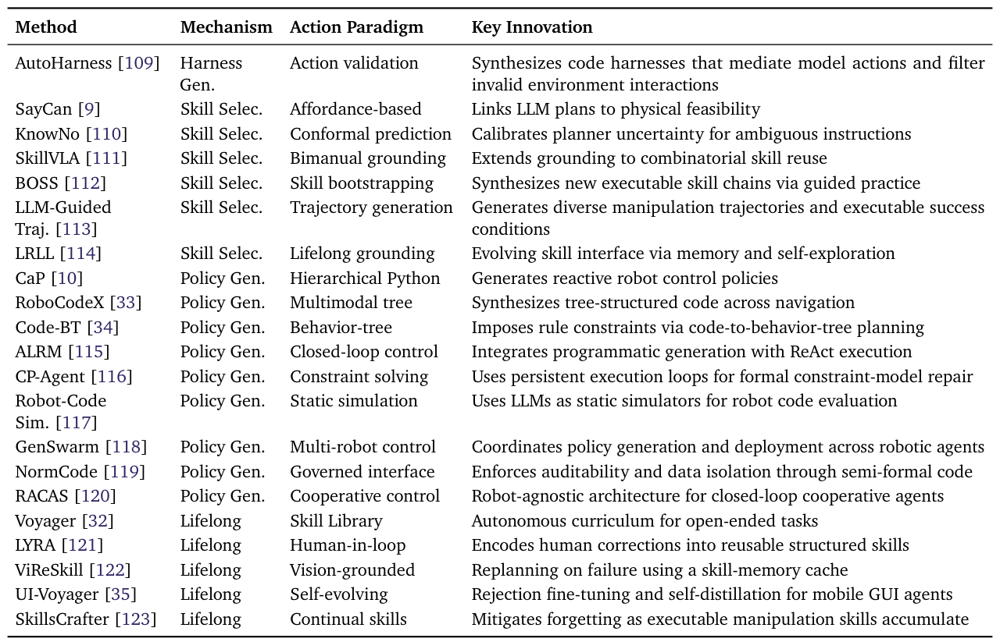

นี่คือบทแปลเนื้อหาจากตารางเปรียบเทียบ (Table 2) และเนื้อหาบทความในหน้า 12 เป็นภาษาไทย โดยใส่คำศัพท์เทคนิคภาษาอังกฤษควบคู่ไว้ในวงเล็บเพื่อความชัดเจนและใช้ในการอ้างอิงครับ:

---

## 📊 เนื้อหาจากตาราง (Table 2): ระบบที่เป็นตัวแทนซึ่งใช้โค้ดเป็นอินเตอร์เฟสการลงมือทำ

| วิธีการ (Method) | กลไก (Mechanism) | กระบวนทัศน์การลงมือทำ (Action Paradigm) | นวัตกรรมสำคัญ (Key Innovation) |
| --- | --- | --- | --- |
| **AutoHarness** [109] | การสร้างตัวควบคุม (Harness Gen.) | การตรวจสอบการลงมือทำ (Action validation) | สังเคราะห์ Code Harnesses ที่ทำหน้าที่เป็นตัวกลางควบคุมการลงมือทำของโมเดล และกรองการปฏิสัมพันธ์ที่ไม่ถูกต้องกับสภาพแวดล้อมออกไป
 |
| **SayCan** [9] | การเลือกทักษะ (Skill Selec.) | อิงตาม Affordance (Affordance-based) | เชื่อมโยงแผนการทำงานของ LLM เข้ากับความเป็นไปได้ทางกายภาพของระบบฮาร์ดแวร์
 |
| **KnowNo** [110] | การเลือกทักษะ (Skill Selec.) | การคาดการณ์แบบ Conformal (Conformal prediction) | ปรับเทียบความไม่แน่นอนของผู้นางแผนสำหรับคำสั่งที่คลุมเครือ
 |
| **SkillVLA** [111] | การเลือกทักษะ (Skill Selec.) | การเชื่อมโยงบริบทสองมือ (Bimanual grounding) | ขยายการเชื่อมโยงบริบทไปสู่การนำทักษะกลับมาใช้ใหม่แบบผสมผสาน
 |
| **BOSS** [112] | การเลือกทักษะ (Skill Selec.) | การสร้างทักษะจากศูนย์ (Skill bootstrapping) | สังเคราะห์ห่วงโซ่ทักษะที่รันได้จริงชุดใหม่ ผ่านการฝึกฝนแบบมีแนวทางนำทาง
 |
| **LLM-Guided Traj.** [113] | การเลือกทักษะ (Skill Selec.) | การสร้างเส้นทางการเคลื่อนที่ (Trajectory generation) | สร้างเส้นทางการหยิบจับวัตถุที่หลากหลาย พร้อมเงื่อนไขความสำเร็จที่รันตรวจสอบได้จริง
 |
| **LRLL** [114] | การเลือกทักษะ (Skill Selec.) | การเชื่อมโยงบริบทตลอดชีวิต (Lifelong grounding) | พัฒนาอินเตอร์เฟสทักษะอย่างต่อเนื่องผ่านหน่วยความจำและการสำรวจด้วยตัวเอง
 |
| **CaP** [10] | การสร้างนโยบาย (Policy Gen.) | ภาษา Python แบบลำดับชั้น (Hierarchical Python) | สร้างนโยบายควบคุมหุ่นยนต์แบบตอบสนอง (Reactive Robot Control Policies)
 |
| **RoboCodeX** [33] | การสร้างนโยบาย (Policy Gen.) | แผนผังมัลติโมดอล (Multimodal tree) | สังเคราะห์โค้ดที่มีโครงสร้างแบบต้นไม้ครอบคลุมระบบนำทาง
 |
| **Code-BT** [34] | การสร้างนโยบาย (Policy Gen.) | แผนผังพฤติกรรม (Behavior-tree) | บังคับใช้ข้อจำกัดของกฎเกณฑ์ผ่านการวางแผนแบบแปลงโค้ดเป็นแผนผังพฤติกรรม
 |
| **ALRM** [115] | การสร้างนโยบาย (Policy Gen.) | การควบคุมแบบลูปปิด (Closed-loop control) | บูรณาการการสร้างโค้ดด้วยโปรแกรมเข้ากับการรันโค้ดแบบ ReAct
 |
| **CP-Agent** [116] | การสร้างนโยบาย (Policy Gen.) | การแก้สมการข้อจำกัด (Constraint solving) | ใช้ลูปการรันโค้ดที่คงอยู่ถาวรสำหรับการซ่อมแซมโมเดลข้อจำกัดที่เป็นทางการ
 |
| **Robot-Code Sim.** [117] | การสร้างนโยบาย (Policy Gen.) | การจำลองแบบสแตติก (Static simulation) | ใช้ LLMs เป็นเครื่องจำลองแบบสแตติกสำหรับการประเมินผลโค้ดของหุ่นยนต์
 |
| **GenSwarm** [118] | การสร้างนโยบาย (Policy Gen.) | การควบคุมหุ่นยนต์กลุ่มย่อย (Multi-robot control) | ประสานงานการสร้างนโยบายและการติดตั้งใช้งานข้ามผ่านเอเจนต์หุ่นยนต์หลายตัว
 |
| **NormCode** [119] | การสร้างนโยบาย (Policy Gen.) | อินเตอร์เฟสแบบมีการกำกับดูแล (Governed interface) | บังคับใช้ความสามารถในการตรวจสอบและการแยกโดเมนข้อมูลผ่านโค้ดแบบกึ่งทางการ
 |
| **RACAS** [120] | การสร้างนโยบาย (Policy Gen.) | การควบคุมแบบร่วมมือกัน (Cooperative control) | สถาปัตยกรรมที่ไม่ยึดติดกับประเภทหุ่นยนต์สำหรับเอเจนต์ร่วมมือกันแบบลูปปิด
 |
| **Voyager** [32] | ตลอดชีวิต (Lifelong) | คลังทักษะความสามารถ (Skill Library) | หลักสูตรการเรียนรู้ด้วยตนเองอย่างอิสระสำหรับงานปลายเปิด
 |
| **LYRA** [121] | ตลอดชีวิต (Lifelong) | การกำกับดูแลโดยมนุษย์ (Human-in-loop) | แปลงการแก้ไขจากมนุษย์ให้อยู่ในรูปของทักษะที่มีโครงสร้างและนำกลับมาใช้ซ้ำได้
 |
| **ViReSkill** [122] | ตลอดชีวิต (Lifelong) | เชื่อมโยงกับระบบภาพ (Vision-grounded) | วางแผนใหม่เมื่อเกิดความล้มเหลวโดยใช้แคชหน่วยความจำทักษะ
 |
| **UIVoyager** [35] | ตลอดชีวิต (Lifelong) | พัฒนาตัวเองได้ (Self-evolving) | ใช้ Rejection Fine-tuning และ Self-distillation สำหรับเอเจนต์บน Mobile GUI
 |
| **SkillsCrafter** [123] | ตลอดชีวิต (Lifelong) | ทักษะต่อเนื่อง (Continual skills) | ลดปัญหาการลืมข้อมูล (Forgetting) เมื่อเกิดการสะสมของทักษะการหยิบจับที่รันได้จริง
 |

---

## 📄 เนื้อหาบทความหลัก (Main Text)

...นโยบายการควบคุมที่ถูกสร้างขึ้น (Generated Control Policy), หน่วยความจำทักษะที่คงอยู่ถาวร (Persistent Skill Memory), โปรโตคอลเครื่องมือแบบ GUI/API (GUI/API Tool Protocol) หรือตัวควบคุมการตรวจสอบการลงมือทำที่ชัดเจน (Explicit Action-validation Harness) ระบบ AutoHarness [109] ทำให้รูปแบบสุดท้ายนี้มีความชัดเจนยิ่งขึ้น โดยการสังเคราะห์ Code Harness ออกมาโดยอัตโนมัติ เพื่อทำหน้าที่เป็นตัวกลางระหว่าง LLM และสภาพแวดล้อม ซึ่งจะคอยคัดกรองการลงมือทำที่ไม่ถูกต้องออกไปก่อนการรันโค้ดจริง สิ่งนี้ช่วยเน้นย้ำถึงมุมมองหลักของตัวควบคุมในเรื่องโค้ดสำหรับการลงมือทำ (Code-for-acting): **โค้ดไม่ได้เป็นเพียงแค่การลงมือทำที่จะต้องถูกรันเท่านั้น แต่ยังเป็นขอบเขตที่รันได้จริง (Executable Boundary)** ที่เชื่อมโยงความเจตนาของโมเดลเข้ากับการรับรู้ (Perception), การเชื่อมโยงบริบทจริง (Grounding), การประเมินความสามารถในการตอบสนอง (Affordance Estimates), ตัวควบคุม (Controllers), APIs, ตัวขับเคลื่อน (Actuators) และข้อจำกัดด้านความปลอดภัย (Safety Constraints)

---

### 2.2.1. การเลือกทักษะที่เชื่อมโยงกับบริบทจริง (Grounded Skill Selection)

การเลือกทักษะที่เชื่อมโยงกับบริบทจริง (Grounded skill selection) ศึกษาแนวทางที่เอเจนต์ใช้ในการจับคู่ความเจตนาทางภาษาในระดับสูง (High-level Language Intent) ให้กลายมาเป็นพฤติกรรมที่รันได้จริง ผ่านทางอินเตอร์เฟสทักษะที่นำกลับมาใช้ใหม่ได้ (Reusable Skill Interfaces) แทนที่จะสร้างการลงมือทำในระดับต่ำ (Low-level Actions) ออกมาตรง ๆ ระบบเหล่านี้จะปฏิบัติกับสภาพแวดล้อมในฐานะคอลเลกชันของความสามารถที่รันได้จริง (Executable Capabilities) ซึ่งตัวควบคุมเอเจนต์ (Agent Harness) สามารถเรียกใช้งาน, ผสมผสาน และปรับแต่งภายใต้ข้อจำกัดของสภาพแวดล้อมนั้น ๆ ได้

ระบบ SayCan [9] ได้สร้างกระบวนทัศน์หลักในเรื่องนี้ ด้วยการจับคู่การวางแผนทางภาษา (Language Planning) เข้ากับการรันสมรรถนะทักษะที่เชื่อมโยงกับบริบทจริง (Grounded Skill Execution) ซึ่งเปิดโอกาสให้เอเจนต์สามารถเลือกการลงมือทำได้ โดยพิจารณาจากไม่ใช่เพียงแค่ความสอดคล้องเชิงอรรถศาสตร์ (Semantic Relevance) เท่านั้น แต่ยังรวมถึงความเป็นไปได้ทางกายภาพของระบบฮาร์ดแวร์ (Embodiment Feasibility) อีกด้วย งานวิจัยในเวลาต่อมาได้ขยายอินเตอร์เฟสการรันโปรแกรมนี้ออกไปในหลายทิศทาง

ตัวอย่างเช่น KnowNo [110] นำเสนอการควบคุมที่รับรู้ถึงความไม่แน่นอน (Uncertainty-aware Control) ผ่านการคาดการณ์แบบ Conformal (Conformal Prediction) ซึ่งช่วยให้ตัวควบคุมสามารถตรวจจับสถานะที่คลุมเครือ และสั่งให้เกิดการถามเพื่อความกระจ่างชัดเจนก่อนที่จะเกิดการรันโค้ดที่ไม่ปลอดภัย ระบบ BOSS [112] แก้ปัญหาความตายตัวของคลังทักษะที่ถูกกำหนดไว้คงที่ ด้วยการใช้การฝึกฝนที่มีแนวทางทางภาษาคอยนำทาง (Language-guided Practice) เพื่อสังเคราะห์ห่วงโซ่ทักษะที่รันได้จริงชุดใหม่ ซึ่งช่วยให้ตัวควบคุมสามารถขยายขอบเขตการลงมือทำ (Action Space) ของตนเองได้เมื่อเวลาผ่านไป ในทำนองเดียวกัน งานวิจัย [113] ได้เข้ามาจัดการปัญหาสัญญาณข้อมูลคอขวด (Data Bottleneck) ของการปฏิสัมพันธ์แบบเชื่อมโยงบริบทจริง โดยการใช้การสร้างผลลัพธ์ที่มี LLM คอยนำทาง เพื่อสร้างเส้นทางการหยิบจับวัตถุที่หลากหลาย (Diverse Manipulation Trajectories)...

## หน้า 13

...และเงื่อนไขความสำเร็จที่รันตรวจสอบได้จริง (Executable Success Conditions) สำหรับการพยายามใหม่โดยอัตโนมัติ (Automatic Retry) และการติดป้ายกำกับข้อมูลใหม่ (Relabeling) นอกเหนือจากการรันโค้ดแบบสแตติก (Static Execution) แล้ว ระบบ LRLL [114] ได้นำเสนอหน่วยความจำและการสำรวจโดยมีแนวทางนำทางด้วยตนเอง (Self-guided Exploration) เพื่อคงรักษาอินเตอร์เฟสทักษะที่คงอยู่ถาวรและพัฒนาอย่างต่อเนื่องข้ามงานต่าง ๆ ท้ายที่สุด SkillVLA [111] ได้ขยายกระบวนทัศน์นี้ไปสู่การปฏิสัมพันธ์แบบผสมผสานด้วยสองมือ (Combinatorial Bimanual Interaction) โดยเน้นย้ำว่าอินเตอร์เฟสการลงมือทำที่เชื่อมโยงกับบริบทจริง จะต้องสนับสนุนการนำทักษะที่มีโครงสร้างกลับมาใช้ใหม่และการประกอบสร้างใหม่ ภายใต้การตั้งค่าระบบฮาร์ดแวร์ (Embodiment Settings) ที่มีความซับซ้อนมากขึ้นเรื่อย ๆ

### 2.2.2. การสร้างนโยบายในรูปแบบของโปรแกรม (Programmatic Policy Generation)

การสร้างนโยบายในรูปแบบของโปรแกรม (Programmatic Policy Generation) จะปฏิบัติกับตัวโค้ดเองในฐานะอินเตอร์เฟสการควบคุม (Control Interface) ระหว่างโมเดลและสภาพแวดล้อม แทนที่จะเลือกจากทักษะที่กำหนดไว้ล่วงหน้า ตัวควบคุม (Harness) จะสร้างนโยบายที่รันได้จริง (Executable Policies) ออกมาโดยตรงในรูปแบบของโปรแกรมที่ระบุตรรกะการควบคุม (Control Logic), การแตกแขนงเงื่อนไขที่รับรู้จากการรับรู้ (Perception-conditioned Branching), ลูปข้อมูลป้อนกลับ (Feedback Loops) และการปฏิสัมพันธ์กับเอพีไอ (API Interaction)

ระบบ CaP [10] ได้ช่วยให้กระบวนทัศน์นี้ตกผลึกชัดเจน โดยการวางกรอบให้โปรแกรม Python ที่สร้างขึ้นโดย LLM ทำหน้าที่เป็นนโยบายหุ่นยนต์ที่รันได้จริง (Executable Robot Policies) ด้วยการต่อยอดบนแนวคิดนี้ RoboCodeX [33] จึงได้นำเสนอการสร้างโค้ดแบบมัลติโมดอลและแบบโครงสร้างต้นไม้ (Multimodal and Tree-structured Code Generation) เพื่อสนับสนุนพฤติกรรมการหยิบจับวัตถุและการนำทางที่มีความซับซ้อนยิ่งขึ้น งานวิจัยในเวลาต่อมาได้มุ่งเน้นไปที่การขยายซับสเตรตของการปฏิสัมพันธ์ (Scaling the Interaction Substrate) โดย RoboPro [124] ทำการสังเคราะห์โค้ดนโยบายที่รันได้จริงจากวิดีโอในธรรมชาติขนาดใหญ่ (Large-scale In-the-wild Videos) ในขณะที่ Code-BT [34] ทำการคอมไพล์โปรแกรมที่สร้างขึ้นให้กลายเป็นตัวควบคุมแบบแผนผังพฤติกรรม (Behavior-tree Controllers) ที่สนับสนุนการรันโค้ดแบบมีข้อจำกัด (Constrained Execution) และข้อมูลป้อนกลับในตอนรันไทม์แบบวนซ้ำ (Iterative Runtime Feedback)

นอกเหนือจากงานทางด้านหุ่นยนต์แล้ว CP-Agent [116] ได้พิสูจน์ให้เห็นว่า ลูปการรันโค้ดที่คงอยู่ถาวร (Persistent Execution Loops) สามารถสนับสนุนเอเจนต์ที่แก้สมการข้อจำกัดที่เป็นทางการ (Formal Constraint-solving Agents) ได้ผ่านการรันโค้ดและการซ่อมแซมโค้ดแบบวนซ้ำ เพื่อลดการพึ่งพาสภาพแวดล้อมทางกายภาพที่มีค่าใช้จ่ายสูง งานวิจัย [117] ได้กำหนดค่าโมเดลภาษาให้ทำหน้าที่เป็นเครื่องจำลองการรันโค้ดแบบสแตติก (Static Execution Simulators) สำหรับการประเมินผลโค้ดของหุ่นยนต์ ยิ่งไปกว่านั้น GenSwarm [118] ได้ขยายการควบคุมในรูปแบบของโปรแกรมไปสู่ระบบหุ่นยนต์หลายเอเจนต์ (Multi-agent Robotic Systems) ซึ่งตัวควบคุม (Harness) จะต้องประสานงานเรื่องการสร้างนโยบาย, การวิเคราะห์ข้อจำกัด และการติดตั้งใช้งานข้ามผ่านเอเจนต์ระบบฮาร์ดแวร์หลายตัว

ในระดับระบบนั้น NormCode [119] ได้เน้นย้ำเรื่องการกำกับดูแลและความสามารถในการตรวจสอบ (Governance and Auditability) โดยการนำเสนออินเตอร์เฟสการเขียนโปรแกรมแบบกึ่งทางการ (Semi-formal Programming Interface) ที่มีการบังคับใช้การแยกโดเมนข้อมูล (Enforced Data Isolation) ซึ่งช่วยให้ร่องรอยการรันโค้ด (Execution Traces) และตรรกะการควบคุมยังคงสามารถตรวจสอบและถูกจำกัดขอบเขตได้ ท้ายที่สุด ALRM [115] และ RACAS [120] ได้รวมแนวคิดเหล่านี้เข้าด้วยกันให้เป็นสถาปัตยกรรมควบคุมแบบลูปปิดที่คงอยู่ถาวร (Persistent Closed-loop Control Architectures) ซึ่งบูรณาการทั้งการสร้างโค้ด, การรันโค้ด, การติดตามตรวจสอบ (Monitoring) และการปฏิสัมพันธ์แบบวนซ้ำ เข้าไว้ภายในตัวควบคุมเอเจนต์ที่เป็นเอกภาพ (Unified Agent Harnesses)

### 2.2.3. เอเจนต์ฐานโค้ดที่เรียนรู้ตลอดชีวิต (Lifelong Code-Based Agents)

เอเจนต์ฐานโค้ดที่เรียนรู้ตลอดชีวิต (Lifelong Code-based Agents) ศึกษาแนวทางที่อินเตอร์เฟสการปฏิสัมพันธ์ที่รันได้จริง จะสามารถคงอยู่, พัฒนา และสะสมขีดความสามารถเพิ่มขึ้นได้ผ่านการปฏิสัมพันธ์ระยะยาว (Long-horizon Interaction) ในระบบเหล่านี้ โค้ดไม่ได้เป็นเพียงแค่กลไกการรันโปรแกรมเท่านั้น แต่ยังเป็นซับสเตรตของหน่วยความจำที่คงอยู่ถาวร (Persistent Memory Substrate) ซึ่งตัวควบคุม (Harness) ใช้ในการจัดเก็บพฤติกรรมที่นำกลับมาใช้ใหม่ได้, ร่องรอยการปฏิสัมพันธ์ (Interaction Traces) และความรู้เกี่ยวกับสภาพแวดล้อม

ระบบ Voyager [32] ได้สร้างกระบวนทัศน์นี้ผ่านหลักสูตรการเรียนรู้ด้วยตนเองอัตโนมัติ (Automatic Curriculum) และคลังทักษะความสามารถที่รันได้จริงซึ่งขยายตัวอย่างต่อเนื่อง (Continually Expanding Executable Skill Library) สำหรับการปฏิสัมพันธ์แบบปลายเปิด (Open-ended Interaction) ในเกม Minecraft การขยายแนวคิดนี้ไปสู่สภาพแวดล้อมระบบฮาร์ดแวร์ ระบบ LRLL [114] ได้นำเสนอหน่วยความจำที่คงอยู่ถาวร, การสำรวจงานโดยมีแนวทางนำทางด้วยตนเอง และการสรุปย่อทักษะ (Skill Abstraction) เพื่อก้าวข้ามขีดจำกัดของคลังนโยบายที่ถูกกำหนดไว้คงที่ โดยไม่จำเป็นต้องมีการอัปเดตเกรเดียนต์ (Gradient Updates) ความท้าทายหลักในตัวควบคุมแบบเรียนรู้ตลอดชีวิต (Lifelong Harnesses) ก็คือ ข้อมูลป้อนกลับและการแก้ไขจากการปฏิสัมพันธ์มักจะเกิดขึ้นเพียงชั่วคราว (Transient) และนำกลับมาใช้ใหม่ได้ยาก

ระบบ LYRA [121] แก้ปัญหานี้โดยการแปลงการแก้ไขจากมนุษย์ให้กลายเป็นทักษะที่รันได้จริงและนำกลับมาใช้ใหม่ได้ ควบคู่ไปกับโครงสร้างหน่วยความจำแบบเพิ่มขยายด้วยการดึงข้อมูล (Retrieval-augmented Memory Structures) ในทำนองเดียวกัน ViReSkill [122] ได้ผสมผสานการวางแผนใหม่โดยเชื่อมโยงกับระบบภาพ (Vision-grounded Replanning) เข้ากับการทำแคชหน่วยความจำทักษะ (Skill-memory Caching) เพื่อรักษาระดับการปฏิสัมพันธ์ให้มีความเสถียรภายใต้ความล้มเหลวของสภาพแวดล้อมและความผันผวนของผลลัพธ์ งานวิจัยเมื่อไม่นานมานี้ได้มุ่งเน้นเพิ่มเติมไปที่การปรับตัวอย่างต่อเนื่องและการพัฒนาตัวเองภายใต้การติดตั้งใช้งานที่คงอยู่ถาวร โดย SkillsCrafter [123] ได้นำเสนอโครงสร้างการหยิบจับวัตถุที่กำหนดเงื่อนไขด้วยภาษาแบบต่อเนื่อง (Continual Language-conditioned Manipulation Structures) เพื่อลดปัญหาการลืมข้อมูลอย่างรุนแรง (Catastrophic Forgetting) เมื่อเกิดการสะสมของขีดความสามารถที่รันได้จริง ในขณะที่ UI-Voyager [35] ได้ประยุกต์ใช้กระบวนทัศน์การปฏิสัมพันธ์แบบพัฒนาตัวเอง (Self-evolving Interaction Paradigm) เข้ากับเอเจนต์บน GUI ผ่านการปรับตัวที่ขับเคลื่อนด้วยความล้มเหลว (Failure-driven Adaptation) และการกลั่นกรองความรู้ด้วยตัวเอง (Self-distillation)

เมื่อนำมารวมกัน ระบบเหล่านี้ได้ก้าวข้ามขีดจำกัดของการรันโค้ดแบบครั้งเดียวผ่าน (One-shot Execution) ไปสู่ตัวควบคุมเอเจนต์ที่คงอยู่ถาวร ซึ่งสามารถขยาย, ปรับแต่ง และนำอินเตอร์เฟสการปฏิสัมพันธ์ที่รันได้จริงกลับมาใช้ซ้ำได้อย่างต่อเนื่องเมื่อเวลาผ่านไป

## หน้า 14

Table 3: ระบบ agent โดยที่ code ทำหน้าที่เป็น agent environment

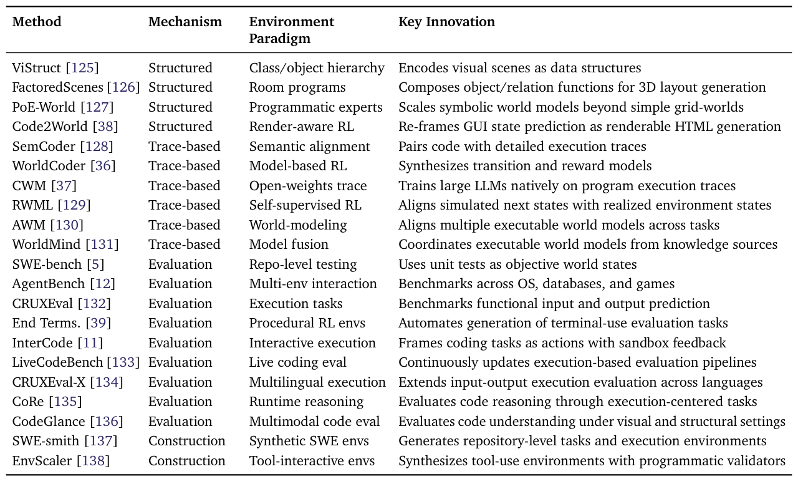

## 📊 แปลเนื้อหาจากตาราง (Table 3): ระบบที่เป็นตัวแทนซึ่งใช้โค้ดเป็นตัวแทนของสภาพแวดล้อม

| วิธีการ (Method) | กลไก (Mechanism) | กระบวนทัศน์สภาพแวดล้อม (Environment Paradigm) | นวัตกรรมสำคัญ (Key Innovation) |
| --- | --- | --- | --- |
| **ViStruct** [125] | ลำดับชั้นคลาส/ออบเจกต์ (Class/object hierarchy) | แบบมีโครงสร้าง (Structured) | แปลงรหัสฉากทัศน์ภาพ (Visual Scenes) ให้เป็นโครงสร้างข้อมูล (Data Structures)
 |
| **FactoredScenes** [126] | แบบมีโครงสร้าง (Structured) | โปรแกรมการจัดห้อง (Room programs) | ประกอบสร้างฟังก์ชันของออบเจกต์และความสัมพันธ์สำหรับการสร้างแผนผัง 3 มิติ (3D Layout Generation)
 |
| **PoE-World** [127] | ผู้เชี่ยวชาญในรูปแบบโปรแกรม (Programmatic experts) | แบบมีโครงสร้าง (Structured) | ขยายขนาดโมเดลโลกเชิงสัญลักษณ์ (Symbolic World Models) ให้ไกลกว่าโลกแบบตารางทั่วไป
 |
| **Code2World** [38] | แบบมีโครงสร้าง (Structured) | การเรียนรู้แบบเสริมกำลังที่รับรู้การเรนเดอร์ (Render-aware RL) | วางกรอบการคาดเดาสถานะ GUI ใหม่ให้เป็นการสร้าง HTML ที่สามารถเรนเดอร์ได้
 |
| **SemCoder** [128] | อิงตามร่องรอยการทำงาน (Trace-based) | การจัดแนวเชิงอรรถศาสตร์ (Semantic alignment) | จับคู่โค้ดเข้ากับร่องรอยการรันโค้ดอย่างละเอียด (Detailed Execution Traces)
 |
| **WorldCoder** [36] | อิงตามร่องรอยการทำงาน (Trace-based) | การเรียนรู้แบบเสริมกำลังแบบอิงโมเดล (Model-based RL) | สังเคราะห์โมเดลการเปลี่ยนผ่านและโมเดลการให้รางวัล (Transition and Reward Models)
 |
| **CWM** [37] | อิงตามร่องรอยการทำงาน (Trace-based) | ร่องรอยแบบเปิดน้ำหนัก (Open-weights trace) | ฝึกฝน LLMs ขนาดใหญ่โดยตรงบนร่องรอยการรันโปรแกรม (Program Execution Traces)
 |
| **RWML** [129] | อิงตามร่องรอยการทำงาน (Trace-based) | การเรียนรู้แบบเสริมกำลังแบบกำกับดูแลตัวเอง (Self-supervised RL) | จัดแนวสถานะถัดไปที่ถูกจำลองให้ตรงกับสถานะสภาพแวดล้อมที่เกิดขึ้นจริง
 |
| **AWM** [130] | การจำลองโมเดลโลก (World-modeling) | อิงตามร่องรอยการทำงาน (Trace-based) | จัดแนวโมเดลโลกที่รันได้จริงหลายโมเดล (Multiple Executable World Models) ข้ามผ่านงานต่าง ๆ
 |
| **WorldMind** [131] | อิงตามร่องรอยการทำงาน (Trace-based) | การหลอมรวมโมเดล (Model fusion) | ประสานงานโมเดลโลกที่รันได้จริงจากแหล่งข้อมูลความรู้ต่าง ๆ
 |
| **SWE-bench** [5] | การประเมินผล (Evaluation) | การทดสอบระดับคลังรหัส (Repo-level testing) | ใช้ชุดทดสอบระดับฟังก์ชันหรือยูนิตเทสต์ (Unit Tests) เป็นสถานะโลกที่เป็นวัตถุวิสัย
 |
| **AgentBench** [12] | การประเมินผล (Evaluation) | การปฏิสัมพันธ์หลายสภาพแวดล้อม (Multi-env interaction) | วัดผลเปรียบเทียบข้ามระบบปฏิบัติการ (OS), ฐานข้อมูล (Databases) และเกม
 |
| **CRUXEval** [132] | การประเมินผล (Evaluation) | งานการรันโค้ด (Execution tasks) | วัดผลเปรียบเทียบการคาดเดาข้อมูลเข้าและผลลัพธ์ของฟังก์ชัน (Functional Input and Output)
 |
| **End Terms.** [39] | สภาพแวดล้อม RL แบบขั้นตอน (Procedural RL envs) | การประเมินผล (Evaluation) | สร้างงานประเมินผลสำหรับการใช้งานเทอร์มินอล (Terminal-use) โดยอัตโนมัติ
 |
| **InterCode** [11] | การรันโค้ดแบบโต้ตอบ (Interactive execution) | การประเมินผล (Evaluation) | วางกรอบงานการเขียนโค้ดให้เป็นการลงมือทำพร้อมข้อมูลป้อนกลับจากแซนด์บ็อกซ์ (Sandbox Feedback)
 |
| **LiveCodeBench** [133] | การประเมินผล (Evaluation) | การประเมินการโค้ดดิ้งสด (Live coding eval) | อัปเดตไปป์ไลน์การประเมินผลที่อิงตามการรันโค้ดจริงอย่างต่อเนื่อง
 |
| **LiveCodeBench** [133] | การประเมินผล (Evaluation) | การประเมินการโค้ดดิ้งสด (Live coding eval) | อัปเดตไปป์ไลน์การประเมินผลที่อิงตามการรันโค้ดจริงอย่างต่อเนื่อง
 |
| **CRUXEval-X** [134] | การรันโค้ดหลายภาษา (Multilingual execution) | การประเมินผล (Evaluation) | ขยายการประเมินผลการรันโค้ดแบบข้อมูลเข้า-ออกไปในหลายภาษา
 |
| **CoRe** [135] | การให้เหตุผลตอนรันไทม์ (Runtime reasoning) | การประเมินผล (Evaluation) | ประเมินผลการให้เหตุผลของโค้ดผ่านงานที่มีการรันโค้ดเป็นศูนย์กลาง
 |
| **CodeGlance** [136] | การประเมินโค้ดแบบมัลติโมดอล (Multimodal code eval) | การประเมินผล (Evaluation) | ประเมินผลความเข้าใจโค้ดภายใต้การตั้งค่าเชิงภาพและเชิงโครงสร้าง
 |
| **SWE-smith** [137] | การสร้าง (Construction) | สภาพแวดล้อม SWE สังเคราะห์ (Synthetic SWE envs) | สร้างงานในระดับคลังรหัส (Repository-level Tasks) และสภาพแวดล้อมการรันโค้ด
 |
| **EnvScaler** [138] | สภาพแวดล้อมโต้ตอบเครื่องมือ (Tool-interactive envs) | การสร้าง (Construction) | สังเคราะห์สภาพแวดล้อมการใช้เครื่องมือพร้อมตัวตรวจสอบความถูกต้องทางโปรแกรม (Programmatic Validators)
 |

---

## 📄 เนื้อหาบทความหลัก (Main Text)

### 2.3. โค้ดสำหรับสภาพแวดล้อมจำลอง (Code for Environment)

เอเจนต์ (Agent) จะต้องคงรักษาตัวแทนที่ชัดเจนของสภาพแวดล้อม (Explicit Representation of the Environment) ที่เอเจนต์กำลังมีปฏิสัมพันธ์ด้วย หากไม่มีตัวแทนดังกล่าว สภาพแวดล้อมจะถูกเปิดเผยต่อเอเจนต์ทางอ้อมเท่านั้น ผ่านทางการสังเกตด้วยข้อความ (Textual Observations), ค่าที่ส่งคืนจากเอพีไอ (API Returns) หรือสัญญาณข้อมูลป้อนกลับที่เบาบาง (Sparse Feedback Signals) ส่งผลให้สถานะของสภาพแวดล้อม (Environment State) มักจะยังคงเป็นสิ่งแฝงเร้น (Implicit), เกิดขึ้นชั่วคราว (Transient) และยากต่อการตรวจสอบความถูกต้อง สิ่งนี้ทำให้เกิดความท้าทายในการติดตามการเปลี่ยนผ่านสถานะ (State Transitions), การประเมินผลลัพธ์ของการปฏิสัมพันธ์ หรือการนำประวัติการปฏิสัมพันธ์ในอดีตกลับมาใช้ซ้ำในงานระยะยาว (Long-horizon Tasks) ข้อจำกัดนี้จะทวีความรุนแรงเป็นพิเศษในสภาพแวดล้อมซอฟต์แวร์ที่มีความซับซ้อน, สภาพแวดล้อมทางหุ่นยนต์ และสภาพแวดล้อมแบบโต้ตอบหลายขั้นตอน ซึ่งการปฏิสัมพันธ์ที่ประสบความสำเร็จนั้น ขึ้นอยู่กับการรักษาสถานะโลกที่สอดคล้องกัน (Consistent World State) และข้อมูลป้อนกลับที่มีบริบทเชื่อมโยงจริงเมื่อเวลาผ่านไป

"โค้ดสำหรับสภาพแวดล้อม" (Code-for-environment) เข้ามาจัดการข้อจำกัดนี้โดยการนำเสนอโปรแกรมที่รันได้จริงเข้าทำหน้าที่เป็นตัวอินเตอร์เฟสของสภาพแวดล้อมเอง (Environment Interface) แทนที่จะปฏิบัติกับสภาพแวดล้อมในฐานะกระบวนการภายนอกที่ทึบแสง (Opaque External Process) ระบบเหล่านี้จะทำให้โครงสร้างและพลวัตของสภาพแวดล้อมเป็นรูปธรรมขึ้นมา ผ่านชิ้นงานเชิงคำนวณ (Computational Artifacts) เช่น เครื่องจำลอง (Simulators), คลังรหัส (Repositories), ชุดทดสอบ (Tests), ร่องรอยการรันโค้ด (Execution Traces), ล็อก (Logs) และโปรแกรมการเปลี่ยนผ่านสถานะ (State-transition Programs) สิ่งนี้ช่วยให้เอเจนต์สามารถจัดเก็บ, ตรวจสอบ (Inspect), รัน (Execute) และแก้ไขสถานะของสภาพแวดล้อมได้อย่างชัดเจนตลอดการปฏิสัมพันธ์

การเป็นตัวแทนของสภาพแวดล้อมผ่านโค้ดที่รันได้จริง มอบข้อดีหลัก 2 ประการ ได้แก่:

* **ประการแรก:** สภาพแวดล้อมที่รันได้จริงจะเปิดเผยการเปลี่ยนผ่านสถานะที่ตรวจสอบความถูกต้องได้ (Verifiable State Transitions) ซึ่งช่วยให้เอเจนต์สามารถประเมินผลลัพธ์ของการปฏิสัมพันธ์ผ่านการรันโค้ด มากกว่าการใช้การตัดสินด้วยภาษาธรรมชาติที่คลุมเครือ

* **ประการที่สอง:** สภาพแวดล้อมที่มีโค้ดเป็นฐานนั้นมีความคงอยู่ถาวรและสามารถแก้ไขได้ (Persistent and Modifiable) ซึ่งเอเจนต์สามารถสอบถามข้อมูล (Query), จำลองสถานการณ์ (Simulate), แก้ไข และปรับแต่งในระหว่างการปฏิสัมพันธ์ได้

แทนที่จะโต้ตอบกับโลกที่ทึบแสงผ่านทางภาษาเพียงอย่างเดียว ตัวควบคุมเอเจนต์ (Agent Harness) จะสามารถเชื่อมโยงกระบวนการให้เหตุผลและการลงมือทำเข้ากับสถานะเชิงคำนวณที่ชัดเจน (Explicit Computational State) และพลวัตในตอนรันไทม์ (Runtime Dynamics) ได้ ทั้งนี้ งานวิจัยที่มีอยู่ในทิศทางนี้สามารถจัดหมวดหมู่ออกเป็น 4 กระบวนทัศน์ (Paradigms) ได้แก่: **ตัวแทนโลกแบบมีโครงสร้าง (Structured World Representations), การจำลองโมเดลโลกจากร่องรอยการรันโค้ด (Execution-trace World Modeling), สภาพแวดล้อมการประเมินผลที่มีโค้ดเป็นรากฐาน (Code-grounded Evaluation Environments) และการสร้างสภาพแวดล้อมที่ตรวจสอบความถูกต้องได้ (Verifiable Environment Construction)**
## หน้า 15

### 2.3.1. ตัวแทนโลกแบบมีโครงสร้าง (Structured World Representations)

ตัวแทนโลกแบบมีโครงสร้าง (Structured world representations) จำลองสภาพแวดล้อมต่าง ๆ ผ่านทางโครงสร้างโปรแกรมที่ชัดเจน (Explicit Programmatic Structures) ซึ่งเอเจนต์สามารถรัน (Execute), ตรวจสอบ (Inspect) และจัดการได้ แทนที่จะเป็นตัวแทนของสภาพแวดล้อมผ่านทางเวกเตอร์ฝังตัวแฝงเร้น (Latent Embeddings) หรือคำอธิบายด้วยข้อความเพียงอย่างเดียว แนวทางเหล่านี้จะแปลงรหัสสถานะโลก, ความสัมพันธ์ของวัตถุ, แผนผังพื้นที่ และพลวัตของการปฏิสัมพันธ์ให้อยู่ในรูปของชิ้นงานเชิงคำนวณที่มีโครงสร้างชัดเจน

ตัวอย่างเช่น ระบบ ViStruct [125] ใช้โครงสร้างของภาษาโปรแกรมเป็นอินเตอร์เฟสที่ชัดเจนสำหรับการสกัดความรู้เชิงโครงสร้างทางภาพ (Visual Structural Knowledge Extraction) ซึ่งช่วยให้เหตุการณ์ทางภาพในระดับความละเอียดที่หลากหลาย สามารถถูกนำเสนอผ่านโครงสร้างที่รันได้และมีความสอดคล้องกัน ในทำนองเดียวกัน FactoredScenes [126] จำลองสภาพแวดล้อมภายในอาคารให้เป็น "โปรแกรมการจัดห้อง" แบบประกอบสร้างได้ (Compositional Room Programs) ซึ่งฟังก์ชันของวัตถุและความสัมพันธ์ที่นำกลับมาใช้ใหม่ได้ จะเป็นตัวกำหนดแผนผังฉากทัศน์ที่มีความสอดคล้องทางกายภาพ การขยายแนวคิดนี้ไปสู่การจำลองโมเดลโลกเชิงสัญลักษณ์ที่ขยายขนาดได้ (Scalable Symbolic World Modeling) ระบบ PoE-World [127] ได้นำเสนอกรอบการทำงานแบบประกอบสร้างที่ผสมผสานผู้เชี่ยวชาญในรูปแบบโปรแกรมขนาดเล็ก (Small Programmatic Experts) จำนวนมากเข้าด้วยกัน เพื่อเป็นตัวแทนของพลวัตสภาพแวดล้อมที่มีความซับซ้อนยิ่งขึ้น

ระบบที่ใหม่กว่านั้นได้ขยายอินเตอร์เฟสสภาพแวดล้อมแบบมีโครงสร้างไปสู่โลกแบบโต้ตอบที่มีความแม่นยำสูง (High-fidelity Interactive Worlds) โดย Code2World [38] วางกรอบการคาดเดาสถานะ GUI ใหม่ให้เป็นการสร้าง HTML ที่สามารถเรนเดอร์ได้ ซึ่งเปิดโอกาสให้การเปลี่ยนผ่านของสภาพแวดล้อมสามารถถูกนำเสนอและประเมินผลผ่านโค้ดการเรนเดอร์ที่รันได้จริง ยิ่งไปกว่านั้น Code2Worlds [139] ได้ขยายกระบวนทัศน์นี้ไปสู่สภาพแวดล้อมจำลอง 4 มิติ (4D Simulated Environments) ผ่านการสร้างโปรแกรมแปลงภาษาเป็นสถานการณ์จำลอง (Language-to-simulation Program Generation) ซึ่งลูปการทำงานที่รับรู้ถึงหลักฟิสิกส์ (Physics-aware Execution Loops) จะช่วยลดความไม่สอดคล้องกันระหว่างเชิงอรรถศาสตร์และเชิงกายภาพในระหว่างการสร้างและการปฏิสัมพันธ์กับสภาพแวดล้อม

### 2.3.2. การจำลองโมเดลโลกจากร่องรอยการรันโค้ด (Execution-trace World Modeling)

การจำลองโมเดลโลกจากร่องรอยการรันโค้ด (Execution-trace world modeling) ศึกษาแนวทางที่เอเจนต์สามารถเรียนรู้พลวัตของสภาพแวดล้อมได้โดยตรง จากร่องรอยการปฏิสัมพันธ์ที่รันได้จริง (Executable Interaction Traces) แทนที่จะปฏิบัติกับการรันโค้ดเป็นเพียงขั้นตอนการประเมินผลขั้นสุดท้ายเท่านั้น แนวทางเหล่านี้จะจำลองการเปลี่ยนผ่านตอนรันไทม์ (Runtime Transitions) ด้วยตัวเอง เพื่อให้เป็นตัวแทนหลักของพฤติกรรมสภาพแวดล้อม

ระบบ SemCoder [128] เชื่อมโยงโปรแกรมแบบสแตติก (Static Programs) เข้ากับอรรถศาสตร์ตอนรันไทม์ (Runtime Semantics) โดยการฝึกฝนโมเดลภาษาให้วิเคราะห์เกี่ยวกับพฤติกรรมเชิงฟังก์ชัน (Functional Behavior), ผลกระทบของการรันโค้ดในระดับคำสั่ง (Statement-level Execution Effects) และการเปลี่ยนผ่านของข้อมูลเข้าและผลลัพธ์ ด้วยการต่อยอดบนมุมมองนี้ โมเดลโลกฐานโค้ด (Code World Model - CWM) [37] จึงเรียนรู้โมเดลโลกแบบคาดการณ์ (Predictive World Models) โดยตรงจากร่องรอยของโปรแกรม ซึ่งช่วยให้เอเจนต์สามารถคาดการณ์สถานะสภาพแวดล้อมในอนาคตได้ผ่านพลวัตที่รันได้จริง

นอกจากนี้ WorldCoder [36] ได้นำเสนอกรอบการทำงานของการปฏิสัมพันธ์แบบอิงโมเดล (Model-based Interaction Framework) ซึ่งเอเจนต์จะเขียนและอัปเดตโมเดลโลกที่รันได้จริงซึ่งนำเสนอในรูปแบบของโปรแกรม Python อย่างชัดเจน แทนที่จะจัดเก็บความรู้เกี่ยวกับสภาพแวดล้อมไว้ในพารามิเตอร์ของโมเดล (Model Parameters) เพียงอย่างเดียวแบบแฝงเร้น เอเจนต์จะคงรักษาตัวแทนเชิงคำนวณที่สามารถแก้ไขได้ (Editable Computational Representations) ซึ่งสามารถนำไปรัน, แก้ไข และนำกลับมาใช้ซ้ำได้ในระหว่างการวางแผนและการปฏิสัมพันธ์ งานวิจัยในเวลาต่อมาได้ขยายกระบวนทัศน์นี้ไปสู่การปรับตัวของโมเดลโลกแบบต่อเนื่องและแบบโต้ตอบ (Interactive World-model Adaptation) โดย RWML [129] ผสมผสานร่องรอยการรันโค้ดเข้ากับการเรียนรู้แบบเสริมกำลัง (Reinforcement Learning) เพื่อปรับแต่งพลวัตของสภาพแวดล้อมผ่านการปฏิสัมพันธ์ในตอนรันไทม์ ในขณะที่ AWM [130] และ WorldMind [131] ศึกษาแนวทางที่โมเดลโลกที่รันได้จริงหลาย ๆ โมเดลสามารถถูกจัดแนว (Aligned), หลอมรวม (Fused) และประสานงานร่วมกันข้ามผ่านงานและแหล่งข้อมูลความรู้ต่าง ๆ ได้

### 2.3.3. สภาพแวดล้อมการประเมินผลที่มีโค้ดเป็นรากฐาน (Code-grounded Evaluation Environments)

สภาพแวดล้อมการประเมินผลที่มีโค้ดเป็นรากฐาน (Code-grounded evaluation environments) ใช้ระบบที่รันได้จริงเป็นอินเตอร์เฟสสำหรับการวัดผลพฤติกรรมของเอเจนต์และคุณภาพของการปฏิสัมพันธ์ สิ่งที่แตกต่างจากชุดทดสอบมาตรฐานแบบสแตติก (Static Benchmarks) ที่อิงตามผลลัพธ์ที่เป็นข้อความเพียงอย่างเดียวก็คือ สภาพแวดล้อมเหล่านี้จะเปิดเผยการเปลี่ยนผ่านสถานะตอนรันไทม์ที่ชัดเจน (Explicit Runtime State Transitions), ข้อมูลป้อนกลับจากการรันโค้ด (Execution Feedback) และผลลัพธ์ของการปฏิสัมพันธ์ที่ตรวจสอบความถูกต้องได้ ซึ่งเอเจนต์สามารถสังเกตและประเมินผลได้โดยตรง

ระบบ InterCode [11] ได้สร้างกระบวนทัศน์นี้ขึ้นมาโดยการวางกรอบงานการเขียนโค้ดใหม่ ให้กลายเป็นสภาพแวดล้อมการรันโค้ดแบบโต้ตอบ (Interactive Execution Environments) ซึ่งโค้ดจะทำหน้าที่เป็นการลงมือทำ (Actions), ข้อมูลป้อนกลับจากการรันโค้ดทำหน้าที่เป็นข้อมูลการสังเกต (Observations) และสภาพแวดล้อมรันไทม์แบบแซนด์บ็อกซ์ (Sandboxed Runtimes) จะมอบการปฏิสัมพันธ์ที่มีบริบทเชื่อมโยงจริง

นอกจากนี้ CRUXEval [132] ยังประเมินความเข้าใจโปรแกรมเพิ่มเติมผ่านงานคาดเดาข้อมูลเข้าและผลลัพธ์ที่รันได้จริง (Executable Input-output Prediction Tasks) ในขณะที่ LiveCodeBench [133] นำเสนอไปป์ไลน์การประเมินผลที่อัปเดตอย่างต่อเนื่อง ซึ่งทำหน้าที่ประเมินการรันโค้ด, การซ่อมแซมตัวเอง (Self-repair) และความสามารถในการให้เหตุผลตอนรันไทม์ ภายใต้การกระจายตัวของปัญหาที่พัฒนาเปลี่ยนแปลงอยู่ตลอดเวลา ท้ายที่สุด SWE-bench [5] ได้ขยายการประเมินผลแบบรันได้จริงนี้ไปสู่ระดับโลกแห่งความเป็นจริง...

## หน้า 16

...คลังซอฟต์แวร์ในโลกแห่งความเป็นจริง (Real-world Software Repositories) ซึ่งเอเจนต์ต้องเข้าไปแก้ไขฐานรหัสขนาดใหญ่ (Large-scale Codebases) และถูกประเมินผลผ่านการรันชุดทดสอบระดับฟังก์ชันหรือยูนิตเทสต์ในระดับคลังรหัส (Repository-level Unit-test Execution) แทนที่จะดูเพียงความถูกต้องของข้อความเพียงอย่างเดียว ยิ่งไปกว่านั้น เมื่อมองในภาพรวม สหกรณ์ชุดทดสอบอย่าง AgentBench [12] ได้พิสูจน์ให้เห็นว่า สภาพแวดล้อมการปฏิสัมพันธ์ที่รันได้จริง สามารถประเมินผลกระบวนการให้เหตุผลและการตัดสินใจ ครอบคลุมงานทางระบบฮาร์ดแวร์และระบบดิจิทัลที่หลากหลาย

ชุดทดสอบมาตรฐานในเวลาต่อมา เช่น CRUXEval-X [134], CoRe [135], GeoGramBench [140], CodeGlance [136] และ Endless Terminals [39] ได้ขยายกระบวนทัศน์นี้เพิ่มเติมไปสู่สภาพแวดล้อมการประเมินผลแบบรองรับหลายภาษา (Multilingual), มัลติโมดอล (Multimodal) และการปฏิสัมพันธ์แบบต่อเนื่อง (Continuously Interactive Evaluation Settings) ซึ่งการปฏิสัมพันธ์ในตอนรันไทม์ (Runtime Interaction) ได้กลายมาเป็นอินเตอร์เฟสหลักในการประเมินผล แทนที่จะเป็นการจับคู่คำตอบแบบสแตติก (Static Answer Matching) แบบเดิม

### 2.3.4. การสร้างสภาพแวดล้อมที่ตรวจสอบความถูกต้องได้ (Verifiable Environment Construction)

ทิศทางที่ใหม่กว่านั้นจะปฏิบัติกับสภาพแวดล้อมที่รันได้จริง ไม่ใช่แค่ในฐานะชุดทดสอบมาตรฐาน (Benchmarks) เพื่อประเมินเอเจนต์เท่านั้น แต่ในฐานะชิ้นงานของตัวควบคุม (Harness Artifacts) ที่สามารถถูกสังเคราะห์, ขยายขนาด และตรวจสอบความถูกต้องได้ด้วยโปรแกรม สิ่งนี้มีความสำคัญอย่างยิ่งสำหรับเอเจนต์ที่ทำงานระยะยาว (Long-horizon Agents) ซึ่งตัวควบคุม (Harness) จะต้องไม่เพียงแค่มอบคำสั่งกระตุ้น (Task Prompt) เท่านั้น แต่ยังต้องจัดเตรียมสถานะที่รันได้ (Runnable State), พลวัตการเปลี่ยนผ่าน (Transition Dynamics), ช่องทางรับข้อมูลป้อนกลับ (Feedback Channels) และระบบคำนวณผลลัพธ์เพื่อตรวจสอบความถูกต้อง (Verification Oracles) อีกด้วย

ระบบ SWE-smith [137] ขยายขนาดข้อมูลของเอเจนต์วิศวกรรมซอฟต์แวร์ โดยการสร้างงานในระดับคลังรหัส (Repository-level Tasks) และสภาพแวดล้อมการรันโค้ดขึ้นมาจากฐานรหัสที่มีอยู่เดิม ซึ่งจะเปลี่ยนคลังซอฟต์แวร์ให้กลายเป็นโลกโปรแกรมที่สามารถรันซ้ำได้ (Reproducible Program Worlds) เพื่อใช้ในการฝึกฝนและประเมินผลเอเจนต์ ส่วนระบบ EnvScaler [138] ได้ขยายแนวคิดนี้ไปไกลกว่างานวิศวกรรมซอฟต์แวร์ ด้วยการสังเคราะห์สภาพแวดล้อมที่โต้ตอบกับเครื่องมือ (Tool-interactive Environments) ขึ้นมาด้วยโปรแกรม ควบคู่ไปกับฉากทัศน์และตัวตรวจสอบความถูกต้องของเส้นทางการทำงานแบบอิงกฎเกณฑ์ (Rule-based Trajectory Validators)

เมื่อมองจากมุมมองของตัวควบคุม (Harness Perspective) วิธีการเหล่านี้ทำให้อินเตอร์เฟสของสภาพแวดล้อมกลายมาเป็นวัตถุในการก่อร่างสร้างตัวขึ้นมาเอง: โค้ดไม่ได้ระบุเพียงแค่สิ่งที่เอเจนต์จะแก้ไขหรือรันเท่านั้น แต่ยังรวมถึงการเปลี่ยนผ่านสถานะ (State Transitions), ความสามารถในการตอบสนองของเครื่องมือ (Tool Affordances) และตัวตรวจสอบความถูกต้อง (Verifiers) ที่จะเป็นตัวกำหนดว่าการปฏิสัมพันธ์นั้นประสบความสำเร็จหรือไม่

---

## 3. กลไกของตัวควบคุม: การวางแผน, หน่วยความจำ, การใช้เครื่องมือ, การควบคุม และการเพิ่มประสิทธิภาพ (Harness Mechanisms: Planning, Memory, Tool Use, Control, and Optimization)

กลไกของตัวควบคุม (Harness Mechanisms) ฟอร์มตัวเป็นเลเยอร์ระบบส่วนกลาง (Central Systems Layer) ที่ช่วยเพิ่มความน่าเชื่อถือให้กับเอเจนต์ที่ถูกควบคุมด้วยโค้ด เกินกว่าขั้นตอนการสร้างผลลัพธ์เพียงขั้นตอนเดียว (Single Generation Step) เมื่อโค้ดเข้าสู่ลูปของเอเจนต์ (Agent Loop) แล้ว การสร้างซอฟต์แวร์จะไม่ใช่เพียงแค่ปัญหาของการผลิตโปรแกรมที่ถูกต้องจากคำสั่งกระตุ้นอีกต่อไป แต่มันจะกลายเป็นการปฏิสัมพันธ์กันระหว่างตัวโมเดล, สถานะงานที่แปรเปลี่ยนได้ (Mutable Task State) และโครงสร้างพื้นฐานของตัวควบคุมที่มนุษย์ออกแบบขึ้นมา (Human-designed Harness Infrastructure)

* **ตัวโมเดล** ทำหน้าที่ให้การตัดสินใจ (Judgment): ย่อยส่วนงานของเป้าหมาย, เลือกการลงมือทำ, ตีความข้อมูลป้อนกลับ และตัดสินใจว่าจะทำการแก้ไขเมื่อใด

* **สถานะงานที่แปรเปลี่ยนได้** ทำหน้าที่บันทึกหลักฐานจากคลังรหัส (Repository Evidence), บริบทการทำงาน (Working Context), ร่องรอยการรันโค้ด (Execution Traces), ผลลัพธ์การตรวจสอบความถูกต้อง (Validation Results), หน่วยความจำ และความเชื่อระหว่างทางเกี่ยวกับงานนั้น ๆ

* **โครงสร้างพื้นฐานของตัวควบคุม** ทำหน้าที่เปิดเผยเครื่องมือและซับสเตรตการรันโค้ด (Execution Substrates), จัดเก็บและบีบอัดสถานะให้กระชับ, จำกัดขอบเขตการลงมือทำผ่านนโยบายและระดับสิทธิ์การเข้าถึง (Permission Tiers), กำหนดเส้นทางของข้อมูลป้อนกลับ และตรวจสอบความถูกต้องว่าการเปลี่ยนผ่านสถานะในแต่ละครั้งนั้นเป็นสิ่งที่ยอมรับได้หรือไม่

เมื่อมองจากมุมมองนี้ กลไกของตัวควบคุมจึงไม่ใช่โมดูลส่วนเสริมที่แยกขาดจากกัน แต่เป็นพื้นผิวการควบคุมที่ประสานงานร่วมกัน (Coordinated Control Surfaces) ซึ่งทำหน้าที่เปลี่ยนการตัดสินใจของโมเดล ให้กลายเป็นการเปลี่ยนแปลงที่ถูกจำกัดขอบเขต, สังเกตได้ และแก้ไขได้ภายในสภาพแวดล้อมที่รันได้จริง ในรูปแบบพื้นฐาน โค้ดจะเปิดโอกาสให้เอเจนต์สามารถเรียกใช้งานอินเตอร์เฟสที่รันได้ที่มีอยู่เดิม ยิ่งไปกว่านั้น เอเจนต์ยังสามารถเขียนสร้างอินเตอร์เฟสที่รันได้จริงขึ้นมาเฉพาะสำหรับงานนั้น ๆ ได้แบบไดนามิกอีกด้วย ชิ้นงานที่สร้างขึ้นโดยเอเจนต์ (Agent-authored Artifacts) เหล่านี้ช่วยให้ตัวควบคุมสามารถปรับตัวได้ดียิ่งขึ้น เพราะพวกมันเปิดโอกาสให้สภาพแวดล้อมการรันโค้ดสามารถถูกปรับเปลี่ยนรูปร่างใหม่รอบ ๆ งานปัจจุบันได้

อย่างไรก็ตาม โค้ดที่ถูกเขียนขึ้นมาแบบไดนามิกนี้ ไม่ได้เข้ามาทดแทนโครงสร้างพื้นฐานของตัวควบคุมในภาพรวมที่มนุษย์ออกแบบขึ้นมาแต่อย่างใด ความน่าเชื่อถือของระบบยังคงต้องพึ่งพาการตัดสินใจจากฝั่งโมเดล ควบคู่ไปกับนโยบายที่มนุษย์ออกแบบ, ขอบเขตแซนด์บ็อกซ์ (Sandbox Boundaries), ระดับสิทธิ์การเข้าถึง (Permission Tiers), ระบบคำนวณผลลัพธ์เพื่อตรวจสอบความถูกต้อง (Verification Oracles), ล็อกสำหรับการตรวจสอบ (Audit Logs) และประตูกลั่นกรองโดยการรีวิวจากมนุษย์ (Human-review Gates) ดังนั้น โค้ดจึงทำหน้าที่เป็นสื่อกลางที่รันได้จริงอยู่ภายในตัวควบคุม ในขณะที่ตัวควบคุมยังคงเป็นระบบขนาดใหญ่ที่ถูกกำกับดูแลด้วยนโยบาย (Policy-governed System) ซึ่งทำหน้าที่ตัดสินว่าโค้ดใดบ้างที่สามารถรันได้, ได้รับความไว้วางใจ, จัดเก็บถาวร, นำกลับมาใช้ซ้ำ หรือส่งเสริมเข้าไปในเวิร์กโฟลว์อนาคตได้

ในส่วนนี้ เราจะทบทวนกลไกของตัวควบคุมสำหรับเอเจนต์ฐานโค้ด 5 หมวดหมู่ที่มีปฏิสัมพันธ์ร่วมกัน ได้แก่:

* **การวางแผน (Planning - §3.1):** จัดระเบียบการรันงานระยะยาวโดยการดึงเป้าหมายออกมาสู่ภายนอกให้อยู่ในรูปของการย่อยส่วนงาน, ข้อจำกัดเชิงโครงสร้าง (Structural Constraints), เส้นทางการค้นหา (Search Trajectories) หรือการประสานงานในระดับเวิร์กโฟลว์ (Workflow-level Orchestration)

* **หน่วยความจำและวิศวกรรมบริบท (Memory and Context Engineering - §3.2):** จัดการสถานะที่แปรเปลี่ยนได้ตลอดการปฏิสัมพันธ์ระยะยาว โดยการคงรักษาบริบทการทำงาน, ดึงหลักฐานจากคลังรหัส, จัดเก็บ...

## หน้า 17

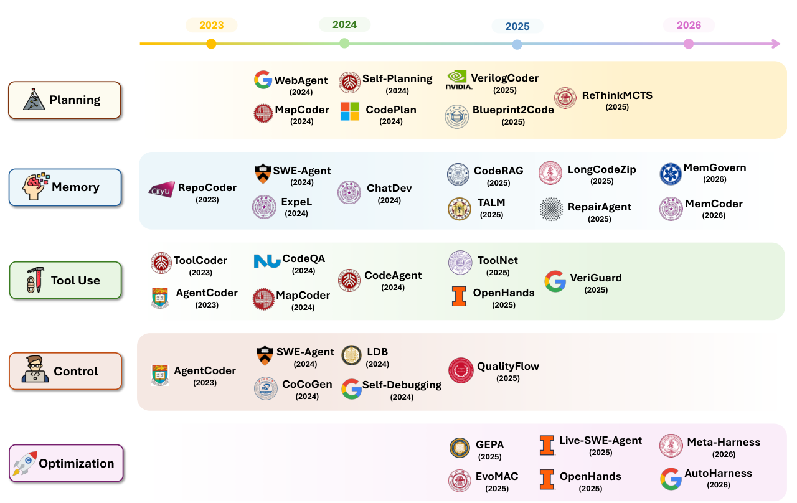

รูปที่ 4: ภาพรวมแผนงานของกลไก agent harness

นี่คือบทแปลเนื้อหาจากรูปภาพแผนงานกลไก (Figure 4) และเนื้อหาบทความในหน้า 17 เป็นภาษาไทย โดยใส่คำศัพท์เทคนิคภาษาอังกฤษควบคู่ไว้ในวงเล็บเพื่อความชัดเจนและใช้ในการอ้างอิงครับ

---

## 📌 แปลเนื้อหาจากแผนภาพ (Figure 4): ภาพรวมแผนงานของกลไกตัวควบคุมเอเจนต์ (Agent Harness Mechanisms)

### การวางแผน (Planning)

* **2024:** WebAgent, MapCoder, Self-Planning, CodePlan

* **2025:** VerilogCoder (NVIDIA), Blueprint2Code, ReThinkMCTS

### หน่วยความจำ (Memory)

* **2023:** RepoCoder

* **2024:** SWE-Agent, Expel, ChatDev

* **2025:** CodeRAG, TALM, LongCodeZip, RepairAgent

* **2026:** MemGovern, MemCoder

### การใช้เครื่องมือ (Tool Use)

* **2023:** ToolCoder, AgentCoder

* **2024:** CodeQA, MapCoder, CodeAgent

* **2025:** ToolNet, OpenHands, VeriGuard

### การควบคุม (Control)

* **2023:** AgentCoder

* **2024:** SWE-Agent, CoCoGen, LDB, Self-Debugging

* **2025:** QualityFlow

### การเพิ่มประสิทธิภาพ (Optimization)

* **2025:** GEPA, EvoMAC, Live-SWE-Agent, OpenHands

* **2026:** Meta-Harness, AutoHarness

* *คำอธิบายภาพ:* **รูปที่ 4: ภาพรวมแผนงาน (Roadmap) ของกลไกตัวควบคุมเอเจนต์ (Agent Harness Mechanisms)**

---

## 📄 เนื้อหาบทความหลัก (Main Text)

...จัดเก็บประสบการณ์ที่นำกลับมาใช้ใหม่ได้ (Reusable Experience), สนับสนุนประวัติการโต้ตอบที่ใช้ร่วมกัน (Shared Histories) และการโยกย้ายสถานะ (Offloading State) ออกไปนอกหน้าต่างบริบทที่กำลังทำงานอยู่ (Active Context Window)

* **การใช้เครื่องมือ (Tool Usage - §3.3):** เชื่อมต่อเอเจนต์เข้ากับอินเตอร์เฟสที่รันได้และถูกกำกับดูแล (Governed Executable Interfaces) ซึ่งรวมถึง APIs, คลังรหัส (Repositories), เทอร์มินอล (Terminals), แซนด์บ็อกซ์ (Sandboxes), เครื่องมือตรวจสอบความถูกต้อง (Verification Tools) และตัวประสานงานเวิร์กโฟลว์ (Workflow Orchestrators)

* **การควบคุมตัวควบคุมผ่านลูป วางแผน-รัน-ตรวจสอบ (Harness Control through the Plan-Execute-Verify Loop - §3.4):** วางกรอบการดีบั๊กที่ขับเคลื่อนด้วยข้อมูลป้อนกลับ (Feedback-guided Debugging) ใหม่ให้เป็นกระบวนการควบคุมที่กว้างขึ้น: โดยแผนการทำงาน (Plans) จะฟอร์มตัวเป็นสัญญา (Contracts) เหนือการเปลี่ยนแปลงที่เจตนาจะทำ, การรันโค้ด (Execution) จะนำการเปลี่ยนแปลงเหล่านั้นไปประยุกต์ใช้ภายในสภาพแวดล้อมที่ปลอดภัยแบบแซนด์บ็อกซ์และได้รับอนุญาตสิทธิ์ (Sandboxed and Permissioned Environments) และการตรวจสอบความถูกต้อง (Verification) จะใช้เซนเซอร์แบบดีเทอร์มินิสติก (Deterministic Sensors) และประตูกลั่นกรองโดยการรีวิวจากมนุษย์ (Human-review Gates) เพื่อตัดสินว่าสถานะนั้นควรจะถูกยอมรับ, แก้ไข, ยกระดับปัญหา (Escalated) หรือย้อนกลับ (Rolled Back)

* **วิศวกรรมตัวควบคุมเอเจนต์ (Agentic Harness Engineering - §3.5):** ศึกษาแนวทางที่ตัวควบคุมจะสามารถถูกวัดผลและปรับปรุงได้ด้วยตัวเอง ผ่านระบบวัดและบันทึกข้อมูลทางไกลแบบลึก (Deep Telemetry), เอเจนต์เพื่อการวิวัฒนาการ (Evolution Agents), การประเมินผลแบบอิงตามการเล่นซ้ำ (Replay-based Evaluation) และการกลายพันธุ์ของตัวควบคุมภายใต้การกำกับดูแล (Governed Harness Mutation)

---

### 3.1. การวางแผนสำหรับตัวควบคุมเอเจนต์ (Planning for Agent Harness)

การวางแผน (Planning) มีบทบาทสำคัญอย่างยิ่งในตัวควบคุมเอเจนต์ (Agentic Harness) เนื่องจากงานวิศวกรรมซอฟต์แวร์ในโลกแห่งความเป็นจริง น้อยครั้งนักที่จะยอมให้เกิดการจับคู่แบบครั้งเดียวผ่านตรง ๆ (Direct One-shot Mapping) จากความเจตนาทางภาษาธรรมชาติไปสู่การนำไปใช้งานที่ถูกต้องได้

เมื่อมองจากมุมมองของตัวควบคุม การวางแผนไม่ได้เป็นเพียงแค่ความสามารถในการให้เหตุผลภายใน (Internal Reasoning Capability) ของ LLM เท่านั้น แต่เป็นรูปแบบหนึ่งของการควบคุมของตัวควบคุม (Harness Control): กล่าวคือ มันช่วยจัดโครงสร้างแนวทางที่เอเจนต์ใช้ในการดึงความเจตนาออกมาสู่ภายนอกให้เป็นขั้นตอนที่รันได้จริง (Executable Steps), จัดตารางเวลาการปฏิสัมพันธ์กับชิ้นงานโค้ดและเครื่องมือต่าง ๆ และควบคุมเส้นทางของการให้เหตุผล, การรันโค้ด และการแก้ไขโค้ดเมื่อเวลาผ่านไป

นอกเหนือจากการสร้างโทเค็นของโค้ด (Code Tokens) แล้ว ตัวควบคุมเอเจนต์ที่มีประสิทธิภาพจะต้องจัดระเบียบการแก้ปัญหาระยะยาว (Long-horizon Problem Solving) ให้เป็นแนวทางการลงมือทำที่สอดคล้องกัน โดยต้องตัดสินใจว่าเป้าหมายระหว่างทางใดที่ควรจะมุ่งดำเนินการ, ควรจะรันเป้าหมายเหล่านั้นในลำดับใด, ชิ้นงานใดที่ต้องเข้าไปตรวจสอบหรือแก้ไข และจะปรับปรุงเส้นทางการทำงานอย่างไรเมื่อข้อมูลป้อนกลับจากการรันโค้ดเปิดเผยให้เห็นถึงข้อผิดพลาด (Errors), การพึ่งพาที่ขาดหายไป (Missing Dependencies) หรือ...

## หน้า 18

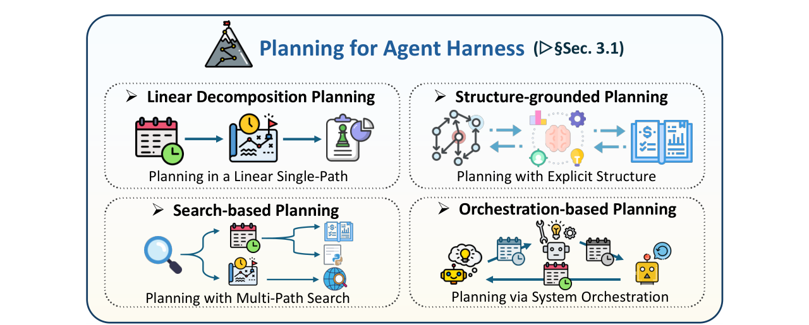

รูปที่ 5: ภาพรวมของกลไก planning สำหรับ harness agent

## 📌 เนื้อหาจากแผนภาพ (Figure 5): ภาพรวมของกลไกการวางแผนสำหรับตัวควบคุมเอเจนต์ (Planning Mechanisms for Agent Harnesses)

### การวางแผนสำหรับตัวควบคุมเอเจนต์ (Planning for Agent Harness - ▷§Sec. 3.1)

* **การวางแผนแบบย่อยส่วนงานเชิงเส้น (Linear Decomposition Planning):** การวางแผนในเส้นทางเดี่ยวเชิงเส้น (Planning in a Linear Single-Path)

* **การวางแผนแบบเชื่อมโยงกับโครงสร้างจริง (Structure-grounded Planning):** การวางแผนด้วยโครงสร้างที่ระบุชัดเจน (Planning with Explicit Structure)

* **การวางแผนแบบอิงตามการค้นหา (Search-based Planning):** การวางแผนด้วยการค้นหาแบบหลายเส้นทาง (Planning with Multi-Path Search)

* **การวางแผนแบบอิงตามการประสานงาน (Orchestration-based Planning):** การวางแผนผ่านการประสานงานของระบบ (Planning via System Orchestration)

---

## 📄 เนื้อหาบทความหลัก (Main Text)

...ข้อจำกัดที่ถูกละเมิด (Violated Constraints) ความจำเป็นนี้จะทวีความรุนแรงเป็นพิเศษในงานแก้ไขโค้ดระดับคลังรหัส (Repository-level Editing), การปฏิสัมพันธ์บนเว็บ (Web Interaction), การเขียนโปรแกรมเพื่อการแข่งขัน (Competitive Programming) และการออกแบบฮาร์ดแวร์ (Hardware Design) ซึ่งเอเจนต์จะต้องทำงานภายใต้พื้นที่การลงมือทำขนาดใหญ่ (Large Action Spaces), ข้อมูลป้อนกลับที่เบาบาง (Sparse Feedback) และปัญหาซับซ้อนย่อย ๆ ที่พึ่งพากันอย่างลึกซึ้ง ในการตั้งค่าระบบเช่นนี้ ความท้าทายพื้นฐานจะเกิดขึ้นระหว่างความซับซ้อนของงานเป้าหมายและความน่าเชื่อถือที่จำกัดของการรันเอเจนต์แบบไม่มีการควบคุม (Unconstrained Agent Execution): หากไม่มีกลไกการวางแผนที่ชัดเจนทำหน้าที่ควบคุมระบบ (Harness Control) เอเจนต์อาจจะด่วนตัดสินใจเลือกเส้นทางโซลูชันที่เปราะบางเร็วเกินไป, มองข้ามความเกี่ยวพันที่แฝงอยู่ หรือล้มเหลวในการประสานงานระหว่างการให้เหตุผล (Reasoning), การดึงข้อมูล (Retrieval), การรันโค้ด (Execution) และการแก้ไขโค้ด (Revision) ให้กลายเป็นเวิร์กโฟลว์ที่มั่นคงได้

ระบบที่มุ่งเน้นการวางแผนในยุคแรก ๆ ส่วนใหญ่จะปฏิบัติกับการวางแผนเสมือนเป็นเพียงขั้นตอนการย่อยส่วนงานเชิงเส้น (Linear Decomposition Step) โดยที่โมเดลจะสร้างโครงร่างโซลูชันด้วยภาษาธรรมชาติต่าง ๆ ขึ้นมาก่อน แล้วจึงแปลงโครงร่างนั้นให้เป็นโค้ด ทว่าเมื่อโค้ดเอเจนต์ (Code Agents) ถูกนำไปประยุกต์ใช้กับสภาพแวดล้อมที่มีความซับซ้อนมากขึ้น กลไกการวางแผนจึงค่อย ๆ พัฒนาจากโครงนั่งร้านแบบง่าย ๆ ก่อนการสร้างโค้ด (Pre-generation Scaffold) ไปสู่กลไกการควบคุมในระดับระบบควบคุมที่มีความสมบูรณ์ยิ่งขึ้น มันสามารถเชื่อมโยงเข้ากับโครงสร้างคลังรหัส (Repository Structure) หรือความรู้ภายนอกเพื่อจำกัดพื้นที่การลงมือทำของเอเจนต์, สามารถขยายประสิทธิภาพผ่านการค้นหาอย่างชัดเจนเหนือเส้นทางทางเลือกที่หลากหลาย (Multiple Candidate Trajectories) เพื่อเพิ่มความทนทาน (Robustness) หรือสามารถกระจายงานข้ามบทบาทเอเจนต์เฉพาะทาง (Specialized Agent Roles) และลูปข้อมูลป้อนกลับเพื่อประสานงานการรันโค้ดในระดับระบบได้ ทั้งนี้ เมื่อพิจารณาจากตำแหน่งหลักที่การควบคุมของระบบได้รับการปฏิบัติต่าง ๆ เราจึงจัดหมวดหมู่วิธีการวางแผนที่มีอยู่ในเอเจนต์ฐานโค้ดออกเป็น 4 ประเภท ได้แก่: **การวางแผนแบบย่อยส่วนงานเชิงเส้น (Linear Decomposition Planning), การวางแผนแบบเชื่อมโยงกับโครงสร้างจริง (Structure-grounded Planning), การวางแผนแบบอิงตามการค้นหา (Search-based Planning) และการวางแผนแบบอิงตามการประสานงาน (Orchestration-based Planning)**

---

### 3.1.1. การวางแผนแบบย่อยส่วนงานเชิงเส้น (Linear Decomposition Planning)

ในกระบวนทัศน์การวางแผนนี้ เริ่มแรกเอเจนต์จะสร้างลำดับขั้นตอนที่ชัดเจนและรันได้จริงขึ้นมาเพียงเส้นทางเดียว (Single Explicit, Executable Sequence of Steps) จากนั้นจึงดำเนินการสร้างโค้ดโดยปฏิบัติตามขั้นตอนที่ถูกย่อยออกมานี้ [141, 40, 41, 142, 143] รูปแบบต้นแบบที่มีน้ำหนักเบาของแนวคิดนี้ก็คือ ReAct [144] ซึ่งเอเจนต์จะทำการสลับการทำงานไปมาระหว่างความคิด (Thoughts), การลงมือทำ (Actions) และข้อมูลการสังเกต (Observations) ในเส้นทางการทำงานแบบอนุกรม (Serial Trajectory) ในเฟรมเวิร์กนี้ แต่ละขั้นตอนการให้เหตุผลจะดึงเป้าหมายย่อยปัจจุบันออกมาสู่ภายนอก และทำหน้าที่จำกัดขอบเขตการลงมือทำในขั้นต่อไป ซึ่งจะเปลี่ยนตัวเส้นทางการทำงานเองให้กลายเป็นระบบควบคุมทีละก้าวสำหรับการควบคุมระบบ (Stepwise Harness for Control)

รูปแบบนี้ได้รับการทำให้เห็นภาพอย่างชัดเจนที่สุดในระบบ Self-Planning [40]: โดยโมเดลจะย่อยความเจตนาออกเป็นขั้นตอนสั้น ๆ ในระดับสูงพร้อมใส่หมายเลขกำกับ จากนั้นจึงสร้างโค้ดขึ้นมาทีละขั้นตอนภายใต้การนำทางของแผนการทำงานนี้ นอกจากนี้ ระบบ Plan-And-Act [145] ยังได้ช่วยทำให้ระบบควบคุมนี้มีความชัดเจนยิ่งขึ้น โดยการแยกแยะ "ตัววางแผน" (Planner) ออกมา ซึ่งทำหน้าที่สร้างแผนการทำงานระดับสูงที่มีโครงสร้างชัดเจน: โดยตัววางแผนจะคอยอัปเดตโครงนั่งร้านเชิงเส้นนั้นซ้ำ ๆ เมื่อมีข้อมูลการสังเกตใหม่ ๆ เข้ามา ซึ่งเปิดโอกาสให้กลยุทธ์การวางแผนสามารถคงรักษาการควบคุมในระดับงาน (Task-level Control) เอาไว้ได้ในขณะที่ปรับตัวเข้ากับข้อมูลป้อนกลับจากสภาพแวดล้อมไปด้วย ยิ่งไปกว่านั้น ระบบ WebAgent [41] ได้ขยายแนวคิดนี้ไปสู่การใช้งานบนเว็บ...

## หน้า 19

...ระบบอัตโนมัติบนเว็บ (Web Automation): โดยมันจะย่อยคำสั่งของผู้ใช้ออกเป็นคำสั่งย่อย (Sub-instructions) ที่ต่อเนื่องกัน สรุปเนื้อหา HTML ที่เกี่ยวข้องกับงานโดยอิงตามเป้าหมายย่อยในปัจจุบัน แล้วจึงสังเคราะห์การลงมือทำด้วยภาษา Python ที่รันได้จริงขึ้นมาจากลำดับคำสั่งย่อยเชิงเส้นนั้น

ระบบ KareCoder [141] ก็ปฏิบัติตามรูปแบบที่คล้ายกันนี้ในการตั้งค่าระบบแบบเพิ่มขยายด้วยความรู้ (Knowledge-augmented Setting) โดยเริ่มแรกโมเดลจะสร้างคำสั่งกระตุ้น (Prompt) แบบทีละขั้นตอนที่รับรู้ถึงบริบทความรู้จากคลังความรู้ภายนอก แล้วจึงใช้คำสั่งกระตุ้นนี้ในการสร้างโค้ด ซึ่งทำให้การวางแผนกลายเป็นเลเยอร์ระหว่างทางที่มีโครงสร้าง (Structured Intermediate Layer) ระหว่างความเข้าใจปัญหาและการนำไปใช้งานจริง

แนวปฏิบัติในภาคอุตสาหกรรมเมื่อไม่นานมานี้แสดงให้เห็นว่า โครงนั่งร้านเชิงเส้น (Linear Scaffold) นี้สามารถถูกยกระดับจากเดิมที่เป็นเพียงชิ้นงานคำสั่งกระตุ้นที่เกิดขึ้นชั่วคราว (Ephemeral Prompt Artifact) ไปสู่การเป็นวัตถุของตัวควบคุมที่คงอยู่ถาวร (Persistent Harness Object) ได้ ในเวิร์กโฟลว์การเขียนโค้ดระยะยาว (Long-horizon Coding Workflows) ไฟล์ต่าง ๆ เช่น `PLAN.md`, `Implement.md` และStatus Logs จะทำหน้าที่บันทึกเหตุการณ์สำคัญ (Milestones), เกณฑ์การยอมรับงาน (Acceptance Criteria), คำสั่งตรวจสอบความถูกต้อง (Validation Commands) และกฎการกู้คืนระบบ (Recovery Rules) ซึ่งช่วยให้เอเจนต์สามารถโหลดข้อมูลใหม่, อัปเดต, ตรวจสอบความถูกต้อง และบันทึกเอกสารความคืบหน้าข้ามผ่านการรีเซ็ตบริบท (Context Resets) หรือการรันโค้ดแบบหลายเซสชัน (Multi-session Execution) ได้ [146, 147]

ในมุมมองนี้ การวางแผนไม่ใช่เป็นเพียงแค่ร่องรอยการให้เหตุผลภายใน (Internal Reasoning Trace) อีกต่อไป แต่เป็นวัตถุควบคุมที่สำรองข้อมูลไว้ในระบบไฟล์ (Filesystem-backed Control Object): ซึ่งมนุษย์สามารถเข้าไปรีวิวได้, รองรับการทำ Version Control ด้วย Git, ถูกนำไปใช้งานต่อโดยเอเจนต์ย่อย (Subagents) และใช้เป็นแหล่งข้อมูลความจริงหลัก (Source of Truth) สำหรับการนำไปใช้งาน ทั้งนี้ ข้อจำกัดหลักยังคงอยู่ที่วิธีการเหล่านี้มักจะยึดติดกับเส้นทางการย่อยส่วนงานเพียงเส้นทางเดียว: เมื่อแผนการทำงานในตอนแรกไม่สมบูรณ์หรือจัดแนวไม่ตรงกับเป้าหมาย ตัวควบคุม (Harness) จะช่วยปรับปรุงเรื่องความคงอยู่และการตรวจสอบได้ก็จริง แต่ก็ยังให้ความสามารถในการสำรวจ (Exploration) ที่จำกัดอยู่นอกเหนือจากเส้นทางที่เลือกไว้

---

### 3.1.2. การวางแผนแบบเชื่อมโยงกับโครงสร้างจริง (Structure-Grounded Planning)

ในงานวิจัยกลุ่มนี้ เอเจนต์จะไม่ดึงลำดับการลงมือทำออกมาจากคำสั่งกระตุ้นภาษาธรรมชาติแบบอิสระ (Free-form Natural Language Prompt) เพียงอย่างเดียว แต่จะเชื่อมโยงการวางแผนเข้ากับตัวแทนเชิงโครงสร้างที่ชัดเจน (Explicit Structured Representation) ของสภาพแวดล้อมงาน เช่น กราฟความพึ่งพา (Dependency Graphs), กราฟคลังรหัส (Repository Graphs), กราฟวงจร (Circuit Graphs) หรือกราฟความรู้ (Knowledge Graphs) โครงสร้างเหล่านี้ทำหน้าที่เป็นโครงนั่งร้านของตัวควบคุมตามธรรมชาติ (Natural Harness Scaffolds): โดยพวกมันจะเปิดเผยเอนทิตีที่เกี่ยวข้อง, แปลงรหัสความสัมพันธ์เชิงความพึ่งพา และนำทางลำดับขั้นตอนที่งานย่อยควรจะถูกสร้าง, แก้ไข หรือตรวจสอบความถูกต้อง

ตัวอย่างเช่น ระบบ CodePlan [42] จะสร้างกราฟแผนการทำงาน (Plan Graph) เหนือภาระผูกพันในการแก้ไขโค้ด และดึงขั้นตอนใหม่ออกมาผ่านการวิเคราะห์ความพึ่งพา (Dependency Analysis) และการแพร่กระจายผลกระทบจากการเปลี่ยนแปลง (Change-impact Propagation) ในขณะเดียวกัน วิธีการทำความเข้าใจคลังรหัส [148, 149, 150] จะแปลงฐานรหัสให้กลายเป็นกราฟแบบเฮเทอโรจีนียส (Heterogeneous Graphs) หรือกราฟโค้ดที่มีข้อความสมบูรณ์ (Text-rich Code Graphs) จากนั้นจึงใช้การให้เหตุผลแบบบูรณาการกราฟเพื่อระบุตำแหน่งของเอนทิตีที่เกี่ยวข้อง และกำหนดเงื่อนไขการสร้างผลลัพธ์ในขั้นปลายน้ำโดยอิงตามความพึ่งพาเชิงโครงสร้าง (Structural Dependencies) แทนที่จะใช้บริบทข้อความแบบแบนราบ

ระบบ GraphCodeAgent [151] ได้ขยายแนวคิดนี้ด้วยตัวควบคุมแบบกราฟคู่ (Dual-graph Harness) ซึ่งกราฟความต้องการ (Requirement Graph) จะจับความสัมพันธ์ระหว่างความต้องการทางภาษาธรรมชาติ และกราฟโค้ดเชิงอรรถศาสตร์-โครงสร้าง (Structural-Semantic Code Graph) จะจับความพึ่งพาภายในคลังรหัส หลักการเดียวกันนี้ยังปรากฏในแนวปฏิบัติเกี่ยวกับคลังรหัสที่เป็นแบบเอเจนต์เนทีฟ (Agent-native Repository Practices) เมื่อไม่นานมานี้ด้วย ไฟล์ต่าง ๆ เช่น บันทึกสถาปัตยกรรม (Architecture Notes), ข้อกำหนดเฉพาะของเอพีไอ (API Specifications) และคู่มือการทดสอบ (Testing Guides) จะเปลี่ยนความรู้ของโปรเจกต์ให้กลายเป็นชิ้นงานที่คงอยู่ถาวร, ตรวจสอบได้ และถูกควบคุมเวอร์ชัน (Version-controlled Artifacts) ซึ่งเอเจนต์สามารถเข้าไปปรึกษาข้อมูลก่อนการลงมือทำได้ [152, 153, 154]

สิ่งนี้ช่วยขยายขอบเขตของการวางแผนแบบเชื่อมโยงกับโครงสร้างจริงให้ไกลกว่าการสร้างกราฟ: โครงสร้างที่เกี่ยวข้องจะเป็นตัวกำหนดกฎเกณฑ์ที่ชัดเจน, คำสั่งบิลด์ (Build Commands), ขอบเขตไดเรกทอรี (Directory Boundaries), ข้อตกลงการเขียนโค้ด (Coding Conventions) และข้อจำกัดเชิงการออกแบบ ซึ่งจะช่วยส่งเสริมการควบคุมระบบที่สอดคล้องและมั่นคงเหนือโปรแกรมเหล่านั้น สำหรับโดเมนเฉพาะทางก็ปฏิบัติตามรูปแบบเดียวกันนี้ [155, 156] โดย VerilogCoder [156] จะเชื่อมโยงการวางแผนงานย่อยเข้ากับกราฟความสัมพันธ์ของงานและวงจร (Task and Circuit Relation Graph) เพื่อให้แต่ละงานย่อยได้รับการเติมเต็มด้วยสัญญาณ, การเปลี่ยนผ่าน และตัวอย่างต่าง ๆ ในขณะที่ DomAgent [155] ใช้กราฟความรู้เพื่อผสมผสานความรู้เชิงโครงสร้างแบบบนลงล่าง (Top-down Structured Knowledge) เข้ากับตัวอย่างแบบล่างขึ้นบน (Bottom-up Examples) สำหรับการสร้างโค้ดเฉพาะโดเมน

โดยภาพรวม งานวิจัยเหล่านี้แสดงให้เห็นว่า การวางแผนแบบเชื่อมโยงกับโครงสร้างจริงช่วยปรับปรุงเรื่องความสอดคล้อง, การรับรู้ถึงความพึ่งพา และความคงเส้นคงวาในงานระยะยาว (Long-horizon Consistency) โดยการเปลี่ยนความรู้ของโปรเจกต์หรือโดเมนให้กลายเป็นวัตถุของตัวควบคุมที่ชัดเจนและตรวจสอบได้ ซึ่งทำหน้าที่นำทางพฤติกรรมของเอเจนต์เมื่อเวลาผ่านไป

---

### 3.1.3. การวางแผนแบบอิงตามการค้นหา (Search-Based Planning)

การวางแผนแบบอิงตามการค้นหา (Search-based planning) จะจัดสรรทรัพยากรการคำนวณในตอนที่โมเดลกำลังอนุมาน (Inference-time Compute) เพื่อทำการสำรวจ, ประเมินผล และเลือกสรรข้ามผ่านเส้นทางโซลูชันทางเลือกที่หลากหลาย (Multiple Candidate Solution Paths) อย่างเป็นระบบ แทนที่จะผูกมัดเอเจนต์ไว้กับแผนการทำงานเพียงเส้นทางเดียว แนวคิดสำคัญคือการขยายพื้นที่การตัดสินใจ (Decision Space) และใช้ข้อมูลป้อนกลับเพื่อควบคุมว่าทางเลือกใดบ้างที่ควรจะถูกดำเนินการต่อ, ถูกแก้ไข หรือถูกตัดทิ้ง...

## หน้า 20

Table 4: module agent planning สำหรับ agent code

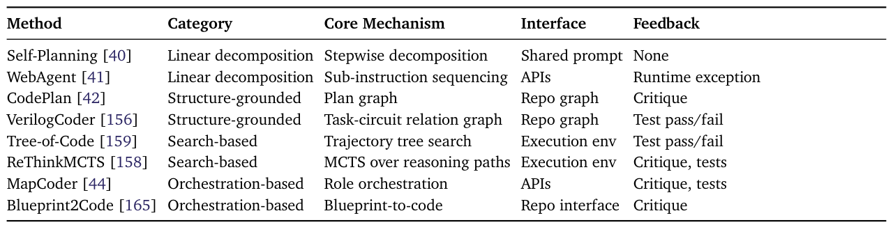

## 📊 แปลเนื้อหาจากตาราง (Table 4): โมดูลการวางแผนที่เป็นตัวแทนสำหรับเอเจนต์ฐานโค้ด

| วิธีการ (Method) | หมวดหมู่ (Category) | กลไกหลัก (Core Mechanism) | อินเตอร์เฟส (Interface) | ข้อมูลป้อนกลับ (Feedback) |
| --- | --- | --- | --- | --- |
| **Self-Planning** [40] | การย่อยส่วนงานเชิงเส้น (Linear decomposition) | การย่อยส่วนงานทีละก้าว (Stepwise decomposition) | คำสั่งกระตุ้นร่วมกัน (Shared prompt) | ไม่มี (None)
 |
| **WebAgent** [41] | การย่อยส่วนงานเชิงเส้น (Linear decomposition) | การจัดลำดับคำสั่งย่อย (Sub-instruction sequencing) | เอพีไอ (APIs) | ข้อผิดพลาดรันไทม์ (Runtime exception)
 |
| **CodePlan** [42] | เชื่อมโยงกับโครงสร้างจริง (Structure-grounded) | กราฟแผนการทำงาน (Plan graph) | กราฟคลังรหัส (Repo graph) | การวิพากษ์วิจารณ์ (Critique)
 |
| **VerilogCoder** [156] | เชื่อมโยงกับโครงสร้างจริง (Structure-grounded) | กราฟความสัมพันธ์งาน-วงจร (Task-circuit relation graph) | กราฟคลังรหัส (Repo graph) | การทดสอบผ่าน/ล้มเหลว (Test pass/fail)
 |
| **Tree-of-Code** [159] | อิงตามการค้นหา (Search-based) | การค้นหาต้นไม้เส้นทางการทำงาน (Trajectory tree search) | สภาพแวดล้อมรันโค้ด (Execution env) | การทดสอบผ่าน/ล้มเหลว (Test pass/fail)
 |
| **ReThinkMCTS** [158] | อิงตามการค้นหา (Search-based) | MCTS เหนือเส้นทางการให้เหตุผล (MCTS over reasoning paths) | สภาพแวดล้อมรันโค้ด (Execution env) | การวิพากษ์, การทดสอบ (Critique, tests)
 |
| **MapCoder** [44] | อิงตามการประสานงาน (Orchestration-based) | การประสานงานบทบาท (Role orchestration) | เอพีไอ (APIs) | การวิพากษ์, การทดสอบ (Critique, tests)
 |
| **Blueprint2Code** [165] | อิงตามการประสานงาน (Orchestration-based) | พิมพ์เขียวสู่โค้ด (Blueprint-to-code) | อินเตอร์เฟสคลังรหัส (Repo interface) | การวิพากษ์วิจารณ์ (Critique)
 |

---

## 📄 เนื้อหาบทความหลัก (Main Text)

...ถูกตัดทิ้ง งานวิจัยในกลุ่มแรก [157, 158] ได้ทำให้ระบบควบคุม (Harness) นี้เกิดขึ้นจริงภายในพื้นที่ความคิด (Thought Space) แทนที่จะเขียนโค้ดขึ้นมาโดยตรง เริ่มแรกพวกมันจะแตกแขนง (Branch) เหนือข้อมูลการสังเกตระดับสูง, กลยุทธ์ หรือร่องรอยการให้เหตุผล โดยมีเป้าหมายเพื่อเพิ่มความหลากหลายทางแนวคิดก่อนเริ่มการนำไปใช้งานจริง ในมุมมองนี้ การวางแผนที่ดีกว่าจะมาจากการครอบคลุมพื้นที่แนวคิดที่กว้างขึ้น และการใช้ข้อมูลป้อนกลับเพื่อปรับแต่งตัวการให้เหตุผลเอง แทนที่จะเป็นเพียงแค่การซ่อมแซมโค้ดขั้นสุดท้าย

งานวิจัยในกลุ่มที่สอง [43, 159, 160, 161] จะดำเนินการค้นหาในพื้นที่เส้นทางการทำงาน (Trajectory Space) ของการลงมือทำด้านการเขียนโค้ด: วิธีการเหล่านี้จะจำลองการเขียนโค้ดให้เป็นกระบวนการแตกแขนงเหนือการเลือกกลยุทธ์, การนำไปใช้งาน, การดีบั๊ก และการแก้ไขโค้ด และพึ่งพาสัญญาณการรันโค้ด (Execution Signals) หรือตัววิจารณ์ที่ถูกเรียนรู้ขึ้นมา (Learned Critics) เพื่อตัดสินว่าควรจะขยายโหนด (Nodes) ใดต่อไป ดังนั้น คุณภาพของการเขียนโค้ดระยะยาว (Long-horizon Coding Quality) จะถูกปรับปรุงให้ดีขึ้นได้ เมื่อเอเจนต์สามารถย้อนกลับ (Backtrack) จากการตัดสินใจที่ต่ำกว่าเกณฑ์มาตรฐาน (Suboptimal Decisions) และทำการเปรียบเทียบเส้นทางการทำงานบางส่วนได้

งานวิจัยในอีกแนวทางหนึ่ง เช่น ReLoc [162] และ SFS [163] จะปฏิบัติกับการวางแผนเสมือนเป็นการค้นหาในพื้นที่ของโค้ด (Code Space) ในส่วนนี้ วิธีการต่าง ๆ จะทำการสำรวจโปรแกรมข้างเคียงซ้ำ ๆ ผ่านการกลายพันธุ์โค้ด (Mutation), การแก้ไขโค้ด หรือการเพิ่มประสิทธิภาพเฉพาะจุด (Local Optimization) โดยมีแนวทางนำทางจากข้อมูลป้อนกลับการตรวจสอบความถูกต้อง (Validation Feedback) หรือสัญญาณการให้คะแนนที่มีความละเอียดสูง

นอกเหนือจากวิธีการข้างต้น ระบบเมื่อไม่นานมานี้เริ่มมีแนวโน้มที่จะปฏิบัติกับแผนทางเลือก (Candidate Plans), โค้ดแก้ไข (Patches), ล็อก (Logs), ชุดทดสอบ (Tests) และร่องรอยการรันโค้ด (Execution Traces) ในฐานะชิ้นงานที่คงอยู่ถาวร (Persistent Artifacts) แทนที่จะเป็นเพียงสิ่งประดิษฐ์ชั่วคราว ระบบ SWE-Search [164] ได้ผสมผสานการค้นหาต้นไม้แบบมอนเตคาร์โล (Monte Carlo Tree Search - MCTS) เข้ากับเอเจนต์วิศวกรรมซอฟต์แวร์ เพื่อสำรวจเส้นทางการซ่อมแซมโค้ดทางเลือก (Alternative Repair Trajectories) ในขณะที่ CodeTree [43] จัดระเบียบการสำรวจกลยุทธ์, การสร้างโซลูชัน และการปรับแต่งไว้ภายในโครงสร้างต้นไม้อันเป็นเอกภาพ

ยิ่งไปกว่านั้น ในภาพรวม ระบบ Meta-Harness [13] ได้ผลักดันแนวคิดนี้ไปสู่ระดับตัวควบคุมเอง (Harness Level): โดยมันทำการค้นหาเหนือตัวโค้ดของตัวควบคุม (Harness Code) ผ่านการให้เอเจนต์เข้าถึงซอร์สโค้ดในอดีต, คะแนน และร่องรอยการรันโค้ดผ่านระบบไฟล์ การพัฒนาเหล่านี้ชี้ให้เห็นว่า การวางแผนแบบอิงตามการค้นหาไม่ได้เป็นเพียงกลยุทธ์การสุ่มตัวอย่างฝั่งโมเดล (Model-side Sampling Strategy) เท่านั้น แต่ยังเป็นปัญหาการจัดการสถานะในระดับตัวควบคุม (Harness-level State Management Problem) อีกด้วย: กล่าวคือ ระบบรันไทม์ (Runtime) จะต้องคงรักษาตัวเลือกต่าง ๆ เอาไว้, เปิดเผยหลักฐานประจักษ์, รันตัวตรวจสอบความถูกต้อง (Validators) และตัดสินใจว่ากิ่งก้าน (Branch) ใดที่คุ้มค่าต่อการจัดสรรทรัพยากรคำนวณเพิ่มเติม

---

### 3.1.4. การวางแผนแบบอิงตามการประสานงาน (Orchestration-based Planning)

การวางแผนแบบอิงตามการประสานงาน (Orchestration-Based Planning) หมายถึงกระบวนทัศน์การวางแผนที่ฟังก์ชันการวางแผนหลัก ถูกทำให้เกิดขึ้นจริงผ่านทางการออกแบบตัวควบคุมสำหรับการประสานงานในระดับระบบ (System-level Coordination) ในกระบวนทัศน์นี้ ตัวควบคุม (Harness) จะเข้ามากำกับดูแลแนวทางที่เอเจนต์หรือโมดูลต่าง ๆ จะแยกบทบาทหน้าที่เฉพาะทาง (Specialize Roles), รันสถานีงาน (Execute Stages), กำหนดเส้นทางของข้อมูลป้อนกลับ และสั่งให้เกิดลูปการตรวจสอบความถูกต้อง ซึ่งจะเป็นตัวกำหนดว่าการลงมือทำใดที่ควรจะถูกดำเนินการต่อไปในเวิร์กโฟลว์การสร้างโค้ดระยะยาว

รูปแบบทั่วไปอันแรก [50, 51, 52] คือ **การประสานงานที่มีข้อมูลป้อนกลับเป็นศูนย์กลาง (Feedback-centered Orchestration)** โดยระบบจะกระจายงานการเขียนโค้ด, การทดสอบ, การวิเคราะห์ และการซ่อมแซมโค้ด แยกข้ามไปตามโมดูลต่าง ๆ เพื่อให้ความคืบหน้าของงานถูกขับเคลื่อนด้วยข้อมูลป้อนกลับที่มีการรันโค้ดเป็นรากฐานซ้ำ ๆ (Repeated Execution-grounded Feedback) และการยกระดับปัญหาตามสถานการณ์ (Adaptive Escalation) ในกลุ่มนี้ การวางแผนไม่ใช่ชิ้นงานที่ต้องทำล่วงหน้าตั้งแต่แรก แต่เป็นคุณสมบัติที่ปรากฏเด่นชัดขึ้นมา (Emergent Property) จากแนวทางที่ความล้มเหลวถูกตรวจจับ, ตีความ และส่งเส้นทางกลับไปสู่การลงมือทำในขั้นถัดไป

รูปแบบทั่วไปอันที่สอง [44, 166, 165] คือ **การประสานงานเวิร์กโฟลว์แบบแบ่งเป็นสถานี (Staged Workflow Orchestration)** ซึ่งจะวางกรอบการสร้างโค้ดให้เป็นไปไป์ไลน์กระบวนการซอฟต์แวร์ที่มีโครงสร้างชัดเจน (Structured Software-process Pipeline) เช่น ขั้นตอนความเข้าใจปัญหา (Comprehension), ขั้นตอนการดึงข้อมูลหรือการดูตัวอย่าง (Retrieval or Preview), ขั้นตอนการวางแผนหรือการทำพิมพ์เขียว (Planning or Blueprinting), ขั้นตอนการเขียนโค้ด, ขั้นตอนการดีบั๊ก และขั้นตอนการซ่อมแซมโค้ด ข้อดีหลักของกลุ่มนี้อยู่ที่การย่อยส่วนงานการสร้างผลลัพธ์ที่ซับซ้อน ให้กลายเป็นสถานีงานที่สามารถตีความได้ (Interpretable Stages) พร้อมกฎการส่งต่องานที่ชัดเจน (Explicit Handoff Rules) และพลังการวางแผนที่แท้จริงนั้นจะมาจาก การควบคุมข้ามสถานีงาน (Cross-stage Control), การตัดแต่งตัวเลือกที่ไม่ต้องการ (Candidate Pruning) และ...

## หน้า 21

...และการปรับแต่งแบบวนซ้ำ (Iterative Refinement)

รูปแบบทั่วไปอันที่สาม [167, 168, 169, 170] คือ **การประสานงานที่มีตัวควบคุมเป็นศูนย์กลาง (Controller-centric Orchestration)** ซึ่งการวางแผนจะถูกฝังอยู่ภายในกระบวนการแปลงสภาพของชิ้นงานระหว่างทาง (Transformation of Intermediate Artifacts) และฝังอยู่ในตัวซับสเตรตของการกำหนดเส้นทาง (Routing Substrate) เอง ในส่วนนี้ ระบบต่าง ๆ จะจัดระเบียบการตัดสินใจผ่านกลไกต่าง ๆ เช่น ไปป์ไลน์ข้อกำหนดเฉพาะที่เป็นทางการ (Formal-specification Pipelines), สถานีงานให้คำแนะนำในระหว่างการระบุตำแหน่งโค้ดและการซ่อมแซมโค้ด (Suggestion Stages Between Localization and Repair), ตัวแทนระหว่างทางแบบระบุประเภทข้อมูล (Typed Intermediate Representations), กระดานดำข้อมูลร่วมกัน (Shared Blackboards) หรือการประสานงานเฉพาะทางระหว่างตัววางแผนและตัวเขียนโค้ด (Planner-coder Coordination) เพื่อให้แผนการทำงานขั้นถัดไปถูกกำหนดโดยตรรกะการควบคุมของโครงนั่งร้าน (Scaffold's Control Logic) แทนที่จะถูกกำหนดโดยคำสั่งกระตุ้นที่เป็นข้อความเพียงอย่างเดียว

ระบบควบคุม (Harness Systems) เมื่อไม่นานมานี้ได้ทำให้มุมมองด้านการประสานงานนี้มีความชัดเจนเป็นพิเศษ ตัวควบคุมที่ทำงานระยะยาวของ Anthropic ได้แยกการวางแผน (Planning), การสร้างโค้ด (Generation) และการประเมินผล (Evaluation) ออกเป็นบทบาทหน้าที่ที่แตกต่างกัน โดยใช้ชิ้นงานที่มีโครงสร้าง (Structured Artifacts) และการประเมินผลที่เป็นอิสระแยกขาดจากกัน เพื่อรักษาความคืบหน้าของงานข้ามผ่านเซสชันการทำงานที่ยาวนาน [15, 171] ในทำนองเดียวกัน การทดลองเขียนโค้ดอัตโนมัติขนาดใหญ่ของ Cursor ก็ได้เน้นย้ำถึงการประสานงานระหว่างตัววางแผนและตัวปฏิบัติงาน (Planner-worker Coordination) เพื่อเป็นแนวทางในการขยายขนาดจากงานเอเจนต์เดี่ยวที่เน้นเฉพาะจุด ไปสู่เอเจนต์คู่ขนานจำนวนมากที่ทำงานร่วมกันบนโปรเจกต์ที่ใช้ร่วมกัน [172]

สูตรโครงสร้างที่ทั่วไปที่สุดปรากฏในตัวควบคุมเอเจนต์ภาษาธรรมชาติ (Natural-Language Agent Harnesses) ซึ่งตรรกะของตัวควบคุมในระดับสูง (เช่น บทบาทหน้าที่, สถานีงาน, สัญญาข้อตกลง, ตัวปรับต่อหรือ Adapters, ข้อตกลงเรื่องสถานะ และอนุกรมวิธานความล้มเหลว) จะถูกเขียนขึ้นในรูปแบบของภาษาธรรมชาติที่สามารถแก้ไขได้ และถูกรันโดยระบบรันไทม์ของตัวควบคุมอัจฉริยะ (Intelligent Harness Runtime - IHR) [173] ตัว IHR จะทำการตีความคำสั่งภาษาธรรมชาติระดับสูงเหล่านี้ในตอนรันไทม์ และแปลงคำสั่งเหล่านั้นให้กลายเป็นขั้นตอนการรันโค้ดที่ถูกจำกัดขอบเขต ภายใต้สัญญาข้อตกลง (Contracts), งบประมาณ (Budgets), อินเตอร์เฟสเครื่องมือ (Tool Interfaces) และสถานะของสภาพแวดล้อมที่ระบุไว้อย่างชัดเจน สิ่งนี้ช่วยวางกรอบการวางแผนแบบอิงตามการประสานงานใหม่ให้กลายเป็นปัญหาของการตีความในตอนรันไทม์ (Runtime Interpretation Problem): โดยแผนการทำงานไม่ใช่เป็นเพียงแค่เอกสารฉบับหนึ่งอีกต่อไป แต่เป็นข้อกำหนดเฉพาะของตัวควบคุมที่รันได้จริง (Executable Harness Specification) ซึ่งทำหน้าที่เป็นตัวกลางเชื่อมโยงระหว่างผลลัพธ์ของโมเดล, สถานะของระบบไฟล์, เครื่องมือต่าง ๆ, ตัวตรวจสอบความถูกต้อง และการมอบหมายงานในระบบหลายเอเจนต์

---

### บทสนทนา: การวางแผนสำหรับตัวควบคุมเอเจนต์ (Discussion: Planning for Agent Harness)

การวางแผนสำหรับการสร้างโค้ด สามารถทำความเข้าใจได้ในฐานะรูปแบบหลักของตัวควบคุมเอเจนต์ (Agentic Harness): นั่นคือเป็นเลเยอร์การควบคุม (Control Layer) ที่ทำหน้าที่จัดระเบียบแนวทางที่เอเจนต์ LLM ใช้ในการย่อยส่วนงาน, การเชื่อมโยงการตัดสินใจเข้ากับโครงสร้างโปรแกรม (Program Structure), การสำรวจทางเลือกต่าง ๆ ในตอนที่โมเดลกำลังอนุมาน (Inference Time) และการประสานงานเวิร์กโฟลว์วิศวกรรมซอฟต์แวร์แบบหลายสถานีงาน เมื่อมองจากมุมมองนี้ การวางแผนจึงเป็นชุดของกลไกของตัวควบคุมที่มุ่งเน้นไปยังคำถามสำคัญข้อเดียวคือ: **จะตัดสินใจอย่างไรว่าเอเจนต์ควรทำอะไรต่อไป และจะทำให้กระบวนการตัดสินใจนั้นถูกจำกัดขอบเขต, สามารถตรวจสอบได้ และมีความสอดคล้องกันตลอดงานการเขียนโค้ดระยะยาวได้อย่างไร**

สิ่งที่น่าสังเกตคือ การวางแผนในการสร้างโค้ดไม่สามารถแยกออกจากปัญหาการประเมินผล (Evaluation Problem) ได้อย่างเด็ดขาด ข้อสรุปในปัจจุบันจำนวนมากเกี่ยวกับประโยชน์ของการวางแผนนั้น พึ่งพาสภาพแวดล้อมและเงื่อนไขการรันโค้ดรอบข้างอย่างมาก ซึ่งรวมถึงสภาพแวดล้อมการรันโค้ด (Execution Environments), คุณภาพของข้อมูลป้อนกลับ (Feedback Quality), การเข้าถึงเครื่องมือ (Tool Access), งบประมาณเส้นทางการทำงาน (Trajectory Budgets) และการที่ชุดทดสอบมาตรฐานนั้นได้ทดสอบขีดจำกัดของการจัดการความพึ่งพาระยะยาว (Long-range Dependency Management) จริง ๆ หรือเป็นเพียงแค่การสร้างโค้ดแก้ไขเฉพาะจุด (Localized Patch Generation) เท่านั้น

หากสัญญาณการรันโค้ดมีความเบาบาง, งบประมาณการแก้ไขโค้ดไม่สอดคล้องกับความเป็นจริง หรือชุดทดสอบมาตรฐานล้มเหลวในการเปิดเผยข้อผิดพลาดจากการประสานงานแบบหลายขั้นตอน ผลประโยชน์จากการวางแผนที่ถูกรายงานไว้ก็อาจจะไม่สะท้อนถึงการปรับปรุงที่แท้จริงในการแก้ปัญหาในระดับเอเจนต์ ดังนั้น การวางแผนจึงไม่ใช่เพียงแค่ปัญหาของการออกแบบวิธีการ (Method Design Problem) เท่านั้น แต่ยังเป็นปัญหาของตัวควบคุม (Harness Problem) ระหว่างเอเจนต์และสภาพแวดล้อมอีกด้วย

เมื่อมองไปข้างหน้า ความท้าทายหลักไม่ใช่เพียงแค่การสร้างตัววางแผนที่ใหญ่ขึ้นหรือการสร้างร่องรอยการให้เหตุผลที่ยาวขึ้นเท่านั้น แต่คือการออกแบบตัวควบคุมเอเจนต์ที่มีความน่าเชื่อถือยิ่งขึ้นสำหรับการวางแผน (More Reliable Agentic Harnesses for Planning): เช่น กลไกการผูกมัดแบบปรับตัวได้ (Adaptive Commitment Mechanisms) ที่ทำหน้าที่ตัดสินว่าเมื่อใดควรจะปฏิบัติตาม, แก้ไข หรือละทิ้งแผนการทำงาน; สถานะการวางแผนที่มีความหมายเชิงโครงสร้าง (Structurally Meaningful Planning States) ที่ช่วยเปิดเผยความพึ่งพาและความคืบหน้าของงาน; กลยุทธ์การสำรวจและการแก้ไขโค้ดที่มีประสิทธิภาพ (Efficient Exploration-and-revision Strategies) ที่ใช้ประโยชน์จากข้อมูลป้อนกลับโดยไม่สิ้นเปลืองทรัพยากรคำนวณมากเกินไป; และกระบวนทัศน์การประเมินผลงานระยะยาวที่เข้มงวด (Rigorous Long-horizon Evaluation Paradigms) ซึ่งสามารถวัดผลคุณภาพของการวางแผนได้อย่างเที่ยงตรง เกินกว่าการดูเพียงความถูกต้องในรอบสุดท้าย (Final-pass Accuracy)

---

## 3.2. หน่วยความจำและวิศวกรรมบริบทสำหรับตัวควบคุมเอเจนต์ (Memory and Context Engineering for Agent Harness)

หน่วยความจำ (Memory) ได้กลายมาเป็นโครงสร้างพื้นฐานหลักสำหรับเอเจนต์ฐานโค้ด โดยส่วนใหญ่เป็นเพราะงานวิศวกรรมซอฟต์แวร์ในโลกแห่งความเป็นจริงนั้น มีลักษณะเป็นงานระยะยาว (Long-horizon) และมีการใช้สถานะระบบอย่างเข้มข้น (State-intensive) โดยธรรมชาติ [174, 175] สิ่งที่แตกต่างจากการเติมเต็มโค้ดแบบจบรอบในครั้งเดียว (Single-turn Code Completion) ก็คือ ฉากทัศน์การเขียนโค้ดในภาคปฏิบัติกำหนดให้เอเจนต์ต้องประคับประคองลำดับขั้นตอนที่พึ่งพากันและกันข้ามผ่านการปฏิสัมพันธ์หลายต่อหลายรอบ เช่น การทำความเข้าใจความต้องการของระบบ (Requirement Understanding), การระบุตำแหน่งโค้ด (Code Localization), การดึงหลักฐานประจักษ์ (Evidence Retrieval), การแก้ไขไฟล์จำนวนมาก (Multi-file Editing), การรันชุดทดสอบ (Test Execution), การแก้ไขบั๊ก (Bug Fixing) และการตรวจสอบเพื่อป้องกันความผิดพลาดจากการแก้ไขโค้ด (Regression Verification) [176, 177]

สิ่งนี้ทำให้เกิดความตึงเครียดพื้นฐาน (Fundamental Tension) ระหว่างหน้าต่างบริบทที่มีจำกัดของตัวโมเดล (Model's Limited Context Window) และสถานะระหว่างทางของงานที่ขยายตัวออกไปอย่างต่อเนื่อง (Continuously Expanding Intermediate State) เมื่อมองจากมุมมองของตัวควบคุม (Harness Perspective) หน่วยความจำไม่ใช่เป็นเพียงแค่หน้าต่างบริบทที่ใหญ่ขึ้นหรือฐานข้อมูลเวกเตอร์ (Vector Database) เท่านั้น...

## หน้า 22

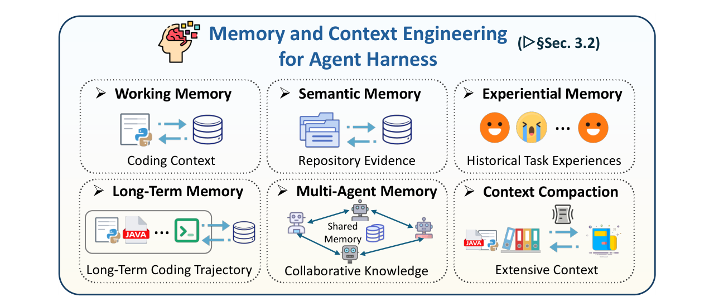

รูปที่ 6: ภาพรวมของกลไกทางวิศวกรรม memory และ context สำหรับ harness agent

## 📌 เนื้อหาจากแผนภาพ (Figure 6): ภาพรวมของกลไกหน่วยความจำและวิศวกรรมบริบทสำหรับตัวควบคุมเอเจนต์ (Memory and Context Engineering Mechanisms for Agent Harnesses)

### หน่วยความจำและวิศวกรรมบริบทสำหรับตัวควบคุมเอเจนต์ (Memory and Context Engineering for Agent Harness - ▷§Sec. 3.2)

* **หน่วยความจำปฏิบัติการ (Working Memory):** บริบทการเขียนโค้ด (Coding Context)

* **หน่วยความจำเชิงอรรถศาสตร์ (Semantic Memory):** หลักฐานประจักษ์จากคลังรหัส (Repository Evidence)

* **หน่วยความจำเชิงประสบการณ์ (Experiential Memory):** ประสบการณ์ของงานในอดีต (Historical Task Experiences)

* **หน่วยความจำระยะยาว (Long-Term Memory):** เส้นทางการเขียนโค้ดระยะยาว (Long-Term Coding Trajectory)

* **หน่วยความจำสำหรับหลายเอเจนต์ (Multi-Agent Memory):** ความรู้ร่วมกันในระบบความร่วมมือ (Collaborative Knowledge / Shared Memory)

* **การบีบอัดบริบท (Context Compaction):** บริบทที่ขยายตัวเป็นวงกว้าง (Extensive Context)

---

## 📄 เนื้อหาบทความหลัก (Main Text)

...มันคือเลเยอร์การจัดการสถานะ (State-management Layer) ที่ทำหน้าที่ตัดสินว่าข้อมูลใดควรคงอยู่ในบริบทโมเดลที่กำลังทำงานอยู่ (Active Model Context), ข้อมูลใดควรถูกบีบอัดให้อยู่ในรูปของบทสรุป (Summaries) และข้อมูลใดควรถูกโยกย้ายออกไปจัดเก็บไว้ในอุปกรณ์จัดเก็บข้อมูลภายนอกที่คงทนถาวร (Durable External Storage) [178] หากไม่มีกลไกหน่วยความจำและการจัดการบริบทที่มีประสิทธิภาพ เอเจนต์ก็อาจจะสูญเสียเบาะแสสำคัญในระหว่างกระบวนการให้เหตุผลระยะยาวได้ง่าย, เกิดการค้นหาและวิเคราะห์ซ้ำซ้อนในสิ่งที่เคยทำสำเร็จไปแล้ว หรือทำลายความสอดคล้องเฉพาะจุด (Local Consistency) ที่สร้างไว้ในขั้นตอนก่อนหน้าในระหว่างการแก้ไขโค้ดในขั้นต่อมา [179, 175]

ระบบในยุคแรก ๆ ส่วนใหญ่พึ่งพาคำสั่งกระตุ้น (Prompts) ในการคงรักษาข้อมูลประวัติ โดยปฏิบัติกับหน่วยความจำเป็นเพียงแค่ประวัติการสนทนา (Conversation History) หรือกระดาษทดที่ไม่มีโครงสร้างชัดเจน (Unstructured Scratchpad) ทว่า ด้วยการเกิดขึ้นของงานซ่อมแซมโค้ดระดับคลังรหัส (Repository-level Repair) และงานการเขียนโค้ดระยะยาวอื่น ๆ มันจึงเริ่มมีความชัดเจนมากขึ้นเรื่อย ๆ ว่า เพียงแค่การสะสมข้อมูลประวัติภาษาธรรมชาติเพียงอย่างเดียว ไม่สามารถสนับสนุนลูปวิศวกรรมซอฟต์แวร์ที่มีความซับซ้อนได้อย่างน่าเชื่อถือ [180] ส่งผลให้ในปัจจุบัน หน่วยความจำจึงถูกดึงออกมาสู่ภายนอกเพิ่มขึ้นเรื่อย ๆ ในฐานะองค์ประกอบหนึ่งของระบบ (System Component) ที่สามารถดึงข้อมูลได้ (Retrievable), สามารถกำดูลดูแลได้ (Governable) และสามารถติดตามร่องรอยได้ (Traceable)

ในหัวข้อย่อยนี้ เราจะจัดหมวดหมู่หน่วยความจำในเอเจนต์ฐานโค้ดตามบทบาทหน้าที่หลัก (Primary Functional Role) ของพวกมันในลูปวิศวกรรมซอฟต์แวร์ ภายใต้มุมมองนี้ แนวทางที่มีอยู่สามารถจัดระเบียบอย่างกว้าง ๆ ออกเป็น 5 ประเภท ได้แก่: **หน่วยความจำปฏิบัติการ (Working Memory), หน่วยความจำเชิงอรรถศาสตร์ (Semantic Memory), หน่วยความจำเชิงประสบการณ์ (Experiential Memory), หน่วยความจำระยะยาว (Long-term Memory) และหน่วยความจำสำหรับหลายเอเจนต์ (Multi-agent Memory)** นอกจากนี้ เราจะร่วมพูดคุยเกี่ยวกับ **การบีบอัดบริบท (Context Compaction) และการโยกย้ายสถานะ (State Offloading)** ในฐานะกลไกวิศวกรรมบริบทแบบคาบเกี่ยว (Cross-cutting Context-engineering Mechanisms) ซึ่งเป็นตัวกำหนดแนวทางที่ชิ้นงานจากการรันโค้ดขนาดใหญ่จะเคลื่อนย้ายไปมาระหว่างบริบทโมเดลที่กำลังทำงานอยู่ (Active Model Context) และสถานะงานที่คงทนถาวร (Durable Task State) โดยผลงานที่เป็นตัวแทนได้ถูกแสดงไว้ในตารางที่ 5 (Table 5)

---

### 3.2.1. หน่วยความจำปฏิบัติการ (Working Memory)

หน่วยความจำปฏิบัติการ (Working memory) สนับสนุนการคงรักษาสถานะตลอดเส้นทางการทำงานของงานเขียนโค้ดปัจจุบัน [181] สิ่งที่มันมุ่งเน้นเป็นหลักไม่ใช่ปริมาณของข้อมูลประวัติที่จะจัดเก็บไว้ แต่คือข้อมูลชิ้นใดที่มีประโยชน์มากที่สุดสำหรับการลงมือทำในขั้นถัดไป ภายใต้งบประมาณบริบทที่มีจำกัด (Limited Context Budget) ในเอเจนต์ฐานโค้ด หน่วยความจำปฏิบัติการมักจะปรากฏอยู่ในรูปแบบของพื้นที่คำสั่งกระตุ้นที่มีโครงสร้างชัดเจน (Structured Prompt Regions), บทสรุปสถานะ (State Summaries), บันทึกการทดสอบที่ล้มเหลว (Failed-test Records), รายชื่อไฟล์ หรือข้อมูลสแตกที่สำคัญ (Critical Stack Information)

จุดประสงค์ของมันคือเพื่อลดปัญหาการขยายตัวของบริบทอย่างรุนแรง (Context Explosion), ลดการระบุตำแหน่งซ้ำซ้อน และคงรักษาความสอดคล้องเฉพาะจุดของการซ่อมแซมโค้ดหรือเส้นทางการแก้ไขโค้ดที่กำลังดำเนินอยู่ [57, 182, 183, 45] เมื่อมองจากมุมมองของตัวควบคุม (Harness Perspective) หน่วยความจำปฏิบัติการคือพื้นผิวการควบคุมที่กำลังทำงานอยู่ (Active Control Surface) ระหว่างตัวโมเดลและสภาพแวดล้อมฐานโค้ด: มันเป็นตัวกำหนดว่าเอเจนต์จะสังเกตเห็นสิ่งใดก่อนที่จะเลือกการเรียกใช้เครื่องมือ (Tool Call), การแก้ไขโค้ด หรือขั้นตอนการตรวจสอบความถูกต้องในขั้นต่อไป ระบบที่เป็นตัวแทน เช่น SWE-agent [57] และ RepairAgent [183] แสดงให้เห็นว่า แม้จะใช้โมเดลฐานตัวเดียวกัน แต่ประสิทธิภาพในการซ่อมแซมโค้ดระดับคลังรหัสก็สามารถแปรผันได้อย่างมีนัยสำคัญ... [57, 183]

## หน้า 23

Table 5: agent memory และ context กลไกการจัดการสำหรับ harness code-agent

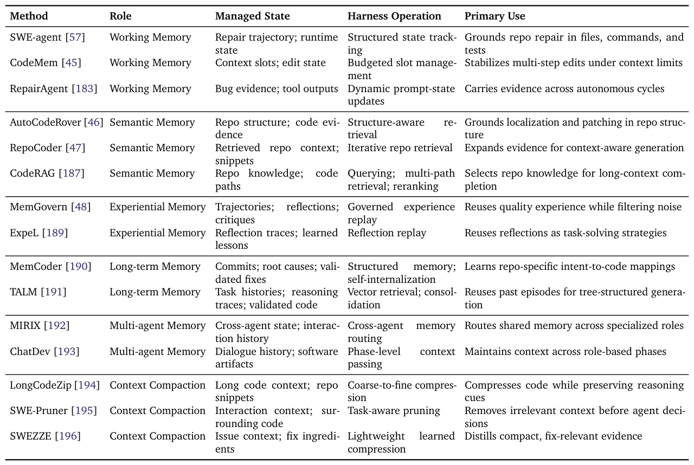

## 📊 เนื้อหาจากตาราง (Table 5): กลไกการจัดการหน่วยความจำและบริบทที่เป็นตัวแทนสำหรับตัวควบคุมเอเจนต์ฐานโค้ด (Representative memory and context management mechanisms for code-agent harnesses.)

| วิธีการ (Method) | บทบาท (Role) | สถานะที่ถูกจัดการ (Managed State) | การใช้งานหลัก (Primary Use) | การทำงานของตัวควบคุม (Harness Operation) |
| --- | --- | --- | --- | --- |
| **SWE-agent** [57] | หน่วยความจำปฏิบัติการ (Working Memory) | เส้นทางการซ่อมแซมโค้ด; สถานะรันไทม์ (Repair trajectory; runtime state) | การติดตามสถานะแบบมีโครงสร้าง (Structured state tracking) | เชื่อมโยงการซ่อมแซมคลังรหัสเข้ากับไฟล์, คำสั่ง และชุดทดสอบ
 |
| **CodeMem** [45] | หน่วยความจำปฏิบัติการ (Working Memory) | ช่องบริบท; สถานะการแก้ไข (Context slots; edit state) | การจัดการช่องหน่วยความจำตามงบประมาณ (Budgeted slot management) | รักษาเสถียรภาพการแก้ไขแบบหลายขั้นตอนภายใต้ขีดจำกัดบริบท
 |
| **RepairAgent** [183] | หน่วยความจำปฏิบัติการ (Working Memory) | หลักฐานของบั๊ก; ผลลัพธ์เครื่องมือ (Bug evidence; tool outputs) | นำส่งหลักฐานประจักษ์ข้ามผ่านลูปการทำงานที่เป็นอิสระ (Carries evidence across autonomous cycles) | อัปเดตสถานะคำสั่งกระตุ้นแบบไดนามิก (Dynamic prompt-state updates)
 |
| **AutoCodeRover** [46] | หน่วยความจำเชิงอรรถศาสตร์ (Semantic Memory) | โครงสร้างคลังรหัส; หลักฐานโค้ด (Repo structure; code evidence) | การดึงข้อมูลที่รับรู้ถึงโครงสร้าง (Structure-aware retrieval) | เชื่อมโยงการระบุตำแหน่งและการเขียนโค้ดแก้ไขเข้ากับโครงสร้างคลังรหัส
 |
| **RepoCoder** [47] | หน่วยความจำเชิงอรรถศาสตร์ (Semantic Memory) | บริบทคลังรหัสที่ถูกดึงข้อมูลมา; ชิ้นส่วนโค้ด (Retrieved repo context; snippets) | การดึงข้อมูลคลังรหัสแบบวนซ้ำ (Iterative repo retrieval) | ขยายหลักฐานประจักษ์เพื่อการสร้างผลลัพธ์ที่รับรู้ถึงบริบท
 |
| **CodeRAG** [187] | หน่วยความจำเชิงอรรถศาสตร์ (Semantic Memory) | ความรู้คลังรหัส; เส้นทางโค้ด (Repo knowledge; code paths) | การสอบถาม; การดึงข้อมูลหลายเส้นทาง; การจัดอันดับใหม่ (Querying; multi-path retrieval; reranking) | คัดเลือกความรู้คลังรหัสสำหรับการเติมเต็มโค้ดที่มีบริบทกว้างยาว
 |
| **MemGovern** [48] | หน่วยความจำเชิงประสบการณ์ (Experiential Memory) | เส้นทางการทำงาน; การคิดทบทวน; การวิพากษ์ (Trajectories; reflections; critiques) | การเล่นซ้ำประสบการณ์ภายใต้การกำกับดูแล (Governed experience replay) | นำประสบการณ์ที่มีคุณภาพกลับมาใช้ใหม่พร้อมทั้งคัดกรองสัญญาณรบกวนออก
 |
| **Expel.** [189] | หน่วยความจำเชิงประสบการณ์ (Experiential Memory) | ร่องรอยการคิดทบทวน; บทเรียนที่ได้เรียนรู้ (Reflection traces; learned lessons) | นำการคิดทบทวนกลับมาใช้ซ้ำในฐานะกลยุทธ์การแก้ปัญหา (Reuses reflections as task-solving strategies) | การเล่นซ้ำการคิดทบทวน (Reflection replay)
 |
| **MemCoder** [190] | หน่วยความจำระยะยาว (Long-term Memory) | การคอมมิต; สาเหตุรากเหง้า; โค้ดแก้ไขที่ตรวจสอบแล้ว (Commits; root causes; validated fixes) | หน่วยความจำแบบมีโครงสร้าง; การซึมซับไว้ภายในด้วยตัวเอง (Structured memory; self-internalization) | เรียนรู้การจับคู่ระหว่างความเจตนาและโค้ดเฉพาะสำหรับคลังรหัสนั้น ๆ
 |
| **TALM** [191] | หน่วยความจำระยะยาว (Long-term Memory) | ประวัติงาน; ร่องรอยการให้เหตุผล; โค้ดที่ตรวจสอบแล้ว (Task histories; reasoning traces; validated code) | การดึงข้อมูลแบบเวกเตอร์; การรวบรวมให้เป็นปึกแผ่น (Vector retrieval; consolidation) | นำเหตุการณ์ในอดีตกลับมาใช้ใหม่สำหรับการสร้างผลลัพธ์แบบโครงสร้างต้นไม้
 |
| **MIRIX** [192] | หน่วยความจำหลายเอเจนต์ (Multi-agent Memory) | สถานะข้ามเอเจนต์; ประวัติการปฏิสัมพันธ์ (Crossagent-state; interaction history) | การกำหนดเส้นทางหน่วยความจำข้ามเอเจนต์ (Cross-agent memory routing) | กำหนดเส้นทางหน่วยความจำที่ใช้ร่วมกันข้ามผ่านบทบาทเฉพาะทางต่าง ๆ
 |
| **ChatDev** [193] | หน่วยความจำหลายเอเจนต์ (Multi-agent Memory) | ประวัติการสนทนา; ชิ้นงานซอฟต์แวร์ (Dialogue history; software artifacts) | การส่งผ่านบริบทในระดับเฟสงาน (Phase-level context passing) | คงรักษาบริบทข้ามผ่านเฟสงานที่อิงตามบทบาทหน้าที่
 |
| **LongCodeZip** [194] | การบีบอัดบริบท (Context Compaction) | บริบทโค้ดยาว; ชิ้นส่วนคลังรหัส (Long code context; repo snippets) | การบีบอัดจากหยาบไปละเอียด (Coarse-to-fine compression) | บีบอัดโค้ดในขณะที่ยังคงรักษาสัญญาณชี้นำการให้เหตุผลเอาไว้
 |
| **SWE-Pruner** [195] | การบีบอัดบริบท (Context Compaction) | บริบทการปฏิสัมพันธ์; โค้ดรอบข้าง (Interaction context; surrounding code) | การตัดแต่งที่รับรู้ถึงตัวงาน (Task-aware pruning) | กำจัดบริบทที่ไม่เกี่ยวข้องออกไปก่อนที่เอเจนต์จะทำการตัดสินใจ
 |
| **SWEZZE** [196] | การบีบอัดบริบท (Context Compaction) | บริบทของปัญหา; ส่วนผสมของโค้ดแก้ไข (Issue context; fix ingredients) | การบีบอัดที่มีน้ำหนักเบาและถูกเรียนรู้ขึ้นมา (Lightweight learned compression) | กลั่นกรองหลักฐานประจักษ์ที่กระชับและเกี่ยวข้องกับการแก้ไขโค้ด
 |

---

## 📄 เนื้อหาบทความหลัก (Main Text)

...ขึ้นอยู่กับแนวทางที่สถานะการปฏิสัมพันธ์ (Interaction State) และข้อมูลป้อนกลับจากการรันโค้ด (Execution Feedback) ถูกจัดระเบียบเอาไว้ ระบบ CodeMem [45] ก็ปฏิบัติกับบริบทในฐานะทรัพยากรที่ถูกจัดการในทำนองเดียวกัน โดยการใช้ช่องหน่วยความจำที่ถูกจัดสรรตามงบประมาณ (Budgeted Memory Slots) เพื่อรักษาเสถียรภาพของการแก้ไขโค้ดแบบหลายขั้นตอน

### 3.2.2. หน่วยความจำเชิงอรรถศาสตร์ (Semantic Memory)

หน่วยความจำเชิงอรรถศาสตร์ (Semantic memory) ทำหน้าที่จัดเตรียมหลักฐานประจักษ์ภายนอกที่เกี่ยวข้องกับงาน (Task-relevant External Evidence) สำหรับกระบวนการเขียนโค้ดในปัจจุบัน ในการตั้งค่าระบบของเอเจนต์ฐานโค้ด หลักฐานประจักษ์ดังกล่าวมักจะเป็นข้อมูลเฉพาะของคลังรหัสนั้น ๆ และมีโครงสร้างในรูปแบบของโปรแกรม (Program-structured) ซึ่งรวมถึง คำนิยามของคลาส (Class Definitions), การนำฟังก์ชันไปใช้งานจริง (Function Implementations), ความสัมพันธ์ของการเรียกใช้งาน (Call Relations), ไฟล์กำหนดค่า (Configuration Files), เอกสารอธิบาย (Documentation), คำอธิบายปัญหา (Issue Descriptions), ข้อมูลเมทาดาตาของความพึ่งพา (Dependency Metadata) และรูปแบบการนำไปใช้งานในอดีต (Historical Implementation Patterns)

ดังนั้น หน่วยความจำเชิงอรรถศาสตร์จึงเปลี่ยนฐานรหัสภายนอก (External Codebase) ให้กลายเป็นพื้นที่หลักฐานประจักษ์ที่สามารถส่งคำสั่งสอบถามได้ (Queryable Evidence Space) ซึ่งตัวควบคุม (Harness) สามารถดึงข้อมูลออกมาและฉีดป้อนเข้าไปในบริบทที่กำลังทำงานอยู่ (Active Context) ได้

ผลงานที่เป็นตัวแทน เช่น AutoCodeRover [46] และ RepoCoder [47] แสดงให้เห็นว่า งานการเขียนโค้ดในระดับคลังรหัส (Repository-level Coding Tasks) จะได้รับประโยชน์ไม่ใช่เพียงแค่จากการดึงข้อมูลเนื้อหาในปริมาณที่มากขึ้นเท่านั้น แต่มาจากการดึงหลักฐานประจักษ์ที่จัดแนวตรงกับโครงสร้างของโปรแกรม (Evidence Aligned with Program Structure) กลไกต่าง ๆ เช่น การแบ่งข้อมูลเป็นชิ้นหนาที่มีโครงสร้างโดยอิงตามแผนผัง AST (AST-based Structured Chunking), การเขียนคำสั่งสอบถามใหม่แบบวนซ้ำ (Iterative Query Rewriting) และกลยุทธ์การดึงข้อมูลที่กำหนดเงื่อนไขตามเบาะแสการระบุตำแหน่งในปัจจุบัน สามารถปรับปรุงอรรถประโยชน์ของบริบทที่ถูกดึงข้อมูลมาเพื่อใช้ในการสร้างผลลัพธ์ขั้นปลายน้ำได้อย่างมีนัยสำคัญ ในแง่นี้ หน่วยความจำเชิงอรรถศาสตร์จึงเปลี่ยนฐานรหัสให้กลายเป็นเลอยอร์หลักฐานประจักษ์ที่มีโครงสร้าง (Structured Evidence Layer) สำหรับกระบวนการตัดสินใจในปัจจุบัน

## หน้า 24

### 3.2.3. หน่วยความจำเชิงประสบการณ์ (Experiential Memory)

เมื่อเอเจนต์ฐานโค้ด (Code Agents) พัฒนาจากการทำงานชิ้นเดี่ยวให้เสร็จสิ้น (Single-task Completion) ไปสู่การซ่อมแซมโค้ดอย่างต่อเนื่อง (Continual Repair) และการประยุกต์ใช้ความรู้ข้ามโปรเจกต์ (Cross-project Generalization) วงการวิจัยจึงหันมาให้ความสนใจกับหน่วยความจำเชิงประสบการณ์หรือความจำเชิงเหตุการณ์ (Experiential or Episodic Memory) มากขึ้นเรื่อย ๆ สิ่งที่แตกต่างจากหน่วยความจำปฏิบัติการ (Working Memory) ซึ่งทำหน้าที่คงรักษาเส้นทางการทำงานปัจจุบัน หรือหน่วยความจำเชิงอรรถศาสตร์ (Semantic Memory) ซึ่งทำหน้าที่ดึงหลักฐานประจักษ์จากคลังรหัส ก็คือ หน่วยความจำเชิงประสบการณ์จะคอยจับประบันทึกประสบการณ์ที่นำกลับมาใช้ใหม่ได้ ซึ่งถูกสะสมไว้ข้ามงานต่าง ๆ เช่น เส้นทางการซ่อมแซมโค้ด (Repair Trajectories), กรณีที่เกิดความล้มเหลว (Failure Cases), บันทึกการดีบั๊ก (Debugging Records) และรูปแบบกลยุทธ์ในระดับที่สูงกว่า (Higher-level Strategy Patterns)

คุณค่าหลักของมันอยู่ที่การเปิดโอกาสให้เกิดการส่งต่อความรู้ข้ามงาน (Cross-task Transfer) ผ่านกลไกต่าง ๆ เช่น การ์ดประสบการณ์ (Experience Cards), บัฟเฟอร์ความคิดทบทวน (Reflection Buffers) และไปป์ไลน์การบันทึกและเล่นซ้ำ (Record-and-replay Pipelines) ซึ่งระบบสามารถเปลี่ยนกระบวนการดีบั๊กในอดีตที่ทั้งสำเร็จและล้มเหลว ให้กลายเป็นหน่วยงานที่นำกลับมาใช้ใหม่ได้สำหรับการแก้ปัญหาในอนาคต งานวิจัยอย่าง MemGovern [48] ชี้ให้เห็นเพิ่มเติมว่า คุณภาพของประสบการณ์ที่จัดเก็บนั้นมีความสำคัญมากกว่าขนาดของข้อมูล เนื่องจากบันทึกประวัติศาสตร์ที่ไม่ได้รับการกำกับดูแล (Ungoverned Historical Records) สามารถนำสัญญาณรบกวนเชิงอรรถศาสตร์ (Semantic Noise), การแพร่กระจายของข้อผิดพลาด (Error Propagation) และการดึงข้อมูลที่ผิดพลาดมาให้ระบบได้ ในขณะที่หน่วยความจำเชิงประสบการณ์ที่ผ่านการคัดสรรและควบคุมคุณภาพมาอย่างดี มีแนวโน้มที่จะกลายเป็นสินทรัพย์ที่มีประโยชน์สำหรับงานซ่อมแซมโค้ดระดับคลังรหัส (Repository-level Repair)

### 3.2.4. หน่วยความจำระยะยาว (Long-Term Memory)

เมื่อเส้นทางการเขียนโค้ด (Coding Trajectories) ยาวนานขึ้น เพียงแค่หน่วยความจำปฏิบัติการและหน่วยความจำเชิงอรรถศาสตร์ย่อมไม่เพียงพออีกต่อไป เพราะระบบจะต้องรับมือกับการเติบโตของหน่วยความจำ, ความบิดเบือนของหลักฐานประจักษ์ที่เกิดจากการบีบอัดข้อมูล (Compression-induced Evidence Distortion) และการเบี่ยงเบนระยะยาว (Long-term Drift) สิ่งนี้ทำให้การวางแผนการดึงข้อมูลระยะยาวและการควบคุมหน่วยความจำ กลายมาเป็นทิศทางการวิจัยที่ทวีความสำคัญมากขึ้นเรื่อย ๆ

ด้วยเหตุนี้ จุดเน้นจึงเปลี่ยนจากความจุของหน่วยความจำ (Memory Capacity) ไปสู่การกำกับดูแลหน่วยความจำ (Memory Governance) ระบบที่เป็นตัวแทนในกลุ่มนี้ เช่น MemGPT [207] และ MemoryOS [208] ได้ย้ายประเด็นบทสนทนาจากเรื่อง "ควรจัดเก็บอะไร" ไปสู่เรื่อง "ควรเขียนเมื่อใด" "ควรบีบอัดเมื่อใด" "ควรดึงข้อมูลเมื่อใด" และ "จะหลีกเลี่ยงการปนเปื้อนข้อมูลได้อย่างไร" งานวิจัยที่มีโค้ดเป็นศูนย์กลางเมื่อไม่นานมานี้ ได้นำแนวคิดนี้มาเชื่อมโยงเข้ากับเวิร์กโฟลว์วิศวกรรมซอฟต์แวร์จริง โดย MemCoder [190] ใช้ประโยชน์จากประวัติการคอมมิตที่มีโครงสร้างชัดเจน (Structured Historical Commits) และโซลูชันที่ผ่านการตรวจสอบโดยมนุษย์ (Human-validated Solutions) มาทำหน้าที่เป็นหน่วยความจำที่คงอยู่ถาวร ซึ่งช่วยให้เกิดการสะสมประสบการณ์เฉพาะสำหรับคลังรหัสนั้น ๆ เมื่อเวลาผ่านไป ส่วนระบบ TALM [191] ได้รวบรวมหน่วยความจำระยะยาวเข้ากับการสร้างโค้ดแบบหลายเอเจนต์ (Multi-agent Code Generation) โดยคอยดึงร่องรอยปัญหาและโซลูชันในอดีต พร้อมทั้งควบรวมหน่วยความจำที่ซ้อนทับกันเพื่อควบคุมความซ้ำซ้อนของข้อมูล (Redundancy) งานวิจัยเหล่านี้ชี้ให้เห็นว่า สำหรับเอเจนต์ฐานโค้ดแล้ว หน่วยความจำระยะยาวไม่ควรอัดแน่นไปด้วยประวัติศาสตร์ที่มากขึ้นเพียงอย่างเดียว แต่ต้องคงรักษาประสบการณ์ที่ได้รับการตรวจสอบและนำกลับมาใช้ใหม่ได้ ให้อยู่ในรูปแบบที่กระชับ (Compact) และสามารถควบคุมได้ มิฉะนั้น หน่วยความจำอาจจะเปลี่ยนสภาพจากทรัพยากรสำหรับวิศวกรรมซอฟต์แวร์ระยะยาว (Long-horizon Software Engineering) ไปเป็นภาระที่คอยขยายสัญญาณรบกวน, ความล้าสมัยของข้อมูล และข้อผิดพลาดให้รุนแรงขึ้นแทน

### 3.2.5. หน่วยความจำสำหรับหลายเอเจนต์ (Multi-Agent Memory)

หน่วยความจำสำหรับหลายเอเจนต์ (Multi-agent memory) ขยายขีดความสามารถของการจัดการสถานะ (State Management) จากระดับเอเจนต์เดี่ยวไปสู่ระบบควบคุมที่ใช้ร่วมกัน (Shared Harness) เมื่อมองจากมุมมองเชิงระบบ หน่วยความจำในการสร้างโค้ดนั้นมีมิติของการทำงานร่วมกันที่สูงมาก ในเฟรมเวิร์กแบบหลายเอเจนต์ (Multi-agent Frameworks) หน่วยความจำไม่ได้เป็นเพียงแค่ตู้คอนเทนเนอร์สำหรับเก็บสถานะของแต่ละตัวเท่านั้น แต่ยังเป็นสื่อกลางสำหรับการแบ่งปันข้อมูล (Information Sharing), การส่งผ่านเจตนารมณ์ (Intention Passing) และการรักษาความสอดคล้องกันข้ามผ่านบทบาทหน้าที่เฉพาะทางต่าง ๆ

ผลงานที่เป็นตัวแทน เช่น AgentCoder [50], MapCoder [44], MIRIX [192], ChatDev [193] และ G-Memory [211] ได้แสดงให้เห็นว่า หน่วยความจำสามารถสนับสนุนการวางแผน, การทดสอบ, การรีวิว และการประสานงานเส้นทางการทำงานในระบบหลายเอเจนต์ได้อย่างไร ในการตั้งค่าระบบเช่นนี้ ความท้าทายหลักไม่ใช่เพียงแค่การดึงข้อมูลเนื้อหาที่เกี่ยวข้องอีกต่อไป แต่คือการควบคุมระดับความละเอียดของการแบ่งปันข้อมูล (Granularity of Sharing), การป้องกันไม่ให้เกิดข้อมูลท่วมล้นระบบ (Information Flooding) และการสนับสนุนการเข้าถึงแบบสองทิศทาง (Bidirectional Access) ระหว่างการตัดสินใจในระดับสูง (High-level Decisions) และร่องรอยการรันโค้ดที่มีความละเอียดสูง (Fine-grained Execution Traces) ด้วยเหตุนี้ หน่วยความจำในการสร้างโค้ดแบบหลายเอเจนต์ จึงเริ่มมีลักษณะคล้ายคลึงกับกระดานดำข้อมูลร่วมกัน (Shared Blackboard) หรือกราฟสถานะความร่วมมือกัน (Collaborative State Graph) มากกว่าการเป็นหน่วยจัดเก็บข้อมูลส่วนบุคคลเพียงอย่างเดียว

### 3.2.6. การบีบอัดบริบทและการโยกย้ายสถานะ (Context Compaction and State Offloading)

การบีบอัดบริบทและการโยกย้ายสถานะ (Context compaction and state offloading) เป็นกลไกวิศวกรรมบริบทแบบคาบเกี่ยว (Cross-cutting Context-engineering Mechanisms) สำหรับหน่วยความจำในตัวควบคุมเอเจนต์ฐานโค้ด จุดหมายของพวกมันไม่ใช่การจำแนกหมวดหมู่หน่วยความจำขึ้นมาใหม่อีกประเภทหนึ่ง แต่คือการควบคุม...

## หน้า 25

...ขอบเขตระหว่างบริบทโมเดลที่กำลังทำงานอยู่ (Active Model Context) และสถานะงานที่คงทนถาวร (Durable Task State) เวิร์กโฟลว์วิศวกรรมซอฟต์แวร์ระยะยาว (Long-horizon Software Engineering Workflows) จะสร้างชิ้นงานปริมาณมหาศาลอย่างต่อเนื่อง เช่น ล็อกการบิลด์ระบบ (Build Logs), ร่องรอยการรันโค้ด (Execution Traces), ความเปลี่ยนแปลงของคลังรหัส (Repository Diffs), ผลลัพธ์การทดสอบ (Test Outputs) และแผนการทำงานระหว่างทาง (Intermediate Plans) การนำชิ้นงานเหล่านี้ใส่เข้าไปในคำสั่งกระตุ้น (Prompt) โดยตรง สามารถทำให้หน้าต่างบริบทล้นระบบอย่างรวดเร็ว ขยายสัญญาณรบกวนให้รุนแรงขึ้น และบดบังหลักฐานประจักษ์ที่เกี่ยวข้องกับการตัดสินใจ

ดังนั้น ตัวควบคุม (Harness) จะต้องตัดสินใจว่าข้อมูลการสังเกต (Observations) ใดควรคงอยู่ในบริบทที่กำลังทำงานอยู่ ข้อมูลใดควรถูกบีบอัดให้เป็นบทสรุปที่กระชับ และข้อมูลใดควรถูกโยกย้ายไปยังอุปกรณ์จัดเก็บข้อมูลภายนอกพร้อมกับมี Handle ที่สามารถดึงข้อมูลกลับมาได้ [178] การบีบอัดบริบท (Context Compaction) จะช่วยบีบอัดประวัติการปฏิสัมพันธ์ที่ยาวนานและผลลัพธ์ของเครื่องมืออันมหาศาล ให้กลายเป็นบทสรุปที่มีโครงสร้างและคงรักษาแหล่งที่มาของข้อมูล (Provenance-preserving Summaries) เอาไว้ ตัวอย่างเช่น รายงานผลการทดสอบที่ล้มเหลวสามารถถูกลดรูปให้เหลือเพียงแค่ ชื่อชุดการทดสอบที่ล้มเหลว, เฟรมสแตกที่สำคัญ (Key Stack Frames), ไฟล์ที่ต้องสงสัย และลิงก์ที่เชื่อมโยงไปยังล็อกฉบับเต็ม [196, 215, 194, 195]

กระบวนการนี้จะถูกเติมเต็มด้วยการโยกย้ายสถานะ (State Offloading) ซึ่งทำหน้าที่คงรักษาชิ้นงานที่มีความเที่ยงตรงสูง (Full-fidelity Artifacts) เอาไว้ภายนอกหน้าต่างบริบทที่กำลังทำงานอยู่ เช่น ในไฟล์, ฐานข้อมูล, แหล่งเก็บร่องรอยการทำงาน หรืออินเตอร์เฟสทรัพยากรในรูปแบบโปรโตคอล เช่น เซิร์ฟเวอร์รูปแบบ MCP (MCP-style Servers) จากนั้นเอเจนต์จะได้รับเพียงบทสรุปที่กระชับและตัวระบุทรัพยากร (Resource Identifiers) แทนที่จะเป็นล็อกหรือร่องรอยการทำงานแบบดิบ การแยกบริบทที่เกี่ยวข้องกับการตัดสินใจออกจากหลักฐานประจักษ์ที่คงทนถาวรนี้ จะช่วยให้การบีบอัดบริบทและการโยกย้ายสถานะ ทำให้หน่วยความจำสามารถขยายขนาดได้ง่ายขึ้น (Scalable), สามารถตรวจสอบได้ (Auditable) และเข้ากันได้กับการตรวจสอบความถูกต้องในระหว่างการรันโค้ด (Execution-time Verification)

---

### บทสนทนา: หน่วยความจำสำหรับตัวควบคุมเอเจนต์ (Discussion: Memory for Agent Harness)

หน่วยความจำในระบบ "โค้ดในฐานะตัวควบคุมเอเจนต์" (Code-as-agent-harness Systems) สามารถทำความเข้าใจได้ในฐานะเลเยอร์การจัดการสถานะที่เป็นเอกภาพ (Unified State-management Layer) ซึ่งเชื่อมโยงการจัดการบริบท, การดึงหลักฐานประจักษ์จากคลังรหัส, การส่งต่อเชิงประสบการณ์, การควบคุมระยะยาว และการประสานสถานะระหว่างหลายเอเจนต์เข้าด้วยกัน แทนที่จะเป็นเพียงโครงสร้างข้อมูลเดี่ยว ๆ, หน้าต่างบริบทที่ขยายใหญ่ขึ้น หรือเป็นแค่ฐานข้อมูลเวกเตอร์ แต่หน่วยความจำจะทำหน้าที่ประสานงานว่าสถานะที่เกี่ยวข้องกับงานควรจะจัดเก็บไว้ที่ใด และจะนำกลับมาใช้ซ้ำอย่างไรตลอดเวิร์กโฟลว์วิศวกรรมซอฟต์แวร์ระยะยาว

* **หน่วยความจำปฏิบัติการ (Working Memory)** ช่วยให้การลงมือทำในขั้นต่อไปมีบริบทเชื่อมโยงกับความเป็นจริง

* **หน่วยความจำเชิงอรรถศาสตร์ (Semantic Memory)** ช่วยเปิดเผยหลักฐานประจักษ์จากคลังรหัส

* **หน่วยความจำเชิงประสบการณ์ (Experiential Memory)** สนับสนุนการส่งต่อความรู้ข้ามงาน

* **หน่วยความจำระยะยาว (Long-term Memory)** ช่วยคงรักษาความรู้ที่ได้รับการตรวจสอบความถูกต้องแล้ว

* **หน่วยความจำหลายเอเจนต์ (Multi-agent Memory)** ช่วยประสานสถานะที่ใช้ร่วมกันข้ามผ่านบทบาทหน้าที่ต่าง ๆ ให้ตรงกัน

การบีบอัดบริบทและการโยกย้ายสถานะจะช่วยขยายเลเยอร์นี้ออกไปเพิ่มเติม โดยการแยกบริบทที่กำลังทำงานอยู่และเกี่ยวข้องกับการตัดสินใจ ออกจากชิ้นงานที่มีความเที่ยงตรงสูงและคงทนถาวร ซึ่งช่วยให้หน่วยความจำสามารถขยายขนาดได้ง่ายขึ้น, สามารถตรวจสอบได้ และเข้ากันได้กับการตรวจสอบความถูกต้องในระหว่างการรันโค้ด

สิ่งที่สำคัญคือ งานวิจัยด้านหน่วยความจำในเอเจนต์ฐานโค้ดไม่สามารถแยกออกจากความน่าเชื่อถือของการประเมินผล (Evaluation Reliability) ได้ ข้อสรุปจำนวนมากเกี่ยวกับผลประโยชน์จากหน่วยความจำนั้น พึ่งพาคุณภาพของไปป์ไลน์การประเมินผลอย่างมาก [216, 217]: หากการทดสอบไม่เพียงพอ, การแยกแยะวิเคราะห์ล็อก (Log Parsing) มีข้อบกพร่อง หรือชุดทดสอบมาตรฐานประสบปัญหาการจดจำข้อความ (Memorization) และการปนเปื้อนข้อมูล (Contamination) ผลประสิทธิภาพที่รายงานว่าพัฒนาขึ้นก็อาจไม่ได้สะท้อนถึงพฤติกรรมระยะยาวที่ทนทานและมั่นคง

เมื่อมองไปข้างหน้า ความท้าทายหลักไม่ใช่เพียงแค่การขยายความจุของหน่วยความจำเท่านั้น แต่คือการสร้างประตูควบคุมการเขียนข้อมูลที่มีคุณภาพสูงขึ้น (Higher-quality Write Gates), คีย์สำหรับดึงข้อมูลที่จัดแนวตรงกันทางโครงสร้าง (Structurally Aligned Retrieval Keys), กลไกการบีบอัดที่คงรักษาแหล่งที่มาของข้อมูล, โปรโตคอลการโยกย้ายสถานะที่น่าเชื่อถือ และกระบวนทัศน์การประเมินผลที่เข้มงวด เพื่อวัดผลว่าหน่วยความจำสามารถช่วยให้เอเจนต์ยังคงมีบริบทเชื่อมโยงกับความเป็นจริง, มีความคงเส้นคงวา และสามารถตรวจสอบความถูกต้องได้ตลอดเส้นทางการทำงานที่ยาวนานขึ้นจริงหรือไม่

---

## 3.3. การใช้เครื่องมือสำหรับตัวควบคุมเอเจนต์ (Tool Use for Agent Harness)

การใช้เครื่องมือ (Tool usage) คือเลเยอร์ของการลงมือทำและการสังเกต (Action and Observation Layer) ของตัวควบคุมเอเจนต์ฐานโค้ด เมื่อโค้ดถูกนำไปใส่ไว้ในลูปของเอเจนต์ (Agent Loop) ตัวโมเดลจะต้องไม่เพียงแค่สร้างข้อความออกมาเท่านั้น แต่ยังต้องค้นหาคลังรหัส, แก้ไขโค้ด, รันชุดทดสอบ, เรียกใช้งานเอพีไอ (APIs), สอบถามข้อมูลเอกสารอธิบาย และตรวจสอบความถูกต้องของผลลัพธ์ระหว่างทาง [218, 219] เครื่องมือต่าง ๆ จึงเข้ามาขยายขอบเขตการลงมือทำ (Action Space) ของเอเจนต์ ในขณะเดียวกันก็เปิดเผยสัญญาณข้อมูลป้อนกลับจากภายนอก ซึ่งทำให้ตัวควบคุมสามารถรันได้จริงและตรวจสอบได้

เมื่อมองจากมุมมองของแนวคิดโค้ดในฐานะตัวควบคุมเอเจนต์ การใช้เครื่องมือไม่ได้เป็นเพียงแค่ความสามารถเสริมสำหรับการสร้างโค้ดเท่านั้น แต่มันคือ **อินเตอร์เฟสที่มีการกำกับดูแล (Governed Interface)** ระหว่างความเจตนาของโมเดลและระบบภายนอก ตัวควบคุมที่น่าเชื่อถือจะต้องตัดสินว่ามีเครื่องมือใดบ้างที่สามารถใช้งานได้, โครงสร้างสกีมา (Schemas) ของพวกมันถูกเปิดเผยอย่างไร, เครื่องมือแต่ละชิ้นได้รับสิทธิ์การเข้าถึง (Permissions) ระดับใด, การรันโค้ดเกิดขึ้นที่ไหน, ผลลัพธ์จะถูกคัดกรองหรือบีบอัดอย่างไร และเมื่อใดที่การลงมือทำที่มีความเสี่ยงจำเป็นต้องได้รับการอนุมัติจากมนุษย์

ชุดเครื่องมือพัฒนาเอเจนต์ (Agent SDKs) และแพลตฟอร์มเอเจนต์ซอฟต์แวร์เมื่อไม่นานมานี้ ได้ทำให้การเปลี่ยนแปลงนี้มีความชัดเจนยิ่งขึ้น โดยทำการรวมกลุ่มเครื่องมือ, เซสชันการทำงาน, แนวกันชนหรือกรอบป้องกัน (Guardrails), การส่งต่อสิทธิ์ (Handoffs), พื้นที่ทำงาน (Workspaces) และสภาพแวดล้อมการรันโค้ด (Execution Environments) เข้าไว้ด้วยกันให้เป็นองค์ประกอบของตัวควบคุมที่นำกลับมาใช้ซ้ำได้ [58, 220, 221] ในขณะเดียวกัน สภาพแวดล้อมการรันโค้ดแบบแซนด์บ็อกซ์ (Sandboxed Execution Environments) ซึ่งรวมถึงพื้นที่ทำงานที่รันบนคอนเทนเนอร์ (Containerized) หรือบนไมโครเวอร์ชวลแมชชีน (MicroVM-based Workspaces) จะช่วยแยกส่วนการลงมือทำของเอเจนต์ออกจากระบบโฮสต์หลัก (Host System) และช่วยให้การรันโค้ดสามารถทำซ้ำได้และได้รับการตรวจสอบได้ดียิ่งขึ้น [22, 222, 223]
## หน้า 26

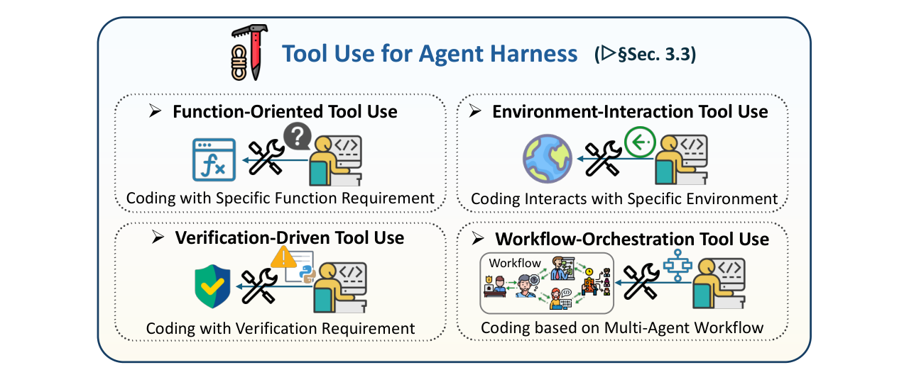

รูปที่ 7: ภาพรวมของกลไกการใช้ tool สำหรับ harness agent

## 📌 เนื้อหาจากแผนภาพ (Figure 7): ภาพรวมของกลไกการใช้เครื่องมือสำหรับตัวควบคุมเอเจนต์ (Tool-using Mechanisms for Agent Harnesses)

### การใช้เครื่องมือสำหรับตัวควบคุมเอเจนต์ (Tool Use for Agent Harness - ▷§Sec. 3.3)

* **การใช้เครื่องมือแบบมุ่งเน้นฟังก์ชัน (Function-Oriented Tool Use):** การเขียนโค้ดตามข้อกำหนดฟังก์ชันเฉพาะ (Coding with Specific Function Requirement)

* **การใช้เครื่องมือแบบปฏิสัมพันธ์กับสภาพแวดล้อม (Environment-Interaction Tool Use):** การเขียนโค้ดที่โต้ตอบกับสภาพแวดล้อมเฉพาะ (Coding Interacts with Specific Environment)

* **การใช้เครื่องมือแบบขับเคลื่อนด้วยการตรวจสอบความถูกต้อง (Verification-Driven Tool Use):** การเขียนโค้ดตามข้อกำหนดการตรวจสอบความถูกต้อง (Coding with Verification Requirement)

* **การใช้เครื่องมือแบบประสานงานเวิร์กโฟลว์ (Workflow-Orchestration Tool Use):** การเขียนโค้ดโดยอิงตามเวิร์กโฟลว์ของระบบหลายเอเจนต์ (Coding based on Multi-Agent Workflow)

---

## 📄 เนื้อหาบทความหลัก (Main Text)

มุมมองในระดับระบบควบคุม (Harness-level View) นี้ ยังช่วยเน้นย้ำถึงความสำคัญของการควบคุมวงจรชีวิตของเครื่องมือ (Tool Lifecycle Control) อีกด้วย โดยก่อนที่เครื่องมือจะถูกรัน ตัวควบคุม (Harness) อาจนำมาตรการตรวจสอบสิทธิ์การเข้าถึง (Permission Checks), กฎเกณฑ์เชิงนโยบาย (Policy Rules), การตรวจสอบความถูกต้องของอาร์กิวเมนต์ (Argument Validation) หรือประตูกลั่นกรองโดยมนุษย์ (Human-in-the-loop Gates) มาประยุกต์ใช้ และหลังจากการรันเครื่องมือเสร็จสิ้น ตัวควบคุมก็อาจทำการคัดกรองข้อมูลผลลัพธ์ (Sanitize Outputs), สรุปเนื้อหาล็อกขนาดใหญ่ (Summarize Large Logs), โยกย้ายร่องรอยการทำงานไปยังอุปกรณ์จัดเก็บข้อมูลที่คงทนถาวร (Offload Traces to Durable Storage), อัปเดตหน่วยความจำ หรือสั่งให้เกิดเครื่องมือตรวจสอบความถูกต้อง (Verification Tools)

จุดเชื่อมต่อในวงจรชีวิต (Lifecycle Hooks) เหล่านี้ช่วยทำให้จุดควบคุมดังกล่าวมีความชัดเจนยิ่งขึ้น ซึ่งจะเปลี่ยนการใช้เครื่องมือ จากเดิมที่เป็นเพียงการลงมือทำแบบดิบ ๆ ที่โมเดลสุ่มเลือกมา (Raw Model-selected Action) ให้กลายเป็นการเปลี่ยนผ่านสถานะที่ถูกติดตามตรวจสอบ (Monitored Transition) อยู่ภายในลูปการทำงานของเอเจนต์ (Agent's Execution Loop)

ดังนั้น งานวิจัยที่มีอยู่เกี่ยวกับการใช้เครื่องมือสำหรับเอเจนต์ฐานโค้ด จึงสามารถจัดระเบียบตามบทบาทหน้าที่หลักของตัวควบคุมที่เครื่องมือนั้นตอบสนอง ได้แก่:

1. **การใช้เครื่องมือแบบมุ่งเน้นฟังก์ชัน (Function-oriented tool use):** เครื่องมือกลุ่มนี้จะเชื่อมโยงเอเจนต์เข้ากับระบบเอพีไอ (APIs), ไลบรารี (Libraries) และเอกสารอธิบายภายนอก (External Documentation)

2. **การใช้เครื่องมือแบบปฏิสัมพันธ์กับสภาพแวดล้อม (Environment-interaction tool use):** เปิดโอกาสให้เอเจนต์สามารถลงมือทำสิ่งต่าง ๆ อยู่ภายในคลังรหัส (Repositories), เทอร์มินอล (Terminals), โปรแกรม IDEs, เว็บบราวเซอร์ และแซนด์บ็อกซ์ (Sandboxes)

3. **การใช้เครื่องมือแบบขับเคลื่อนด้วยการตรวจสอบความถูกต้อง (Verification-driven tool use):** มอบข้อมูลป้อนกลับแบบดีเทอร์มินิสติก (Deterministic Feedback) ผ่านทางชุดทดสอบ (Tests), เครื่องมือตรวจเช็คโค้ด (Linters), ตัวตรวจสอบประเภทข้อมูล (Type Checkers), ตัววิเคราะห์โค้ดแบบสแตติก (Static Analyzers) และข้อผิดพลาดขณะรันไทม์ (Runtime Errors)

4. **การใช้เครื่องมือแบบประสานงานเวิร์กโฟลว์ (Workflow-orchestration tool use):** ทำหน้าที่ประสานงานเครื่องมือจำนวนมาก, บทบาทหน้าที่, การอัปเดตหน่วยความจำ และนโยบายวงจรชีวิตเข้าด้วยกัน ให้เป็นกระบวนการรันโค้ดระยะยาวที่น่าเชื่อถือ

โดยผลงานที่เป็นตัวแทนได้ถูกแสดงไว้ในตารางที่ 6 (Table 6)

---

### 3.3.1. การใช้เครื่องมือแบบมุ่งเน้นฟังก์ชัน (Function-Oriented Tool Use)

งานวิจัยในแนวทางนี้ใช้เครื่องมือโดยมีวัตถุประสงค์หลักเพื่อเติมเต็มช่องว่างในความรู้ด้านการเขียนโปรแกรมของตัวโมเดล โดยเฉพาะระบบเอพีไอ (APIs), ไลบรารี (Libraries), เอกสารอธิบาย (Documentation) และเครื่องมืออำนวยความสะดวกในการเขียนโค้ดภายนอก [19, 224, 225, 227, 228, 229]

ตัวอย่างเช่น ระบบ ToolCoder [19] เริ่มต้นจากปัญหาคอขวดที่ชัดเจนข้อหนึ่ง นั่นคือ โมเดลฐานโค้ดมักจะเกิดอาการคิดไปเองเกี่ยวกับเอพีไอ (Hallucinate APIs), เลือกฟังก์ชันที่ไม่เหมาะสม หรือทำงานล้มเหลวเมื่อเจอกับไลบรารีสาธารณะและไลบรารีส่วนบุคคลที่มีข้อมูลสำหรับการฝึกฝนโมเดล (Training Coverage) ค่อนข้างเบาบาง เพื่อแก้ไขปัญหานี้ มันจึงได้บูรณาการเครื่องมือค้นหาเอพีไอเข้าไว้ในกระบวนการสร้างโค้ด และฝึกฝนโมเดลให้ตัดสินใจว่าเมื่อใดควรจะส่งคำสั่งสอบถามไปยังเครื่องมือ และจะคัดเลือกเอพีไอจากผลลัพธ์ที่ดึงข้อมูลกลับมาได้อย่างไร

ผลงานหลักที่นำเสนอจึงไม่ใช่เพียงแค่การสร้างไวยากรณ์โค้ดที่ดีขึ้น (Better Syntax Generation) เพียงอย่างเดียว แต่คือการได้มาซึ่งความรู้ที่ดีขึ้น (Better Knowledge Acquisition) และการเชื่อมโยงเอพีไอเข้ากับบริบทจริงได้อย่างแม่นยำ (API Grounding) เมื่อมองในภาพรวม วิธีการที่มุ่งเน้นการดึงข้อมูลจะช่วยลดการพึ่งพาหน่วยความจำในพารามิเตอร์ (Parametric Memory) และทำให้การสร้างโค้ดสามารถปรับตัวเข้ากับเอพีไอที่มีผู้ใช้งานน้อย (Long-tail APIs), ไลบรารีส่วนบุคคล และระบบนิเวศซอฟต์แวร์ที่พัฒนาเปลี่ยนแปลงอยู่ตลอดเวลาได้ดีขึ้น [225, 230]

วิธีการเหล่านี้จะมีประสิทธิภาพสูงสุดเมื่อปัญหาคอขวดหลักเกิดจากการที่โมเดลขาดความรู้ที่น่าเชื่อถือว่า ควรจะเลือกใช้ฟังก์ชัน, เอพีไอ หรือโครงสร้างไลบรารีใด ด้วยเหตุนี้ ความท้าทายหลักเชิงการออกแบบจึงตกไปอยู่ที่การจัดสูตรคำสั่งสอบถาม (Query Formulation), การเลือกผลลัพธ์ (Result Selection), การบีบอัดหลักฐานประจักษ์ (Evidence Compression) และการฉีดป้อนความรู้ที่ดึงข้อมูลมาเข้าสู่กระบวนการสร้างโค้ดขั้นปลายน้ำได้อย่างทนทานและมั่นคง วิธีการแบบเอเจนต์ (Agentic Methods) เหล่านี้มีความเหมาะสมเป็นพิเศษสำหรับงานสร้างโค้ดที่เน้นเอพีไอเป็นหลัก (API-oriented Generation), การย้ายระบบไลบรารี (Library Migration) และการพัฒนาชุดเครื่องมือซอฟต์แวร์ส่วนบุคคล (Private SDK)...

## หน้า 27

Table 6: agent tool-ใช้กลไกสำหรับ harness code-agent

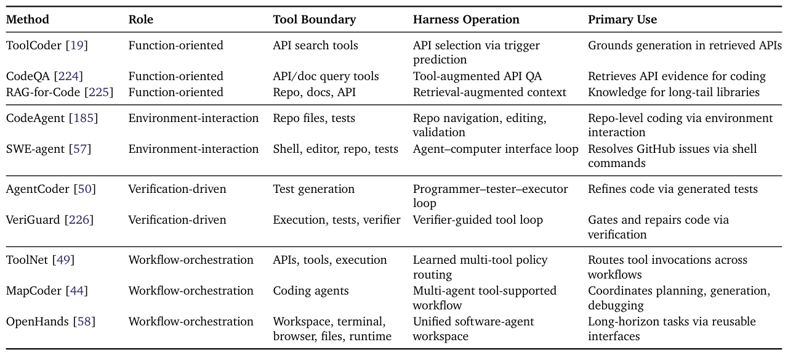

## 📊 เนื้อหาจากตาราง (Table 6): กลไกการใช้เครื่องมือที่เป็นตัวแทนสำหรับตัวควบคุมเอเจนต์ฐานโค้ด (Representative tool-use mechanisms for code-agent harnesses.)

| วิธีการ (Method) | บทบาท (Role) | ขอบเขตเครื่องมือ (Tool Boundary) | การทำงานของตัวควบคุม (Harness Operation) | การใช้งานหลัก (Primary Use) |
| --- | --- | --- | --- | --- |
| **ToolCoder** [19] | มุ่งเน้นฟังก์ชัน (Function-oriented) | เครื่องมือค้นหาเอพีไอ (API search tools) | เลือกเอพีไอผ่านการคาดการณ์ตัวทริกเกอร์ (API selection via trigger prediction) | เชื่อมโยงการสร้างโค้ดเข้ากับเอพีไอที่ดึงข้อมูลมาได้
 |
| **CodeQA** [224] | มุ่งเน้นฟังก์ชัน (Function-oriented) | เครื่องมือสอบถามเอพีไอ/เอกสาร (API/doc query tools) | การตอบคำถามเกี่ยวกับเอพีไอแบบเพิ่มขยายด้วยเครื่องมือ (Tool-augmented API QA) | ดึงข้อมูลหลักฐานประจักษ์ของเอพีไอสำหรับการเขียนโค้ด
 |
| **RAG-for-Code** [225] | มุ่งเน้นฟังก์ชัน (Function-oriented) | คลังรหัส, เอกสารอธิบาย, เอพีไอ (Repo, docs, API) | บริบทแบบเพิ่มขยายด้วยการดึงข้อมูล (Retrieval-augmented context) | มอบองค์ความรู้สำหรับไลบรารีที่มีผู้ใช้งานน้อย (Long-tail libraries)
 |
| **CodeAgent** [185] | ปฏิสัมพันธ์กับสภาพแวดล้อม (Environment-interaction) | ไฟล์คลังรหัส, ชุดทดสอบ (Repo files, tests) | การนำทางคลังรหัส, การแก้ไข และการตรวจสอบความถูกต้อง (Repo navigation, editing, validation) | การเขียนโค้ดระดับคลังรหัสผ่านการโต้ตอบกับสภาพแวดล้อม
 |
| **SWE-agent** [57] | ปฏิสัมพันธ์กับสภาพแวดล้อม (Environment-interaction) | เชลล์, ตัวแก้ไขโค้ด, คลังรหัส, ชุดทดสอบ (Shell, editor, repo, tests) | ลูปอินเตอร์เฟสระหว่างเอเจนต์และคอมพิวเตอร์ (Agent-computer interface loop) | แก้ไขปัญหาบน GitHub ผ่านคำสั่งเชลล์ (Shell commands)
 |
| **AgentCoder** [50] | ขับเคลื่อนด้วยการตรวจสอบ (Verification-driven) | การสร้างชุดทดสอบ (Test generation) | ลูปโปรแกรมเมอร์-ผู้ทดสอบ-ตัวรันโค้ด (Programmer-tester-executor loop) | ปรับแต่งโค้ดให้ดีขึ้นผ่านชุดทดสอบที่สร้างขึ้นมา
 |
| **VeriGuard** [226] | ขับเคลื่อนด้วยการตรวจสอบ (Verification-driven) | การรันโค้ด, ชุดทดสอบ, ตัวตรวจสอบความถูกต้อง (Execution, tests, verifier) | ลูปเครื่องมือที่นำทางด้วยตัวตรวจสอบความถูกต้อง (Verifier-guided tool loop) | สกัดกั้นและซ่อมแซมโค้ดผ่านการตรวจสอบความถูกต้อง
 |
| **ToolNet** [49] | ประสานงานเวิร์กโฟลว์ (Workflow-orchestration) | เอพีไอ, เครื่องมือต่าง ๆ, การรันโค้ด (APIs, tools, execution) | กำหนดเส้นทางนโยบายแบบหลายเครื่องมือที่ถูกเรียนรู้ขึ้นมา (Learned multi-tool policy routing) | กำหนดเส้นทางการเรียกใช้งานเครื่องมือข้ามผ่านเวิร์กโฟลว์
 |
| **MapCoder** [44] | ประสานงานเวิร์กโฟลว์ (Workflow-orchestration) | เอเจนต์เขียนโค้ด (Coding agents) | เวิร์กโฟลว์แบบหลายเอเจนต์ที่สนับสนุนด้วยเครื่องมือ (Multi-agent tool-supported workflow) | ประสานงานการวางแผน, การสร้างโค้ด และการดีบั๊ก
 |
| **OpenHands** [58] | ประสานงานเวิร์กโฟลว์ (Workflow-orchestration) | พื้นที่ทำงาน, เทอร์มินอล, บราวเซอร์, ไฟล์, รันไทม์ (Workspace, terminal, browser, files, runtime) | พื้นที่ทำงานของเอเจนต์ซอฟต์แวร์ที่เป็นเอกภาพ (Unified software-agent workspace) | จัดการงานระยะยาวผ่านอินเตอร์เฟสที่นำกลับมาใช้ซ้ำได้
 |

---

## 📄 เนื้อหาบทความหลัก (Main Text)

...แต่อย่างไรก็ตาม การดึงข้อมูล (Retrieval) เพียงอย่างเดียวมักจะไม่เพียงพอ เมื่อตัวงานนั้นกำหนดให้ต้องมีความเข้าใจและการให้เหตุผลข้ามไฟล์ (Cross-file Understanding and Reasoning), การดีบั๊กตอนรันไทม์ (Runtime Debugging) หรือการวิเคราะห์ความพึ่งพาครอบคลุมทั้งคลังรหัส (Repository-wide Dependency Analysis)

### 3.3.2. การใช้เครื่องมือแบบปฏิสัมพันธ์กับสภาพแวดล้อม (Environment-Interaction Tool Use)

สิ่งที่แตกต่างจากเครื่องมือที่มุ่งเน้นฟังก์ชันก็คือ แนวทางการโต้ตอบกับสภาพแวดล้อม (Environment-interaction approaches) จะปฏิบัติกับเครื่องมือในฐานะอินเตอร์เฟสที่เอเจนต์ใช้ในการลงมือทำสิ่งต่าง ๆ อยู่ภายในสภาพแวดล้อมวิศวกรรมซอฟต์แวร์ [231, 232, 233, 234] ปัญหาหลักของพวกมันไม่ใช่เรื่องของการเสาะหาฟังก์ชันที่ขาดหายไปอีกต่อไป แต่คือการปฏิบัติงานอย่างมีประสิทธิภาพเหนือคลังรหัส (Repositories), ชิ้นงานที่เกิดจากการพัฒนา (Development Artifacts) และสภาพแวดล้อมการรันโค้ด (Execution Environments)

ระบบ CodeAgent [185] ได้แสดงให้เห็นว่า การสร้างโค้ดในระดับคลังรหัสในโลกแห่งความเป็นจริง ไม่ใช่เรื่องง่าย ๆ แค่การเติมเต็มฟังก์ชันเดี่ยว ๆ ให้เสร็จสิ้นจากคำสั่งกระตุ้น (Prompt) เพียงอย่างเดียว ในทางกลับกัน ตัวโมเดลจะต้องระบุตำแหน่งของไฟล์ที่เกี่ยวข้อง, ทำความเข้าใจความพึ่งพา (Dependencies), ตรวจสอบเอกสารอธิบาย, นำการแก้ไขไปใช้งานจริง และตรวจสอบความถูกต้องของผลลัพธ์ผ่านการทดสอบ เพื่อสนับสนุนกระบวนการนี้ CodeAgent จึงได้บูรณาการเครื่องมือการเขียนโปรแกรมและกลยุทธ์เอเจนต์สำหรับการดึงข้อมูล (Information Retrieval), การนำทางสัญลักษณ์ของโค้ด (Code-symbol Navigation), การนำโค้ดไปใช้งานจริง และการโต้ตอบกับชุดทดสอบเหนือคลังรหัสที่ใช้งานจริง

ระบบ SWE-agent [57] ได้ผลักดันแนวคิดนี้ให้ไกลขึ้นไปอีกด้วยการจัดรูปแบบอินเตอร์เฟสระหว่างเอเจนต์และคอมพิวเตอร์ (Agent-computer Interface) ให้เป็นทางการ ซึ่งคำสั่งเชลล์ (Shell Commands), การแก้ไขไฟล์ และการรันชุดทดสอบจะกลายมาเป็นช่องทางการปฏิสัมพันธ์หลัก ในทำนองเดียวกัน RepairAgent [183] ได้ติดตั้งเครื่องมือเฉพาะสำหรับงานซ่อมแซมโค้ดให้แก่เอเจนต์ เช่น การอ่านโค้ด, การค้นหาส่วนผสมสำหรับการซ่อมแซม (Repair Ingredients), การติดตั้งโค้ดแก้ไข (Patches) และการรันชุดทดสอบ เมื่อนำมารวมกัน วิธีการเหล่านี้ได้ร่วมกันกำหนดเส้นทางการทำงานหลักของการใช้เครื่องมือแบบปฏิสัมพันธ์กับสภาพแวดล้อม ซึ่งมีความเกี่ยวข้องเป็นพิเศษสำหรับการสร้างโค้ดในระดับคลังรหัส, การแก้ไขปัญหา (Issue Resolution) และงานวิศวกรรมซอฟต์แวร์แบบปลายเปิด (Open-ended Software Engineering Tasks)

### 3.3.3. การใช้เครื่องมือแบบขับเคลื่อนด้วยการตรวจสอบความถูกต้อง (Verification-Driven Tool Use)

งานวิจัยในแนวทางที่สามจะใช้เครื่องมือโดยมีวัตถุประสงค์หลักเพื่อการตรวจสอบความถูกต้องหลังการสร้างโค้ด (Post-generation Verification) และการปรับปรุงประสิทธิภาพแบบวนซ้ำ (Iterative Improvement) การใช้เครื่องมือแบบขับเคลื่อนด้วยการตรวจสอบความถูกต้อง (Verification-driven tool use) จะปฏิบัติต่อเครื่องมือภายนอกเสมือนเป็นเซนเซอร์แบบดีเทอร์มินิสติก (Deterministic Sensors) สำหรับตัวควบคุม (Harness)

เมื่อเปรียบเทียบกับเครื่องมือที่มุ่งเน้นฟังก์ชันและเครื่องมือแบบปฏิสัมพันธ์กับสภาพแวดล้อมแล้ว แนวทางเหล่านี้ไม่ได้เน้นย้ำถึงการดึงข้อมูลจากภายนอกหรือการนำทางคลังรหัสในวงกว้างเป็นสำคัญ แต่ทว่าพวกมันจะใช้ชุดทดสอบ (Tests), ผลลัพธ์การรันโค้ด (Execution Results), ข้อผิดพลาดจากคอมไพเลอร์ (Compiler Errors), ร่องรอยการทำงานตอนรันไทม์ (Runtime Traces), ตัวตรวจสอบประเภทข้อมูล (Type Checkers), ตัววิเคราะห์โค้ดแบบสแตติก (Static Analyzers) และข้อมูลป้อนกลับจากตัวตรวจสอบความถูกต้อง (Verifier Feedback) มาทำหน้าที่เป็นสัญญาณหลักในการยกระดับคุณภาพของโค้ด [226, 235, 236, 237]

## หน้า 28

...ตัวอย่างเช่น ระบบ AgentCoder [50] ประยุกต์ใช้เอเจนต์ผู้เขียนโปรแกรม (Programmer Agent), เอเจนต์ผู้ออกแบบชุดทดสอบ (Test Designer Agent) และเอเจนต์ผู้รันชุดทดสอบ (Test Executor Agent) เพื่อฟอร์มตัวเป็นลูปปิด (Closed Loop) ของการสร้างโค้ด, การประกอบสร้างชุดทดสอบ, การรันโค้ด และการปรับแต่งโค้ดให้ดีขึ้น ในกระบวนทัศน์นี้ บทบาทหลักของเครื่องมือคือการตรวจสอบความถูกต้อง (Verification) ไม่ใช่การดึงข้อมูล (Retrieval)

เมื่อมองจากมุมมองของแนวคิดโค้ดในฐานะตัวควบคุมเอเจนต์ เครื่องมือตรวจสอบความถูกต้องจะช่วยทำให้ความคืบหน้าของเอเจนต์สามารถตรวจสอบได้ (Inspectable): โดยความล้มเหลวของการทดสอบ (Test Failures), ร่องรอยสแตก (Stack Traces), ช่องว่างของความครอบคลุมในการทดสอบ (Coverage Gaps), ข้อผิดพลาดของประเภทข้อมูล (Type Errors) และคำเตือนจากการวิเคราะห์โค้ดแบบสแตติก (Static-analysis Warnings) จะกลายมาเป็นข้อมูลการสังเกตที่มีโครงสร้างชัดเจน (Structured Observations) ซึ่งจะเข้าไปอัปเดตหน่วยความจำปฏิบัติความ (Working Memory) และนำทางคำสั่งการลงมือทำในขั้นต่อไป

ประเด็นหลักเชิงการออกแบบคือการกำหนดเส้นทางเพื่อส่งข้อมูลการสังเกตเหล่านี้กลับเข้าสู่ลูปการทำงาน (Route Observations Back into the Loop) [226] เนื่องจากล็อกแบบดิบ (Raw Logs) อาจมีความยาวหรือมีสัญญาณรบกวนมากเกินไปสำหรับบริบทที่กำลังทำงานอยู่ (Active Context) ตัวควบคุม (Harness) จึงควรทำหน้าที่แยกแยะวิเคราะห์, สรุปผล และโยกย้ายร่องรอยการตรวจสอบความถูกต้องออกไปภายนอก ในขณะที่ยังคงรักษาชิ้นงานที่มีความเที่ยงตรงสูง (Full-fidelity Artifacts) เอาไว้สำหรับการตรวจสอบ (Audit) และการเล่นซ้ำ (Replay)

---

### 3.3.4. การใช้เครื่องมือแบบประสานงานเวิร์กโฟลว์ (Workflow-Orchestration Tool Use)

การใช้เครื่องมือแบบประสานงานเวิร์กโฟลว์ (Workflow-orchestration tool use) มุ่งเน้นไปที่แนวทางที่เครื่องมือ, บทบาทหน้าที่ และนโยบายการควบคุมจำนวนมาก จะถูกจัดระเบียบให้เป็นเวิร์กโฟลว์ของเอเจนต์ที่สอดคล้องกัน (Coherent Agent Workflow) [238, 239, 240, 241] ในงานซอฟต์แวร์ระยะยาว เอเจนต์อาจจำเป็นต้องดึงหลักฐานประจักษ์, ระบุตำแหน่งของบั๊ก, แก้ไขไฟล์, รันชุดทดสอบ, ตรวจสอบความล้มเหลว, อัปเดตหน่วยความจำ, ร้องขอการอนุมัติ และทำลูปวงจรนี้ซ้ำหลาย ๆ รอบ ความท้าทายจึงไม่ใช่เพียงแค่การเพิ่มเครื่องมือเข้าไปให้มากขึ้น แต่เป็นการตัดสินใจว่าเครื่องมือแต่ละชิ้นควรถูกเรียกใช้งานเมื่อใด, ภายใต้สิทธิ์การเข้าถึงใด, ในบริบทแบบไหน และผลลัพธ์ของมันจะเข้าไปอัปเดตสถานะของตัวควบคุม (Harness State) อย่างไร [49]

ชุดเครื่องมือพัฒนาเอเจนต์ (Agent SDKs) และแพลตฟอร์มเอเจนต์ซอฟต์แวร์เมื่อไม่นานมานี้ ได้ทำให้เลเยอร์การประสานงานนี้มีความชัดเจน โดยทำการรวมกลุ่มสกีมาเครื่องมือแบบระเบียบประเภทข้อมูล (Typed Tool Schemas), สถานะเซสชัน (Session State), พื้นที่ทำงาน (Workspaces), แนวกันชนหรือกรอบป้องกัน (Guardrails), การส่งต่อสิทธิ์ (Handoffs), การติดตามร่องรอย (Tracing) และกลไกการรีวิวโดยมนุษย์ (Human-review Mechanisms) เข้าไว้ด้วยกันให้เป็นองค์ประกอบของตัวควบคุมที่นำกลับมาใช้ซ้ำได้

จุดเชื่อมต่อในวงจรชีวิต (Lifecycle Hooks) ช่วยขยายขอบเขตนี้ให้ชัดเจนยิ่งขึ้น: โดยจุดเชื่อมต่อก่อนการใช้งาน (Pre-use Hooks) สามารถตรวจสอบความถูกต้องของอาร์กิวเมนต์, บังคับใช้นโยบายสิทธิ์การเข้าถึง หรือสกัดกั้นคำสั่งที่มีความเสี่ยงสูงได้ ในขณะที่จุดเชื่อมต่อหลังการใช้งาน (Post-use Hooks) สามารถคัดกรองข้อมูลผลลัพธ์, บีบอัดล็อกให้กระชับ, อัปเดตหน่วยความจำ หรือสั่งให้เกิดการตรวจสอบความถูกต้องในขั้นต่อไป ระบบที่เป็นตัวแทนเช่น MapCoder [44] เป็นตัวอย่างที่ชัดเจนของการประสานงานเวิร์กโฟลว์ โดยการมอบหมายงานให้เอเจนต์แยกกันไปทำหน้าที่ดึงข้อมูลตัวอย่างในอดีต (Example Recall), การวางแผน, การสร้างโค้ด และการดีบั๊ก ซึ่งช่วยย่อยส่วนงานของปัญหาการเขียนโค้ดที่ยากลำบาก ให้กลายเป็นปัญหาซับซ้อนย่อย ๆ ที่ถูกประสานงานร่วมกัน นอกจากนี้ CodeAgent [185] ยังศึกษาแนวทางที่การเรียกใช้งานเครื่องมือควรถูกจัดตารางเวลาและจัดโครงสร้างในเวิร์กโฟลว์ระดับคลังรหัสด้วย เครื่องมือในคลาสนี้มีความสำคัญเป็นพิเศษสำหรับเอเจนต์ฐานโค้ดที่ทำงานระยะยาว ซึ่งงานซอฟต์แวร์ในโลกแห่งความเป็นจริงต้องการการย่อยส่วนงาน, การเลือกบริบท, การสำรวจตัวเลือกทางเลือก, การตรวจสอบความถูกต้องผ่านการรันโค้ดจริง และการซ่อมแซมโค้ดขั้นสุดท้ายภายใต้นโยบายการควบคุมที่ชัดเจน [49, 242]

---

### บทสนทนา: การใช้เครื่องมือสำหรับตัวควบคุมเอเจนต์ (Discussion: Tool Use for Agent Harness)

การใช้เครื่องมือในเอเจนต์ฐานโค้ด ได้วิวัฒนาการจากการดึงข้อมูลเอพีไอแบบแยกส่วน (Isolated API Retrieval) ไปสู่การเป็นกลไกของตัวควบคุมที่สมบูรณ์แบบ (Full Harness Mechanism) สำหรับการลงมือทำ, การสังเกต, การตรวจสอบความถูกต้อง และการกำกับดูแล

* **เครื่องมือที่มุ่งเน้นฟังก์ชัน (Function-oriented tools)** ช่วยเชื่อมโยงทางเลือกการนำไปใช้งานเข้ากับองค์ความรู้ภายนอก

* **เครื่องมือแบบปฏิสัมพันธ์กับสภาพแวดล้อม (Environment-interaction tools)** เปิดโอกาสให้เอเจนต์ปฏิบัติงานเหนือคลังรหัสและสภาพแวดล้อมการรันโค้ดได้

* **เครื่องมือแบบขับเคลื่อนด้วยการตรวจสอบความถูกต้อง (Verification-driven tools)** มอบข้อมูลป้อนกลับแบบดีเทอร์มินิสติก

* **เครื่องมือแบบประสานงานเวิร์กโฟลว์ (Workflow-orchestration tools)** ทำหน้าที่ประสานงานขีดความสามารถเหล่านี้ผ่านทาง SDKs, แซนด์บ็อกซ์, กรอบป้องกัน และจุดเชื่อมต่อในวงจรชีวิต

ความท้าทายหลักไม่ใช่เรื่องที่ว่าโมเดลสามารถเรียกใช้งานเครื่องมือได้หรือไม่ในปัจจุบัน แต่คือการที่ตัวควบคุมจะสามารถทำให้การใช้เครื่องมือนั้นมีความปลอดภัย (Safe), สามารถตรวจสอบได้ (Auditable) และเป็นประโยชน์ต่อการรันโค้ดระยะยาวได้อย่างไร ตัวควบคุมเอเจนต์ฐานโค้ดในอนาคตควรสนับสนุนสกีมาเครื่องมือแบบระเบียบประเภทข้อมูล, การเรียกใช้งานที่รับรู้ถึงสิทธิ์การเข้าถึง (Permission-aware Invocation), การรันโค้ดบนแซนด์บ็อกซ์, จุดเชื่อมต่อในวงจรชีวิต, การคัดกรองข้อมูลผลลัพธ์, การบีบอัดบริบท, การโยกย้ายสถานะ และร่องรอยการทำงานที่สามารถทำซ้ำได้ (Reproducible Traces) กลไกเหล่านี้จะช่วยการันตีว่าเครื่องมือต่าง ๆ จะเข้ามาขยายขอบเขตการลงมือทำของเอเจนต์ โดยไม่สูญเสียความน่าเชื่อถือ, ความปลอดภัย หรือความสามารถในการตรวจสอบความถูกต้องไป

---

## 3.4. การควบคุมตัวควบคุมผ่านลูป วางแผน, รัน และตรวจสอบ (Harness Control through the Plan, Execute, and Verify Loop)

ระบบที่ใช้โค้ดเป็นตัวควบคุม (Code-as-harness Systems) จำเป็นต้องมีลูปการควบคุม (Control Loop) ที่เปลี่ยนความเจตนาของโมเดลให้กลายเป็นการเปลี่ยนผ่านสถานะที่ถูกจำกัดขอบเขต, สังเกตได้ และแก้ไขได้ ในหัวข้อย่อยนี้จะวางกรอบลูปดังกล่าวในฐานะ **วางแผน-รัน-ตรวจสอบ (Plan-Execute-Verify - PEV):** โดยเริ่มแรก ตัวควบคุมจะดึงความเจตนาในการเปลี่ยนแปลงและเกณฑ์การตรวจสอบความถูกต้องออกมาสู่ภายนอก จากนั้นจึงนำการเปลี่ยนแปลงนั้นไปรันจริงภายในสภาพแวดล้อมที่ปลอดภัยแบบแซนด์บ็อกซ์และได้รับอนุญาตสิทธิ์ และในท้ายที่สุด จะทำการตรวจสอบความถูกต้องของสถานะผลลัพธ์ที่เกิดขึ้น ผ่านทางเซนเซอร์แบบดีเทอร์มินิสติกและประตูกลั่นกรองโดยการรีวิวจากมนุษย์ การวางกรอบนี้จะรวมเอารวมการวางแผน, การรันโค้ด, การดีบั๊ก, การตรวจสอบความถูกต้อง และการยกระดับปัญหาตามสถานการณ์ (Escalation) เข้าไว้ด้วยกันในฐานะส่วนหนึ่งของกระบวนการควบคุมในระดับระบบควบคุมเพียงหนึ่งเดียว

## หน้า 29

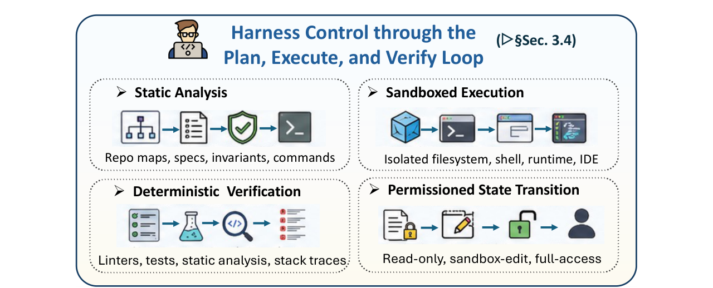

รูปที่ 8: ภาพรวมของการควบคุม harness ผ่านลูป PEV

บทแปลเนื้อหาจากหน้า 29 (Figure 8 และหัวข้อย่อย 3.4.1) เป็นภาษาไทย โดยใส่คำศัพท์เทคนิคภาษาอังกฤษควบคู่ไว้ในวงเล็บเพื่อความชัดเจนและใช้ในการอ้างอิงครับ:

---

## 📌 เนื้อหาจากแผนภาพ (Figure 8): ภาพรวมของการควบคุมตัวควบคุมผ่านลูป PEV (Overview of harness control through PEV loop)

การควบคุมตัวควบคุมผ่านลูป วางแผน, รัน และตรวจสอบ (Harness Control through the Plan, Execute, and Verify Loop - ▷§Sec. 3.4) 

* 
**การวิเคราะห์แบบสแตติก (Static Analysis):** แผนผังคลังรหัส, ข้อกำหนดเฉพาะ, อินแวเรียนต์หรือเงื่อนไขคงที่, คำสั่งต่าง ๆ (Repo maps, specs, invariants, commands) 

* 
**การรันโค้ดบนแซนด์บ็อกซ์ (Sandboxed Execution):** ระบบไฟล์ที่ถูกแยกส่วน, เชลล์, รันไทม์, โปรแกรม IDE (Isolated filesystem, shell, runtime, IDE) 

* 
**การตรวจสอบความถูกต้องแบบดีเทอร์มินิสติก (Deterministic Verification):** เครื่องมือตรวจเช็คโค้ด, ชุดทดสอบ, การวิเคราะห์แบบสแตติก, ร่องรอยสแตก (Linters, tests, static analysis, stack traces) 

* 
**การเปลี่ยนผ่านสถานะที่ได้รับอนุญาตสิทธิ์ (Permissioned State Transition):** อ่านอย่างเดียว, แก้ไขบนแซนด์บ็อกซ์, เข้าถึงสิทธิ์เต็มรูปแบบ (Read-only, sandbox-edit, full-access) 

---

## 📄 เนื้อหาบทความหลัก (Main Text)

### 3.4.1. 

จากการดีบั๊กสู่การควบคุมในระดับระบบควบคุม (From Debugging to Harness-Level Control) 

หัวข้อย่อยก่อนหน้านี้ได้อธิบายถึงการวางแผน (Planning) ในฐานะการควบคุมเส้นทางการทำงาน (Trajectory Control) , หน่วยความจำ (Memory) ในฐานะการจัดการสถานะ (State Management) และการใช้เครื่องมือ (Tool Use) ในฐานะอินเตอร์เฟสการลงมือทำที่มีการกำกับดูแล (Governed Action Interface) ทั้งนี้ การดีบั๊กที่ขับเคลื่อนด้วยข้อมูลป้อนกลับ (Feedback-guided Debugging) จะทำหน้าที่เชื่อมโยงกลไกเหล่านี้เข้าด้วยกันให้เป็นลูปปิด (Closed Loop): กล่าวคือ แผนการทำงานจะระบุการเปลี่ยนแปลงที่เจตนาจะทำ, หน่วยความจำจะคงรักษาหลักฐานประจักษ์ที่เกี่ยวข้อง, เครื่องมือจะรันและตรวจสอบการลงมือทำ และสัญญาณการตรวจสอบความถูกต้อง (Validation Signals) จะเป็นตัวตัดสินว่าเอเจนต์ควรจะดำเนินการต่อ, แก้ไขโค้ด หรือหยุดทำงาน 

เมื่อเอเจนต์ที่มีโค้ดเป็นศูนย์กลาง (Code-centric Agents) พัฒนาจากการสร้างโค้ดแบบจบรอบในครั้งเดียว (Single-turn Generation) ไปสู่งานซอฟต์แวร์ในระดับคลังรหัส (Repository-level Software Work) การดีบั๊กจึงได้รับการทำความเข้าใจที่ดีกว่าในฐานะ **การควบคุมเหนือสถานะโปรแกรมที่รันได้จริง (Control over Executable Program State)** มากกว่าการเป็นเพียงขั้นตอนการแก้ไขภายหลัง (Post hoc Correction Stage) เนื่องจากโปรแกรมที่ถูกสร้างขึ้นสามารถล้มเหลวได้จากข้อผิดพลาดทางไวยากรณ์ (Syntax Errors), ข้อผิดพลาดขณะรันไทม์ (Runtime Exceptions), ผลลัพธ์ที่ไม่ถูกต้อง (Incorrect Outputs), การจัดการกรณีขอบเขตที่ไม่สมบูรณ์ (Incomplete Edge-case Handling), การปฏิบัติการที่ไม่ปลอดภัย หรือการละเมิดข้อตกลงเฉพาะของโปรเจกต์ ซึ่งทำให้การสร้างโค้ดแบบครั้งเดียวผ่านนั้นไม่เพียงพอ ระบบเมื่อไม่นานมานี้จึงทำการแก้ไขโค้ดผ่านข้อมูลป้อนกลับจากคอมไพเลอร์ (Compilers), รันไทม์ (Runtimes), ชุดทดสอบ (Tests), ตัววิเคราะห์โค้ดแบบสแตติก (Static Analyzers), มนุษย์ และเอเจนต์เสริม (Auxiliary Agents) 

เมื่อมองจากมุมมองของตัวควบคุม (Harness Perspective) กระบวนการนี้สามารถถูกวางกรอบใหม่ให้เป็น **ลูป วางแผน-รัน-ตรวจสอบ (Plan-Execute-Verify - PEV Loop):** โดยเอเจนต์จะดึงเส้นทางการทำงานที่เจตนาจะทำออกมาสู่ภายนอก, รันการลงมือทำที่ถูกจำกัดขอบเขตอยู่ภายในสภาพแวดล้อมที่ควบคุมได้ และตรวจสอบความถูกต้องของสถานะผลลัพธ์ที่เกิดขึ้นก่อนจะเกิดการเปลี่ยนผ่านสถานะในขั้นต่อไป ระบบนิเวศทางวิศวกรรมที่เติบโตขึ้นรอบ ๆ ตัวควบคุมเอเจนต์ (Agent Harnesses) ได้ช่วยสนับสนุนมุมมองนี้ โดยแหล่งข้อมูลที่ผ่านการคัดสรรเมื่อไม่นานมานี้ ได้จำแนกความแตกต่างระหว่าง ระบบประสานงาน (Orchestration), สถานะการทำงาน (Working State), ซับสเตรตการรันโค้ด (Execution Substrates), ตัวควบคุมการประเมินผล (Evaluation Harnesses), ความสามารถในการสังเกตติดตาม (Observability) และการกำกับดูแล (Governance) ออกเป็นเลเยอร์ของตัวควบคุมที่แยกขาดจากกัน แทนที่จะมองว่าเป็นเพียงรายละเอียดการนำไปใช้งานที่เกิดขึ้นโดยบังเอิญ 

ภายใต้มุมมองนี้ ตัวควบคุม (Harness) จะทำหน้าที่เสมือนเป็นตัวควบคุมแบบไซเบอร์เนติกส์ (Cybernetic Governor): ซึ่งเป็นเลเยอร์การควบคุมที่คอยสังเกตผลกระทบจากการลงมือทำของเอเจนต์ และควบคุมการเปลี่ยนผ่านสถานะในขั้นถัดไป แทนที่จะเป็นเพียงแค่การส่งต่อข้อความแสดงข้อผิดพลาด (Error Messages) ไปยังตัวโมเดลตรง ๆ ระบบควบคุมจะทำการสังเกตคลังรหัสและสภาพแวดล้อมการรันโค้ดผ่านทางเซนเซอร์แบบดีเทอร์มินิสติก (Deterministic Sensors) เช่น เครื่องมือตรวจเช็คโค้ด (Linters), ตัวแยกแยะวิเคราะห์ (Parsers), คอมไพเลอร์ (Compilers), ตัวตรวจสอบประเภทข้อมูล (Type Checkers), ยูนิตเทสต์ (Unit Tests), อินทิเกรชันเทสต์ (Integration Tests), ตัววิเคราะห์โค้ดแบบสแตติก (Static Analyzers), เครื่องมือทดสอบฟัซซิง (Fuzzers), ตัวติดตามตรวจสอบรันไทม์ (Runtime Monitors) และไปป์ไลน์ CI (CI Pipelines) 

เซนเซอร์เหล่านี้จะเปลี่ยนเส้นทางการเขียนโค้ดให้กลายเป็นสัญญาณที่สามารถตรวจสอบได้ (Inspectable Signals) ซึ่งรวมถึง ผลลัพธ์ผ่าน/ล้มเหลว (Pass/fail Outcomes), ข้อมูลการวินิจฉัย (Diagnostics), ร่องรอยความล้มเหลว (Failing Traces), ช่องว่างของความครอบคลุมในการทดสอบ (Coverage Gaps), คำเตือนด้านความปลอดภัย, ขีดจำกัดของทรัพยากร และการละเมิดนโยบาย จากนั้น ตัวควบคุมจะสามารถตัดสินใจได้ว่า ควรจะรันโค้ดต่อไป, แก้ไขโค้ดแก้ไข (Revise a Patch), ร้องขอความช่วยเหลือเกี่ยวกับบริบทเพิ่มเติม, กำหนดเส้นทางงานส่งต่อไปยังโมดูลอื่น, ลดระดับสิทธิ์การเข้าถึง หรือยกรดับปัญหาขึ้นไปให้ผู้รีวิวที่เป็นมนุษย์ (Human Reviewer) พิจารณา โดยตารางที่ 7 (Table 7) ได้สรุปภาพรวมของพื้นผิวการควบคุม (Control Surface) นี้ไว้ และเนื้อหาที่เหลือของหัวข้อย่อยนี้จะติดตามลูปการทำงานตั้งแต่ขั้นตอนการฟอร์มตัวของสัญญาข้อตกลง (Contract Formation), การเปลี่ยนผ่านสถานะบนแซนด์บ็อกซ์ (Sandboxed State Transition) ไปจนถึงการตรวจสอบความถูกต้องแบบดีเทอร์มินิสติกและการซ่อมแซมโค้ดที่มีหลักฐานประจักษ์เป็นรากฐาน (Evidence-grounded Repair)

## หน้า 30

Table 7: วิธีการและระบบ agent สำหรับการควบคุม PEV-loop harness

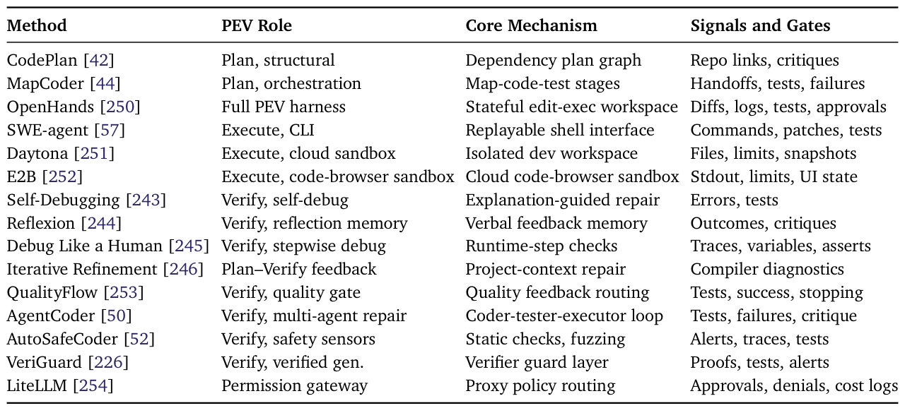

## 📊 เนื้อหาจากตาราง (Table 7): วิธีการและระบบที่เป็นตัวแทนสำหรับระบบควบคุมลูป PEV (Plan-Execute-Verify)

| วิธีการ (Method) | บทบาทใน PEV (PEV Role) | กลไกหลัก (Core Mechanism) | สัญญาณและประตูกลั่นกรอง (Signals and Gates) |
| --- | --- | --- | --- |
| **CodePlan** [42] | การวางแผน เชิงโครงสร้าง (Plan, structural) | กราฟแผนความต้องการพึ่งพา (Dependency plan graph) | ลิงก์คลังรหัส, การวิพากษ์วิจารณ์ (Repo links, critiques) 
 |
| **MapCoder** [44] | การวางแผน เชิงประสานงาน (Plan, orchestration) | สถานีงาน แผน-โค้ด-ทดสอบ (Map-code-test stages) | การส่งต่องาน, ชุดทดสอบ, ความล้มเหลว (Handoffs, tests, failures) 
 |
| **OpenHands** [250] | ระบบควบคุม PEV แบบเต็มรูปแบบ (Full PEV harness) | พื้นที่ทำงานแก้ไข-รันโค้ดแบบเก็บสถานะ (Stateful edit-exec workspace) | ความเปลี่ยนแปลงของโค้ด, ล็อก, ชุดทดสอบ, การอนุมัติ (Diffs, logs, tests, approvals) 
 |
| **SWE-agent** [57] | การรันโค้ด, CLI (Execute, CLI) | อินเตอร์เฟสเชลล์ที่เล่นซ้ำได้ (Replayable shell interface) | คำสั่งต่าง ๆ, โค้ดแก้ไข, ชุดทดสอบ (Commands, patches, tests) 
 |
| **Daytona** [251] | การรันโค้ด, แซนด์บ็อกซ์บนคลาวด์ (Execute, cloud sandbox) | พื้นที่ทำงานพัฒนาแบบแยกส่วน (Isolated dev workspace) | ไฟล์ต่าง ๆ, ขีดจำกัด, สแนปชอต (Files, limits, snapshots) 
 |
| **E2B** [252] | การรันโค้ด, แซนด์บ็อกซ์บราวเซอร์โค้ด (Execute, code-browser sandbox) | แซนด์บ็อกซ์บราวเซอร์โค้ดบนคลาวด์ (Cloud code-browser sandbox) | เอาต์พุตมาตรฐาน, ขีดจำกัด, สถานะ UI (Stdout, limits, UI state) 
 |
| **Self-Debugging [243]** | การตรวจสอบ, ดีบั๊กตัวเอง (Verify, self-debug) | การซ่อมแซมโค้ดนำทางด้วยคำอธิบาย (Explanation-guided repair) | ข้อผิดพลาดต่าง ๆ, ชุดทดสอบ (Errors, tests) 
 |
| **Reflexion** [244] | การตรวจสอบ, หน่วยความจำคิดทบทวน (Verify, reflection memory) | หน่วยความจำข้อมูลป้อนกลับแบบคำพูด (Verbal feedback memory) | ผลลัพธ์ต่าง ๆ, การวิพากษ์วิจารณ์ (Outcomes, critiques) 
 |
| **Debug Like a Human** [245] | การตรวจสอบ, ดีบั๊กทีละขั้น (Verify, stepwise debug) | การตรวจสอบเป็นขั้นในตอนรันไทม์ (Runtime-step checks) | ร่องรอยการทำงาน, ตัวแปร, การอัสเสิร์ต (Traces, variables, asserts) 
 |
| **Iterative Refinement** [246] | ข้อมูลป้อนกลับ แผน-ตรวจสอบ (Plan-Verify feedback) | การซ่อมแซมโค้ดบริบทโปรเจกต์ (Project-context repair) | ข้อมูลวินิจฉัยจากคอมไพเลอร์ (Compiler diagnostics) 
 |
| **QualityFlow** [253] | การตรวจสอบ, ประตูกลั่นกรองคุณภาพ (Verify, quality gate) | การกำหนดเส้นทางข้อมูลป้อนกลับคุณภาพ (Quality feedback routing) | ชุดทดสอบ, ความสำเร็จ, การสั่งหยุดทำงาน (Tests, success, stopping) 
 |
| **AgentCoder** [50] | การตรวจสอบ, ซ่อมแซมแบบหลายเอเจนต์ (Verify, multi-agent repair) | ลูปตัวเขียนโค้ด-ตัวทดสอบ-ตัวรันโค้ด (Coder-tester-executor loop) | ชุดทดสอบ, ความล้มเหลว, การวิพากษ์วิจารณ์ (Tests, failures, critique) 
 |
| **AutoSafeCoder** [52] | การตรวจสอบ, เซนเซอร์ความปลอดภัย (Verify, safety sensors) | การตรวจสอบแบบสแตติก, การทดสอบฟัซซิง (Static checks, fuzzing) | การแจ้งเตือน, ร่องรอยการทำงาน, ชุดทดสอบ (Alerts, traces, tests) 
 |
| **VeriGuard** [226] | การตรวจสอบ, การสร้างแบบยืนยัน (Verify, verified gen.) | เลเยอร์ป้องกันด้วยตัวตรวจสอบความถูกต้อง (Verifier guard layer) | การพิสูจน์, ชุดทดสอบ, การแจ้งเตือน (Proofs, tests, alerts) 
 |
| **LiteLLM** [254] | เกตเวย์การอนุญาตสิทธิ์ (Permission gateway) | การกำหนดเส้นทางนโยบายแบบพร็อกซี (Proxy policy routing) | การอนุมัติ, การปฏิเสธ, ล็อกค่าใช้จ่าย (Approvals, denials, cost logs) 
 |

---

## 📄 เนื้อหาบทความหลัก (Main Text)

### 3.4.2. การวางแผนในฐานะการฟอร์มตัวของสัญญาข้อตกลง (Planning as Contract Formation)

ขั้นตอนการวางแผน (Planning Phase) จะเปลี่ยนคำร้องขอของผู้ใช้ให้กลายเป็นสัญญาข้อตกลงที่ชัดเจน (Explicit Contract) เหนือการเปลี่ยนผ่านสถานะในขั้นต่อไป แผนการทำงานที่ทนทานและมั่นคง (Robust Plan) จะทำหน้าที่มากกว่าเพียงแค่การย่อยส่วนงานคำร้องขอออกมาเป็นขั้นตอนการนำไปใช้งานจริงเท่านั้น ทว่ามันยังทำหน้าที่ระบุไฟล์ที่เกี่ยวข้อง, อินแวเรียนต์หรือเงื่อนไขคงที่ที่คาดหวัง (Expected Invariants), คำสั่งตรวจสอบความถูกต้อง (Validation Commands), จุดย้อนกลับระบบ (Rollback Points) และการปฏิบัติการที่มีความเสี่ยงสูงอีกด้วย 

สิ่งนี้ทำให้การวางแผนกลายเป็นชิ้นงานของตัวควบคุม (Harness Artifact) มากกว่าที่จะเป็นเพียงแค่ร่องรอยการให้เหตุผลที่มองไม่เห็น (Unobserved Reasoning Trace) เท่านั้น ในงานระดับคลังรหัส (Repository-level Tasks) ชิ้นงานควบคุมดังกล่าวจะช่วยจำกัดขอบเขตพื้นที่การลงมือทำในขั้นต่อไป โดยการระบุเจาะจงว่าส่วนประกอบใดที่สามารถเปิดอ่านได้, ไฟล์ใดบ้างที่สามารถแก้ไขได้ และเกณฑ์การตรวจสอบความถูกต้องใดที่ต้องได้รับการตอบสนองก่อนที่งานจะเสร็จสิ้น 

คำแนะนำเฉพาะภายในคลังรหัส (Repository-local Instructions) และโปรโตคอลเครื่องมือต่าง ๆ จะเข้ามาช่วยทำให้เลเยอร์สัญญาข้อตกลงนี้แข็งแกร่งยิ่งขึ้น: เช่น คู่มือนำทางในรูปแบบไฟล์ `AGENTS.md`, ทะเบียนเซิร์ฟเวอร์ MCP (MCP Server Registries), สกีมาเครื่องมือแบบระบุประเภทข้อมูล (Typed Tool Schemas), ตัวปรับต่อ (Adapters) และโปรโตคอลเกตเวย์ (Protocol Gateways) สิ่งเหล่านี้ช่วยทำให้การลงมือทำที่มีอยู่สามารถถูกตรวจสอบได้ก่อนที่จะเกิดการรันโค้ดจริง แทนที่จะเป็นการปล่อยให้เอเจนต์สุ่มค้นพบในระหว่างการรันโค้ด การวางกรอบแบบ PEV ยังช่วยทำให้เกิดความชัดเจนว่า เหตุใดการวางแผนและการดีบั๊กจึงไม่ควรแยกขาดจากกัน: เนื่องจากการตรวจสอบความถูกต้องที่ล้มเหลว (Failed Verification) จะเข้าไปอัปเดตแผนการทำงาน ในขณะที่ตัวแผนการทำงานเองจะเป็นตัวกำหนดว่าหลักฐานการตรวจสอบความถูกต้องชิ้นใดที่มีความหมาย 

---

### 3.4.3. การรันโค้ดบนแซนด์บ็อกซ์และการเปลี่ยนผ่านสถานะที่ได้รับอนุญาตสิทธิ์ (Sandboxed Execution and Permissioned State Transition)

ขั้นตอนการรันโค้ด (Execution Phase) จะทำให้แผนการทำงานเกิดขึ้นจริงในฐานะการเปลี่ยนผ่านสถานะที่ถูกจำกัดขอบเขตและสังเกตได้ สภาพแวดล้อมแบบแซนด์บ็อกซ์ (Sandboxed Environment) คือซับสเตรตเชิงปฏิบัติการ (Operational Substrate) ของลูปการทำงาน: โดยมันจะจัดเตรียมระบบไฟล์ที่ถูกแยกส่วน (Isolated Filesystem), สถานะความพึ่งพา (Dependency State), เชลล์ (Shell), ภาษาโปรแกรมรันไทม์ (Language Runtime), อินเตอร์เฟสบราวเซอร์หรือโปรแกรม IDE และขอบเขตของทรัพยากร ซึ่งคำสั่งการลงมือทำที่สร้างโดยเอเจนต์สามารถรันได้โดยไม่เข้าไปรบกวนหรือสร้างความเสียหายต่อระบบโฮสต์หลักโดยตรง 

งานวิจัยเกี่ยวกับซับสเตรตการรันโค้ดในปัจจุบัน ได้รับการทำความเข้าใจที่ดีที่สุดในรูปแบบของกลุ่มก้อนบทบาทหน้าที่ (Functional Clusters) แทนที่จะมองเป็นเพียงบัญชีรายชื่อระบบที่ไม่มีความแตกต่างกัน 

* 
**แซนด์บ็อกซ์สำหรับการเขียนโค้ด (Coding Sandboxes):** จะเปิดเผยระบบไฟล์, การปฏิบัติการ Git, เชลล์, เครื่องมือจัดการแพ็กเกจ (Package Managers) และระบบหลังบ้านของการรันโค้ด 

* 
**ซับสเตรตสำหรับการใช้งานคอมพิวเตอร์ (Computer-use Substrates):** จะเพิ่มส่วนของสถานะเว็บบราวเซอร์, หน้าจอเดสก์ท็อป, โปรโตคอล LSP หรือโปรแกรม IDE เข้ามา 

* 
**รันไทม์ที่คงทนถาวร (Durable Runtimes):** จะเน้นย้ำเรื่องการแยกส่วนด้วยไมโครเวอร์ชวลแมชชีน (MicroVM) หรือ WebAssembly (WASM), การทำสแนปชอต (Snapshots), กลุ่มทรัพยากรที่พร้อมใช้งานทันที (Warm Pools), เซสชันการทำงานที่กู้คืนและทำต่อได้ (Resumable Sessions), สภาพแวดล้อมชุดทดสอบมาตรฐาน และบริบทการปฏิบัติการที่เปิดทำงานอยู่ตลอดเวลา (Always-on Operating Contexts) 

นอกจากนี้ แซนด์บ็อกซ์ยังช่วยเพิ่มความสามารถในการทำซ้ำ (Reproducibility) เนื่องจากตัวควบคุม (Harness) สามารถเล่นซ้ำ (Replay) โค้ดแก้ไขชิ้นเดียวกัน, คำสั่งเดิม, ค่าสุ่มเริ่มต้น (Seed), ไฟล์ล็อกระบบความพึ่งพา (Dependency Lockfile) หรือการตั้งค่าชุดทดสอบเดียวกัน ภายใต้เงื่อนไขสภาพแวดล้อมที่เปรียบเทียบกันได้ หากไม่มีซับสเตรตที่มั่นคงและเสถียรเช่นนี้ สัญญาณการตรวจสอบความถูกต้องก็จะกลายเป็น...

## หน้า 31

...เป็นเรื่องยากที่จะตีความ และความล้มเหลวที่เกิดขึ้นอาจสะท้อนถึงปัญหาการเปลี่ยนแปลงของสภาพแวดล้อม (Environment Drift) มากกว่าจุดบกพร่องของโปรแกรม (Program Defects) [250, 217, 279]

การประมวลผล (Execution) จำเป็นต้องได้รับการกำหนดสิทธิ์ (Permissioned) เช่นกัน โดยแบบจำลองแบบหลายระดับ (Multi-tier Model) จะทำหน้าที่แยกส่วนการสังเกตการณ์ที่มีความเสี่ยงต่ำ (Low-risk Observation) ออกจากการดำเนินการที่มีความเสี่ยงสูง (High-risk Action) ได้แก่:

* **ระดับอ่านอย่างเดียว (Read-only Tier):** รองรับการเรียกดูคลังเก็บรหัส (Repository Browsing), การดึงข้อมูล (Retrieval), การตรวจสอบแบบสแตติก (Static Inspection) และการวิเคราะห์ปูมบันทึก (Log Analysis)
* **ระดับแก้ไขในพื้นที่แซนด์บ็อกซ์ (Sandbox-edit Tier):** รองรับการแก้ไขโค้ดเฉพาะจุดในเครื่อง (Local Patching), การประมวลผลการทดสอบ (Test Execution) และการติดตั้งซอฟต์แวร์ที่ต้องพึ่งพาชั่วคราว (Temporary Dependency Installation) ภายในพื้นที่ทำงานที่ถูกแยกส่วน (Isolated Workspace)
* **ระดับการเข้าถึงแบบเต็มรูปแบบ (Full-access Tier):** ครอบคลุมถึงการเข้าถึงเครือข่าย (Network Access), ข้อมูลประจำตัวเพื่อยืนยันตัวตน (Credentials), คำสั่งการปรับใช้งาน (Deployment Commands), การเผยแพร่แพ็กเกจ (Package Publishing), การดำเนินการกับระบบไฟล์ที่มีความเสี่ยงต่อการสูญหาย (Destructive Filesystem Operations) หรือการเปลี่ยนแปลงประวัติของ Git (Git History Mutation)

การดำเนินการในระดับสุดท้ายนี้ควรได้รับการดูแลโดยด่านตรวจที่ต้องมีมนุษย์ร่วมตัดสินใจ (Human-in-the-loop (HITL) Gates) เสมอ เนื่องจากผลลัพธ์ที่ตามมาอาจขยายวงกว้างออกไปนอกเหนือจากพื้นที่แซนด์บ็อกซ์ ระบบเอเจนต์ซอฟต์แวร์ (Software-agent Systems) และงานวิศวกรรมโครงสร้างควบคุม (Harness Engineering) ในปัจจุบัน เริ่มเปิดเผยจุดควบคุม (Control Points) เหล่านี้มากขึ้นเรื่อย ๆ ผ่านทางเครื่องมือ (Tools), เซสชัน (Sessions), นโยบาย (Policies), หน้าต่างแจ้งเตือนเพื่อขออนุมัติ (Approval Prompts) และปูมบันทึกการตรวจสอบ (Audit Logs) ที่มีความชัดเจน [280, 250, 281, 178, 282, 283]

นอกจากนี้ ชั้นเกตเวย์และนโยบาย (Gateway and Policy Layers) ยังทำหน้าที่เป็นองค์ประกอบส่วนที่ใช้ในระบบงานจริง (Production Counterpart) โดยระบบสำหรับการกำหนดเส้นทางแบบจำลอง (Model Routing), การลงทะเบียนเครื่องมือ (Tool Registration), การบันทึกปูมในระดับพร็อกซี (Proxy-level Logging), แนวป้องกันศูนย์กลาง (Centralized Guardrails), ระบบความปลอดภัยอัตโนมัติ (Security Automation) และหลักฐานการอนุมัติที่พิสูจน์ความเท็จได้ (Falsifiable Approval Evidence) จะช่วยให้การกำกับดูแล (Governance) นั้นเกิดขึ้นภายนอกตัวพรอมต์ (Prompt) เพียงอย่างเดียว [254, 284, 285, 262, 286, 287, 288, 289, 290, 291]

### 3.4.4 การตรวจสอบความถูกต้องผ่านเซ็นเซอร์แบบดีเทอร์มินิสติก (Verification through Deterministic Sensors)

ขั้นตอนการตรวจสอบความถูกต้อง (Verification Phase) จะทำหน้าที่ปิดลูป และหากจำเป็น ก็จะเปิดลูปใหม่อีกครั้ง โดยการเปรียบเทียบสถานะใหม่ (New State) กับข้อจำกัดที่ระบุไว้อย่างชัดเจน (Explicit Constraints) ข้อมูลป้อนกลับจากการคอมไพล์ (Compilation Feedback) และการวิเคราะห์แบบสแตติก (Static-analysis Feedback) ถือเป็นเซ็นเซอร์ที่มีต้นทุนต่ำ (Low-cost Sensors) ที่สามารถใช้ได้ก่อนการประมวลผลจริงแบบเต็มรูปแบบ ซึ่งรวมถึงการวินิจฉัยของตัวแยกส่วนวิเคราะห์ (Parser Diagnostics), ข้อผิดพลาดของประเภทข้อมูล (Type Errors), การแจ้งเตือนจากเครื่องมือตรวจสอบโค้ด (Lint Warnings) และการแจ้งเตือนความปลอดภัย (Security Alerts) [246, 292, 293]

ในขณะที่สัญญาณระหว่างการรันไทม์ (Runtime Signals) จะช่วยเปิดเผยความล้มเหลวที่จะเกิดขึ้นเฉพาะในเส้นทางการประมวลผลจริง (Concrete Execution Paths) เท่านั้น เช่น ข้อผิดพลาดที่ยกเว้น (Exceptions), การหลุดจากเงื่อนไขที่กำหนด (Assertion Breaks), การใช้งาน API ที่ไม่ถูกต้อง (Invalid API Usage), การหมดสิ้นของทรัพยากร (Resource Exhaustion) และการหมดเวลาการทำงาน (Timeouts) [294, 295, 245]

จากนั้น ข้อมูลป้อนกลับที่เป็นฐานการทดสอบ (Test-based Feedback) จะประเมินว่าพฤติกรรมที่สังเกตได้นั้นเป็นไปตามข้อกำหนดที่ตั้งใจไว้ (Intended Specification) หรือไม่ โดยใช้การทดสอบหน่วยย่อย (Unit Tests), การทดสอบการรวมระบบ (Integration Tests), การทดสอบเพื่อป้องกันความถดถอย (Regression Tests), การทดสอบด้วยการสุ่มป้อนข้อมูล (Fuzzing) หรือตัวประเมินเฉพาะสำหรับเกณฑ์มาตรฐาน (Benchmark-specific Evaluators) [243, 296, 297, 298]

โครงสร้างการประเมินผล (Evaluation Harnesses) ได้ขยายแนวคิดนี้จากการใช้คำสั่งทดสอบเดี่ยว ๆ ไปสู่ชุดกระจายงานที่ทำซ้ำได้ (Repeatable Task Distributions) โดยโครงสร้างเหล่านี้จะเข้ารหัสตรรกะของตัวประเมิน (Evaluator Logic), จุดเชื่อมต่อสำหรับการจำลอง (Simulation Hooks), กรณีทดสอบเพื่อหาช่องโหว่ (Red-team Cases) หรือสภาพแวดล้อมในรูปแบบการเรียนรู้แบบเสริมกำลัง (Reinforcement Learning-style / RL-style Environments) ที่สามารถเปรียบเทียบโครงสร้างที่แตกต่างกันภายใต้เงื่อนไขที่ควบคุมได้ [299, 300, 301, 302, 303, 304, 305, 306, 307, 308, 309]

เมื่อเปรียบเทียบกับการวิพากษ์ด้วยภาษาธรรมชาติ (Natural-language Critique) เซ็นเซอร์เหล่านี้มีความเป็นดีเทอร์มินิสติก (Deterministic) หรืออย่างน้อยก็มีความสามารถในการทำซ้ำได้ (Reproducible) มากพอที่จะทำหน้าที่เป็นสัญญาณควบคุม (Control Signals) การวิพากษ์โดยมนุษย์หรือโดยเอเจนต์ (Human or Agentic Critiques) ยังคงมีประโยชน์เมื่อหลักฐานความล้มเหลวมีอยู่อย่างเบาบาง แต่ในลูป PEV ที่มีการกำกับดูแล (Governed PEV Loop) การวิพากษ์เหล่านั้นควรทำหน้าที่ตีความผลลัพธ์จากเซ็นเซอร์ (Sensor Outputs) มากกว่าที่จะเข้ามาแทนที่เซ็นเซอร์เหล่านั้น [244, 310, 54]

การตรวจสอบความถูกต้อง (Verification) ยังเป็นผู้ให้หลักฐานสำหรับการซ่อมแซม (Repair), การสะท้อนคิด (Reflection) และการยุติการทำงาน (Termination) ดังนั้น กิจกรรมเหล่านี้จึงถูกจัดให้เป็นผลลัพธ์ที่ตามมาของขั้นตอนการตรวจสอบ (Verify Phase) มากกว่าที่จะเป็นขั้นตอนที่แยกเป็นอิสระ เมื่อการตรวจสอบล้มเหลว หลักฐานจากเซ็นเซอร์ตัวเดียวกันนั้นจะสามารถตัดสินได้ว่า โครงสร้างควบคุมควรสั่งให้แบบจำลองวินิจฉัยความล้มเหลว (Diagnose the Failure), ดึงข้อมูลบริบทที่ขาดหายไป (Retrieve Missing Context), สร้างโค้ดแก้ไขเฉพาะจุดขึ้นมาใหม่ (Regenerate a Localized Patch), ส่งต่อภารกิจไปยังเอเจนต์ผู้ทดสอบหรือเอเจนต์ความปลอดภัย (Testing or Security Agent) หรือละทิ้งสายงานปัจจุบัน (Abandon the Current Branch)

กลไกการสะท้อนคิดด้วยตนเอง (Self-reflection Mechanisms) ช่วยเปลี่ยนข้อมูลการวินิจฉัยที่ยังไม่ผ่านการประมวลผล (Raw Diagnostics) ให้กลายเป็นสมมติฐานที่สามารถนำไปปฏิบัติได้จริง (Actionable Hypotheses) เช่น ความล้มเหลวนั้นมาจากลำดับการควบคุมที่ไม่ถูกต้อง (Incorrect Control Flow), กรณีขอบเขตที่ตกหล่น (Missing Edge Cases), การทำความเข้าใจ API คลาดเคลื่อน (Misunderstood APIs) หรือการทดสอบที่ไม่เพียงพอ (Inadequate Tests) [311, 166] อย่างไรก็ตาม การสะท้อนคิดจะมีความน่าเชื่อถือก็ต่อเมื่อมันตั้งอยู่บนพื้นฐานของหลักฐานที่สามารถนำไปประมวลผลได้จริง (Executable Evidence) ระบบต่าง ๆ เช่น AgentCoder, AutoSafeCoder และ QualityFlow ได้แสดงให้เห็นถึงหลักการนี้ โดยการผสมผสานการวิพากษ์โดยเอเจนต์ (Agentic Critique) เข้ากับการประมวลผลที่เป็นอิสระ (Independent Execution), การวิเคราะห์แบบสแตติก (Static Analysis), การทดสอบด้วยการสุ่มป้อนข้อมูล (Fuzzing) หรือด่านควบคุมคุณภาพของการทดสอบ (Test-quality Gates) [50, 52, 253]

ในทำนองเดียวกัน การยุติการทำงาน (Termination) ควรถูกควบคุมโดยการตรวจสอบความถูกต้อง มากกว่าการดูจากค่าความเชื่อมั่นของแบบจำลอง (Model Confidence) โดยลูปสามารถหยุดทำงานได้เมื่อการตรวจสอบที่จำเป็นนั้นผ่านเกณฑ์, เมื่อความพยายามเพิ่มเติมไม่ทำให้สถานะดีขึ้นอีกต่อไป, เมื่อระดับความเสี่ยง (Risk Tier) เปลี่ยนไป หรือเมื่อจำเป็นต้องใช้การทบทวนโดยมนุษย์ (Human Review)

### บทอภิปราย (Discussion)

การเปลี่ยนกรอบความคิดของการดีบั๊กแบบวนซ้ำ (Iterative Debugging) ให้เป็น **ลูป PEV (PEV Loop)** เป็นการเน้นย้ำว่า ความน่าเชื่อถือ (Reliability) เกิดขึ้นจากการเปลี่ยนผ่านสถานะที่มีการกำกับดูแล (Governed State Transitions) ไม่ใช่เพียงแค่การใช้พรอมต์สำหรับการซ่อมแซมที่ดีขึ้น (Better Repair Prompts)

* **การวางแผน (Planning):** ช่วยให้เห็นภาพการเปลี่ยนแปลงที่ตั้งใจไว้และข้อสมมติฐานด้านความเสี่ยง (Risk Assumptions) จากภายนอก
* **การประมวลผล (Execution):** นำการเปลี่ยนแปลงเหล่านั้นไปใช้ภายในสภาพแวดล้อมแบบแซนด์บ็อกซ์และได้รับอนุญาตตามสิทธิ์ (Sandboxed and Permissioned Environments)
* **การตรวจสอบความถูกต้อง (Verification):** ใช้เซ็นเซอร์แบบดีเทอร์มินิสติก (Deterministic Sensors) เพื่อตัดสินว่าสถานะนั้นเป็นที่ยอมรับได้หรือไม่
* **ด่านตรวจ HITL (HITL Gates):** ช่วยรักษาความรับผิดชอบและความโปร่งใส (Accountability) เอาไว้เมื่อพื้นที่การดำเนินการ (Action Space) ข้ามผ่านขอบเขตความปลอดภัย

การวางกรอบการทำงานเช่นนี้ได้รวมการวิเคราะห์แบบสแตติก (Static Analysis), ข้อผิดพลาดระหว่างรันไทม์ (Runtime Errors), การทดสอบ (Tests) และการวิพากษ์ (Critique) เข้าไว้ด้วยกัน...

## หน้า 32

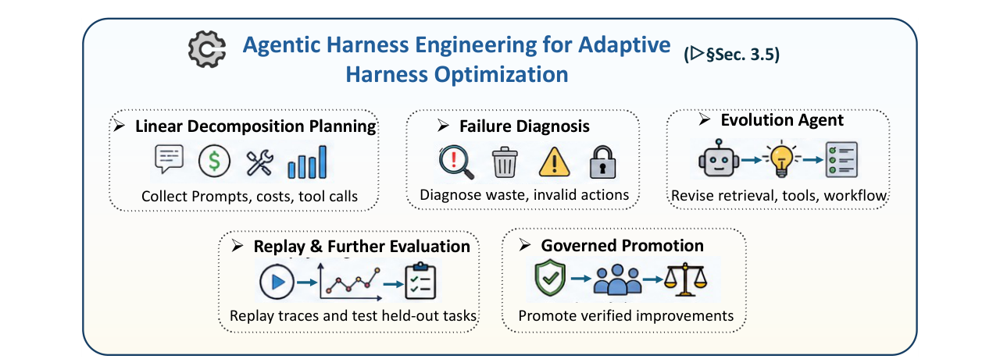

รูปที่ 9: ภาพรวมของวิศวกรรม harness สำหรับการเพิ่มประสิทธิภาพ harness แบบปรับเปลี่ยนได้

### 3.5 วิศวกรรมโครงสร้างควบคุมโดยเอเจนต์สำหรับการปรับปรุงโครงสร้างควบคุมแบบปรับตัว (Agentic Harness Engineering for Adaptive Harness Optimization)

วิศวกรรมโครงสร้างควบคุมโดยเอเจนต์ (Agentic Harness Engineering หรือ AHE) คือชื่อเรียกของปัญหาการออกแบบในระดับโครงสร้างควบคุม (Harness-level Design Problem): ซึ่งก็คือวิธีในการวัดผลและปรับปรุงแก้ไขโครงสร้างพื้นฐานซอฟต์แวร์ (Software Substrate) ที่เปลี่ยนแบบจำลองภาษา (Language Model) ให้กลายเป็นเอเจนต์สำหรับการเขียนโค้ด (Coding Agent) ในขณะที่วิศวกรรมพรอมต์ (Prompt Engineering) มุ่งเปลี่ยนคำสั่ง และวิศวกรรมบริบท (Context Engineering) มุ่งเปลี่ยนหลักฐานข้อมูลที่จะนำเสนอต่อแบบจำลอง แต่ AHE จะปฏิบัติกับสภาพแวดล้อมการทำงาน (Operating Environment) เองในฐานะวัตถุแห่งการวิเคราะห์ ซึ่งรวมถึง โครงสร้างข้อมูลเครื่องมือ (Tool Schemas), สิ่งประดิษฐ์จากการวางแผน (Planning Artifacts), นโยบายหน่วยความจำ (Memory Policies), กลยุทธ์การดึงข้อมูล (Retrieval Strategies), การกำหนดค่าแซนด์บ็อกซ์ (Sandbox Configuration), เซ็นเซอร์ตรวจสอบความถูกต้อง (Verification Sensors), ระดับสิทธิ์การเข้าถึง (Permission Tiers), กฎการกำหนดเส้นทาง (Routing Rules), เวิร์กโฟลว์แบบหลายเอเจนต์ (Multi-agent Workflows) และด่านตรวจทบทวนโดยมนุษย์ (Human-review Gates)

มุมมองนี้มีประโยชน์เนื่องจากความล้มเหลวจำนวนมากที่สังเกตได้ในเอเจนต์รหัส (Code Agents) นั้น เกิดขึ้นจากบริบทคลังเก็บรหัสที่ขาดหายไป (Missing Repository Context), อินเทอร์เฟซเครื่องมือที่เปราะบาง (Brittle Tool Interfaces), ตัวตรวจสอบที่อ่อนแอ (Weak Validators), ต้นทุนโทเค็นที่สูงเกินไป (Excessive Token Cost), นโยบายการลองใหม่อีกครั้งที่ไม่มีประสิทธิภาพ (Poor Retry Policies) หรือขอบเขตสิทธิ์การเข้าถึงที่ไม่สอดคล้องกัน (Mismatched Permission Boundaries) แทนที่จะเกิดจากการสร้างคำของแบบจำลอง (Model Generation) เอง

งานวิจัยที่มีอยู่สามารถจำแนกออกเป็น 3 แนวทางที่ส่งเสริมกันและกัน ได้แก่:

* **AutoHarness:** ศึกษาการสังเคราะห์โครงสร้างควบคุมรหัสโดยอัตโนมัติ (Automatic Synthesis of Code Harnesses)

* **Meta-Harness:** กำหนดให้การออกแบบโครงสร้างควบคุมเป็นปัญหาการปรับปรุงให้เหมาะสมที่สุด (Optimization Problem) บนโครงสร้างพื้นฐานที่เผชิญหน้ากับแบบจำลอง (Model-facing Infrastructure)

* **AHE ที่ขับเคลื่อนด้วยความสามารถในการสังเกตการณ์ (Observability-driven AHE):** เน้นย้ำการวินิจฉัยที่อุดมไปด้วยข้อมูลการวัดระยะไกล (Telemetry-rich Diagnosis) ว่าลูปของเอเจนต์ล้มเหลว ณ จุดใด และองค์ประกอบโครงสร้างควบคุมใดที่ควรเปลี่ยน

งานวิจัยที่เกี่ยวข้องเกี่ยวกับวิวัฒนาการพรอมต์แบบสะท้อนคิด (Reflective Prompt Evolution), เวิร์กโฟลว์ที่วิวัฒนาการได้ด้วยตนเอง (Self-evolving Workflows) และเอเจนต์วิศวกรรมซอฟต์แวร์แบบสด (Live Software-engineering Agents) ต่างสนับสนุนมุมมองเชิงระบบแบบเดียวกันนี้ว่า: การเปลี่ยนโครงนั่งร้าน (Scaffold) รอบแบบจำลองสามารถเปลี่ยนพฤติกรรมของเอเจนต์ได้โดยไม่ต้องฝึกฝนแบบจำลองฐานใหม่ (Base Model) คู่มือวิศวกรรมจาก OpenAI, Anthropic และ LangChain ต่างก็ลู่เข้าสู่บทเรียนเชิงปฏิบัติแบบเดียวกันว่า: เอเจนต์ที่น่าเชื่อถือจำเป็นต้องมีลูปโครงสร้างควบคุมที่ชัดเจน (Explicit Harness Loops), ข้อสัญญาเครื่องมือ (Tool Contracts), การเล่นซ้ำร่องรอยการทำงาน (Trace Replay), ชุดการประเมินผล (Evaluation Suites), งบประมาณบริบท (Context Budgets) และขอบเขตการประมวลผลที่ควบคุมได้ (Controlled Execution Boundaries)

### 3.5.1 ข้อมูลการวัดระยะไกลเชิงลึกในฐานะโครงสร้างพื้นฐานเพื่อการปรับปรุงให้เหมาะสมที่สุด (Deep Telemetry as the Optimization Substrate)

โครงสร้างพื้นฐานที่เป็นแกนกลางของ AHE คือข้อมูลการวัดระยะไกลเชิงลึก (Deep Telemetry): ซึ่งก็คือร่องรอยการทำงานที่มีโครงสร้าง (Structured Traces) ซึ่งเชื่อมต่อการตัดสินใจของแบบจำลอง (Model Decisions), การดำเนินการของโครงสร้างควบคุม (Harness Actions), สถานะของสภาพแวดล้อม (Environment States) และผลลัพธ์ (Outcomes) เข้าด้วยกัน ปูมบันทึกแบบตื้น (Shallow Log) อาจบันทึกเพียงแค่คำตอบสุดท้ายหรือผลลัพธ์ผ่าน/ไม่ผ่าน (Pass/Fail Result) เท่านั้น แต่ข้อมูลการวัดระยะไกลเชิงลึก (Deep Telemetry) จะบันทึกกระบวนการตัดสินใจอย่างละเอียดเจาะลึกยิ่งกว่ามาก ได้แก่ พรอมต์และบริบทที่ดึงข้อมูลมา (Prompts and Retrieved Context), ปริมาณการใช้โทเค็นและต้นทุน (Token Usage and Cost), ความหน่วงของแบบจำลอง/เครื่องมือ (Model/Tool Latency), อาร์กิวเมนต์ของเครื่องมือ (Tool Arguments), คำขอสิทธิ์การเข้าถึง (Permission Requests), ไฟล์ที่ถูกแก้ไข (Edited Files), ภาพสแนปชอตของแซนด์บ็อกซ์ (Sandbox Snapshots), ผลลัพธ์ของคำสั่ง (Command Outputs), ผลการทดสอบ (Test Results), ร่องรอยการเรียกซ้อนของฟังก์ชัน (Stack Traces), การแจ้งเตือนจากเครื่องมือตรวจสอบโค้ด (Lint Warnings), การตัดสินใจเลือกสายงาน (Branch Decisions), ทางเลือกที่ถูกปฏิเสธ (Rejected Alternatives), การแทรกแซงโดยมนุษย์ (Human Interventions) และผลลัพธ์สุดท้าย...

## หน้า 33

...ผลลัพธ์ของภารกิจ (Task Outcome) ในบริบทที่เน้นรหัสเป็นศูนย์กลาง (Code-centric Settings) ร่องรอยการทำงานเหล่านี้จะมีคุณค่าเป็นอย่างยิ่ง เนื่องจากระบบประมวลผลโปรแกรมได้เปิดเผยการเปลี่ยนผ่านสถานะ (State Transitions) ผ่านทางปูมบันทึก (Logs), รหัสเปรียบเทียบความแตกต่าง (Diffs) และพฤติกรรมระหว่างรันไทม์ (Runtime Behavior) อยู่แล้ว ในระบบที่ใช้งานจริง (Production Systems) บทบาทนี้จะได้รับการสนับสนุนมากขึ้นจากสแต็กความสามารถในการสังเกตการณ์และความน่าเชื่อถือ (Observability and Reliability Stacks) ซึ่งทำหน้าที่บันทึกร่องรอยการทำงาน (Traces), ตัวชี้วัด (Metrics), พรอมต์ (Prompts), ปริมาณการรับส่งข้อมูลของแบบจำลอง (Model Traffic), ผลการประเมิน (Eval Results) และสัญญาณด้านต้นทุน (Cost Signals) ด้วยเหตุนี้ ระบบการประมวลผล การสังเกตการณ์ และการกำกับดูแล จึงทำหน้าที่เป็นช่องทางข้อมูลการวัดระยะไกลที่ส่งเสริมซึ่งกันและกัน (Complementary Telemetry Channels): โดยตัวประเมินผลจะเปิดเผยความถดถอยในระดับภารกิจ (Task-level Regressions), สแต็กการติดตามจะเปิดเผยสาเหตุในระดับเส้นทางการทำงาน (Trajectory-level Causes) และเกตเวย์เชิงนโยบายจะเปิดเผยการละเมิดขอบเขตความปลอดภัย (Boundary Violations) ซึ่งเอเจนต์วิวัฒนาการ (Evolution Agent) สามารถนำข้อมูลเหล่านี้ไปเปลี่ยนเป็นการปรับปรุงแก้ไขโครงสร้างควบคุมได้ 

ข้อมูลการวัดระยะไกลช่วยเปลี่ยนการปรับปรุงแก้ไขโครงสร้างควบคุมจากการดีบั๊กแบบอิงตามเรื่องเล่าหรือกรณีเฉพาะ (Anecdotal Debugging) ให้กลายเป็นการวินิจฉัยเชิงเปรียบเทียบ (Comparative Diagnosis):

* 
**ร่องรอยการทำงานด้านต้นทุนโทเค็น (Token-cost Traces):** ช่วยเปิดเผยเมื่อขั้นตอนการดึงข้อมูลหรือการสะท้อนคิดใช้สารสนเทศหรือต้นทุนเกินงบประมาณ โดยไม่ได้ทำให้ผลลัพธ์การตรวจสอบความถูกต้องดีขึ้น 

* 
**ร่องรอยการทำงานแบบต้นไม้ตัดสินใจ (Decision-tree Traces):** แสดงให้เห็นจุดที่เอเจนต์เลือกใช้เครื่องมือที่ไม่ก่อให้เกิดประโยชน์ซ้ำ ๆ, แก้ไขไฟล์ที่ไม่เกี่ยวข้อง หรือวนลูปอยู่ระหว่างกลยุทธ์ที่ล้มเหลว 

* 
**ร่องรอยการทำงานของความล้มเหลว (Failure Traces):** ช่วยจัดกลุ่มรูปแบบที่เกิดขึ้นซ้ำ ๆ เช่น ซอฟต์แวร์ที่ต้องพึ่งพาขาดหายไป (Missing Dependencies), การทดสอบที่อ่อนแอ (Weak Tests), การจินตนาการ API ขึ้นมาเอง (Hallucinated APIs), แซนด์บ็อกซ์ที่ไม่เสถียร (Flaky Sandboxes), การเรียกใช้เครื่องมือที่ให้สิทธิ์มากเกินไป (Over-permissive Tool Calls) หรือการยุติการทำงานก่อนเวลาอันควร (Premature Termination) 

เนื่องจากสัญญาณเหล่านี้เชื่อมโยงกับสิ่งประดิษฐ์ที่เป็นรูปธรรม (Concrete Artifacts) จึงสามารถนำมาเล่นซ้ำ (Replayed) และเปรียบเทียบข้ามเวอร์ชันของโครงสร้างควบคุมได้ ทำให้สามารถประเมินได้ว่าการเปลี่ยนแปลงนั้นช่วยเพิ่มความน่าเชื่อถือได้จริงหรือไม่ แทนที่จะเป็นการเปลี่ยนพฤติกรรมเพียงแค่เปลือกนอก (Surface Behavior) 

### 3.5.2 เอเจนต์วิวัฒนาการ (The Evolution Agent)

เอเจนต์วิวัฒนาการ (Evolution Agent) คือเอเจนต์ในระดับเมตา (Meta-level Agent) ที่ใช้ข้อมูลการวัดระยะไกลเชิงลึก (Deep Telemetry) เพื่อเสนอ, ประเมินผล และส่งเสริมการปรับปรุงแก้ไขส่วนประกอบของโครงสร้างควบคุม สิ่งที่ต่างจากเอเจนต์ระดับภารกิจ (Task Agent) ซึ่งทำหน้าที่แก้ไขคลังเก็บรหัสเป้าหมาย (Target Repository) คือ เอเจนต์วิวัฒนาการจะทำหน้าที่แก้ไขเงื่อนไขการทำงาน (Operating Conditions) ซึ่งเอเจนต์ระดับภารกิจรุ่นต่อ ๆ ไปจะต้องใช้ทำงาน ข้อมูลนำเข้าของมันคือคลังข้อมูลของเส้นทางการทำงาน (Corpus of Trajectories) ในขณะที่ผลลัพธ์อาจเป็นเทมเพลตพรอมต์ที่ปรับปรุงใหม่ (Revised Prompt Template), นโยบายการดึงข้อมูล (Retrieval Policy), โครงสร้างข้อมูลเครื่องมือที่มีความแม่นยำยิ่งขึ้น (Precise Tool Schema), ตัวตรวจสอบที่เพิ่มเข้ามา (Added Validator), กฎการกำหนดสิทธิ์ที่เปลี่ยนแปลงไป (Changed Permission Rule), การปรับเปลี่ยนสถาปัตยกรรมเวิร์กโฟลว์ (Workflow-topology Adjustment) หรือการทดสอบเพื่อป้องกันความถดถอยชุดใหม่ (New Regression Test) 

บทบาทนี้มีความเกี่ยวข้องอย่างใกล้ชิดกับระบบหลายเอเจนต์ที่วิวัฒนาการได้ด้วยตนเอง (Self-evolving Multi-agent Systems) ซึ่งเอเจนต์เฉพาะทางจะเข้ามาตรวจสอบปูมบันทึกการประมวลผล, ระบุว่าความล้มเหลวนั้นมาจากองค์ประกอบใดของเวิร์กโฟลว์ และอัปเดตโครงสร้างการทำงานร่วมกัน ในบริบทของโครงสร้างควบคุมนี้ แนวคิดเดียวกันจะได้รับการขยายขอบเขตจากสถาปัตยกรรมหลายเอเจนต์ไปสู่พื้นผิวการควบคุมของระบบรันไทม์ของเอเจนต์ (Control Surface of the Agent Runtime) 

โดยทั่วไป ลูปของเอเจนต์วิวัฒนาการ (Evolution-Agent Loop) จะประกอบด้วย 5 ขั้นตอน ได้แก่:

1. 
**สังเกตการณ์เส้นทางการทำงาน (Observe Trajectories):** รวบรวมข้อมูลการวัดระยะไกลจากการประมวลผลของลูป PEV 

2. 
**วินิจฉัยรูปแบบความล้มเหลว (Diagnose Failure Modes):** จำแนกต้นทุน, ความหน่วง, การดำเนินการที่ไม่ถูกต้อง, การทดสอบที่ล้มเหลว หรือการปฏิเสธสิทธิ์การเข้าถึง ว่าเป็นผลมาจากส่วนประกอบใดของโครงสร้างควบคุม 

3. 
**เสนอทางเลือกการปรับปรุงแก้ไข (Propose Candidate Revisions):** เช่น การเขียนคำอธิบายเครื่องมือใหม่, การเปลี่ยนกฎการจัดกลุ่มบริบท (Context Packing Rules), การเพิ่มเครื่องมือตรวจสอบโค้ด (Linter), การแก้ไขขีดจำกัดการลองใหม่ (Retry Limits) หรือการแทรกด่านตรวจ HITL ก่อนคำสั่งที่มีความเสี่ยง 

4. 
**ประเมินผลโครงสร้างควบคุมที่ปรับปรุงแล้ว (Evaluate the Revised Harness):** ทดสอบกับภารกิจที่แยกไว้เฉพาะ (Held-out Tasks) หรือร่องรอยการทำงานที่นำมาเล่นซ้ำ โดยใช้เซ็นเซอร์แบบดีเทอร์มินิสติกและชุดทดสอบเพื่อป้องกันความถดถอย 

5. 
**ส่งเสริมการใช้งาน (Promote):** ส่งเสริมเฉพาะการเปลี่ยนแปลงที่ช่วยพัฒนาความน่าเชื่อถือ, ต้นทุน หรือความปลอดภัย โดยไม่ทำให้กรณีที่เคยแก้ไขได้แล้วเกิดความถดถอย (Regressed) 

กระบวนการนี้ช่วยให้ AHE อยู่ภายใต้ระเบียบวินัยทางวิศวกรรมเช่นเดียวกับลูป PEV: กล่าวคือ การเปลี่ยนแปลงที่ถูกเสนอจะต้องได้รับการประมวลผล, ตรวจสอบความถูกต้อง และทำให้สามารถตรวจสอบย้อนกลับ (Auditable) ได้ก่อนที่จะนำไปใช้งานจริง 

### 3.5.3 การกลายพันธุ์ของโครงสร้างควบคุมภายใต้การกำกับดูแล (Governed Harness Mutation)

ไม่ควรสับสนระหว่าง AHE กับการปรับเปลี่ยนตัวเองอย่างไม่มีขอบเขต (Unconstrained Self-modification) เนื่องจากเอเจนต์วิวัฒนาการทำหน้าที่เปลี่ยนโครงสร้างควบคุมที่จะไปควบคุมเอเจนต์ระดับภารกิจตัวอื่น ๆ ในภายหลัง การดำเนินการของมันจึงจำเป็นต้องมีการกำกับดูแลที่เข้มงวดกว่าการซ่อมแซมโค้ดทั่วไป การเปลี่ยนแปลงโครงสร้างควบคุมที่ถูกเสนอควรได้รับการประเมินผลภายในแซนด์บ็อกซ์, เปรียบเทียบกับชุดทดสอบป้องกันความถดถอยที่กำหนดไว้คงที่ และบันทึกพร้อมเหตุผลที่สามารถตรวจสอบย้อนกลับได้ 

การเปลี่ยนแปลงใด ๆ ที่ส่งผลต่อขอบเขตสิทธิ์การเข้าถึง (Permission Boundaries), การเข้าถึงเครือข่าย, การจัดการข้อมูลประจำตัวเพื่อยืนยันตัวตน, พฤติกรรมการปรับใช้งาน หรือข้อกำหนดในการทบทวนโดยมนุษย์ จำเป็นต้องได้รับการอนุมัติจากด่านตรวจ HITL ก่อนที่จะเปิดใช้งานจริง ในแง่นี้ ตัวเอเจนต์วิวัฒนาการเองก็ต้องอยู่ภายใต้ลูป PEV เช่นกัน: โดยมันจะต้องวางแผนการกลายพันธุ์ของโครงสร้างควบคุม (Harness Mutation), ประมวลผลมันในสภาพแวดล้อมการประเมินผลที่แยกส่วน, ตรวจสอบความถูกต้องของผลลัพธ์ผ่านข้อมูลการวัดระยะไกลและการทดสอบป้องกันความถดถอย และส่งต่อการเปลี่ยนแปลงที่มีความเสี่ยงสูงไปให้มนุษย์ตัดสินใจ 

**บทอภิปราย (Discussion):** วิศวกรรมโครงสร้างควบคุมโดยเอเจนต์ (Agentic Harness Engineering) ได้ขยายมุมมองของ "รหัสในฐานะโครงสร้างควบคุม" (Code-as-harness) จากเดิมที่เน้นเพียงแค่การควบคุมการทำงานของเอเจนต์ ไปสู่การวิเคราะห์...

## หน้า 34

Table 8: วิธีการ agent สำหรับ Agentic Harness วิศวกรรมที่มีเป้าหมายการแก้ไขที่ขับเคลื่อนด้วยการวัดและส่งข้อมูลทางไกล

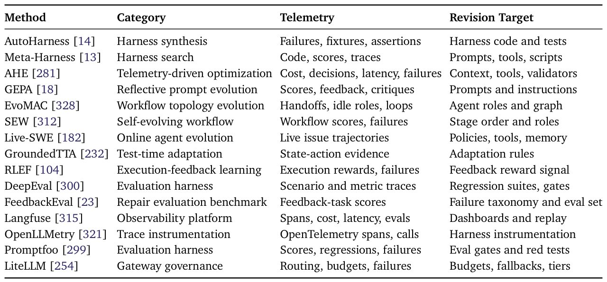

ตารางที่ 8: วิธีการที่เป็นตัวแทนสำหรับวิศวกรรมโครงสร้างควบคุมโดยเอเจนต์ พร้อมเป้าหมายการปรับปรุงแก้ไขที่ขับเคลื่อนด้วยข้อมูลการวัดระยะไกล (Representative methods for Agentic Harness Engineering with telemetry-driven revision targets) 

4. การขยายขีดความสามารถของโครงสร้างควบคุม: การประสานงานหลายเอเจนต์เหนือรหัส (Scaling the Harness: Multi-Agent Orchestration over Code) 

เมื่อระบบปัญญาประดิษฐ์ (AI Systems) ต้องเข้ามาแก้ไขปัญหาที่มีความซับซ้อนเพิ่มมากขึ้นเรื่อย ๆ ตั้งแต่การสังเคราะห์โค้ดในระดับฟังก์ชัน (Function-level Code Synthesis) ไปจนถึงวิศวกรรมระบบในระดับคลังเก็บรหัส (Repository-level System Engineering) ข้อจำกัดพื้นฐานของการใช้เอเจนต์เดี่ยว (Single-agent) จึงเริ่มปรากฏชัดเจนขึ้น ได้แก่:

1. 
**ข้อจำกัดของหน้าต่างบริบท (Context Window Constraints):** ซึ่งขัดขวางไม่ให้เอเจนต์เดี่ยวสามารถเก็บรหัสต้นฉบับทั้งหมด (Entire Codebase), ประวัติการโต้ตอบที่ยาวนาน และร่องรอยการประมวลผล (Execution Trace) ไว้ในหน่วยความจำปฏิบัติงาน (Working Memory) พร้อม ๆ กันได้ 

2. 
**ข้อกำหนดด้านความเชี่ยวชาญเฉพาะทาง (Specialization Requirements):** ทำให้ไม่มีประสิทธิภาพหากจะใช้เอเจนต์ที่เป็นผู้รู้รอบแบบทั่วไป (Generalist Agent) เพียงตัวเดียวในการทำหน้าที่วางแผน, สังเคราะห์, ทดสอบ, ทบทวน และดีบั๊กไปพร้อมกัน 

3. 
**การขาดช่องทางการประสานงานและการตรวจสอบที่เป็นอิสระ (Absence of Independent Coordination and Verification Channels):** ทำให้เอเจนต์ไม่สามารถตรวจจับและแก้ไขข้อผิดพลาดของตนเองได้อย่างน่าเชื่อถือในระหว่างการประมวลผลที่มีระยะเวลาดำเนินงานยาวนาน (Long-horizon Execution) 

ระบบหลายเอเจนต์ (Multi-Agent Systems หรือ MAS) ได้นำหลักการอันทรงพลังเข้ามาแก้ปัญหานี้: นั่นคือ เมื่อความรับผิดชอบเหล่านี้ถูกกระจายออกไปยังบทบาทเฉพาะทางต่าง ๆ ตัวโครงสร้างควบคุมเอเจนต์ (Agent Harness) เองก็จะมีความเป็นโมดูล (Modular), สามารถเข้าไปตรวจสอบได้ง่ายขึ้น (Inspectable) และปรับตัวได้ดียิ่งขึ้น (Adaptable) ระบบในยุคแรก ๆ เช่น ChatDev [330], MetaGPT [55] และ AgentCoder [50] ได้แสดงให้เห็นถึงการเปลี่ยนแปลงนี้ โดยการแบ่งแยกความรับผิดชอบในการพัฒนาซอฟต์แวร์ออกจากกันในหมู่เอเจนต์ที่มีบทบาทต่างกัน เช่น สถาปนิก (Architect), นักเขียนโปรแกรม (Programmer), นักทดสอบ (Tester), ผู้ทบทวน (Reviewer) และผู้ประมวลผล (Executor) 

เอเจนต์ที่เชี่ยวชาญเฉพาะตามบทบาทเหล่านี้ จะได้รับการประสานงานผ่านโปรโตคอลการสื่อสารที่มีโครงสร้าง (Structured Communication Protocols) และการใช้สิ่งประดิษฐ์รหัสร่วมกัน (Shared Code Artifacts) ซึ่งช่วยเปลี่ยนรหัสจากการเป็นเพียงแค่เป้าหมายผลลัพธ์ปลายทาง (Output Target) ให้กลายเป็นโครงสร้างพื้นฐานร่วมกันที่เน้นรหัสเป็นศูนย์กลาง (Shared Code-centric Substrate) ซึ่งเป็นช่องทางที่ทำให้โครงสร้างควบคุมในภาพรวมสามารถใช้วางแผน, ดำเนินการ, ตรวจสอบความถูกต้อง และปรับปรุงตนเองได้ 

ในส่วนนี้ เราจะสำรวจทิศทางที่กำลังเติบโตอย่างรวดเร็วอย่างเป็นระบบ ในเรื่องของการนำระบบหลายเอเจนต์ (MAS) มาใช้เพื่อขยายขีดความสามารถของโครงสร้างควบคุมการเขียนโค้ด และเราจะนำเสนอมุมมองใหม่ในการสร้างโครงสร้างพื้นฐานโครงสร้างควบคุมร่วมกันที่เน้นรหัสเป็นศูนย์กลางสำหรับเอเจนต์ปัญญาประดิษฐ์

## หน้า 35

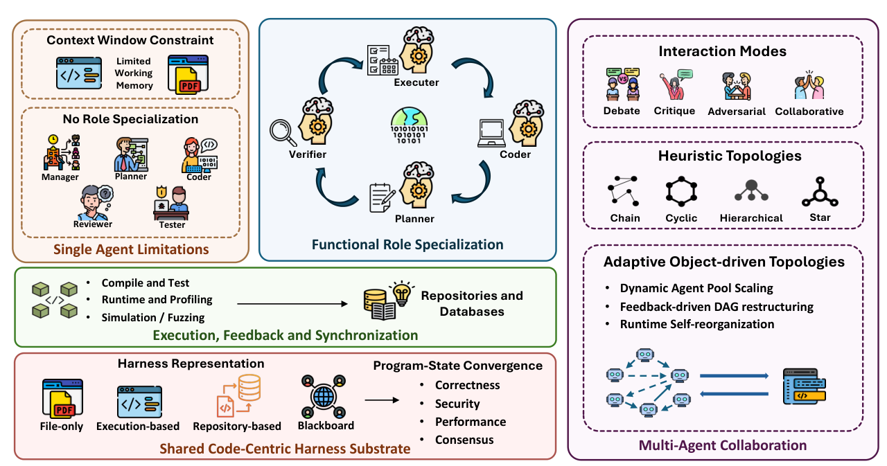

รูปที่ 10: ภาพรวมของการขยาย agent harness ถึง multi-agent orchestration เหนือ code รูปร่าง
แสดงให้เห็นว่า agent เฉพาะทาง แบ่งปันซับสเตรต code เป็นศูนย์กลาง ข้อเสนอแนะในการดำเนินการ และการปรับตัวอย่างไร
โทโพโลยีการทำงานร่วมกันระบุข้อจำกัด single-agent ใน context ความเชี่ยวชาญพิเศษ และการแก้ไขตนเอง

แผนภาพนี้แสดงให้เห็นว่าเอเจนต์ที่เชี่ยวชาญเฉพาะตามบทบาท (Role-specialized Agents), โครงสร้างพื้นฐานร่วมกันที่เน้นรหัสเป็นศูนย์กลาง (Shared Code-centric Substrates), ข้อมูลป้อนกลับจากการประมวลผล (Execution Feedback) และสถาปัตยกรรมการทำงานร่วมกันแบบปรับตัว (Adaptive Collaboration Topologies) สามารถเข้ามาแก้ไขข้อจำกัดของเอเจนต์เดี่ยวในด้านบริบท, ความเชี่ยวชาญเฉพาะทาง และการแก้ไขข้อผิดพลาดด้วยตนเองได้อย่างไร 

* 
**ข้อจำกัดของเอเจนต์เดี่ยว (Single Agent Limitations):** 

* 
**ข้อจำกัดของหน้าต่างบริบท (Context Window Constraint):** หน่วยความจำปฏิบัติงานมีจำกัด (Limited Working Memory) 

* 
**ไม่มีการแบ่งความเชี่ยวชาญเฉพาะตามบทบาท (No Role Specialization):** ตัวเดียวต้องทำหน้าที่เป็นทั้งผู้จัดการ (Manager), ผู้ตรวจสอบ (Reviewer), นักทดสอบ (Tester), ผู้วางแผน (Planner) และนักเขียนโค้ด (Coder) 

* 
**การแบ่งความเชี่ยวชาญเฉพาะตามบทบาทหน้าที่ (Functional Role Specialization):** กระจายการทำงานเป็นวงจรระหว่าง ผู้วางแผน (Planner) $\rightarrow$ นักเขียนโค้ด (Coder) $\rightarrow$ ผู้ประมวลผล (Executer) $\rightarrow$ ผู้ตรวจสอบความถูกต้อง (Verifier) 

* 
**การประมวลผล ข้อมูลป้อนกลับ และการซิงโครไนซ์ (Execution, Feedback and Synchronization):** 

* การคอมไพล์และการทดสอบ (Compile and Test) 

* รันไทม์และการวิเคราะห์ประสิทธิภาพ (Runtime and Profiling) 

* การจำลอง / การสุ่มป้อนข้อมูลเพื่อหาช่องโหว่ (Simulation / Fuzzing) 

* ส่งต่อข้อมูลไปยัง คลังเก็บรหัสและฐานข้อมูล (Repositories and Databases) 

* 
**โครงสร้างพื้นฐานร่วมกันที่เน้นรหัสเป็นศูนย์กลาง (Shared Code-Centric Harness Substrate):** 

* 
**รูปแบบของโครงสร้างควบคุม (Harness Representation):** มีทั้งแบบเน้นไฟล์เท่านั้น (File-only), อิงตามการประมวลผล (Execution-based), อิงตามคลังเก็บรหัส (Repository-based) และแบบกระดานดำ/กระดานข้อมูลร่วมกัน (Blackboard) 

* 
**การลู่เข้าสู่สถานะโปรแกรมที่ต้องการ (Program-State Convergence):** เพื่อความถูกต้อง (Correctness), ความปลอดภัย (Security), ประสิทธิภาพ (Performance) และความเห็นพ้องต้องกัน (Consensus) 

* 
**การทำงานร่วมกันของหลายเอเจนต์ (Multi-Agent Collaboration):** 

* 
**โหมดการโต้ตอบ (Interaction Modes):** การโต้วาที (Debate), การวิพากษ์ (Critique), การเผชิญหน้า/ตรวจสอบช่องโหว่ (Adversarial), การร่วมมือกัน (Collaborative) 

* 
**สถาปัตยกรรมแบบฮิวริสติก (Heuristic Topologies):** แบบเส้นตรง (Chain), แบบวงจร (Cyclic), แบบลำดับขั้น (Hierarchical), แบบดาว (Star) 

* 
**สถาปัตยกรรมแบบปรับตัวตามวัตถุประสงค์ (Adaptive Object-driven Topologies):** การขยายขนาดกลุ่มเอเจนต์แบบไดนามิก (Dynamic Agent Pool Scaling), การปรับโครงสร้างกราฟระบุทิศทางแบบไม่เป็นวงจรด้วยข้อมูลป้อนกลับ (Feedback-driven DAG restructuring), การจัดระเบียบตัวเองใหม่ในระหว่างรันไทม์ (Runtime Self-reorganization) 

---

### 4.1 การสนับสนุนการเขียนโค้ดที่ดียิ่งขึ้นผ่านการทำงานร่วมกันของหลายเอเจนต์ (Improved Coding Support through Multi-agent Collaboration)

คุณประโยชน์ที่เห็นได้ชัดเจนที่สุดของระบบหลายเอเจนต์ (Multi-agent Systems) คือการปรับปรุงประสิทธิภาพในการสนับสนุนการเขียนโค้ด โดยการแตกโครงสร้างควบคุม (Harness) ออกเป็นส่วนประกอบต่าง ๆ ที่มีความเชี่ยวชาญเฉพาะด้านแต่ทำงานประสานกัน แทนที่จะรวมกระบวนการวางแผน, การสังเคราะห์, การประมวลผล และการตรวจสอบความถูกต้องเอาไว้ภายในลูปเอเจนต์เดี่ยวเพียงตัวเดียว ระบบเหล่านี้จะกระจายความรับผิดชอบไปยังบทบาทหน้าที่ (Roles) ต่าง ๆ ที่โต้ตอบกันผ่านสิ่งประดิษฐ์รหัสร่วมกัน (Shared Code Artifacts) และสัญญาณข้อมูลป้อนกลับ (Feedback Signals) การแบ่งงานกันทำ (Division of Labor) ในลักษณะนี้ช่วยให้โครงสร้างควบคุมในภาพรวมมีความสามารถเพิ่มขึ้นในการจัดการกับภารกิจซอฟต์แวร์ที่มีความซับซ้อน ในขณะเดียวกันก็ช่วยให้เวิร์กโฟลว์ภายในระบบสามารถเข้าไปตรวจสอบและควบคุมได้ง่ายขึ้นด้วย 

ในเชิงปฏิบัติ การปรับปรุงนี้บรรลุผลสำเร็จผ่านมิติการออกแบบ 3 ด้านที่เชื่อมโยงกันอย่างใกล้ชิด ได้แก่: วิธีการแบ่งบทบาทหน้าที่ให้เชี่ยวชาญเฉพาะด้าน, วิธีการที่เอเจนต์โต้ตอบกันเหนือสิ่งประดิษฐ์โปรแกรมร่วมกัน และวิธีที่สถาปัตยกรรมเวิร์กโฟลว์ (Workflow Topology) จัดระเบียบการทำงานร่วมกันของเอเจนต์เหล่านั้น 

#### 4.1.1 การแบ่งความเชี่ยวชาญตามบทบาทหน้าที่และการวางแผนโดยมีมนุษย์นำทาง (Functional Role Specialization and Human-Guided Planning)

ในการพัฒนาซอฟต์แวร์ของมนุษย์ บุคลากรในบทบาทที่แตกต่างกันจะมีความเชี่ยวชาญในแง่มุมที่ต่างกันของกระบวนการพัฒนา ระบบหลายเอเจนต์ (MAS) จำนวนมากจึงถอดแบบการแบ่งงานกันทำนี้มาใช้ตามธรรมชาติ โดยการมอบหมายบทบาทหน้าที่ตามการทำงานที่ชัดเจนให้แก่เอเจนต์แต่ละตัว ความเชี่ยวชาญเฉพาะด้านนี้ช่วยให้เอเจนต์แต่ละตัวมุ่งความสนใจไปที่ส่วนย่อยเฉพาะของโครงสร้างควบคุมรหัสร่วมกัน โดยใช้ประโยชน์จากความสามารถและมุมมองอันเป็นเอกลักษณ์ของตนเพื่อขับเคลื่อนภารกิจในภาพรวมให้สำเร็จ ในส่วนนี้ จะเป็นการขยายความเกี่ยวกับบทบาทหน้าที่ตามการทำงานที่พบได้บ่อยที่สุดในวรรณกรรมงานวิจัยที่ได้ทำการสำรวจมา โดยพึงระลึกว่าระบบจำนวนมากมีการใช้งานหลายบทบาทร่วมกัน และขอบเขตระหว่างบทบาทเหล่านั้นสามารถมีความยืดหยุ่นหรือปรับเปลี่ยนได้ตามสถานการณ์ 

* 
**เอเจนต์สำหรับการสังเคราะห์โปรแกรม (Program Synthesis Agents):** มีหน้าที่รับผิดชอบในการสร้าง (Generating) หรือการปรับแปลงรหัสโค้ด (Transforming Code) เอเจนต์เหล่านี้จะบริโภคหรือรับข้อมูลข้อกำหนด (Specifications), แผนงาน (Plans) หรือสัญญาณข้อมูลป้อนกลับ (Feedback Signals) เข้าไป เพื่อผลิตหรือปรับปรุงแก้ไขสิ่งประดิษฐ์รหัส (Code Artifacts) ออกมา ซึ่งถือเป็นบทบาทที่เป็นพื้นฐานที่สุด...

=========================================

## หน้า 36

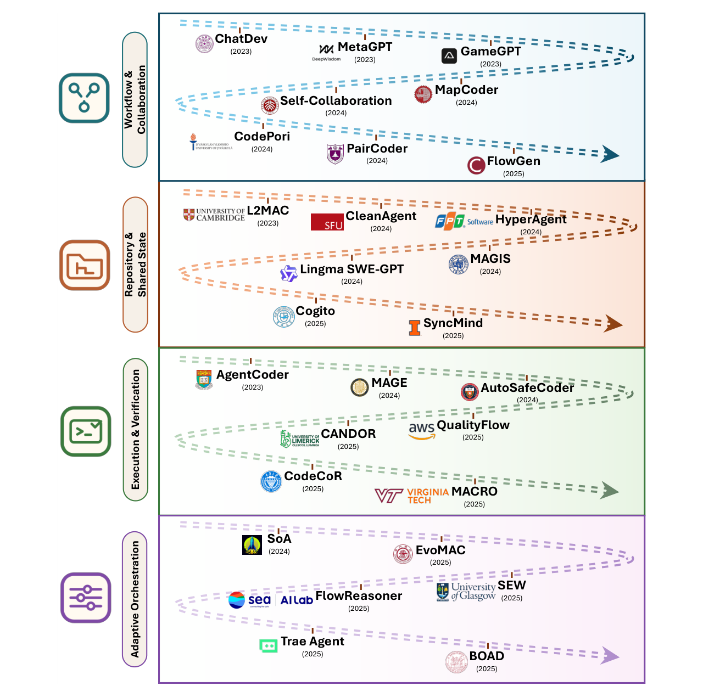

รูปที่ 11: แผนงานของการปรับขนาด code ชุด harness สำหรับ multi-agent orchestration จัดโดย workflow
การทำงานร่วมกัน สถานะ repository ที่แชร์ การดำเนินการ verification และการประสานงานแบบปรับตัว

...บทบาทที่พบได้บ่อยที่สุดในระบบต่าง ๆ ที่ได้ทำการสำรวจมา ตัวอย่างที่เป็นตัวแทน (Representative instances) ได้แก่ บทบาทนักเขียนโค้ด (Coder) ในระบบ Self-Collaboration, บทบาทนักเขียนโปรแกรม (Programmer) ในระบบ AgentCoder, บทบาทวิศวกร (Engineer) ในระบบ MetaGPT, บทบาทนักพัฒนา (Developer) ในระบบ ChatDev และเอเจนต์สร้างระดับการถ่ายโอนรีจิสเตอร์ (RTL Generation Agent) ในระบบ MAGE 

* 
**เอเจนต์เพื่อความเข้าใจโปรแกรม (Program Understanding Agents):** เอเจนต์เพื่อความเข้าใจโปรแกรมทำหน้าที่วิเคราะห์โค้ดที่มีอยู่เดิมหรือข้อกำหนดระบุคุณสมบัติ (Specifications) เพื่อสร้างตัวแทนข้อมูลในระดับที่สูงขึ้น (Higher-level Representations) เอเจนต์กลุ่มนี้จะเป็นเจ้าของกระบวนการตีความว่าโค้ดนั้นมีความหมายอย่างไร (What the code means) มากกว่าที่จะมุ่งเน้นว่าโค้ดนั้น...

## หน้า 37

Table 9: agent MAS การออกแบบการทำงานร่วมกันตามบทบาทเฉพาะทางและโครงสร้างปฏิสัมพันธ์

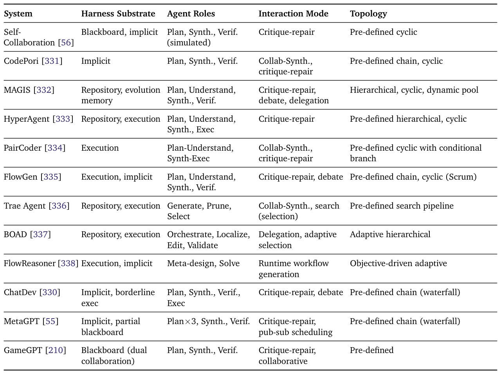

...สิ่งที่มันทำ หมวดหมู่นี้รวมถึง **ตัวดูแลคลังรหัส (Repository Custodian)** ในระบบ MAGIS [332], **ตัวนำทาง (Navigator)** ในระบบ HyperAgent [333], **RepoUer** ในระบบ Lingma SWE-GPT [340] และ **ตัวบันทึกคำอธิบายประเภทคอลัมน์ (Column-type Annotator)** ในระบบ CleanAgent [341]

### เอเจนต์ผู้ตรวจสอบความถูกต้อง (Verification Agents)

เอเจนต์ผู้ตรวจสอบความถูกต้อง (Verification agents) ทำหน้าที่ประเมินผลคุณภาพของโค้ด โดยทั่วไปแล้วจะดำเนินการผ่านการสร้างกรณีทดสอบหรือชุดทดสอบ (Test Cases), การรันการวิเคราะห์แบบสแตติก (Static Analysis) หรือการจำลองการรันโค้ด (Simulating Execution)

* **ผู้ออกแบบชุดทดสอบ (Test Designer)** ในระบบ AgentCoder [50] จะทำหน้าที่สร้างกรณีทดสอบขึ้นมาโดยแยกเป็นอิสระจากตัวโค้ด เพื่อหลีกเลี่ยงปัญหาการให้เหตุผลแบบวงกลม (Circular Reasoning) ซึ่งหลักการออกแบบนี้มีขึ้นเพื่อป้องกัน **ปัญหาโหมดล้มเหลวแบบยุบตัว (Mode-collapse Problem)** อันเป็นกรณีที่ชุดทดสอบที่มีความลำเอียงของเอเจนต์ตัวหนึ่ง ดันรันผ่านฉลุยบนโค้ดที่ยังมีบั๊กของตัวมันเอง

* **ตัวตรวจสอบคุณภาพชุดทดสอบ (Test Quality Checker)** ในระบบ QualityFlow [253] เข้ามาจัดการปัญหานี้ในระดับเมตา (Meta-level) โดยทำหน้าที่คัดกรองชุดทดสอบที่ถูกสังเคราะห์ขึ้นมา (Filtered Synthesized Tests) ก่อนที่พวกมันจะถูกนำไปใช้เป็นข้อมูลป้อนกลับ (Feedback)

* **ตัววิเคราะห์แบบสแตติก (Static Analyzer)** และ **เอเจนต์ทดสอบฟัซซิง (Fuzzing Agent)** ในระบบ AutoSafeCoder [52] มอบการตรวจสอบความถูกต้องที่มุ่งเน้นด้านความปลอดภัย (Security-oriented Verification) โดยอาศัยการวิเคราะห์ช่องโหว่ CWE แบบสแตติก (Static CWE Analysis) และการตรวจจับการพังทลายของระบบแบบไดนามิก (Dynamic Crash Detection) ตามลำดับ

* **คณะผู้พิจารณา (Panelists)** ในระบบ CANDOR [342] จะทำหน้าที่ตรวจสอบความถูกต้องของระบบคำนวณผลลัพธ์ (Oracle Correctness) แยกเป็นอิสระ โดยอ้างอิงเปรียบเทียบกับข้อกำหนดเฉพาะทางภาษาธรรมชาติ (Natural Language Specifications) แทนที่จะตรวจสอบกับตัวโค้ดโดยตรง ซึ่งเป็นความจงใจที่จะหลีกเลี่ยงการปนเปื้อนข้อมูล (Contamination) จากการนำโค้ดส่วนที่บกพร่องไปใช้งานจริง (Faulty Implementations)

## หน้า 38

### เอเจนต์ผู้รันโค้ด (Execution Agents)

เอเจนต์ผู้รันโค้ด (Execution agents) ทำหน้าที่เชื่อมต่อโดยตรงกับระบบรันไทม์ของโปรแกรม (Program Runtime) จุดที่สำคัญอย่างยิ่งคือ **ตัวรันชุดทดสอบ (Test Executor)** ในระบบ AgentCoder [50] นั้นเป็นสคริปต์ภาษา Python แบบดีเทอร์มินิสติก (Deterministic Python Script) ไม่ใช่โมเดลภาษา (ไม่ใช่ LLM) ซึ่งช่วยแยกส่วนกระบวนการให้เหตุผลออกจากกระบวนการรันโค้ดได้อย่างเด็ดขาด และช่วยเชื่อมโยงสัญญาณข้อมูลป้อนกลับ (Feedback Signal) เข้ากับพฤติกรรมที่เป็นวัตถุวิสัยของโปรแกรม ส่วนระบบ *ตัวรันโค้ด (Executor)* ใน HyperAgent [333] จะรันยูนิตเทสต์และอินทิเกรชันเทสต์ผ่านทางอินเตอร์เฟสเชลล์ Bash แบบโต้ตอบ (Interactive Bash Shell) และ *เอเจนต์ผู้ตัดสิน (Judge Agent)* ใน MAGE [339] จะเชื่อมต่อกับเครื่องมือจำลองสถานการณ์ RTL (RTL Simulation Tools) เพื่อสร้างภาพสแนปชอตสัญญาณรูปคลื่นในแต่ละขอบขาของสัญญาณนาฬิกา (Per-clock-edge Waveform Snapshots)

### เอเจนต์ผู้วางแผน (Planning Agents)

เอเจนต์ผู้วางแผน (Planning agents) ทำหน้าที่ย่อยส่วนงานพัฒนาซอฟต์แวร์ในภาพรวมออกเป็นงานย่อย ๆ (Subtasks) และมอบหมายงานเหล่านั้นให้แก่เอเจนต์ผู้สังเคราะห์โค้ด (Synthesis Agents) โดยบทบาท **สถาปนิก (Architect)** และ **ผู้จัดการโปรเจกต์ (Project Manager)** ใน MetaGPT [55], **ผู้จัดการ (Manager)** ใน MAGIS [332], **สครัมมาสเตอร์ (Scrum Master)** ใน FlowGen [335] และ **เอเจนต์แม่ (Mother Agents)** ใน SoA [212] ต่างก็ทำหน้าที่ย่อยส่วนงานด้วยกันทั้งสิ้น ทั้งนี้ เอเจนต์แม่ใน SoA [212] มีความน่าสนใจเป็นพิเศษ ตรงที่พวกมันจะทำการสร้าง **เอเจนต์ลูก (Child Agents)** ขึ้นมาแบบไดนามิกในตอนรันไทม์ โดยอิงตามระดับความซับซ้อนที่ประเมินได้ของแต่ละฟังก์ชันย่อย ซึ่งทำให้การวางแผนและการสร้างเอเจนต์เพื่อเริ่มต้นทำงาน (Agent Initialization) มีความพึ่งพาอาศัยซึ่งกันและกัน

ฟีเจอร์ที่โดดเด่นเฉพาะตัวของ EvoMAC [328] คือการนำเสนอ 2 บทบาทระดับเมตา (Meta-roles) แบบใหม่ ซึ่งไม่ปรากฏในระบบอื่น ๆ ที่ถูกสำรวจมาเลย ได้แก่:

* **เอเจนต์ความชันข้อมูล (Gradient Agent):** ทำหน้าที่เปิดอ่านล็อกการรันโค้ด (Execution Logs) เพื่อระบุตัวตนว่าเอเจนต์ตัวใดที่เป็นสาเหตุทำให้ระบบล้มเหลว

* **เอเจนต์ผู้อัปเดต (Updating Agent):** ทำหน้าที่แก้ไขปรับปรุงคำสั่งกระตุ้นของเอเจนต์ (Agent Prompts) และปรับโครงสร้างกราฟเวิร์กโฟลว์แบบ DAG (Workflow DAG) ให้สอดคล้องกัน

บทบาทหน้าที่เหล่านี้จะปฏิบัติงานในระดับของระบบหลายเอเจนต์ (MAS) เอง ไม่ใช่ในระดับของตัวโปรแกรม ซึ่งเปิดโอกาสให้ระบบสามารถปรับเปลี่ยนโครงสร้างของตัวมันเองได้ เพื่อตอบสนองต่อข้อมูลป้อนกลับจากการรันโค้ด

---

### 4.1.2. โหมดการปฏิสัมพันธ์ที่หลากหลายซึ่งเชื่อมโยงกับสถานะโปรแกรมที่ใช้ร่วมกัน (Diverse Interaction Modes Grounded in Shared Program State)

สิ่งที่แตกต่างจากระบบหลายเอเจนต์ทั่วไป (General MAS) ที่ปฏิสัมพันธ์ของเอเจนต์จะเน้นการส่งผ่านข้อความ (Message-passing) เป็นหลักก็คือ การปฏิสัมพันธ์ที่มีโค้ดเป็นศูนย์กลางจะมีลักษณะเด่นเป็น **การสื่อสารที่มีชิ้นงานเป็นตัวกลาง (Artifact-mediated Communication):** กล่าวคือ เอเจนต์ต่าง ๆ จะคอยสังเกตและแก้ไขชิ้นงานโค้ดที่ใช้ร่วมกัน (Shared Code Artifacts) และการปฏิสัมพันธ์ของพวกมันจะถูกเชื่อมโยงอยู่กับสถานะที่เป็นวัตถุวิสัย (Objective State) ซึ่งเปิดเผยออกมาโดยชิ้นงานเหล่านั้นรวมถึงผลลัพธ์การรันโค้ด

ช่องทางการประสานงานเหล่านี้ยังมีขอบเขตที่กว้างขวางกว่าเพียงแค่ซอร์สโค้ด (Source Code) เปล่า ๆ: โดยเอเจนต์สามารถสื่อสารกันผ่านระบบ APIs, ไฟล์ต่าง ๆ, ความเปลี่ยนแปลงของโค้ด (Diffs), ชุดทดสอบ (Tests), ล็อก (Logs), สกีมา (Schemas), กระดานดำข้อมูล (Blackboards) และสถานะเวิร์กโฟลว์ที่ระบุชัดเจน ในระบบส่วนใหญ่ ช่องทางเหล่านี้จะเป็นส่วนหนึ่งของตัวควบคุมที่มนุษย์ออกแบบขึ้นมา (Human-designed Harness) ในขณะที่ตัวเอเจนต์จะทำหน้าที่เขียนหรือแก้ไขชิ้นงานที่หมุนเวียนอยู่ภายในช่องทางเหล่านั้นแบบไดนามิก โดยเราสามารถจำแนกโหมดการปฏิสัมพันธ์ออกได้เป็น 4 โหมด ดังนี้:

#### 1) การสังเคราะห์แบบร่วมมือกัน (Collaborative Synthesis)

การสังเคราะห์แบบร่วมมือกัน (Collaborative synthesis) เกิดขึ้นเมื่อเอเจนต์ 2 ตัวร่วมกันสร้างส่วนประกอบของโปรแกรมขึ้นมา ซึ่งคล้ายคลึงกับการจับคู่เขียนโปรแกรมของมนุษย์ (Pair Programming) ตัวอย่างการจับคู่ระหว่าง **ตัวนำทางและตัวขับเคลื่อน (Navigator-Driver Pairing)** ในระบบ PairCoder [334] คือรูปแบบที่ตรงที่สุด: โดย *ตัวนำทาง (Navigator)* จะสร้างและคัดเลือกแผนการสำหรับโซลูชัน ในขณะที่ *ตัวขับเคลื่อน (Driver)* จะนำแผนนั้นไปลงมือปฏิบัติจริง โดยมีกระแสข้อมูลไหลเวียนแบบสองทิศทาง นอกจากนี้ ระบบ CodePori [331] ก็ได้ประยุกต์ใช้การสังเคราะห์แบบร่วมมือกันระหว่าง Dev_01 และ Dev_02 ซึ่งจะแลกเปลี่ยนร่างโค้ด (Code Drafts) สลับกันไปมาทั้งหมด 3 รอบ โหมดนี้ถือว่าค่อนข้างพบได้ยากในบรรดาระบบที่ถูกสำรวจ เนื่องจากระบบส่วนใหญ่จะชื่นชอบการส่งต่องานตามลำดับขั้น (Sequential Handoff) มากกว่าการมาร่วมกันสร้างในเวลาเดียวกันจริง ๆ

#### 2) การวิพากษ์และการซ่อมแซมโค้ด (Critique and Repair)

การวิพากษ์และการซ่อมแซมโค้ด (Critique and repair) ถือเป็นโหมดการปฏิสัมพันธ์ที่ครอบงำหรือพบได้บ่อยที่สุดในบรรดาวรรณกรรมที่ถูกสำรวจมา โดยเอเจนต์ผู้ตรวจสอบความถูกต้องหรือประเมินผล (Verification or Evaluation Agent) จะทำการตรวจสอบชิ้นงานโค้ดและสร้างข้อมูลป้อนกลับที่มีโครงสร้างชัดเจน (Structured Feedback) จากนั้นเอเจนต์ผู้สังเคราะห์โค้ด (Synthesis Agent) จะทำการแก้ไขชิ้นงานดังกล่าวเพื่อตอบสนองต่อคำวิพากษ์นั้น รูปแบบนี้ปรากฏอยู่บางเวอร์ชันในแทบทุกระบบที่ถูกสำรวจ โดยมีการตัดสินใจเชิงการออกแบบที่สำคัญคือ:

* **(ก) คำวิพากษ์นั้นเป็นแบบจำลองด้วย LLM หรือเชื่อมโยงกับการรันโค้ดจริง (LLM-simulated หรือ Execution-grounded):** ตัวอย่างเช่น Self-Collaboration [56] จะใช้ตัวทดสอบแบบจำลองด้วย LLM ในขณะที่ AgentCoder [50] จะใช้ตัวรันโค้ดภาษา Python จริง

* **(ข) ความสมบูรณ์ของสัญญาณข้อมูลป้อนกลับ (Richness of the Feedback Signal):** มีตั้งแต่สัญญาณแบบไบนารี ผ่าน/ล้มเหลว (Pass/fail) ในระบบ SEW [312] ไปจนถึงล็อกการรันโค้ดที่มีโครงสร้างชัดเจน ซึ่งแจกแจงข้อกำหนดที่ผ่านเกณฑ์, ข้อผิดพลาดของฟังก์ชัน และข้อกำหนดที่ไม่ผ่านเกณฑ์ในระบบ EvoMAC [328]

* **(ค) จำนวนรอบของการซ่อมแซมโค้ด (Repair Iterations):** จำนวนรอบที่อนุญาตให้เอเจนต์ดำเนินการแก้ไขก่อนที่จะเข้าสู่แผนสำรอง (Fallback)

## หน้า 39

#### 3) การตรวจสอบความถูกต้องแบบเผชิญหน้า (Adversarial Validation)

การตรวจสอบความถูกต้องแบบเผชิญหน้า (Adversarial validation) เป็นรูปแบบการตรวจสอบความถูกต้องที่มีความเชิงรุก (Active) มากยิ่งขึ้น โดยเอเจนต์ตัวหนึ่งจะพยายามทำลายโค้ดหรือทำให้โค้ดพังด้วยข้อมูลป้อนกลับแบบเผชิญหน้า (Adversarial Inputs) แทนที่จะเป็นการนั่งรีวิวโค้ดอยู่เฉย ๆ (Passive Review)

* ระบบ **AutoSafeCoder** [52] ได้ประยุกต์ใช้แนวคิดนี้ผ่านทาง *เอเจนต์ทดสอบฟัซซิง (Fuzzing Agent)* ซึ่งทำหน้าที่สร้างค่าสุ่มเริ่มต้นของข้อมูลเข้า (Input Seeds) ที่สามารถกระตุ้นให้ระบบเกิดการล่มหรือพัง (Crash-inducing Inputs) โดยอาศัยการกลายพันธุ์โค้ดแบบรับรู้ถึงประเภทข้อมูล (Type-aware Mutation) จากนั้นจึงรันโค้ดดังกล่าวเพื่อสร้างร่องรอยการพังทลายของระบบ (Crash Traces)

* โหมดนี้มีคุณลักษณะที่แตกต่างจากโหมดการวิพากษ์และการซ่อมแซมโค้ด (Critique-and-repair) อย่างสิ้นเชิง: เนื่องจากตัวฟัซเซอร์ (Fuzzer) จะไม่ได้เข้ามาอธิบายว่ามีสิ่งใดที่ผิดพลาด แต่จะแสดงให้เห็นถึงความล้มเหลวของการรันโค้ดที่เป็นรูปธรรม (Concrete Execution Failure) ซึ่งทำหน้าที่เป็นตัวอย่างค้าน (Counterexample) ที่เอเจนต์ผู้เขียนโค้ดจำเป็นต้องเข้าไปจัดการแก้ไข

* ในทำนองเดียวกัน ระบบ **MAGE** [339] ก็ใช้ความไม่สอดคล้องกันของการจำลองสถานการณ์ (Simulation Mismatch) มาเป็นสัญญาณแบบเผชิญหน้า: โดย *เอเจนต์ดีบั๊ก (Debug Agent)* จะได้รับหน้าต่างสัญญาณรูปคลื่น (Waveform Window) ที่เจาะจงรอบ ๆ จุดที่มีความล้มเหลวในขอบขาของสัญญาณนาฬิกาแรก ซึ่งเปิดโอกาสให้สามารถดำเนินการซ่อมแซมโค้ดได้อย่างตรงจุด

#### 4) การโต้เถียงเชิงให้เหตุผล (Reasoning Debate)

การโต้เถียงเชิงให้เหตุผล (Reasoning debate) เกี่ยวข้องกับการที่เอเจนต์ต่าง ๆ มาโต้แย้งกันในเรื่องความถูกต้องของการตัดสินใจ หรือการตีความข้อกำหนดเฉพาะของงาน (Specification) ก่อนที่จะบรรลุข้อตกลงร่วมกัน (Consensus)

* ระบบ **ChatDev** [330] ได้นำเสนอกลไกการขจัดอาการคิดไปเองผ่านการสื่อสาร (Communicative De-hallucination) ซึ่งเป็นกลไกที่เอเจนต์ผู้ช่วยจะทำการสลับบทบาทหน้าที่เพื่อถามคำถามสร้างความกระจ่าง (Clarifying Questions) ก่อนที่จะผูกมัดหรือส่งมอบคำตอบ

* การประชุมสปรินต์ของสครัม (Scrum Sprint Meetings) ในระบบ **FlowGen** [335] เปิดโอกาสให้เกิดการพูดคุยในระบบหลายเอเจนต์แบบไม่มีลำดับขั้นตอน (Disordered Multi-agent Discussion) รอบ ๆ บัฟเฟอร์บริบทที่ใช้ร่วมกัน (Shared Context Buffer) ก่อนที่บทบาท *สครัมมาสเตอร์ (Scrum Master)* จะทำหน้าที่สังเคราะห์การตัดสินใจขั้นสุดท้าย

* ระบบ **CANDOR** [342] ได้ประยุกต์ใช้กลไกการโต้เถียงที่มีโครงสร้างชัดเจนที่สุด: โดยจะมี *คณะผู้พิจารณาที่เป็นอิสระแยกขาดจากกัน 3 ตัว (Three Independent Panelists)* ทำหน้าที่ประเมินความถูกต้องของระบบคำนวณผลลัพธ์ (Oracle Correctness) จากนั้นจะมีบทบาท *ผู้คัดสรร (Curator)* ทำหน้าที่รวบรวมคำตัดสินของพวกเขาผ่านการลงคะแนนเสียงข้างมาก (Majority Vote)

* การประชุมเริ่มงาน (Kick-off Meeting) ในระบบ **MAGIS** [332] จะเกี่ยวข้องกับการผลัดกันพูดคุยเป็นวงกลม (Circular Speech) ระหว่างบทบาท *ผู้จัดการ (Manager)* และ *เอเจนต์ผู้พัฒนา (Developer Agents)* ทั้งหมด เพื่อเจรจาต่อรองเรื่องความพึ่งพาอาศัยกันของงาน (Task Dependencies) และป้องกันไม่ให้เกิดความขัดแย้งในระบบ

---

### 4.1.3. โทโพโลยีเวิร์กโฟลว์ที่เพิ่มประสิทธิภาพเพื่อการประสานงานของเอเจนต์ (Optimized Workflow Topology for Agentic Coordination)

โทโพโลยีของการปฏิสัมพันธ์ของเอเจนต์ (Topology of Agent Interaction) ซึ่งหมายถึง ใครสื่อสารกับใคร, ในลำดับใด และเป็นจำนวนกี่ครั้ง ถือเป็นหนึ่งในการตัดสินใจเชิงการออกแบบที่มีผลลัพธ์ตามมามากที่สุดในระบบหลายเอเจนต์ (MAS) สำหรับการสร้างโค้ด โดยเราสามารถจัดระเบียบโทโพโลยีออกตามแกนหลัก 2 แกน ดังนี้:

#### โทโพโลยีแบบศึกษาสำรวจล่วงหน้า (Pre-defined Heuristic Topologies)

ระบบส่วนใหญ่ที่ถูกสำรวจจะใช้โทโพโลยีที่ถอดแบบมาจากโมเดลวัฏจักรการพัฒนาระบบซอฟต์แวร์ (Software Development Life Cycle - SDLC) ที่เป็นมาตรฐาน โทโพโลยีเหล่านี้จะถูกกำหนดไว้ตายตัวตั้งแต่ตอนออกแบบระบบ (Design Time) และจะไม่มีการเปลี่ยนแปลงไปตามระดับความซับซ้อนของงานหรือประสิทธิภาพของระบบ

* **โทโพโลยีแบบลูกโซ่หรือแบบน้ำตก (Chain / Waterfall Topologies):** จะจัดเรียงลำดับเอเจนต์ให้ทำงานต่อกันเป็นเส้นตรงอย่างเข้มงวด โดยชิ้นงาน (Artifacts) จะไหลไปในทิศทางเดียว (Unidirectionally) ตั้งแต่ขั้นตอนการวางแผน (Planning) ไปสู่การสังเคราะห์โค้ด (Synthesis) และไปสิ้นสุดที่การตรวจสอบความถูกต้อง (Verification) ตัวอย่างที่คลาสสิกคือระบบ **ChatDev** [330] และ **MetaGPT** [55] ซึ่งจำลองรูปแบบโมเดลน้ำตก SDLC อย่างชัดเจน ได้แก่: การออกแบบ (Design) $\rightarrow$ การเขียนโค้ด (Coding) $\rightarrow$ การทดสอบ (Testing) ขณะที่ระบบ **FlowGen** [335] ได้ทำให้โมเดล SDLC 3 รูปแบบใช้งานได้จริงในฐานะโทโพโลยีที่แตกต่างกัน ได้แก่: *FlowWater* (ลูกโซ่น้ำตกที่เข้มงวด), *FlowTDD* (ความต้องการ $\rightarrow$ การออกแบบ $\rightarrow$ การทดสอบ $\rightarrow$ การนำไปใช้งานจริง $\rightarrow$ การแก้ไขโค้ด ซึ่งเป็นลำดับขั้นตอนแบบขับเคลื่อนด้วยการทดสอบ) และ *FlowScrum* (การสปรินต์ซ้ำ ๆ เป็นวงจร) ซึ่งงานวิจัยชิ้นนี้มีความโดดเด่นเฉพาะตัวตรงที่มีการเปรียบเทียบผลกระทบของโทโพโลยีที่ถอดแบบมาจาก SDLC แบบต่าง ๆ ที่มีต่อคุณภาพของโค้ดโดยตรง นอกจากนี้ระบบ **L2MAC** [344] ก็ปฏิบัติตามโทโพโลยีแบบลูกโซ่เช่นกัน แต่มีการปรับเปลี่ยนรูปแบบใหม่: โดยแต่ละขั้นตอนในแผนการคำสั่ง (Instruction Plan) จะถูกรันโดยเอเจนต์ที่มีบริบทใหม่สด (Fresh-context Agent) ซึ่งทำให้ตัวลูกโซ่กลายเป็นลำดับของการเรียกใช้งาน LLM แบบอิสระต่อกันที่แชร์ร่วมกันเพียงแค่อุปกรณ์จัดเก็บไฟล์ภายนอกเท่านั้น

* **โทโพโลยีแบบวงจรหรือแบบคล่องตัว/ทำซ้ำ (Cyclic / Agile/Iterative Topologies):** มีการนำเส้นทางย้อนกลับ (Back-edges) เข้ามาใช้ เพื่อเปิดโอกาสให้โค้ดสามารถถูกแก้ไขปรับปรุงเพื่อตอบสนองต่อข้อมูลป้อนกลับจากการตรวจสอบความถูกต้องได้ ตัวอย่างเช่น ระบบ **AgentCoder** [50] ประยุกต์ใช้ลูปวงจร: ตัวเขียนโปรแกรม $\rightarrow$ ตัวรันชุดทดสอบ $\rightarrow$ (หากล้มเหลว) $\rightarrow$ ตัวเขียนโปรแกรม โดยจำกัดขอบเขตไว้ที่ 5 รอบ ส่วนระบบ **Self-Collaboration** [56] ได้ฝังเส้นทางย้อนกลับระหว่างตัวเขียนโค้ดและตัวทดสอบไว้ภายในโครงสร้างลูกโซ่แบบน้ำตก โดยกำหนดไว้สูงสุด 4 รอบ ระบบ **PairCoder** [334] ได้ยกระดับรูปแบบวงจรนี้ด้วยการสำรวจแบบหลายแผนงาน (Multi-plan Exploration): โดยกลุ่มของแผนโซลูชันจำนวน $n$ แผนจะถูกสร้างขึ้นล่วงหน้าผ่านกระบวนการทำคลัสเตอร์แบบ $k$-means++ เพื่อความหลากหลาย และตัววงจรสามารถสลับไปใช้งานแผนทางเลือกถัดไปได้ทันทีเมื่อตรวจพบทางตัน (Dead-end) ผ่านการวิเคราะห์ลูปวงจรโดยอิงจากประวัติการทำงาน ท้ายที่สุด ระบบ **MAGE** [339] ได้ผสมผสานโครงสร้างลูกโซ่เริ่มต้นที่เป็นเส้นตรงเข้ากับลูปวงจรดีบั๊ก-ตัดสิน (Debug-judge Loop) และมีการนำการสุ่มตัวอย่างผู้สมัครที่มีค่าอุณหภูมิสูง (High-temperature Candidate Sampling) มาใช้เพื่อสำรวจโปรแกรมรูปแบบต่าง ๆ ที่หลากหลายไปพร้อม ๆ กัน

## หน้า 40

**โทโพโลยีแบบลำดับขั้น (Hierarchical Topologies)** จะจัดวางเอเจนต์ผู้จัดการ (Manager Agents) ไว้หนึ่งตัวหรือมากกว่า อยู่เหนือกลุ่มของเอเจนต์ผู้ปฏิบัติงาน (Worker Agents) เพื่อเปิดโอกาสให้เกิดรูปแบบการย่อยส่วนงานและการมอบหมายงาน (Decomposition-and-delegation Patterns)

* ระบบ **MAGIS [332]** มีบทบาทผู้จัดการ (Manager) ที่สามารถสร้างร่างเอเจนต์ผู้พัฒนา (Developer Agent) ขึ้นมาแบบไดนามิกในตอนรันไทม์ ตัวละหนึ่งไฟล์ต่อหนึ่งไฟล์ผู้สมัคร; โดยผู้พัฒนาแต่ละตัวจะเข้าไปแก้ไขไฟล์ที่ตนได้รับมอบหมายแล้วรายงานผลกลับมายังเลเยอร์การรีวิวของผู้จัดการ (Manager-review Layer)

* ระบบ **HyperAgent [333]** ประยุกต์ใช้ตัววางแผน (Planner) อยู่เหนือเอเจนต์ผู้ปฏิบัติงานด้านการนำทางและการแก้ไขคลังรหัสจำนวนมาก (Multiple Repository Navigation and Editing Workers) โดยผสมผสานการย่อยส่วนงานแบบบนลงล่าง (Top-down Decomposition) เข้ากับหลักฐานประจักษ์จากคลังรหัสแบบล่างขึ้นบน (Bottom-up Repository Evidence)

* ระบบ **SoA [212]** ได้ผลักดันลำดับขั้นนี้ให้ไกลขึ้นไปอีก โดยเปิดโอกาสให้เอเจนต์แม่ (Mother Agents) สามารถแตกตัวสร้างเอเจนต์ลูก (Child Agents) ออกมาแบบเรียกซ้ำ (Recursively) ตามระดับความซับซ้อนของงานย่อยที่ประเมินได้ (Inferred Subtask Complexity)

* ระบบเหล่านี้จะปฏิบัติกับการประสานงานของตัวควบคุม (Harness Orchestration) เสมือนเป็นปัญหาการจัดสรรทรัพยากร (Resource-allocation Problem) รูปแบบหนึ่ง

**โทโพโลยีแบบดาว (Star Topologies)** จะมีศูนย์กลางอยู่ที่เอเจนต์ที่เป็นศูนย์กลางหรือฮับ (Hub Agent) ซึ่งทำหน้าที่ประสานงานร่วมกับเอเจนต์ผู้ปฏิบัติงานขนานกันจำนวนมาก (Multiple Parallel Worker Agents)

* ตัวอย่างเช่น คณะผู้พิจารณาในระยะที่ 3 (Stage 3 Panel) ของระบบ **CANDOR [342]**: โดยวิศวกรความต้องการ (Requirement Engineer) จะกระจายงานออกไป (Fans out) ยังไปป์ไลน์ของคณะผู้พิจารณา+ตัวตีความ (Panelist+Interpreter Pipelines) 3 ตัวที่เป็นอิสระต่อกัน จากนั้นผู้คัดสรร (Curator) จะทำหน้าที่รวบรวมผลลัพธ์ (Outputs) ของพวกเขา

* สำหรับกลุ่มข้อความแบบเผยแพร่-สมัครรับ (Publish-subscribe Message Pool) ของระบบ **MetaGPT [55]** ได้สร้างโทโพโลยีแบบดาวขึ้นมาโดยพฤตินัย (De Facto Star Topology) ซึ่งกลุ่มข้อมูลที่ใช้ร่วมกัน (Shared Pool) นั้นจะทำหน้าที่เป็นฮับหลัก

### โทโพโลยีแบบขับเคลื่อนด้วยเป้าหมายและแบบปรับตัวได้ (Objective-driven and Adaptive Topologies)

งานวิจัยในคลาสที่มีขนาดเล็กกว่าแต่กำลังเติบโตอย่างรวดเร็วนี้ จะปฏิบัติกับตัวโทโพโลยีเองในฐานะตัวแปรเชิงการออกแบบ (Design Variable) ที่ต้องได้รับการปรับปรุงให้มีประสิทธิภาพสูงสุด (Optimized) มุ่งสู่สัญญาณคุณภาพของโค้ด (Code Quality Signal) ระบบเมื่อไม่นานมานี้ เช่น **FlowReasoner [338]** และ **BOAD [337]** ช่วยตอกย้ำแนวโน้มนี้เพิ่มเติม โดยปฏิบัติกับการจัดองค์กรหลายเอเจนต์ (Multi-agent Organization) เสมือนเป็นวัตถุที่สามารถปรับตัวได้ (Adaptive Object) ที่จะถูกสร้างขึ้น, ถูกค้นหา หรือถูกเพิ่มประสิทธิภาพเจาะจงต่อหนึ่งงาน

* **การขยายขนาดกลุ่มเอเจนต์แบบไดนามิก (Dynamic Agent Pool Scaling):** ถือเป็นรูปแบบการปรับตัว (Adaptivity) ที่เรียบง่ายที่สุด โดยจำนวนของเอเจนต์จะขยายตัวตามระดับความซับซ้อนของงาน ทว่าประเภทของโทโพโลยีจะถูกกำหนดไว้ตายตัว

* ระบบ **SoA [212]** นำเสนอสิ่งนี้ผ่านโครงสร้างต้นไม้เชิงลำดับขั้น (Hierarchical Tree) ของเอเจนต์แม่ (Mother) และเอเจนต์ลูก (Child) ซึ่งเอเจนต์แม่จะตัดสินใจในตอนรันไทม์ว่าควรย่อยส่วนงานออกเป็นฟังก์ชันย่อย (Subfunctions) จำนวนเท่าใด และแตกตัวสร้างเอเจนต์ลูกที่สอดคล้องกันออกมา ข้อมูลเชิงลึกที่สำคัญคือ หน้าต่างบริบท (Context Window) ของเอเจนต์แต่ละตัวจะยังคงถูกจำกัดขอบเขตเอาไว้ เนื่องจากความซับซ้อนจะถูกรับมือด้วยการเติบโตของกลุ่มเอเจนต์ แทนที่จะเป็นการเติบโตของหน้าต่างบริบทของแต่ละตัว

* ระบบ **MAGIS [332]** ก็สร้างเอเจนต์ผู้พัฒนา (Developer Agents) ขึ้นมาแบบไดนามิกในทำนองเดียวกัน โดยอิงจากจำนวนไฟล์ผู้สมัครที่ระบุได้ในระหว่างการวิเคราะห์คลังรหัส (Repository Analysis)

* ระบบ **BOAD [337]** ได้ขยายแนวคิดนี้จากการขยายขนาดแบบไดนามิก ไปสู่**การค้นพบโครงสร้างลำดับขั้น (Hierarchy Discovery):** แทนที่จะใช้วิธีการกำหนดโครงสร้างเอเจนต์ย่อยเฉพาะทาง (Specialized Sub-agent Structure) ไว้ด้วยมืออย่างตายตัว แต่มันจะจัดสูตรการคัดเลือกเอเจนต์ย่อยสำหรับการระบุตำแหน่ง (Localization), การแก้ไข (Editing) และการตรวจสอบความถูกต้อง (Validation) ที่เป็นประโยชน์ ให้เป็นปัญหาการเพิ่มประสิทธิภาพแบบแบนดิท (Bandit-optimization Problem) ซึ่งแสดงให้เห็นว่า ทีมเชิงลำดับขั้นที่ถูกค้นพบโดยอัตโนมัติสามารถทำผลงานได้เหนือกว่าทีมที่ถูกออกแบบด้วยมือมนุษย์

* **การปรับโครงสร้างกราฟ DAG แบบขับเคลื่อนด้วยข้อมูลป้อนกลับ (Feedback-driven DAG Restructuring):** ได้รับการเป็นตัวแทนที่ดีที่สุดโดยระบบ **EvoMAC [328]** เวิร์กโฟลว์ของมันคือกราฟสัญกรณ์แนวทางที่เป็นวัฏจักร (DAG) ซึ่งโหนด (Nodes) ต่าง ๆ จะสอดคล้องกับตัวเอเจนต์ และเส้นเชื่อม (Edges) จะเป็นตัวกำหนดทิศทางการไหลของข้อมูล (Information Flow) หลังจากเสร็จสิ้นในแต่ละรอบ เอเจนต์ความชันข้อมูล (Gradient Agent) จะเปิดอ่านล็อกการรันโค้ด (Execution Logs) เพื่อระบุที่มาของความล้มเหลวเชื่อมโยงไปยังเอเจนต์ตัวนั้น ๆ และเอเจนต์ผู้อัปเดต (Updating Agent) จะทำหน้าที่แก้ไขคำสั่งกระตุ้น (Prompts) รวมถึงโครงสร้างกราฟให้สอดคล้องกัน นี่คือระบบเพียงหนึ่งเดียวในแบบสำรวจที่โทโพโลยีของตัวควบคุม (Harness Topology) จะถูกปรับเปลี่ยนในเชิงโครงสร้างเพื่อตอบสนองต่อข้อมูลป้อนกลับจากการรันโค้ด

* **การปรับเปลี่ยนองค์กรตัวเองในตอนรันไทม์ (Runtime Self-reorganization):** คือแนวทางของระบบ **SEW [312]**: โดยระบบจะสร้างและผ่าเหล่ากลายพันธุ์ข้อกำหนดเฉพาะของเวิร์กโฟลว์ทั้งหมด (Entire Workflow Specifications) ผ่านการใช้ตัวดำเนินการวิวัฒนาการโดยตรง (Direct Evolution - DE) และตัวดำเนินการวิวัฒนาการระดับสูง (Hyper Evolution - HE) ประยุกต์เข้ากับคำอธิบายเวิร์กโฟลว์ที่สร้างโดย LLM ในรูปแบบที่มีโครงสร้างชัดเจน (เช่น BPMN, CORE, Python, YAML) แทนที่จะเป็นการเพิ่มประสิทธิภาพให้กับพารามิเตอร์ของเอเจนต์ แต่ SEW [312] จะเพิ่มประสิทธิภาพให้กับโครงสร้างของเวิร์กโฟลว์ รวมถึงลำดับของการเรียกใช้งานเอเจนต์, ตรรกะการกำหนดเส้นทาง (Routing Logic) และเส้นทางข้อมูลป้อนกลับ (Feedback Paths) โดยโทโพโลยีมาตรฐาน 2 รูปแบบที่มันค้นพบ (ลูกโซ่เส้นตรง และ ลูปข้อมูลป้อนกลับ) นั้น ปรากฏเด่นชัดขึ้นมาจากกระบวนการเพิ่มประสิทธิภาพ มากกว่าที่จะเป็นสิ่งที่ถูกออกแบบขึ้นมาด้วยมือมนุษย์

* ยิ่งไปกว่านั้น ระบบ **FlowReasoner [338]** ได้ผลักดันมุมมองการปรับตัวนี้ให้ไกลขึ้นไปอีก โดยการฝึกฝนเอเจนต์ระดับเมตาในระดับคำสั่งสอบถาม (Query-level Meta-agent) ซึ่งทำหน้าที่สร้างระบบหลายเอเจนต์ที่ปรับแต่งเฉพาะ (Tailored Multi-agent System) สำหรับแต่ละปัญหาอินพุตภายใต้ข้อมูลป้อนกลับการรันโค้ดจากภายนอก (External Execution Feedback) ซึ่งทำให้การเลือกโทโพโลยีกลายเป็นส่วนหนึ่งของกระบวนการอนุมานแบบไตร่ตรอง (Deliberative Inference Process) แทนที่จะเป็นเพียงการออกแบบระบบที่ถูกตรึงไว้ตายตัว

## หน้า 41

Table 10: agent MAS ข้อเสนอแนะการดำเนินการและการออกแบบการลู่เข้า

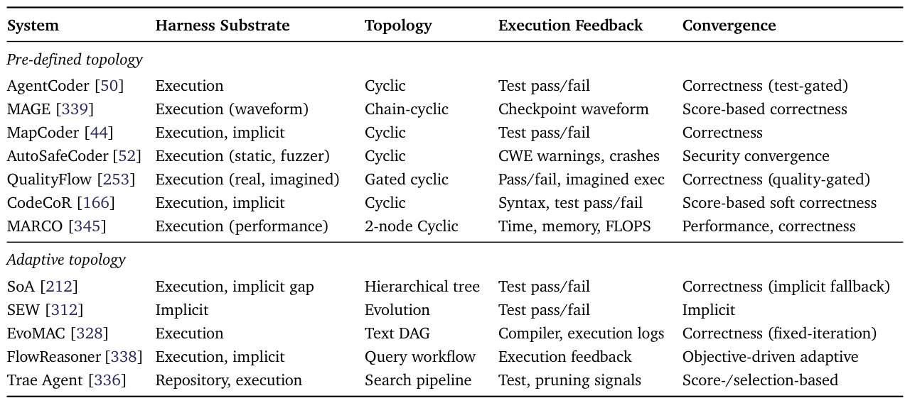

## 📊 เนื้อหาจากตาราง (Table 10): ข้อมูลป้อนกลับจากการรันโค้ดและระบบการลู่เข้าของระบบหลายเอเจนต์ที่เป็นตัวแทน (Representative MAS execution-feedback and convergence designs)

| ระบบ (System) | ซับสเตรตของตัวควบคุม (Harness Substrate) | โทโพโลยี (Topology) | ข้อมูลป้อนกลับจากการรันโค้ด (Execution Feedback) | การลู่เข้า / จุดสิ้นสุดงาน (Convergence) |
| --- | --- | --- | --- | --- |
| **โทโพโลยีแบบกำหนดไว้ล่วงหน้า (Pre-defined topology)** | | | | |
| **AgentCoder** [50] | การรันโค้ด (Execution) | แบบวงจร (Cyclic) | การทดสอบผ่าน/ล้มเหลว (Test pass/fail) | ความถูกต้อง นำทางด้วยประตูกลั่นกรองชุดทดสอบ (Correctness, test-gated) |
| **MAGE** [339] | การรันโค้ด แบบสัญญาณรูปคลื่น (Execution, waveform) | แบบลูกโซ่ผสมวงจร (Chain-cyclic) | สัญญาณรูปคลื่น ณ จุดตรวจสอบ (Checkpoint waveform) | ความถูกต้อง อิงตามคะแนน (Score-based correctness) |
| **MapCoder** [44] | การรันโค้ด, แบบแฝง (Execution, implicit) | แบบวงจร (Cyclic) | การทดสอบผ่าน/ล้มเหลว (Test pass/fail) | ความถูกต้อง (Correctness) |
| **AutoSafeCoder** [52] | การรันโค้ด แบบสแตติกและฟัซเซอร์ (Execution, static, fuzzer) | แบบวงจร (Cyclic) | คำเตือนช่องโหว่ CWE, การล่มของระบบ (CWE warnings, crashes) | การลู่เข้าด้านความปลอดภัย (Security convergence) |
| **QualityFlow** [253] | การรันโค้ด แบบจริงและแบบจินตนาการ (Execution, real, imagined) | แบบวงจรมีประตูกลั่นกรอง (Gated cyclic) | ผ่าน/ล้มเหลว, การรันโค้ดแบบจินตนาการ (Pass/fail, imagined exec) | ความถูกต้อง นำทางด้วยประตูกลั่นกรองคุณภาพ (Correctness, quality-gated) |
| **CodeCoR** [166] | การรันโค้ด, แบบแฝง (Execution, implicit) | แบบวงจร (Cyclic) | ไวยากรณ์, การทดสอบผ่าน/ล้มเหลว (Syntax, test pass/fail) | ความถูกต้องแบบยืดหยุ่นอิงตามคะแนน (Score-based soft correctness) |
| **MARCO** [345] | การรันโค้ด แบบอิงประสิทธิภาพ (Execution, performance) | แบบวงจร 2 โหนก (2-node Cyclic) | เวลา, หน่วยความจำ, ค่า FLOPS (Time, memory, FLOPS) | ประสิทธิภาพ และความถูกต้อง (Performance, correctness) |
| **โทโพโลยีแบบปรับตัวได้ (Adaptive topology)** | | | | |
| **SoA** [212] | การรันโค้ด, ช่องว่างแบบแฝง (Execution, implicit gap) | โครงสร้างต้นไม้เชิงลำดับขั้น (Hierarchical tree) | การทดสอบผ่าน/ล้มเหลว (Test pass/fail) | ความถูกต้อง มีระบบแผนสำรองแบบแฝง (Correctness, implicit fallback) |
| **SEW** [312] | แบบแฝง (Implicit) | วิวัฒนาการ (Evolution) | การทดสอบผ่าน/ล้มเหลว (Test pass/fail) | แบบแฝง (Implicit) |
| **EvoMAC** [328] | การรันโค้ด (Execution) | กราฟข้อความแบบ DAG (Text DAG) | คอมไพเลอร์, ล็อกการรันโค้ด (Compiler, execution logs) | ความถูกต้อง กำหนดรอบวนซ้ำตายตัว (Correctness, fixed-iteration) |
| **FlowReasoner** [338] | การรันโค้ด, แบบแฝง (Execution, implicit) | เวิร์กโฟลว์ระดับคำสั่งสอบถาม (Query workflow) | ข้อมูลป้อนกลับจากการรันโค้ด (Execution feedback) | ปรับตัวตามเป้าหมายที่ขับเคลื่อน (Objective-driven adaptive) |
| **Trae Agent** [336] | คลังรหัส, การรันโค้ด (Repository, execution) | ไปป์ไลน์การค้นหา (Search pipeline) | ชุดทดสอบ, สัญญาณการตัดแต่งกิ่ง (Test, pruning signals) | อิงตามคะแนน / อิงตามการคัดเลือก (Score-/selection-based) |

---

## 📄 เนื้อหาบทความหลัก (Main Text)

### 4.2. ข้อมูลป้อนกลับจากการรันโค้ดและการประสานเวลาตัวควบคุมที่ใช้ร่วมกัน (Execution Feedback and Shared-Harness Synchronization)

ในส่วนนี้เราจะร่วมอภิปรายเกี่ยวกับแนวทางที่กลุ่มของเอเจนต์สามารถใช้ประโยชน์จากความสามารถในการรันได้จริงของโค้ด (Executability of Code) และวิธีที่พวกมันใช้ในการคงรักษามุมมองที่สอดคล้องกันร่วมกัน (Consistent Shared View) เหนือสถานะของโปรแกรม มิตินี้ถือเป็นตัวกำหนดคุณลักษณะเฉพาะที่สำคัญสำหรับระบบหลายเอเจนต์ที่มีโค้ดเป็นศูนย์กลาง (Code-centric MAS): เนื่องจากตัวควบคุมที่ใช้ร่วมกัน (Shared Harness) จะมีความโดดเด่นเฉพาะตัวตรงที่สามารถรันได้จริง และสามารถสร้างสัญญาณคำนวณผลลัพธ์ที่เป็นวัตถุวิสัย (Objective Oracle Signals) ออกมาได้ โดยเราจะมุ่งตอบคำถามย่อย 2 ข้อ ได้แก่: มีการใช้ข้อมูลป้อนกลับจากการรันโค้ดประเภทใดบ้าง และสถานะที่ใช้ร่วมกันจะถูกประสานเวลา (Synchronized) ข้ามผ่านตัวเอเจนต์ต่าง ๆ ได้อย่างไร

#### 4.2.1. การบูรณาการข้อมูลป้อนกลับจากการรันโค้ด (Execution Feedback Integration)

* **ข้อมูลป้อนกลับจากคอมไพเลอร์และไวยากรณ์ (Compiler and syntax feedback):** ทำหน้าที่ดักจับข้อผิดพลาดเชิงโครงสร้าง (Structural Errors) ก่อนที่จะเข้าสู่ช่วงรันไทม์ และถูกนำมาประยุกต์ใช้ในหลาย ๆ ระบบ ตัวอย่างเช่น ระบบ **ChatDev** [330] จะป้อนข้อมูลข้อผิดพลาดจากคอมไพเลอร์ที่ได้จากเฟสการทดสอบ ส่งกลับไปยังตัวเขียนโปรแกรม ถึงแม้ว่ามันจะเป็นเพียงแค่การแก้ไขแบบครั้งเดียวจบ (One-off Corrections) ภายในเฟสงานเดี่ยวก็ตาม ส่วนระบบ **L2MAC** [344] จะรันระบบตรวจเช็คไวยากรณ์ผ่านทางโมดูลผู้ประเมินผล (Evaluator Module) $E(D)$ ในทุก ๆ ครั้งที่มีการเขียนบันทึกไฟล์ โดยปฏิบัติกับข้อมูลตรวจเช็คเหล่านั้นเสมือนเป็นเงื่อนไขสกัดกั้น (Blocking Conditions) ที่คอยขัดขวางไม่ให้ไปป์ไลน์คำสั่งขยับเคลื่อนไปข้างหน้าได้

* **สัญญาณการทดสอบผ่าน/ล้มเหลว (Test pass/fail signals):** ถือเป็นประเภทข้อมูลป้อนกลับจากการรันโค้ดที่ถูกนำมาใช้งานบ่อยที่สุด ตัวอย่างเช่น ระบบ **AgentCoder** [50] จะวางศูนย์กลางของลูปการทำงานทั้งหมดไว้ที่ประเด็นว่า กรณีทดสอบที่ถูกสร้างขึ้นอย่างเป็นอิสระจะรันผ่านหรือไม่; โดยรอบการทำงานจะสิ้นสุดลงทันทีเมื่อการทดสอบผ่านทั้งหมด หรือเมื่อใช้งบประมาณรอบการวนซ้ำครบ 5 รอบ นอกจากนี้ ระบบ **QualityFlow** [253] ได้นำเสนอรูปแบบตัวแปรที่น่าสนใจ: นั่นคือ **การรันโค้ดแบบจินตนาการ (Imagined Execution)** ซึ่งเป็นกระบวนการที่ LLM จะจำลองการทำงานของตัวตีความภาษา Python (Python Interpreter) แบบทีละขั้น และคาดการณ์ผลลัพธ์การทดสอบออกมาได้โดยไม่ต้องรันโค้ดจริง ๆ ซึ่งสามารถบรรลุค่าความแม่นยำ (Precision) และค่าความระลึก (Recall) ได้สูงถึง 98%+ บนชุดทดสอบ MBPP ในขณะที่สามารถหลีกเลี่ยงปัญหาป้ายกำกับรั่วไหล (Label Leakage) จากกรณีทดสอบที่มองเห็นได้อีกด้วย ยิ่งไปกว่านั้น ประสิทธิภาพที่ใกล้เคียงกันอย่างมากระหว่างตัวทดสอบแบบจำลองด้วย LLM ของระบบ **Self-Collaboration** [56] และตัวทดสอบแบบคอมไพเลอร์จริงในงานวิจัยฉบับเดียวกัน ได้ช่วยจุดประกายคำถามเชิงประจักษ์ที่ท้าทายว่า: *เมื่อใดกันแน่ที่การรันโค้ดจริงมีความจำเป็น และเมื่อใดที่เพียงแค่การจำลองการรันโค้ดด้วยภาษา (Linguistic Simulation) ก็สามารถให้ผลลัพธ์ที่เพียงพอได้?*

* **ร่องรอยการพังทลายจากตัวฟัซเซอร์ (Fuzzer crash traces):** เป็นตัวแทนของข้อมูลป้อนกลับที่มีคุณลักษณะแตกต่างออกไปในเชิงคุณภาพ: แทนที่จะรายงานผลลัพธ์ออกมาเป็นเพียงแค่ ผ่าน/ล้มเหลว แต่พวกมันจะส่งมอบข้อมูลอินพุตที่ทำให้ระบบล้มเหลวที่เป็นรูปธรรมมาให้เลย ระบบ **AutoSafeCoder** [52] ประยุกต์ใช้การกลายพันธุ์โค้ดแบบรับรู้ถึงประเภทข้อมูล (Type-aware Mutation)...

## หน้า 42

...เพื่อสร้างค่าสุ่มเริ่มต้นของข้อมูลเข้าที่กระตุ้นให้ระบบเกิดการล่ม (Crash-inducing Input Seeds) แล้วจึงส่งข้อมูลเข้าที่ทำให้ระบบล่มนั้นบวกกับรหัสทางออก (Exit Code) ไปยังเอเจนต์ผู้เขียนโค้ด (Coding Agent) ข้อมูลป้อนกลับแบบเผชิญหน้า (Adversarial Feedback) นี้ให้ข้อมูลที่เป็นประโยชน์มากกว่าสัญญาณความล้มเหลวแบบทั่วไป (Generic Failure Signal) เนื่องจากมันช่วยระบุตำแหน่งของบั๊ก (Localizes the Bug) ให้เชื่อมโยงกับหมวดหมู่ของข้อมูลเข้าที่เฉพาะเจาะจงได้

* **คำเตือนจากการวิเคราะห์แบบสแตติก (Static analysis warnings):** มอบข้อมูลป้อนกลับเกี่ยวกับโครงสร้างของโค้ดและคุณสมบัติด้านความปลอดภัยโดยไม่ต้องรันโค้ดจริง ระบบ **AutoSafeCoder** [52] ประยุกต์ใช้การวิเคราะห์แบบสแตติกที่จับคู่กับฐานข้อมูลช่องโหว่ MITRE (CWE-mapped Static Analysis) ซึ่งช่วยเปิดโอกาสให้เอเจนต์ตัววิเคราะห์แบบสแตติก (Static Analyzer Agent) สามารถแนะนำกลยุทธ์การเยียวยาแก้ไข (Remediation Strategies) ที่สอดคล้องกับคลาสของช่องโหว่เฉพาะนั้น ๆ ได้

* **ผลลัพธ์การทำโพรไฟลิงด้านประสิทธิภาพ (Performance profiling results):** ถูกนำมาใช้ประโยชน์อย่างโดดเด่นเฉพาะตัวโดยระบบ **MACRO** [345] ซึ่งมองว่าการเพิ่มประสิทธิภาพโค้ด (Code Optimization) คือภารกิจหลักมากกว่าเรื่องของความถูกต้อง (Correctness) โดยเอเจนต์ผู้ประเมินประสิทธิภาพ (Performance Evaluator Agent) จะทำการวัดผลเวลาในการรันโค้ด (Execution Time), การใช้หน่วยความจำ (Memory Usage) และค่า FLOPS และระบบ MACRO [345] ยังได้เพิ่มขยายส่วนนี้ด้วยการค้นหาเว็บแบบเรียลไทม์ (Real-time Web Search) ที่ไม่เหมือนใคร เพื่อดึงเทคนิคการเพิ่มประสิทธิภาพที่เกี่ยวข้องมาจากวรรณกรรมงานวิจัย

* **ข้อมูลป้อนกลับจากการจำลองสถานการณ์ที่มีความละเอียดสูง (Fine-grained simulation feedback):** ผลงานที่เป็นเอกลักษณ์เฉพาะตัวของระบบ **MAGE** [339] คือการมอบข้อมูลป้อนกลับจากการรันโค้ดที่มีความละเอียดสูงที่สุดในบรรดาวรรณกรรมที่ถูกสำรวจมา แทนที่จะรายงานผลเพียงแค่ว่าแท่นทดสอบ (Testbench) นั้นผ่านหรือล้มเหลว แต่กลไกจุดตรวจสอบสถานะ (State Checkpoint Mechanism) จะทำการบันทึกค่าสัญญาณในทุก ๆ ขอบขาของสัญญาณนาฬิกา (Every Clock Edge) และส่งมอบหน้าต่างสัญญาณรูปคลื่น (Waveform Window) รอบ ๆ รอบสัญญาณนาฬิกาแรกที่ล้มเหลวให้แก่เอเจนต์ดีบั๊ก (Debug Agent) สิ่งนี้ช่วยเปิดโอกาสให้สามารถดำเนินการซ่อมแซมโค้ดเฉพาะจุดได้ในระดับที่มีความละเอียดลึกซึ้งยิ่งกว่าระดับการทดสอบทั่วไป (Sub-test Granularity)

---

### 4.2.2. การประสานเวลาบนตัวควบคุมที่ใช้ร่วมกัน (Shared-Harness Synchronization)

* **การส่งต่องานตามลำดับขั้น (Sequential handoff):** ถือเป็นกลไกการประสานเวลาที่พบได้บ่อยที่สุด โดยเอเจนต์แต่ละตัวจะได้รับผลลัพธ์ (Output) จากเอเจนต์ตัวก่อนหน้า และส่งมอบผลลัพธ์ของตัวมันเองให้แก่เอเจนต์ตัวถัดไป สถานะของโปรแกรม (Program State) จะคงอยู่เพียงในรูปแบบของชิ้นงานล่าสุด (Most Recent Artifact) ในไปป์ไลน์เท่านั้น วิธีการนี้เพียงพอสำหรับไปป์ไลน์เส้นตรงแบบเรียบง่าย แต่จะสร้างให้เกิดปัญหาการเบี่ยงเบนของสถานะที่มองไม่เห็น (Invisible State Divergence) ในการตั้งค่าระบบแบบหลายเอเจนต์ ซึ่งเป็นกรณีที่มีเอเจนต์หลายตัวทำการแก้ไขฐานโค้ดพร้อม ๆ กันหรือทำซ้ำ ๆ แบบวนซ้ำ

* นอกจากนี้ มันยังเป็นจุดที่ทำให้ขอบเขตจำกัดของการประสานงานโดยมีโค้ดเป็นตัวกลาง (Code-mediated Coordination) มีความชัดเจนขึ้นด้วย: เพราะถึงแม้ว่าเอเจนต์ต่าง ๆ จะใช้งานชิ้นงานที่รันได้จริงร่วมกัน ตัวควบคุม (Harness) ก็ยังคงเผชิญหน้ากับข้อจำกัดทางทฤษฎีสารสนเทศ (Information-theoretic Constraints) อยู่ดี เช่น ช่องสัญญาณมีแบนด์วิดท์จำกัด (Finite Bandwidth), บทสรุปต่าง ๆ นำมาซึ่งความสูญเสียจากการบีบอัดข้อมูล (Compression Loss), ข้อมูลล็อกเต็มไปด้วยสัญญาณรบกวน (Noisy Logs), มุมมองข้อมูลที่แคชไว้มีความล้าสมัย (Stale Cached Views) และกิ่งก้านสาขาที่รันขนานกัน (Parallel Branches) ได้ก่อให้เกิดคำถามเกี่ยวกับอำนาจสิทธิ์ขาดและความสอดคล้องกันของข้อมูลที่ยังหาข้อสรุปไม่ได้ แม้ว่าโค้ดจะช่วยมอบซับสเตรต (Substrate) ที่มีความสมบูรณ์มากกว่าสำหรับการประสานงาน แต่มันก็ไม่ได้ช่วยขจัดข้อจำกัดของระบบแบบกระจายศูนย์ (Distributed-systems Constraints) เหล่านี้ออกไปได้

* **กระดานดำร่วมกัน (Shared blackboard):** ทำหน้าที่จัดเตรียมสถานะโปรแกรมที่สามารถเข้าถึงได้จากทั่วโลก (Globally Accessible Program State) ซึ่งเอเจนต์ทุกตัวสามารถเข้ามาอ่านและอัปเดตข้อมูลได้

* ระบบ **L2MAC** [344] ได้ประยุกต์ใช้สิ่งนี้อย่างสะอาดหมดจดที่สุด: โดยแหล่งเก็บไฟล์ $D$ (File Store $D$) จะเป็นโครงสร้างภายนอกที่คงอยู่ถาวร ซึ่งจะไม่ถูกเขียนทับ (Never Overwritten) แต่จะถูกขยายขอบเขตและแก้ไขปรับปรุงเพิ่มเติม หน่วยควบคุม (Control Unit) จะทำหน้าที่บริหารจัดการการอ่านและการเขียนทั้งหมด เพื่อรับประกันว่าการเรียกใช้งานเอเจนต์ในแต่ละครั้งจะได้รับหน้าต่างบริบท (Context Window) ที่ถูกควบคุมอย่างแม่นยำ

* ระบบ **MAGIS** [332] มีหน่วยความจำวิวัฒนาการคลังรหัส $M$ (Repository Evolution Memory $M$) ทำหน้าที่เป็นแหล่งเก็บข้อมูลประเภท Key-Value ที่คงอยู่ถาวร เพื่อจับคู่เวอร์ชันของไฟล์เข้ากับบทสรุปที่สร้างโดย LLM ซึ่งจะถูกอัปเดตเพิ่มขึ้นทีละนิด (Incrementally) ผ่านทางกระดานดำเฉพาะทางสำหรับการให้เหตุผลในระดับคลังรหัส

* ระบบ **Self-Collaboration** [56] ถือเป็นระบบกลุ่มแรก ๆ ที่มีการระบุชื่อและเรียกใช้งานสถาปัตยกรรมกระดานดำ (Blackboard Architecture) อย่างชัดเจน โดยมีการจัดตั้งหน่วยความจำร่วมกัน (Shared Memory) ที่ซึ่งทั้ง 3 บทบาทหน้าที่สามารถเข้ามาอ่านและเขียนข้อมูลได้

* **กิ่งขนานพร้อมการผสานรวม (Parallel branches with merge):** จะเกิดขึ้นเมื่อเอเจนต์หลายตัวทำการแก้ไขส่วนประกอบที่เป็นอิสระต่อกันในเวลาเดียวกัน โดยความเปลี่ยนแปลงของพวกมันจะถูกบูรณาการเข้าด้วยกันในขั้นตอนต่อมา ตัวอย่างเช่น ระบบ **MAGIS** [332] จะสร้างร่างเอเจนต์ *ผู้พัฒนา (Developer)* ขึ้นมาหนึ่งตัวต่อหนึ่งไฟล์ผู้สมัคร; โดยแต่ละตัวจะทำการแก้ไขไฟล์ที่ได้รับมอบหมายอย่างเป็นอิสระต่อกัน และความเปลี่ยนแปลงทั้งหมดจะถูกผสานรวมเข้าสู่...

## หน้า 43

...ความเปลี่ยนแปลงรวมของคลังรหัสในท้ายที่สุด (Final Repository Diff) ระบบ **HyperAgent [333]** จะรันอินสแตนซ์ของตัวนำทาง (Navigator) และตัวแก้ไขโค้ด (Editor) หลาย ๆ ตัวขนานกันผ่านทางคิว Redis (Redis Queues) โดยผลลัพธ์จะถูกนำมาผสานรวมกันในระดับของตัววางแผน (Planner Level)

* **การจัดตารางเวลาบริบทแบบมีโครงสร้าง (Structured context scheduling):** คือการบริหารจัดการอย่างชัดเจนว่าเอเจนต์แต่ละตัวจะมองเห็นสิ่งใดและในเวลาใด สิ่งนี้คือนวัตกรรมหลักของระบบ **L2MAC [344]** โดยหน่วยควบคุม (Control Unit) จะทำการรีเซ็ตหน้าต่างบริบท (Context Window) ในระหว่างขั้นตอนคำสั่ง เพื่อจัดเตรียมบทสรุปที่มุ่งเป้าของความคืบหน้าก่อนหน้า $(M_{rs})$ ให้แก่การเรียกใช้งานใหม่แต่ละครั้ง แทนที่จะส่งประวัติการสนทนาฉบับเต็มไปให้ เมื่อหน้าต่างบริบทใกล้จะเต็มความจุ หน่วยควบคุมจะจัดเก็บผลลัพธ์บางส่วนไว้ใน $D$ และเริ่มต้นระบบใหม่ด้วยมุมมองที่ถูกบีบอัด พร้อมทั้งสั่งการ LLM อย่างชัดเจนว่าไฟล์ใดควรเปิดอ่านหรือข้ามไปเมื่อพิจารณาจากขอบเขตบริบทที่เหลืออยู่ กลไกนี้ช่วยแก้ปัญหาหน้าต่างบริบทไม่ใช่ด้วยการขยายขนาดหน้าต่างให้ใหญ่ขึ้น แต่เป็นการควบคุมสิ่งป้อนภายในหน้าต่างอย่างระมัดระวัง ทั้งนี้ ระบบ **MetaGPT [55]** ได้ประยุกต์ใช้รูปแบบการจัดตารางเวลาบริบทที่เบากว่าผ่านทางกลุ่มข้อความแบบเผยแพร่-สมัครรับ (Publish-subscribe Message Pool): โดยเอเจนต์แต่ละตัวจะสมัครรับข้อมูลเฉพาะประเภทเอกสารที่เกี่ยวข้องกับบทบาทหน้าที่ของตน ทำให้ได้รับมุมมองของสถานะที่ใช้ร่วมกันซึ่งผ่านการกรองข้อมูลแล้ว

* **หน่วยความจำเชิงลำดับขั้น (Hierarchical memory):** เป็นการผสมผสานบริบทการทำงานระยะสั้น (Short-term Working Context) เข้ากับองค์ความรู้สะสมระยะยาว (Longer-term Accumulated Knowledge) ระบบ **ChatDev [330]** แยกหน่วยความจำระยะสั้น (บทสนทนาฉบับเต็มภายในเฟสงาน) ออกจากหน่วยความจำระยะยาว (โซลูชันที่ถูกสกัดออกมาเพื่อส่งต่อข้ามเฟสงาน) อย่างชัดเจน ระบบ **Cogito [346]** ได้ประยุกต์ใช้หน่วยความจำเชิงลำดับขั้นโดยถอดแบบมาจากสถาปัตยกรรมทางประสาทวิทยาศาสตร์: ได้แก่ หน่วยความจำระยะสั้นสำหรับสถานะงานในทันที, ฐานความรู้ระยะยาวสำหรับความเชี่ยวชาญที่สะสมมา และหน่วยเติบโต (Growth Units) สำหรับแนวคิดเชิงนามธรรมที่วิวัฒนาการและปรับปรุงให้ดีขึ้นเมื่อเวลาผ่านไป ส่วนระบบ **HyperAgent [333]** จะใช้ตัวสรุปความน้ำหนักเบา LLAMA-3.1-8B เพื่อย่อยควบแน่นล็อกการรันโค้ด (Execution Logs) ก่อนที่จะนำไปจัดเก็บไว้ในหน่วยความจำเชิงลำดับขั้น เพื่อป้องกันปัญหาบริบทบวมโต (Context Bloat)

* **การขยายขนาดกลุ่มเอเจนต์ (Agent pool scaling):** เข้ามาจัดการกับปัญหาการบริหารจัดการบริบทในแนวตั้งฉาก (Orthogonal Approach): แทนที่จะเป็นการจัดการกับสิ่งที่เอเจนต์เดี่ยว มองเห็น แต่มันจะกระจายภาระบริบท (Context Load) ออกไปยังเอเจนต์จำนวนที่มากขึ้น ระบบ **SoA [212]** คือตัวอย่างที่คลาสสิก: โดยการแตกตัวสร้างเอเจนต์เพิ่มขึ้นเมื่อความซับซ้อนของงานเติบโตขึ้น บริบทของเอเจนต์แต่ละตัวจึงยังคงถูกจำกัดขอบเขตเอาไว้ได้ นี่คือโซลูชันเชิงโครงสร้างสำหรับปัญหาด้านสถานะของตัวควบคุม (Harness-state Problem): แทนที่จะเป็นการสร้างตัวแทนข้อมูลที่ใช้ร่วมกันซึ่งเอเจนต์ทุกตัวสามารถเข้ามาส่งคำสั่งสอบถามได้ แต่ SoA [212] จะแบ่งส่วนสถานะของงานกระจายข้ามผ่านเอเจนต์ต่าง ๆ โดยแต่ละตัวจะถือครองชิ้นส่วนข้อมูลที่จำกัดขอบเขตไว้ ข้อจำกัดของแนวทางนี้คือต้องสูญเสียความสอดคล้องกันในภาพรวม (Global Consistency): เนื่องจากเอเจนต์จะไม่สามารถให้เหตุผลเกี่ยวกับตัวโปรแกรมในภาพรวมทั้งหมดได้ แต่จะรู้แค่เพียงฟังก์ชันย่อยที่ตนได้รับมอบหมายเท่านั้น

* **อื่น ๆ (Other):** กลไกการย้อนคืนสถานะ (Revert Mechanism) ของระบบ **QualityFlow [253]** เป็นตัวแทนของรูปแบบการประสานเวลา (Synchronization Pattern): โดยชิ้นงานโค้ดเริ่มต้นจะไม่ถูกเขียนทับ ซึ่งช่วยเปิดโอกาสให้ระบบสามารถย้อนกลับ (Roll back) ไปสู่สถานะของตัวควบคุมที่ใช้ร่วมกันก่อนหน้าได้ หากเส้นทางการดีบั๊กนั้นทำให้คุณภาพของโค้ดแย่ลง นี่คืองานวิจัยเพียงชิ้นเดียวในบรรดาระบบที่ถูกสำรวจที่มีการบริหารจัดการประวัติสถานะ (State History) อย่างชัดเจน แทนที่จะเป็นการมุ่งหน้าไปข้างหน้าตลอดเวลาเพียงอย่างเดียว

---

### 4.3. จุดยืน: ซับสเตรตของตัวควบคุมร่วมกันที่มีโค้ดเป็นศูนย์กลาง (Position: The Shared Code-Centric Harness Substrate)

เราขอเสนอจุดยืนใหม่สำหรับปัญญาประดิษฐ์แบบหลายเอเจนต์ในยุคถัดไป (Next Generation of Multi-agent Intelligence): นั่นคือ **ซับสเตรตของตัวควบคุมร่วมกันที่มีโค้ดเป็นศูนย์กลาง (Shared Code-centric Harness Substrate)** จุดยืนนี้ขับเคลื่อนมาจากช่องว่างหลักที่ถูกระบุไว้ในวรรณกรรมต่าง ๆ: ซึ่งก็คือการขาดหายไปของตัวแทนสถานะโค้ดที่ใช้ร่วมกันที่เป็นทางการและคงอยู่ถาวร (Formal, Persistent Representations of the Shared Code State) ซึ่งเอเจนต์สามารถเข้ามาส่งคำสั่งสอบถามและอัปเดตข้อมูลข้ามผ่านรอบการทำงานต่าง ๆ ได้ เรารายงานและโต้แย้งว่า การสร้างซับสเตรตของตัวควบคุมเช่นนี้เป็นสิ่งที่เป็นไปได้และมีความจำเป็นอย่างยิ่ง ต่อการบรรลุปัญญาประดิษฐ์แบบหลายเอเจนต์ที่มีความทนทานและสามารถขยายขนาดได้

## หน้า 44

Table 11: การออกแบบ agent MAS มีศูนย์กลางอยู่ที่การเป็น agent และการซิงโครไนซ์สถานะ program ที่ใช้ร่วมกัน

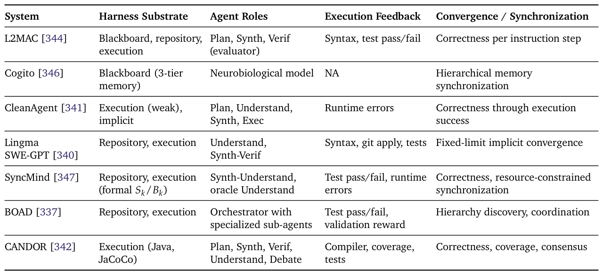

นี่คือบทแปลเนื้อหาบทความและตารางจากหน้า 44 ในไฟล์ "CodeasAgentHarness_page_044.pdf" เป็นภาษาไทยอย่างละเอียด โดยใส่คำศัพท์เทคนิคภาษาอังกฤษกำกับไว้ในวงเล็บเพื่อความแม่นยำในการอ้างอิงเชิงวิชาการครับ:

---

## 📊 เนื้อหาจากตาราง (Table 11): ระบบการออกแบบ MAS ที่เน้นเรื่องการเป็นตัวแทนสถานะโปรแกรมและการประสานเวลาที่ใช้ร่วมกันเป็นศูนย์กลาง (Representative MAS designs centered on shared program-state representation and synchronization)

| ระบบ (System) | ซับสเตรตของตัวควบคุม (Harness Substrate) | บทบาทของเอเจนต์ (Agent Roles) | ข้อมูลป้อนกลับจากการรันโค้ด (Execution Feedback) | การลู่เข้า / การประสานเวลา (Convergence / Synchronization) |
| --- | --- | --- | --- | --- |
| **L2MAC** [344] | กระดานดำ, คลังรหัส, การรันโค้ด (Blackboard, repository, execution) | วางแผน, สังเคราะห์, ตรวจสอบ (ผู้ประเมินผล) (Plan, Synth, Verif (evaluator)) | ไวยากรณ์, การทดสอบผ่าน/ล้มเหลว (Syntax, test pass/fail) | ความถูกต้องต่อหนึ่งขั้นตอนคำสั่ง (Correctness per instruction step) |
| **Cogito** [346] | กระดานดำ (หน่วยความจำ 3 ระดับ) (Blackboard (3-tier memory)) | โมเดลทางประสาทวิทยาศาสตร์ (Neurobiological model) | ไม่มีข้อมูล (NA) | การประสานเวลาของหน่วยความจำเชิงลำดับขั้น (Hierarchical memory synchronization) |
| **CleanAgent** [341] | การรันโค้ด (แบบอ่อน), แบบแฝง (Execution (weak), implicit) | วางแผน, ทำความเข้าใจ, สังเคราะห์, รันโค้ด (Plan, Understand, Synth, Exec) | ข้อผิดพลาดขณะรันไทม์ (Runtime errors) | ความถูกต้องผ่านความสำเร็จในการรันโค้ด (Correctness through execution success) |
| **Lingma SWE-GPT** [340] | คลังรหัส, การรันโค้ด (Repository, execution) | ทำความเข้าใจ, สังเคราะห์-ตรวจสอบ (Understand, Synth-Verif) | ไวยากรณ์, คำสั่ง git apply, ชุดทดสอบ (Syntax, git apply, tests) | การลู่เข้าแบบแฝงที่จำกัดขอบเขตตายตัว (Fixed-limit implicit convergence) |
| **SyncMind** [347] | คลังรหัส, การรันโค้ด (แบบเป็นทางการ $S_{k}/B_{k}$) (Repository, execution (formal $S_{k}/B_{k}$)) | สังเคราะห์-ทำความเข้าใจ, ออราเคิลทำความเข้าใจ (Synth-Understand, oracle Understand) | การทดสอบผ่าน/ล้มเหลว, ข้อผิดพลาดรันไทม์ (Test pass/fail, runtime errors) | ความถูกต้อง, การประสานเวลาภายใต้ทรัพยากรที่จำกัด (Correctness, resource-constrained synchronization) |
| **BOAD** [337] | คลังรหัส, การรันโค้ด (Repository, execution) | ตัวประสานงานพร้อมเอเจนต์ย่อยเฉพาะทาง (Orchestrator with specialized sub-agents) | การทดสอบผ่าน/ล้มเหลว, รางวัลการตรวจสอบความถูกต้อง (Test pass/fail, validation reward) | การค้นพบโครงสร้างลำดับขั้น, การประสานงาน (Hierarchy discovery, coordination) |
| **CANDOR** [342] | การรันโค้ด (Java, JaCoCo) (Execution (Java, JaCoCo)) | วางแผน, สังเคราะห์, ตรวจสอบ, ทำความเข้าใจ, โต้เถียง (Plan, Synth, Verif, Understand, Debate) | คอมไพเลอร์, ความครอบคลุม, ชุดทดสอบ (Compiler, coverage, tests) | ความถูกต้อง, ความครอบคลุม, ฉันทามติ (Correctness, coverage, consensus) |

## 📄 เนื้อหาบทความหลัก (Main Text)

### 4.3.1. ตัวแทนข้อมูลของตัวควบคุมที่ใช้ร่วมกัน (Shared Harness Representation)

คำถามพื้นฐานสำหรับระบบหลายเอเจนต์ (MAS) ใด ๆ ก็คือ: ซับสเตรต (Substrate) ที่เอเจนต์เหล่านี้อาศัยอยู่คืออะไร? ในแนวคิดโค้ดในฐานะตัวควบคุมเอเจนต์ (Code as Agent Harness) คำตอบที่เป็นธรรมชาติที่สุดก็คือ **สภาพแวดล้อมโปรแกรมที่ใช้ร่วมกัน (Shared Program Environment)** ซึ่งหมายถึง กลุ่มก้อนของชิ้นงาน (Artifacts), บริบทการรันโค้ด (Execution Contexts) และสัญญาณคุณภาพ (Quality Signals) ที่เอเจนต์ต่าง ๆ ลงมือกระทำร่วมกัน และมีวิวัฒนาการไปในขณะที่เอเจนต์ผลิต, แก้ไขปรับปรุง และประเมินผลโค้ด เราเรียกสิ่งนี้ว่า **ซับสเตรตของตัวควบคุมร่วมกัน (Shared Harness Substrate)** และเราสามารถจำแนกรูปแบบการจัดโครงสร้างที่เป็นทางการออกเป็น 4 ระดับ ที่ระบบในปัจจุบันใช้ในการเป็นตัวแทนข้อมูลของมัน

#### 1) ตัวแทนข้อมูลแบบแฝง / เฉพาะไฟล์เท่านั้น (Implicit / File-only Representation)

หมวดหมู่ที่พบได้บ่อยที่สุดและมีความเป็นทางการน้อยที่สุด จะปฏิบัติกับตัวควบคุมที่ใช้ร่วมกันเป็นเพียงแค่ไฟล์โค้ดปัจจุบัน (Current Code File) หรือชุดของไฟล์โค้ดเท่านั้น เอเจนต์จะได้รับชิ้นงานโค้ดล่าสุดเป็นส่วนหนึ่งของบริบทอินพุต (Input Context) ของตน และสร้างเวอร์ชันที่ถูกแก้ไขหรือเวอร์ชันที่ผ่านการประเมินผลออกมา รูปแบบนี้จะไม่มีตัวแทนข้อมูลที่คงอยู่ถาวรและสามารถส่งคำสั่งสอบถามได้ (No persistent, queryable representation): สถานะที่ใช้ร่วมกันจะถูกสร้างขึ้นใหม่แบบแฝง (Implicitly Reconstructed) ในการเรียกใช้งานเอเจนต์แต่ละครั้งโดยดึงมาจากประวัติการสนทนา (Conversational History)

หมวดหมู่นี้ครอบคลุมระบบพื้นฐานจำนวนมาก ได้แก่: ChatDev [330], MetaGPT [55], FlowGen [335], MapCoder [44], CodeCoR [166], SEW [312] และ CodePori [331] แม้ว่าตัวแทนข้อมูลรูปแบบนี้จะง่ายต่อการนำไปใช้งาน แต่ก็นำมาซึ่งข้อจำกัดที่สำคัญประการหนึ่ง: คือเอเจนต์จะไม่สามารถให้เหตุผลเกี่ยวกับซับสเตรตที่ใช้ร่วมกันได้เลย เว้นแต่จะมองผ่านเลนส์ที่แคบของหน้าต่างบริบทล่าสุดของพวกมันเท่านั้น **ปัญหาการเบี่ยงเบนของสถานะ (State Divergence)** [347] ซึ่งเป็นกรณีที่ความเชื่อภายในของเอเจนต์เกี่ยวกับสถานะของโค้ดเกิดความเบี่ยงเบนไปจากสถานะที่แท้จริง จะกลายเป็นสิ่งที่ไม่สามารถมองเห็นได้ในระบบ และไม่สามารถตรวจจับหรือแก้ไขได้

#### 2) ตัวแทนข้อมูลแบบอิงตามคลังรหัส (Repository-based Representation)

คลาสของระบบที่มีความสมบูรณ์มากกว่า จะแสดงตัวแทนข้อมูลของตัวควบคุมที่ใช้ร่วมกันในฐานะคลังรหัสที่สามารถนำทางได้ (Navigable Repository): ซึ่งประกอบด้วยระบบไฟล์ที่มีโครงสร้างไดเรกทอรี, กราฟความพึ่งพาอาศัยกันระหว่างไฟล์ (Inter-file Dependency Graphs), ลำดับขั้นการเรียกใช้งาน (Call Hierarchies) และประวัติเวอร์ชัน (Version History) ตัวแทนข้อมูลรูปแบบนี้จะสนับสนุนเอเจนต์ที่ต้องให้เหตุผลว่า จุดใดในฐานโค้ดที่จำเป็นต้องทำการแก้ไข, มีส่วนประกอบอื่นใดบ้างที่ต้องพึ่งพาฟังก์ชันที่ถูกเปลี่ยนแปลงนั้น และตัวฐานโค้ดมีวิวัฒนาการอย่างไรเมื่อเวลาผ่านไป

* ระบบ **MAGIS** [332] ได้นำเสนอหน่วยความจำวิวัฒนาการคลังรหัส (Repository Evolution Memory) ที่ทำหน้าที่แคชบทสรุปในระดับไฟล์เอาไว้ และอัปเดตข้อมูลเหล่านั้นเพิ่มขึ้นทีละนิดผ่านทาง `git diff` เมื่อไฟล์เกิดความเปลี่ยนแปลงข้ามผ่านเอพพิโซดของการแก้ไขปัญหา

* ระบบ **HyperAgent** [333] จะจัดเตรียมเครื่องมือนำทางคลังรหัสให้แก่เอเจนต์ (เช่น `get_tree_structure`, `go_to_definition`, `code_search`, `get_all_references`)
## หน้า 45

...โดยปฏิบัติกับคลังรหัสเสมือนเป็นฐานความรู้ที่มีโครงสร้างชัดเจน (Structured Knowledge Base) ระบบ **Lingma SWE-GPT [340]** ทำหน้าที่บีบอัดมุมมองของคลังรหัสผ่านโครงร่างผังต้นไม้โครงสร้างไวยากรณ์นามธรรม (Abstract Syntax Tree หรือ AST Skeletons) ซึ่งช่วยคงรักษารายละเอียดลายเซ็นของฟังก์ชัน (Function Signatures) และคำนิยามของคลาส (Class Definitions) เอาไว้เพื่อให้สามารถนำทางค้นหาได้อย่างมีประสิทธิภาพ ทั้งนี้ ระบบ **SyncMind [347]** ถือเป็นงานวิจัยเพียงชิ้นเดียวที่มีการกำหนดนิยามซับสเตรตของคลังรหัสอย่างเป็นทางการในฐานะสถานะความจริงเชิงประจักษ์ $S_{k}$ (Ground-truth State $S_{k}$) และทำการวัดผลการเบี่ยงเบนระหว่างสถานะ $S_{k}$ กับสถานะความเชื่อของเอเจนต์ $B_{k}$ (Agent's Belief State $B_{k}$)

#### 3) ตัวแทนข้อมูลแบบอิงตามการรันโค้ด (Execution-based Representation)

ตัวแทนข้อมูลแบบอิงตามการรันโค้ด (Execution-based representation) ถือเป็นหมวดหมู่ที่มีความโดดเด่นเฉพาะตัวที่สุดสำหรับการสร้างโค้ด รูปแบบนี้ไม่มีสิ่งใดเทียบเคียงได้โดยตรงในระบบหลายเอเจนต์ทั่วไป (General MAS) และมันทำหน้าที่เป็นตัวแทนของซับสเตรตที่ใช้ร่วมกันผ่านพฤติกรรมการรันโค้ด (Execution Behavior) สถานะในที่นี้ไม่ใช่การดูว่าตัวโค้ดนั้นมีหน้าตาเป็นอย่างไร แต่คือการดูว่า **ตัวโค้ดนั้นทำอะไรเมื่อสั่งรัน:** เช่น โค้ดคอมไพล์ผ่านหรือไม่, รันผ่านชุดทดสอบใดบ้าง, ตัวฟัซเซอร์ (Fuzzer) ตรวจพบช่องโหว่ใดบ้าง, ตัวโค้ดรันได้เร็วแค่ไหน และพฤติกรรมตอนรันไทม์ (Runtime Behavior) ตรงตามข้อกำหนดเฉพาะที่ระบุไว้หรือไม่

ตัวแทนข้อมูลแบบอิงตามการรันโค้ดนี้จะส่งมอบสัญญาณคำนวณผลลัพธ์ที่เป็นวัตถุวิสัย (Objective Oracle Signal) ซึ่งเป็นความจริงเชิงประจักษ์ (Ground Truth) ที่ไม่ตกอยู่ภายใต้ปัญหาอาการคิดไปเอง (Hallucination) หรือความลำเอียง (Bias) ที่มักส่งผลกระทบต่อการประเมินผลเอเจนต์ด้วยภาษาโปรแกรมเพียงอย่างเดียว ระบบที่ใช้ประโยชน์จากตัวแทนข้อมูลรูปแบบนี้ ได้แก่ AgentCoder [50], AutoSafeCoder [52], QualityFlow [253], MACRO [345], EvoMAC [328], CANDOR [342] และ MAGE [339] จุดที่น่าสังเกตคือ ระบบ **MAGE [339]** สามารถบรรลุข้อมูลป้อนกลับจากการรันโค้ดที่มีความละเอียดลึกซึ้งที่สุดในวรรณกรรม โดยปฏิบัติงานในระดับความละเอียดของขอบขาสัญญาณนาฬิกา (Clock-edge Granularity) ผ่านทางภาพสแนปชอตสัญญาณรูปคลื่นของจุดตรวจสอบสถานะ (State Checkpoint Waveform Snapshots)

#### 4) ตัวแทนข้อมูลแบบกระดานดำ / สถานะร่วมกัน (Blackboard / Shared-State Representation)

หมวดหมู่ที่สี่นำเสนอโครงสร้างข้อมูลที่ระบุชัดเจนและสามารถเข้าถึงได้จากทั่วโลก (Explicit, Globally Accessible Data Structure) ซึ่งเอเจนต์ทุกตัวสามารถเข้ามาอ่านและเขียนข้อมูลลงไปได้ (คล้ายคลึงกับสถาปัตยกรรมกระดานดำคลาสสิกในโลก AI [348]) สถานะที่ใช้ร่วมกันนี้เป็นสิ่งที่ใกล้เคียงที่สุดในวรรณกรรมกับแนวคิดระบบซับสเตรตของตัวควบคุมที่เป็นทางการ (Formal Harness Substrate): เนื่องจากมันจะคงอยู่ถาวรข้ามผ่านการเรียกใช้งานเอเจนต์, สามารถถูกส่งคำสั่งสอบถามและอัปเดตข้อมูลได้ และส่งมอบมุมมองที่สอดคล้องกันเหนือสถานะโปรแกรมให้แก่เอเจนต์ทุกตัว

* ระบบ **Self-Collaboration [56]** ถือเป็นกลุ่มระบบแรก ๆ ที่มีการนำแนวเปรียบเปรยของกระดานดำ (Blackboard Metaphor) มาเรียกใช้งานอย่างชัดเจน โดยจัดตั้งหน่วยความจำร่วมกันที่ซึ่งทั้ง 3 บทบาทหน้าที่ (นักวิเคราะห์, ตัวเขียนโค้ด, ตัวทดสอบ) สามารถเข้ามาอ่านและเขียนข้อมูลได้

* ระบบ **L2MAC [344]** ได้ประยุกต์ใช้ระบบกระดานดำที่มีหลักการเป็นระบบระเบียบที่สุดในวรรณกรรม: นั่นคือแหล่งเก็บไฟล์ที่คงอยู่ถาวร $D$ (Persistent File Store $D$) พร้อมเส้นทางพาธที่มีความหมายเชิงอรรถศาสตร์ โดยถูกเข้าถึงผ่านหน่วยควบคุม (Control Unit) ที่ทำหน้าที่บริหารจัดการอย่างชัดเจนว่าการเรียกใช้งานเอเจนต์แต่ละครั้งจะได้มองเห็นสถานะชิ้นส่วนใด

* ระบบ **GameGPT [210]** จะใช้บัฟเฟอร์บริบทที่ใช้ร่วมกัน (Shared Context Buffer) เพื่อลดการส่งผ่านข้อมูลซ้ำซ้อนในการพัฒนาเกมแบบหลายรอบ

* ระบบ **Cogito [346]** ถอดแบบมาจากสถาปัตยกรรมทางประสาทวิทยาศาสตร์เพื่อนำเสนอหน่วยความจำ 3 ระดับ (Three-tier Memory) ได้แก่: สถานะปฏิบัติการระยะสั้น, ฐานความรู้ระยะยาว และหน่วยเติบโตสำหรับแนวคิดเชิงนามธรรมที่วิวัฒนาการ เพื่อทำหน้าที่เป็นตัวแทนข้อมูลของตัวควบคุมแบบมีโครงสร้าง

### ช่องว่างหลัก (The Central Gap)

การกระจายตัวของระบบต่าง ๆ ข้ามผ่านทั้ง 4 หมวดหมู่นี้ ได้เปิดเผยให้เห็นถึงรูปแบบที่น่าตกใจข้อหนึ่ง: นั่นคือ **วรรณกรรมส่วนใหญ่จัดอยู่ในหมวดหมู่แบบแฝง/เฉพาะไฟล์เท่านั้น ซึ่งขาดแคลนโมเดลที่เป็นทางการของระบบซับสเตรตของตัวควบคุมที่ใช้ร่วมกัน** สิ่งนี้คือช่องว่างหลัก (Central Gap) ที่จุดประกายและขับเคลื่อนกรอบแนวคิดเรื่อง "โค้ดในฐานะตัวควบคุมเอเจนต์" (Code as Agent Harness) ตัวโปรแกรมคอมพิวเตอร์นั้นมีความโดดเด่นเฉพาะตัวท่ามกลางโดเมนหลายเอเจนต์อื่น ๆ ตรงที่เป็นชิ้นงานที่สามารถรันได้จริง (An Artifact that Executes) มันสามารถสร้างสัญญาณที่เป็นวัตถุวิสัยและไม่ใช่ภาษา ซึ่งโดยหลักการแล้วสามารถนำมาใช้เพื่อยึดโยงเป็นโครงสร้างซับสเตรตที่ใช้ร่วมกันที่เป็นทางการได้ ทว่าระบบส่วนใหญ่กลับล้มเหลวในการใช้ประโยชน์จากคุณสมบัติข้อนี้ในระดับสถาปัตยกรรม (Architectural Level) แต่กลับไปพึ่งพาให้เอเจนต์ทำหน้าที่ให้เหตุผลเกี่ยวกับคุณภาพของโค้ดผ่านทางภาษาธรรมชาติเพียงอย่างเดียวแทน

---

### 4.3.2. การลู่เข้าสู่จุดสิ้นสุดของสถานะตัวควบคุม (Harness-State Convergence)

การลู่เข้าสู่จุดสิ้นสุด (Convergence) เป็นตัวกำหนดว่าเมื่อใดที่ตัวควบคุมการเขียนโค้ดแบบหลายเอเจนต์ (Multi-agent Coding Harness) ควรจะหยุดวนซ้ำรอบทำงาน และยอมรับสถานะโปรแกรมปัจจุบันว่าเป็นผลลัพธ์ที่น่าพึงพอใจแล้ว ในระบบ MAS ที่มีอยู่จำนวนมาก การลู่เข้าสู่จุดสิ้นสุดยังคงถูกนิยามไว้แบบแฝง (Implicitly Defined) ไม่ว่าจะผ่านฉันทามติร่วมกันระหว่างเอเจนต์หรือผ่านงบประมาณรอบการวนซ้ำจากภายนอก อย่างไรก็ตาม แนวคิดโค้ดในฐานะตัวควบคุมเอเจนต์มีข้อได้เปรียบที่เด่นชัดข้อหนึ่ง: เนื่องด้วยซับสเตรตที่ใช้ร่วมกันนั้นสามารถรันได้จริง การลู่เข้าสู่จุดสิ้นสุดจึงสามารถถูกยึดโยงไว้กับ **สัญญาณพฤติกรรมที่เป็นวัตถุวิสัย (Objective Behavioral Signals)** แทนที่จะพึ่งพาเพียงแค่ข้อตกลงผ่านการสนทนาแต่เพียงอย่างเดียว โดยเราสามารถจำแนกรูปแบบการลู่เข้าสู่ออกได้เป็น 6 รูปแบบ ตั้งแต่เกณฑ์ที่ใช้กันอย่างแพร่หลายอย่าง ประตูกลั่นกรองชุดทดสอบ (Test-gated) และแบบแฝง (Implicit) ไปจนถึงเกณฑ์ที่พบได้น้อยกว่าอย่าง เกณฑ์อิงตามความปลอดภัย, ประสิทธิภาพ และฉันทามติ

## หน้า 46

* **การลู่เข้าสู่ความถูกต้อง / ประตูกลั่นกรองชุดทดสอบ (Correctness convergence / test-gated):** ถือเป็นเกณฑ์เชิงวัตถุประสงค์ (Objective Criterion) ที่มีหลักการเป็นระบบระเบียบและถูกนำมาใช้งานอย่างแพร่หลายที่สุด โดยระบบจะสิ้นสุดการทำงานอย่างสำเร็จเมื่อกรณีทดสอบหรือชุดทดสอบ (Test Cases) ทั้งหมดรันผ่านฉลุย ระบบที่ประยุกต์ใช้การลู่เข้าสู่จุดสิ้นสุดแบบนำทางด้วยประตูกลั่นกรองชุดทดสอบ ได้แก่ AgentCoder [50], L2MAC [344], SyncMind [347] และ CANDOR [342] ทั้งนี้ ระบบ **PairCoder [334]** ได้ยกระดับเกณฑ์นี้เพิ่มเติมด้วย **การตรวจจับทางตัน (Dead-end Detection):** กล่าวคือ หากโค้ดที่มีบั๊กหรือข้อมูลป้อนกลับแบบเดิม ๆ ปรากฏซ้ำในประวัติการวนซ้ำ (Iteration History) ระบบจะทำการสลับไปใช้งานแผนงานผู้สมัครลำดับถัดไปทันทีแทนที่จะติดลูปอยู่แบบนั้น ส่วนระบบ **FlowGen [335]** เลือกใช้การลู่เข้าสู่จุดสิ้นสุดแบบประตูกลั่นกรองชุดทดสอบเช่นกัน แต่ทำบนชุดทดสอบที่สร้างขึ้นโดย LLM (LLM-generated Tests) แทนที่จะเป็นชุดทดสอบที่เป็นความจริงเชิงประจักษ์ (Ground-truth Tests) ซึ่งจุดนี้อาจนำมาซึ่งประเด็นข้อกังวลด้านคุณภาพ (Quality Concern): เนื่องจากระบบอาจจะลู่เข้าสู่จุดสิ้นสุดบนโค้ดที่รันผ่านชุดทดสอบที่มีความลำเอียงของตัวมันเอง แต่กลับไปทำงานล้มเหลวในการประเมินผลจากภายนอก (External Evaluation)

* **การลู่เข้าด้านความปลอดภัย (Security convergence):** ถูกนำมาใช้งานอย่างโดดเด่นเฉพาะตัวโดยระบบ **AutoSafeCoder [52]** โดยระบบจะสิ้นสุดการทำงานอย่างสำเร็จเมื่อไม่มีการตรวจพบช่องโหว่ CWE ใด ๆ จากการวิเคราะห์แบบสแตติก (Static Analysis) และไม่มีการพังทลายหรือล่มของระบบใด ๆ ที่ถูกกระตุ้นขึ้นมาโดยตัวฟัซเซอร์ (Fuzzer) เกณฑ์การลู่เข้าสู่จุดสิ้นสุดแบบหลายเกณฑ์วัด (Multi-criteria Convergence) นี้ ถือเป็นข้อสนับสนุนที่แข็งแกร่งสำหรับกรอบแนวคิดตัวควบคุมที่อิงตามการรันโค้ดจริง (Execution-based Harness Framing) เนื่องจากเกณฑ์การลู่เข้าสู่จุดสิ้นสุดทั้งสองแบบนี้ต่างยึดโยงอยู่กับพฤติกรรมที่เป็นวัตถุวิสัยของโปรแกรม ไม่ใช่พึ่งพาเพียงความคิดเห็นของตัวเอเจนต์ (Agent Opinions)

* **การลู่เข้าด้านประสิทธิภาพ (Performance convergence):** คือจุดเน้นหลักของระบบ **MACRO [345]** โดยลูปการเพิ่มประสิทธิภาพ (Optimization Loop) จะสิ้นสุดการทำงานลงเมื่อโค้ดสามารถตอบสนองต่อขีดจำกัดรันไทม์ (Runtime) และขีดจำกัดหน่วยความจำ (Memory Thresholds) ที่ผู้ใช้กำหนดไว้ได้ ซึ่งจะถูกวัดผลโดยเอเจนต์ผู้ประเมินประสิทธิภาพ (Performance Evaluator) อ้างอิงตรวจสอบกับชุดทดสอบมาตรฐานการรันโค้ดจริง (Actual Execution Benchmarks) นี่คือระบบเพียงหนึ่งเดียวที่ปฏิบัติกับประสิทธิภาพในฐานะเกณฑ์การลู่เข้าสู่จุดสิ้นสุดหลัก แทนที่จะเป็นเรื่องของความถูกต้องของโค้ด

* **การลู่เข้าอิงตามคะแนน (Score-based convergence):** จะใช้คะแนนคุณภาพเชิงปริมาณ (Quantitative Quality Scores) ที่ถูกคำนวณขึ้นโดยเอเจนต์ที่ทำหน้าที่ประเมินผลลัพธ์ระหว่างทาง (Intermediate Outputs) มาเป็นตัวกำหนดว่าเมื่อใดควรจะสั่งหยุดทำงาน

* ระบบ **MAGE [339]** จัดอันดับโปรแกรมผู้สมัครตามคะแนนความไม่สอดคล้องกันของการจำลองสถานการณ์ (Simulation Mismatch Scores) $s(r)=1-m(r)/tc(r)$ และจะดำเนินการวนซ้ำรอบทำงานต่อไปเรื่อย ๆ จนกระทั่งคะแนนสูงสุดแตะระดับ 1.0

* ระบบ **CodeCoR [166]** จะใช้คะแนนแบบไบนารีที่อิงตามเกณฑ์ 4 ประการ (ความชัดเจน, ความเกี่ยวข้อง, ความกระชับ, บริบท) เพื่อทำการตัดแต่งกิ่งผลลัพธ์ระหว่างทาง (Prune Intermediate Outputs) ในแต่ละสถานีงานของเอเจนต์ และทำการคัดเลือกโค้ดที่ได้รับการจัดอันดับสูงสุดในกลุ่มโค้ดที่ถูกจัดอันดับ (Ranked Code Set) มาเป็นผลลัพธ์สุดท้าย แนวทางนี้เป็นการตั้งเกณฑ์การลู่เข้าสู่ความถูกต้องแบบยืดหยุ่น (Soft Correctness Convergence) ซึ่งจะทำการส่งมอบผลลัพธ์ที่ดีที่สุดเท่าที่มีอยู่ แทนที่จะเป็น การนั่งรอคอยโซลูชันที่สมบูรณ์แบบไร้ที่ติ

* ระบบ **Trae Agent [336]** ได้นำเสนอมุมมองด้านการค้นหาและการคัดเลือก (Search-and-selection View) ที่ใกล้เคียงกันในระดับคลังรหัส (Repository Scale): โดยมันจะจัดสูตรการแก้ไขปัญหา (Issue Resolution) ให้เป็นปัญหาการค้นหาโซลูชันที่เพิ่มประสิทธิภาพสูงสุด (Optimal Solution Search Problem) และประยุกต์ใช้เอเจนต์แยกตามโมดูล ได้แก่ เอเจนต์ผู้สร้าง, เอเจนต์ผู้ตัดแต่งกิ่ง และเอเจนต์ผู้คัดเลือก เพื่อนำทางค้นหาในพื้นที่ขนาดใหญ่ของกลุ่มโค้ดแก้ไขที่เป็นผู้สมัคร (Candidate Patches) ในการตั้งค่าระบบเช่นนี้ การลู่เข้าสู่จุดสิ้นสุดจึงไม่ใช่เพียงแค่เรื่องของการซ่อมแซมโค้ดซ้ำ ๆ เท่านั้น แต่ยังรวมถึงเรื่องของการจัดอันดับ, การกรองข้อมูล และการคัดเลือกท่ามกลางโซลูชันที่แข่งขันกันภายใต้หลักฐานประจักษ์ที่รับรู้ถึงคลังรหัส (Repository-aware Evidence)

* **การลู่เข้าอิงตามฉันทามติ (Consensus convergence):** รวบรวมคำตัดสินจากเอเจนต์ผู้รีวิวหลาย ๆ ตัว (Multiple Reviewer Agents)

* ระบบ **CANDOR [342]** ประยุกต์ใช้การลงคะแนนเสียงข้างมาก (Majority Voting) ท่ามกลางคณะผู้พิจารณา 3 ตัว (Three Panelists) เหนือความถูกต้องของระบบคำนวณผลลัพธ์

* ระบบ **MAGIS [332]** จะใช้คำตัดสินของ LLM จากวิศวกร QA (QA Engineer) มาทำหน้าที่เป็นสัญญาณยอมรับงาน (Acceptance Signal) ถึงแม้ว่ากรณีนี้จะเป็นฉันทามติจากเอเจนต์เดี่ยว (Single-agent Consensus) มากกว่าการโหวตจากหลายเอเจนต์ก็ตาม

* ระบบ **QualityFlow [253]** จะใช้ตัวตรวจสอบคุณภาพโค้ด (Code Quality Checker) ของมันมาทำหน้าที่เป็นสัญญาณประตูกลั่นกรองเพียงหนึ่งเดียว นี่ถือเป็นรูปแบบการออกแบบที่มีประสิทธิภาพซึ่งตัวตรวจสอบคุณภาพจะทำหน้าที่ควบสองตำแหน่ง เป็นทั้งออราเคิลของการลู่เข้าสู่จุดสิ้นสุด (Convergence Oracle) และเป็นตัวควบคุมระบบ (System Controller) ช่วยเปิดโอกาสให้สามารถออกจากระบบได้ก่อนกำหนด (Early Exit) ซึ่งปัญหาประมาณ 75-84% สามารถลู่เข้าสู่จุดสิ้นสุดได้ตั้งแต่หลังจากการเรียกใช้งานตัวสร้างโค้ด (Generator) ในครั้งแรก

* **การลู่เข้าสู่จุดสิ้นสุดแบบแฝง (Implicit convergence):** การสั่งสิ้นสุดการทำงานของไปป์ไลน์หลังจากทำงานครบตามจำนวนสถานีงานหรือรอบการวนซ้ำที่กำหนดไว้ตายตัว โดยไม่มีเกณฑ์วัดคุณภาพเชิงวัตถุประสงค์ใด ๆ (No Objective Quality Criterion) รูปแบบนี้ถือเป็นรูปแบบการลู่เข้าที่แพร่หลายที่สุดในบรรดาวรรณกรรม และถือเป็น **ช่องว่างที่สำคัญที่สุดในสายงานวิจัยนี้**

* ระบบ **ChatDev [330]** จะสิ้นสุดการทำงานหลังจากเสร็จสิ้นเฟสงานที่กำหนดไว้ตายตัว หรือเมื่อรอบการทำงาน 2 รอบติดต่อกันสร้างโค้ดที่เหมือนกันออกมา หรือหลังจากทำงานครบ 10 รอบ ซึ่งไม่มีเกณฑ์ใดเลยที่เป็นสัญญาณคุณภาพเชิงวัตถุประสงค์

* ระบบ **MetaGPT [55]** จะสิ้นสุดการทำงานหลังจากเสร็จสิ้นสถานีงาน SOP ที่กำหนดไว้ตายตัว

* ระบบ **Self-Collaboration [56]** จะถอยกลับไปใช้ระบบแผนสำรองแบบแฝง (Falls back to implicit convergence) หลังจากวนซ้ำครบ $n=4$ รอบ หากตัวทดสอบไม่เคยให้การอนุมัติเลย

* ระบบ **EvoMAC [328]** จะรันรอบทำงานตามจำนวนครั้ง $K$ รอบที่กำหนดไว้ตายตัวเหนือ...

## หน้า 47

...ลูปการแพร่กระจายย้อนกลับ (Backpropagation Loop) การแพร่หลายของการลู่เข้าสู่จุดสิ้นสุดแบบแฝง (Implicit Convergence) เป็นผลลัพธ์โดยตรงจากการขาดแคลนระบบซับสเตรตที่ใช้ร่วมกันที่เป็นทางการ (Formal Shared Substrates): หากปราศจากตัวแทนข้อมูลเชิงวัตถุวิสัยของสถานะโปรแกรม (Objective Representation of the Program State) ระบบต่าง ๆ ก็จะไม่มีเกณฑ์วัดที่มีหลักการสากลสำหรับการลู่เข้าสู่จุดสิ้นสุด

---

### 4.4. รูปแบบและแนวโน้ม (Patterns and Trends)

เมื่อพิจารณาข้ามผ่านระบบต่าง ๆ ความแตกต่างในเรื่องของความเชี่ยวชาญเฉพาะทางด้านบทบาทหน้าที่ (Role Specialization), ตัวแทนข้อมูลสถานะร่วมกัน (Shared-state Representation), การเชื่อมโยงยึดโยงกับการรันโค้ดจริง (Execution Grounding) และโทโพโลยีเวิร์กโฟลว์ (Workflow Topology) ไม่ใช่ทางเลือกทางวิศวกรรมที่แยกขาดจากกันเป็นอิสระ ทว่าพวกมันต่างปฏิสัมพันธ์ร่วมกันเพื่อเป็นตัวกำหนดว่า กลุ่มของเอเจนต์จะสามารถคงรักษาความสอดคล้องกันเหนือซอร์สโค้ดในภาระงานระยะยาว (Long-horizon Coding Tasks) ได้อย่างน่าเชื่อถือเพียงใด ในหัวข้อย่อยนี้ เราจะกลั่นกรองแนวโน้มหลัก ๆ ที่ปรากฏเด่นชัดขึ้นมาจากระบบต่าง ๆ ที่ถูกสำรวจ โดยเน้นย้ำถึงทั้งปัญหาคอขวดเชิงโครงสร้างที่พบได้บ่อยของระบบในปัจจุบัน และหลักการออกแบบที่บ่งชี้ไปสู่ระบบตัวควบคุมร่วมกัน (Shared Harnesses) ที่มีความทนทานและมั่นคงยิ่งขึ้น

#### ข้อจำกัดด้านสถานะตัวควบคุมแบบแฝง (The implicit-harness-state constraint)

ระบบส่วนใหญ่ที่ถูกสำรวจ (ChatDev [330], MetaGPT [55], FlowGen [335], CodePori [331], SEW [312], MapCoder [44], CodeCoR [166]) ต่างปฏิบัติการโดยปราศจากตัวแทนข้อมูลที่ระบุชัดเจนของตัวควบคุมโค้ดที่ใช้ร่วมกัน (Explicit Representations of the Shared Code Harness) ระบบเหล่านี้พึ่งพาเอเจนต์ในการสร้างสถานะขึ้นมาใหม่แบบแฝง (Reconstruct State Implicitly) จากประวัติการสนทนา (Conversational History) ในการเรียกใช้งานแต่ละครั้ง ทางเลือกเชิงการออกแบบนี้สามารถใช้ได้ผลสำหรับงานในระดับฟังก์ชัน (Function-level Tasks) ที่ซึ่งสถานะของโปรแกรมไม่มีความซับซ้อนและไม่เกิดการแตกแยกกระจัดกระจายข้ามผ่านเอเจนต์ตัวต่าง ๆ

อย่างไรก็ตาม แนวทางแบบแฝงนี้ได้สร้างให้เกิดช่องโหว่ที่สำคัญประการหนึ่ง: คือหากปราศจากซับสเตรตที่ใช้ร่วมกันที่เป็นทางการ เอเจนต์จะไม่สามารถตรวจจับได้อย่างน่าเชื่อถือว่าความเข้าใจภายในของพวกมันเกิดความเบี่ยงเบนไปจากสถานะโปรแกรมที่แท้จริงเมื่อใด [347] เมื่อมองจากมุมมองของแนวคิดโค้ดในฐานะตัวควบคุมเอเจนต์ (Code as Agent Harness Perspective) การพึ่งพาตัวแทนสถานะข้อมูลแบบแฝงเช่นนี้ ถือเป็นรากเหง้าทางเทคนิคที่ทำให้ระบบเกิดความเปราะบาง (System Brittleness) มากกว่าจะเป็นความสะดวกสบายในแง่ของความสามารถในการขยายขนาดระบบ (Scalability Convenience)

#### ช่องทางที่มีโค้ดเป็นตัวกลางไม่ได้ช่วยขจัดปัญหาคอขวดของการประสานงาน (Code-mediated channels do not eliminate coordination bottlenecks)

การปรับเปลี่ยนจากการสนทนาแบบไม่มีรูปแบบตายตัว (Free-form Dialogue) ไปสู่การประสานงานโดยมีโค้ดเป็นตัวกลาง (Code-mediated Coordination) ถือเป็นความก้าวหน้าทางสถาปัตยกรรมที่แท้จริง แต่ก็ไม่ควรจะถูกประเมินค่าสูงจนเกินไป ไฟล์ต่าง ๆ, ระบบ APIs, ความเปลี่ยนแปลงของโค้ด (Diffs), ชุดทดสอบ (Tests), ล็อก (Logs), สกีมา (Schemas), กระดานดำข้อมูล (Blackboards) และสถานะเวิร์กโฟลว์ ต่างก็เป็นเพียงช่องทางบางส่วน (Partial Channels) ที่ใช้สำหรับการเข้ารหัส, ส่งผ่าน และสร้างสถานะของงานขึ้นมาใหม่

แต่ละช่องทางต่างต้องแลกเปลี่ยน (Trades off) กันในเรื่องของความเที่ยงตรง (Fidelity), เวลาหน่วง (Latency) และขอบเขตการทำงาน (Scope):

* **ชุดทดสอบ** บีบอัดความหมายเชิงอรรถศาสตร์ให้เหลือเพียงแค่ผลลัพธ์ ผ่าน/ล้มเหลว (Pass/Fail)

* **บทสรุปต่าง ๆ** ช่วยประหยัดเนื้อที่บริบทโดยต้องสูญเสียรายละเอียดเชิงลึกไป

* **ล็อก** มีการยึดโยงกับความจริงแต่เต็มไปด้วยสัญญาณรบกวน

* **กระดานดำร่วมกัน** ช่วยเพิ่มความคงอยู่ถาวรของข้อมูล แต่ก็สร้างปัญหาเรื่องสิทธิ์ขาดและความสอดคล้องกันของข้อมูลตามมา

ประเด็นคำถามหลักเชิงการออกแบบจึงไม่ใช่เพียงแค่ว่า "มีโค้ดอยู่หรือไม่" แต่คือชิ้นงาน (Artifacts) ใดที่มีสิทธิ์ขาดสูงสุด, พวกมันถูกบีบอัดอย่างไร และความขัดแย้งข้ามช่องทางต่าง ๆ จะได้รับการคลี่คลายอย่างไร

#### ข้อมูลป้อนกลับจากการรันโค้ดเป็นสะพานเชื่อมระหว่างการให้เหตุผลเชิงภาษาและการให้เหตุผลที่เป็นทางการ (Execution feedback as the bridge between linguistic and formal reasoning)

ความแบ่งแยกที่ลึกซึ้งที่สุดในบรรดาวรรณกรรมงานวิจัย คือความต่างระหว่างระบบที่ใช้การรันโค้ดจริงเป็นความจริงเชิงประจักษ์ (Execution as Ground Truth) กับระบบที่พึ่งพาคำตัดสินของโมเดลเชิงภาษา (Linguistic Model Judgments) ระบบที่เชื่อมโยงยึดโยงสถานะร่วมกันไว้กับการรันโค้ดจริง (AgentCoder [50], AutoSafeCoder [52], QualityFlow [253], EvoMAC [328], MAGE [339]) จะสามารถเข้าถึงสัญญาณคำนวณผลลัพธ์ที่เป็นวัตถุวิสัย (Objective Oracle Signals) ซึ่งเป็นสัญญาณที่ไม่เกิดปัญหาอาการคิดไปเองหรือหลอนข้อมูลได้

ทว่า มีการค้นพบที่น่าประหลาดใจข้อหนึ่งที่เข้ามาร่วมทำให้ภาพรวมนี้มีความซับซ้อนยิ่งขึ้น: โดยระบบ **Self-Collaboration [56]** และ **QualityFlow [253]** แสดงให้เห็นว่า การรันโค้ดแบบจำลองด้วย LLM (LLM-simulated Execution) สามารถบรรลุค่าความแม่นยำ (Precision) และค่าความระลึก (Recall) ได้สูงถึง 98%+ ในการคาดการณ์ผลลัพธ์ที่จะเกิดขึ้นจริงโดยไม่ต้องสั่งรันโค้ดจริง ๆ เลย สิ่งนี้บ่งชี้ว่าคุณค่าของข้อมูลป้อนกลับจากการรันโค้ดจริงอาจไม่ได้มีน้ำหนักเท่ากันในทุกรูปแบบความล้มเหลว (Failure Modes)

การรันโค้ดจริงจะทำผลงานได้ยอดเยี่ยมเป็นพิเศษในการตรวจจับกรณีขอบเขต (Corner Cases) ที่การจำลองเชิงภาษาไม่มีทางที่จะจินตนาการขึ้นมาได้ในเชิงโครงสร้าง (เช่น การล่มขณะรันไทม์, ทรัพยากรหมดสิ้น, ข้อผิดพลาดของเงื่อนไขขอบเขต, ประสิทธิภาพที่ถดถอยลง) ทว่าสำหรับบั๊กจำนวนมากที่สามารถแก้ไขได้ การใช้การให้เหตุผลแบบจำลอง (Simulated Reasoning) ก็อาจจะเพียงพอแล้ว ระบบตัวควบคุมที่สมบูรณ์และเติบโตเต็มที่จึงควรบูรณาการทั้งสองส่วนเข้าด้วยกัน: โดยใช้การให้เหตุผลเชิงภาษาเป็นเส้นทางด่วนขั้นแรก (Fast Path) และส่งมอบต่อไปยังการรันโค้ดจริงในฐานะออราเคิลเพื่อการตรวจสอบความถูกต้อง (Verification Oracle) เฉพาะสำหรับรูปแบบความล้มเหลวที่จำเป็นต้องใช้มันเท่านั้น

## หน้า 48

#### รูปแบบตัวแทนข้อมูลสองแบบที่ส่งเสริมกันของตัวควบคุมร่วมกัน (Two complementary representations of the shared harness)

ระบบต่าง ๆ ที่ถูกสำรวจได้เปิดเผยให้เห็นถึงมุมมองสองแบบที่แยกขาดจากกันในเชิงแนวคิด (Conceptually Orthogonal Views): ได้แก่ **รูปแบบตัวแทนข้อมูลแบบอิงตามคลังรหัส (Repository-based Representation)** ซึ่งเน้นเรื่องโครงสร้าง (Structure: ฟังก์ชันใดเรียกใช้งานฟังก์ชันใด, ข้อมูลไหลไปที่ไหน, อะไรคือความพึ่งพาอาศัยกัน) และ **รูปแบบตัวแทนข้อมูลแบบอิงตามการรันโค้ด (Execution-based Representation)** ซึ่งเน้นเรื่องพฤติกรรม (Behavior: โค้ดทำอะไรเมื่อสั่งรัน, สถานะมีวิวัฒนาการอย่างไรในตอนรันไทม์, มีความล้มเหลวที่เกิดขึ้นมาใหม่แบบใดบ้างภายใต้อินพุตที่แตกต่างกัน)

* ระบบ **MAGIS [332]** และ **HyperAgent [333]** จะปฏิบัติการหลัก ๆ อยู่ในมุมมองของคลังรหัส ช่วยเปิดโอกาสให้เอเจนต์สามารถให้เหตุผลเกี่ยวกับสถาปัตยกรรมของฐานโค้ดได้

* ระบบ **AgentCoder [50]** และ **MAGE [339]** จะปฏิบัติการหลัก ๆ อยู่ในมุมมองของการรันโค้ด โดยเชื่อมโยงยึดโยงสถานะร่วมกันไว้กับสัญญาณตอนรันไทม์

ทว่า ยังไม่มีระบบใดเลยในบรรดางานวิจัยที่ถูกสำรวจ ที่สามารถรวมทั้งสองมุมมองนี้เข้าด้วยกันได้อย่างสมบูรณ์ให้กลายเป็นระบบซับสเตรตของตัวควบคุมหนึ่งเดียว (Single Harness Substrate) ที่ซึ่งเอเจนต์สามารถให้เหตุผลข้ามผ่านทั้งโครงสร้างแบบสแตติกของโค้ด (Static Structure) และพฤติกรรมแบบไดนามิก (Dynamic Behavior) ของมันได้ ระบบตัวควบคุมที่มีความละเอียดลึกซึ้งที่สุดจึงควรบูรณาการทั้งสองมุมมองนี้เข้าด้วยกัน เพื่อตอบคำถามประเภทที่ว่า "ส่วนประกอบใดที่ทำงานช้า" (ซึ่งจำเป็นต้องใช้ทั้งกราฟการเรียกใช้งานและข้อมูลการทำโพรไฟลิง) หรือ "การทำรีแฟคเตอร์โค้ดนี้จะไปทำลายระบบ APIs ที่โค้ดภายนอกพึ่งพาอยู่หรือไม่" (ซึ่งจำเป็นต้องใช้ทั้งการวิเคราะห์แบบสแตติกและการทดสอบแบบไดนามิก)

#### ความซับซ้อนของโทโพโลยีจะแปรผกผันกับความเป็นทางการของสถานะตัวควบคุม (Topology complexity inversely correlates with harness-state formality)

ระบบที่มีซับสเตรตที่ใช้ร่วมกันที่เป็นทางการและระบุชัดเจน (Explicit, Formal Shared Substrates) จะใช้โทโพโลยีที่เรียบง่ายกว่า ในขณะที่ระบบที่ขาดแคลนสถานะร่วมกันที่เป็นทางการ จะหันไปใช้รูปแบบโทโพโลยีที่มีความซับซ้อนมากยิ่งขึ้นเรื่อย ๆ เพื่อเป็นแนวทางแก้ไขปัญหาเชิงโครงสร้าง (Structural Workaround)

* ระบบ **L2MAC [344]** ซึ่งมีระบบซับสเตรตของตัวควบคุมที่เป็นทางการและชัดเจนที่สุด (แหล่งเก็บไฟล์ที่คงอยู่ถาวรพร้อมระบบจัดตารางเวลาบริบทที่ระบุชัดเจน) จะเลือกใช้โครงสร้างลูกโซ่เส้นตรงแบบเรียบง่าย (Simple Sequential Chain) ร่วมกับการจัดการสถานะที่มีความซับซ้อนสูง

* ในทางตรงกันข้าม ระบบที่มีสถานะแบบแฝง (Implicit-state Systems) อย่าง **EvoMAC [328]** และ **SEW [312]** จะพัฒนาโทโพโลยีแบบปรับตัวได้ที่มีความละเอียดซับซ้อน (เช่น กราฟ DAG แบบไดนามิก, การผ่าเหล่ากลายพันธุ์เวิร์กโฟลว์, การขยายขนาดกลุ่มเอเจนต์) เพื่อพยายามเพิ่มประสิทธิภาพให้กับโครงสร้างการทำงานร่วมกันในสภาวะที่ขาดแคลนตัวแทนข้อมูลร่วมกันที่มีหลักการสากล

สิ่งนี้บ่งชี้ว่าความซับซ้อนของโทโพโลยีส่วนหนึ่งเป็นเพียงแค่อาการของปัญหา (Symptom): กล่าวคือ เมื่อตัวระบบซับสเตรตถูกแสดงข้อมูลไว้อย่างเป็นทางการและสามารถส่งคำสั่งสอบถามได้ เอเจนต์ก็จะสามารถประสานงานกันผ่านโปรโตคอลที่เรียบง่ายและโปร่งใสได้ทันที ทว่าเมื่อใดที่ตัวระบบซับสเตรตเป็นแบบแฝง เอเจนต์ก็จะจำเป็นต้องใช้รูปแบบการปฏิสัมพันธ์ที่สมบูรณ์และซับซ้อนยิ่งขึ้นเพื่อเข้ามาทดแทนข้อมูลสถานะที่ขาดหายไป

#### การบริหารจัดการบริบทคือภาษีที่ต้องจ่ายให้กับสถานะร่วมกันแบบแฝง (Context management is the tax of implicit shared state)

รูปแบบหนึ่งที่น่าตกใจคือการที่ระบบจำนวนมากได้พัฒนากลไกการบริหารจัดการบริบทที่มีความซับซ้อนสูงขึ้นมา ก็เป็นเพราะว่าพวกมันขาดแคลนระบบซับสเตรตที่ใช้ร่วมกันที่เป็นทางการนั่นเอง

* หน่วยควบคุม (Control Unit) ของระบบ **L2MAC [344]**

* กลุ่มข้อมูลแบบเผยแพร่-สมัครรับ (Publish-subscribe Pool) ของระบบ **MetaGPT [55]**

* การขยายขนาดกลุ่มเอเจนต์ (Agent-pool Scaling) ของระบบ **SoA [212]**

* และหน่วยความจำ 3 ระดับ (Three-tier Memory) ของระบบ **Cogito [346]**

สิ่งเหล่านี้ล้วนเป็นการตอบสนองต่อปัญหาพื้นฐานเดียวกัน: นั่นคือจะทำอย่างไรให้เอเจนต์ได้รับมุมมองที่สอดคล้องกันเหนือตัวควบคุมโค้ด (Code Harness) ที่มีขนาดใหญ่เกินกว่าจะยัดลงไปในหน้าต่างบริบท (Context Window) ใด ๆ เพียงหน้าต่างเดียวได้ ซับสเตรตของตัวควบคุมที่เติบโตเต็มที่จึงสามารถรวมโซลูชันที่กระจัดกระจายเหล่านี้เข้าด้วยกันได้ โดยการจัดเตรียมตัวแทนข้อมูลสถานะของงานที่เป็นทางการและสามารถส่งคำสั่งสอบถามได้ ซึ่งเอเจนต์สามารถเข้าถึงได้ตามความต้องการ (Access on Demand) แทนที่จะเป็นการบังคับให้ตัวระบบต้องมาคอยบริหารจัดการอย่างระมัดระวังว่าเอเจนต์แต่ละตัวควรจะมองเห็นสิ่งใดในแต่ละขั้นตอน

#### ความเชี่ยวชาญเฉพาะทางของเอเจนต์ช่วยเพิ่มความสำคัญเชิงวิกฤตให้กับเกณฑ์วัดสถานะร่วมกัน (Agent specialization increases the criticality of shared state metrics)

เมื่อความหลากหลายด้านบทบาทหน้าที่ของเอเจนต์เติบโตขึ้น ตั้งแต่การจับคู่ตัวเขียนโค้ด-ตัวทดสอบแบบพื้นฐาน ไปจนถึงระบบที่มีบทบาท สถาปนิก (Architect), ผู้จัดการ (Manager), ตัวนำทาง (Navigator), ตัวรันโค้ด (Executor) และตัวตรวจสอบความถูกต้อง (Verifier) ความจำเป็นในการมีระบบซับสเตรตที่ใช้ร่วมกันและเป็นหนึ่งเดียว (Unified Shared Substrate) ก็จะยิ่งกลายเป็นเรื่องที่เร่งด่วน หากปราศจากความเข้าใจร่วมกันในเรื่องของสถานะโค้ด:

* เอเจนต์ผู้วางแผน (Planning Agent) อาจจะย่อยส่วนงานโดยอิงจากภาพสแนปชอตของฐานโค้ดที่ล้าสมัยไปแล้ว

* เอเจนต์ผู้รันโค้ด (Execution Agent) อาจจะรันชุดทดสอบกับโค้ดคนละเวอร์ชันกับที่เอเจนต์ผู้สังเคราะห์โค้ด (Synthesis Agent) ตั้งใจไว้

* และข้อมูลป้อนกลับของเอเจนต์ผู้ตรวจสอบความถูกต้อง (Verification Agent) ก็อาจจะทำงานผิดพลาดไม่ตรงเป้าได้

ระบบ **EvoMAC [328]** เข้ามาจัดการปัญหานี้ผ่านทางเอเจนต์ความชันข้อมูล (Gradient Agent) และเอเจนต์ผู้อัปเดต (Updating Agent) ที่ทำหน้าที่ตรวจสอบติดตามการระบุที่มาของความล้มเหลวอย่างชัดเจนในระดับของระบบหลายเอเจนต์ (MAS Level) ส่วนระบบ **SyncMind [347]** ได้จัดสูตรปัญหานี้ให้เป็นรูปแบบทางการในฐานะความเบี่ยงเบนของความเชื่อเอเจนต์ (Agent Belief Divergence) $|B_{k}-S_{k}|$ และนำเสนอโปรโตคอลการประสานเวลาที่ระบุชัดเจน (Explicit Synchronization Protocols) การเพิ่มจำนวนอย่างรวดเร็วของบทบาทหน้าที่ของเอเจนต์จึงไม่ใช่เป็นเพียงแค่ทางเลือกทางวิศวกรรมเท่านั้น ทว่ามันทำหน้าที่เป็นแรงขับบังคับ (Forcing Function) ให้เกิดการพัฒนาระบบตัวควบคุมร่วมกันที่ใช้ร่วมกันที่เติบโตและสมบูรณ์ยิ่งขึ้น โดยระบบหลายเอเจนต์ที่มีบทบาทหน้าที่อันหลากหลายจะไม่สามารถทำงานได้อย่างทนทานและมั่นคงเลยหากปราศจากพวกมัน

## หน้า 49

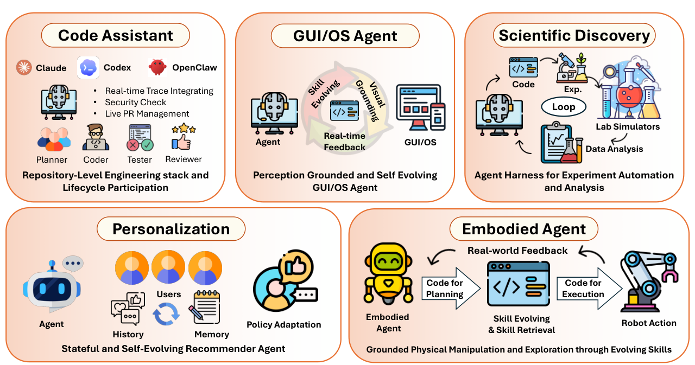

รูปที่ 12: ภาพรวมของ code ในฐานะ agent harness ในโดเมนเกิดใหม่ 5 โดเมน รวมถึงผู้ช่วยเขียนโค้ด
GUI/OS agent การค้นพบทางวิทยาศาสตร์ การปรับเปลี่ยนในแบบของคุณ และ agent ที่เป็นตัวเป็นตน

## 🎨 รายละเอียดจากภาพประกอบ (Figure 12)

**คำอธิบายภาพ (Figure 12):** ภาพรวมของโค้ดในฐานะตัวควบคุมเอเจนต์ (Code as an Agent Harness) ข้ามผ่าน 5 โดเมนที่กำลังเกิดขึ้นใหม่ ซึ่งประกอบไปด้วย เครื่องมือช่วยเหลือการเขียนโค้ด (Coding Assistants), เอเจนต์ระบบปฏิบัติการและอินเตอร์เฟส (GUI/OS Agents), การค้นพบทางวิทยาศาสตร์ (Scientific Discovery), การปรับแต่งเฉพาะบุคคล (Personalization) และเอเจนต์ที่มีร่างสถิต (Embodied Agents)

### 1) ผู้ช่วยด้านโค้ด (Code Assistant)

* **เครื่องมือ/โมเดล:** Claude, Codex, OpenClaw

* **คุณสมบัติหลัก:** การผสานรวมร่องรอยรันไทม์แบบเรียลไทม์ (Real-time Trace Integrating), การตรวจสอบความปลอดภัย (Security Check), การบริหารจัดการ PR แบบสด (Live PR Management)

* **บทบาทเอเจนต์:** ตัววางแผน (Planner), ตัวเขียนโค้ด (Coder), ตัวทดสอบ (Tester), ตัวรีวิว (Reviewer)

* **คำจำกัดความ:** สแตกวิศวกรรมระดับคลังรหัสและการมีส่วนร่วมในวัฏจักรชีวิตโปรแกรม (Repository-Level Engineering stack and Lifecycle Participation)

### 2) เอเจนต์ระบบปฏิบัติการและอินเตอร์เฟส (GUI/OS Agent)

* **กลไกการทำงาน:** เอเจนต์ (Agent) $\rightarrow$ การวิวัฒนาการทักษะ (Skill Evolving) $\rightarrow$ ข้อมูลป้อนกลับแบบเรียลไทม์ (Real-time Feedback) $\rightarrow$ การยึดโยงกับภาพ (Visual Grounding) $\rightarrow$ GUI/OS

* **คำจำกัดความ:** เอเจนต์ GUI/OS ที่รับรู้ผ่านการรับรู้เชิงภาพและวิวัฒนาการได้ด้วยตัวเอง (Perception Grounded and Self Evolving GUI/OS Agent)

### 3) การค้นพบทางวิทยาศาสตร์ (Scientific Discovery)

* **กลไกการทำงาน:** โค้ด (Code) $\rightarrow$ ลูปการทดลอง (Exp. Loop) $\rightarrow$ เครื่องจำลองในห้องแล็บ (Lab Simulators) $\rightarrow$ การวิเคราะห์ข้อมูล (Data Analysis)

* **คำจำกัดความ:** ตัวควบคุมเอเจนต์สำหรับการทำสถานการณ์จำลองการทดลองและการวิเคราะห์แบบอัตโนมัติ (Agent Harness for Experiment Automation and Analysis)

### 4) การปรับแต่งเฉพาะบุคคล (Personalization)

* **องค์ประกอบ:** เอเจนต์ (Agent), ประวัติ (History), ผู้ใช้งาน (Users), หน่วยความจำ (Memory), การปรับตัวของนโยบาย (Policy Adaptation)

* **คำจำกัดความ:** เอเจนต์ผู้แนะนำแบบเก็บสถานะและวิวัฒนาการได้ด้วยตัวเอง (Stateful and Self-Evolving Recommender Agent)

### 5) เอเจนต์ที่มีร่างสถิต (Embodied Agent)

* **กลไกการทำงาน:** ข้อมูลป้อนกลับจากโลกแห่งความเป็นจริง (Real-world Feedback) $\rightarrow$ โค้ดสำหรับการวางแผน (Code for Planning) $\rightarrow$ โค้ดสำหรับการรันคำสั่ง (Code for Execution) $\rightarrow$ เอเจนต์ที่มีร่างสถิต (Embodied Agent) $\rightarrow$ การวิวัฒนาการทักษะและการค้นคืนทักษะ (Skill Evolving & Skill Retrieval) $\rightarrow$ การลงมือทำของหุ่นยนต์ (Robot Action)

* **คำจำกัดความ:** การจัดการทางกายภาพและการสำรวจเชิงพื้นที่ที่ยึดโยงกับความเป็นจริงผ่านทักษะที่วิวัฒนาการได้ (Grounded Physical Manipulation and Exploration through Evolving Skills)

---

## 📄 เนื้อหาบทความหลัก (Main Text)

### 5. โดเมนที่กำลังเกิดขึ้นใหม่และปัญหาเปิด (Emerging Fields and Open Problems)

หลังจากที่เราได้กำหนดคุณลักษณะเฉพาะของโค้ดในฐานะตัวควบคุมเอเจนต์ (Code as an Agent Harness) ผ่านทางอินเตอร์เฟส, กลไก และรูปแบบการประสานงานต่าง ๆ ไปแล้ว ในส่วนนี้เราจะมาตรวจสอบว่า กระบวนทัศน์ (Paradigm) นี้ก่อตัวเป็นรูปธรรมอย่างไรในโดเมนแอปพลิเคชันที่จับต้องได้จริง และมันได้เปิดเผยให้เห็นถึงปัญหาเปิด (Open Problems) ใดบ้าง

ข้ามผ่านทั้ง 5 โดเมน อันได้แก่ เครื่องมือช่วยเหลือการเขียนโค้ด, เอเจนต์ GUI/OS, การค้นพบทางวิทยาศาสตร์, การปรับแต่งเฉพาะบุคคล และเอเจนต์ที่มีร่างสถิต ตัวโค้ดไม่ได้ทำหน้าที่เป็นเพียงแค่ผลลัพธ์ของโมเดล (Model Output) เท่านั้น ทว่ามันยังทำหน้าที่เป็น **ซับสเตรตเชิงปฏิบัติการ (Operational Substrate)** สำหรับการเป็นตัวแทนข้อมูลสถานะ (State Representation), การรันคำสั่งการลงมือทำ (Action Execution), หน่วยความจำ (Memory), ข้อมูลป้อนกลับ (Feedback) และการกำกับดูแล (Governance) อีกด้วย โดเมนเหล่านี้ทำให้คำมั่นสัญญาของระบบเอเจนต์ที่มีโค้ดเป็นศูนย์กลาง (Code-centric Agentic Systems) มีความจับต้องได้จริง ในขณะเดียวกันก็เปิดเผยให้เห็นถึงกลุ่มความท้าทายร่วมกันที่ยังหาข้อสรุปไม่ได้ ในเรื่องของการประเมินผล (Evaluation), การตรวจสอบความถูกต้อง (Verification), ความปลอดภัย (Safety), การประสานงาน (Coordination), การยึดโยงแบบมัลติโมดอล (Multimodal Grounding) และวิวัฒนาการของตัวควบคุม (Harness Evolution)

### 5.1. โดเมนที่กำลังเกิดขึ้นใหม่และแอปพลิเคชันที่จับต้องได้จริง (Emerging Fields and Tangible Applications)

หัวข้อย่อยนี้จะทำการสำรวจ 5 โดเมนแอปพลิเคชันที่ระบบแบบโค้ดในฐานะตัวควบคุม (Code-as-harness Systems) เริ่มมีความโดดเด่นและมองเห็นได้ชัดเจนเป็นพิเศษ ได้แก่:

* **เอเจนต์ผู้ช่วยด้านโค้ด (Code assistants):** จะปฏิบัติงานอยู่เหนือคลังรหัส, ชุดทดสอบ, เครื่องมือพัฒนาซอฟต์แวร์ และเวิร์กโฟลว์การทำงานร่วมกัน

* **เอเจนต์ GUI และระบบปฏิบัติการ (GUI and OS agents):** จะเข้ามาจัดการควบคุมอินเตอร์เฟสที่ถูกเรนเดอร์ (Rendered Interfaces) ผ่านทางการลงมือทำที่รันได้จริง (Executable Actions) และโปรแกรมตรวจสอบความถูกต้องแบบพล็อตคำสั่ง (Programmatic Checkers)

* **เอเจนต์ทางวิทยาศาสตร์ (Scientific agents):** จะทำหน้าที่จัดระเบียบสมมติฐาน, การทดลอง, การวิเคราะห์ และโปรโตคอลในห้องปฏิบัติการ ให้กลายเป็นไปป์ไลน์ที่สามารถรันได้จริง (Executable Pipelines)

* **เอเจนต์การปรับแต่งเฉพาะบุคคล (Personalization agents):** จะปรับตัวนโยบายการแนะนำ (Recommendation Policies) ผ่านทางข้อมูลป้อนกลับของผู้ใช้ที่มีโครงสร้างชัดเจน และสถานะความพึงใจที่สามารถเข้าไปแก้ไขได้ (Editable Preference States)

* **เอเจนต์ที่มีร่างสถิต (Embodied agents):** จะทำหน้าที่ยึดโยงเจตนาในระดับสูง (High-level Intent) ให้กลายเป็นทักษะที่รันได้จริงภายใต้ข้อจำกัดทางกายภาพ (Physical Constraints)

เมื่อนำโดเมนเหล่านี้มารวมกัน จะแสดงให้เห็นว่าโค้ดทำหน้าที่เชื่อมต่อผลลัพธ์ของโมเดลเข้ากับระบบในโลกแห่งความเป็นจริงได้อย่างไร และการออกแบบตัวควบคุมรอบข้าง (Surrounding Harness) ส่งผลต่อความน่าเชื่อถือ, ความสามารถในการควบคุมได้ และความเป็นอิสระในภาระงานระยะยาว (Long-horizon Autonomy) อย่างไร

## หน้า 50

#### 5.1.1. ผู้ช่วยด้านโค้ด (Code Assistants)

เอเจนต์ผู้ช่วยด้านโค้ด (Code assistants) จัดเป็นหนึ่งในโดเมนแอปพลิเคชันที่ชัดเจนที่สุดซึ่งระบบเอเจนต์ที่มีโค้ดเป็นศูนย์กลาง (Code-centric Agentic Systems) สามารถเปิดทำงานและปฏิบัติการได้จริง ระบบในยุคแรก ๆ ส่วนใหญ่จะสนับสนุนเพียงแค่การเติมเต็มโค้ดเฉพาะจุด (Localized Completion) หรือการสร้างโค้ดแบบโต้ตอบรอบเดียว (Single-turn Code Generation) ทว่าเอเจนต์ผู้ช่วยในปัจจุบันได้เปลี่ยนมาปฏิบัติงานครอบคลุมเวิร์กโฟลว์ในระดับคลังรหัส (Repository-level Workflows) ซึ่งมีทั้งการแก้ไขโค้ด, การใช้เครื่องมือ, การตรวจสอบความถูกต้อง และการปฏิสัมพันธ์กับพูลรีเควสต์ (Pull-request Interaction) ประกอบกันเป็นกระบวนการเอเจนต์แบบลูปปิด (Closed-loop Agent Process)

ความพลิกผันนี้สะท้อนให้เห็นในระบบฝั่งงานวิจัย เช่น SWE-agent [57] และ OpenHands [58] รวมถึงแพลตฟอร์มที่มุ่งเน้นการใช้งานจริงในภาคอุตสาหกรรม (Production-oriented Platforms) เช่น Claude Code [26], Codex [27], เอเจนต์เขียนโค้ดของ GitHub Copilot [349] และ DeepAgents [350] ในระบบเหล่านี้ เอเจนต์ผู้ช่วยจะไม่ได้ทำหน้าที่เป็นเพียงตัวสร้างโค้ดแบบเอกเทศ (Standalone Code Generator) อีกต่อไป แต่มันจะถูกฝังตัวลงไปในสภาพแวดล้อมการพัฒนาซอฟต์แวร์ (Development Environment) ที่ซึ่งสถานะของคลังรหัส, เครื่องมือต่าง ๆ, รูทีนการตรวจสอบความถูกต้อง และเวิร์กโฟลว์การทำงานร่วมกัน จะคอยทำหน้าที่จัดเตรียมบริบทเชิงปฏิบัติการ (Operational Context) สำหรับการลงมือทำและข้อมูลป้อนกลับ

* **พื้นที่ทำงานที่มีคลังรหัสเป็นศูนย์กลาง (Repository-centered Workspace):** เอเจนต์ผู้ช่วยด้านโค้ดยุคใหม่จะปฏิบัติงานอยู่เหนือคลังรหัส (Repositories) แทนที่จะเป็นเพียงชิ้นส่วนโค้ดที่แยกขาดจากกัน (Isolated Code Snippets) โดยไฟล์ซอร์สโค้ด, ชุดทดสอบ, สคริปต์สำหรับการบิวด์โปรแกรม (Build Scripts), ข้อมูลเมทาดาตาของความพึ่งพาอาศัยกัน (Dependency Metadata), ประเด็นปัญหา (Issues), กิ่งสาขาโค้ด (Branches) และพูลรีเควสต์ (Pull Requests) จะรวมกันเป็นพื้นที่ทำงานที่คงอยู่ถาวร (Persistent Workspace) ซึ่งเอเจนต์สามารถเข้าตรวจสอบ, แก้ไขปรับปรุง และตรวจสอบความถูกต้องข้ามผ่านหลาย ๆ ขั้นตอนได้ สิ่งนี้ทำให้การช่วยเหลือในระดับคลังรหัสไม่ใช่เรื่องของการพยายามยัดไฟล์ที่เกี่ยวข้องลงไปในคำสั่งกระตุ้น (Prompt) อีกต่อไป แต่เป็นเรื่องของการสร้างมุมมองการทำงานเฉพาะเจาะจงสำหรับงานนั้น ๆ (Task-specific Working View) ขึ้นมาเหนือฐานโค้ดขนาดใหญ่ที่มีวิวัฒนาการอยู่ตลอดเวลา ระบบต่าง ๆ เช่น RepoCoder [47], CodexGraph [351] และ AutoCodeRover [46] เข้ามาจัดการปัญหานี้ผ่านทางการทำดัชนีคลังรหัส (Repository Indexing), การดึงข้อมูลที่รับรู้ถึงความพึ่งพาอาศัยกัน (Dependency-aware Retrieval), ตัวแทนข้อมูลโค้ดแบบอิงตามกราฟ (Graph-based Code Representations) และการระบุตำแหน่งโดยเอเจนต์ (Agentic Localization) ก่อนที่จะเริ่มทำการแก้ไขโค้ด ในแง่นี้ คลังรหัสจึงกลายมาเป็นซับสเตรตเชิงปฏิบัติการ (Operational Substrate) ที่ซึ่งเอเจนต์ผู้ช่วยด้านโค้ดใช้ในการวางแผน, ลงมือทำ และรับข้อมูลป้อนกลับ

* **ตัวควบคุมการพัฒนาที่รันได้จริง (Executable Development Harnesses):** ตัวควบคุมการพัฒนาที่รันได้จริง (Executable development harnesses) กำลังกลายมาเป็นรันไทม์ (Runtime) และระนาบควบคุม (Control Plane) ของเอเจนต์ผู้ช่วยด้านโค้ด แทนที่จะปล่อยให้ตัวโมเดลเผชิญหน้ากับรายการเครื่องมือแบบเรียบ ๆ (Flat List of Tools) แต่ระบบยุคใหม่จะทำการห่อหุ้มโมเดลไว้ภายในลูปการพัฒนาที่มีการบริหารจัดการ (Managed Development Loop) ซึ่งคอยควบคุมการเข้าถึงคลังรหัส, การแก้ไขไฟล์, การรันคำสั่งคอมมานด์ไลน์, ขอบเขตการอนุมัติ (Approval Boundaries), การแยกบริบทเป็นอิสระ (Context Isolation), การบันทึกล็อก และการตรวจสอบความถูกต้อง แนวโน้มนี้สามารถมองเห็นได้ชัดเจนในระบบฝั่งโปรดักชัน:

* **Claude Code** ได้ทำการแพ็กเกจการเขียนโค้ดผ่านทางเทอร์มินัลท้องถิ่น / IDE / เบราว์เซอร์ ให้กลายมาเป็นลูปที่มีเครื่องมือเป็นตัวกลาง (Tool-mediated Loop) พร้อมทั้งมีระบบแก้ไขโค้ด, การรันคำสั่ง, สิทธิ์การเข้าถึง (Permissions), ฮุกจุดเชื่อมต่อ (Hooks), หน่วยความจำ และเอเจนต์ย่อย (Subagents)

* **Codex** และ **เอเจนต์เขียนโค้ดของ GitHub Copilot** ได้ขับเคลื่อนลูปในลักษณะเดียวกันนี้เข้าไปไว้ในพื้นที่ทำงานบนคลาวด์ที่มีการบริหารจัดการ หรือพื้นที่ทำงานที่เป็นสไตล์เนทีฟของ GitHub (GitHub-native Workspaces) ซึ่งเพียบพร้อมไปด้วยกล่องทรายทดลอง (Sandboxes), กิ่งสาขาโค้ด, ระบบอนุมัติ และเอาต์พุตพูลรีเควสต์ที่สามารถตรวจสอบย้อนกลับได้ (Auditable Pull-request Outputs)

* **DeepAgents** เปิดเผยขั้นตอนการวางแผน, สถานะที่รองรับด้วยระบบไฟล์ (Filesystem-backed State), การบริหารจัดการบริบท, การรันโค้ด และการมอบหมายงานให้เอเจนต์ย่อย ในฐานะส่วนประกอบตัวควบคุมที่สามารถนำกลับมาใช้ซ้ำได้ (Reusable Harness Components)

ลูปการทำงานเหล่านั้นได้รับการประสานงานร่วมกันมากขึ้นผ่านทางโปรโตคอลเปิด (Open Protocols) เช่น **โปรโตคอลบริบทโมเดล (Model Context Protocol - MCP)** ซึ่งทำหน้าที่สร้างมาตรฐานว่าตัวควบคุมจะเปิดเผยเครื่องมือ, บริบท และทรัพยากรต่าง ๆ ให้แก่โมเดลอย่างไร และเปิดโอกาสให้สามารถนำเครื่องมือกลับมาใช้ซ้ำข้ามระบบได้ ในขณะเดียวกัน งานวิจัยเมื่อไม่นานมานี้เริ่มปฏิบัติกับตัวควบคุม (Harness) เองในฐานะวัตถุสำหรับการเพิ่มประสิทธิภาพ (Object of Optimization) มากกว่าจะเป็นเพียงแค่กรอบห่อหุ้มที่ถูกตรึงไว้ตายตัว:

* *AutoHarness [14]* ทำหน้าที่สังเคราะห์ตัวควบคุมโค้ดจากข้อมูลป้อนกลับของสภาพแวดล้อม

* *Meta-Harness [13]* ทำการค้นหาเหนือโค้ดตัวควบคุมโดยใช้ผู้สมัครรายก่อนหน้าและร่องรอยการรันโค้ด

* *Agentic Harness Engineering [281]* ทำการวิวัฒนาการตัวควบคุมเอเจนต์เขียนโค้ดผ่านทางความสามารถในการสังเกตตรวจสอบ (Observability)

* *Natural-Language Agent Harnesses [353]* แปลงบทบาทหน้าที่, สัญญาข้อตกลง (Contracts), ตัวปรับต่อ (Adapters) และข้อกำหนดสถานะ ให้กลายเป็นข้อกำหนดเฉพาะของตัวควบคุมที่สามารถเข้าไปแก้ไขได้ (Editable Harness Specifications)

ความก้าวหน้าเหล่านี้ร่วมกันบ่งชี้ว่า ความคืบหน้าในทางปฏิบัติของเอเจนต์ผู้ช่วยด้านโค้ดนั้น ถูกกำหนดทิศทางเพิ่มมากขึ้นเรื่อย ๆ ไม่ใช่เพียงแค่จากการปรับปรุงตัวโมเดลฐาน (Base Model) ให้ดีขึ้นเท่านั้น แต่ยังรวมถึงตัวรันไทม์ของการรันโค้ดรอบข้าง (Surrounding Execution Runtime) ซึ่งนับรวมไปถึงระบบกล่องทราย, สิทธิ์การเข้าถึง, การจัดวางท่อบริบท (Context Plumbing), ระบบโทรมาตร (Telemetry) และฮุกสำหรับตรวจสอบความถูกต้อง (Verification Hooks) อีกด้วย

* **ข้อมูลป้อนกลับจากการรันโค้ดในฐานะการตรวจสอบความถูกต้องแบบยึดโยงความจริง (Execution Feedback as Grounded Verification):** คุณสมบัติที่โดดเด่นเฉพาะตัวของเอเจนต์ผู้ช่วยด้านโค้ดคือการมีข้อมูลป้อนกลับที่เครื่องจักรสามารถตรวจสอบได้ (Machine-checkable Feedback): เช่น ผลวินิจฉัยจากคอมไพเลอร์ (Compiler Diagnostics), ผลลัพธ์ของชุดทดสอบ, คำเตือนจากตัวตรวจจับสไตล์และข้อผิดพลาดของโค้ด (Linter Warnings) และร่องรอยการทำงานขณะรันไทม์ (Runtime Traces) ระบบ **Agentless [354]** แสดงให้เห็นว่า ไปป์ไลน์การระบุตำแหน่งข้อผิดพลาด (Fault-localization) และการสร้างโค้ดแก้ไข (Patch-generation) ที่ถูกนำทางด้วยการรันชุดทดสอบ (Test Execution) สามารถบรรลุผลลัพธ์ที่แข่งขันได้อย่างยอดเยี่ยมบนเกณฑ์วัด SWE-bench [216] โดยไม่จำเป็นต้องพึ่งพาระบบควบคุมของเอเจนต์ที่ซับซ้อนเลย ขณะที่ระบบ **RepairAgent [183]**...

## หน้า 51

...และระบบ **Live-SWE-agent** [182] ได้ขยายลูปการทำงานนี้ไปสู่การซ่อมแซมโปรแกรมแบบอัตโนมัติ (Autonomous Program Repair) ที่ถูกขับเคลื่อนด้วยผลลัพธ์ของชุดทดสอบ ในขณะที่ระบบ **AlphaCodium** [355] แสดงให้เห็นว่า วิศวกรรมเวิร์กโฟลว์ที่ขับเคลื่อนด้วยการทดสอบ (Test-driven Flow Engineering) ช่วยปรับปรุงประสิทธิภาพในการเขียนโปรแกรมเพื่อการแข่งขันได้อย่างมาก เมื่อเทียบกับการใช้คำสั่งกระตุ้นแบบรอบเดียวจบ (Single-shot Prompting) การรันโค้ดจริง (Execution) จึงทำหน้าที่เปลี่ยนโค้ดแก้ไขผู้สมัครแต่ละตัว จากเดิมที่เป็นเพียงแค่สมมติฐานเชิงข้อความ (Textual Hypothesis) ให้กลายเป็นการแปลงสถานะที่สามารถตรวจสอบความถูกต้องได้จริง (Verifiable Transformation) ภายในโลกของโปรแกรม

* **การจัดการหน่วยความจำและบริบทในระดับคลังรหัส (Memory and Context Management at Repository Scale):** คลังรหัสโดยทั่วไปมักจะมีขนาดระบบที่ใหญ่เกินกว่าหน้าต่างบริบท (Context Window) ใด ๆ จะรองรับได้ ส่งผลให้เอเจนต์ผู้ช่วยด้านโค้ดจำเป็นต้องคงรักษาหน่วยความจำที่มีโครงสร้างชัดเจนและระบุไว้โดยตรง (Explicit, Structured Memory) รูปแบบการเติมเต็มโค้ดแบบเพิ่มขยายด้วยการดึงข้อมูล (Retrieval-augmented Completion) [47], การทำดัชนีโค้ดแบบอิงตามกราฟ (Graph-based Code Indexing) [351], เอเจนต์ที่เน้นการจัดการเอกสารข้อมูล เช่น **RepoAgent** [356] และเกณฑ์วัดการค้นคืนบริบทเมื่อไม่นานมานี้อย่าง **ContextBench** [357] ต่างประยุกต์ใช้แนวคิดนามธรรมของหน่วยความจำ (Memory Abstractions) จากหัวข้อ §3.2 มาปรับแต่งในสไตล์เฉพาะเจาะจงสำหรับงานโค้ด: กล่าวคือ รายการข้อมูลที่ถูกจัดเก็บ เช่น ฟังก์ชัน, ชุดทดสอบ, ร่องรอยรันไทม์ และบริบทของประเด็นปัญหาที่ถูกดึงข้อมูลมา ตัวมันเองนั้นสามารถรันได้จริงหรือผูกโยงอยู่กับสถานะที่รันได้จริงโดยตรง ซึ่งทำให้สามารถนำมารันซ้ำ, ตรวจสอบ หรือระบุตำแหน่งได้ แทนที่จะเป็นเพียงแค่การเปิดอ่านซ้ำเฉย ๆ ยิ่งไปกว่านั้น ระบบหน่วยความจำยุคใหม่ยังได้ขยายมุมมองนี้เพิ่มเติมด้วยการจัดเก็บขั้นตอนการทำงานของเอเจนต์ที่นำกลับมาใช้ซ้ำได้ หรือจัดเก็บประสบการณ์จากคลังรหัสในฐานะหน่วยความจำเชิงขั้นตอน (Procedural Memory) และหน่วยความจำเชิงประสบการณ์ (Experiential Memory) [45, 48] สิ่งนี้ช่วยลดช่องว่างระหว่างหน่วยความจำและสภาพแวดล้อมที่มักพบในสถาปัตยกรรมเอเจนต์แบบดั้งเดิม และทำให้การบริหารจัดการแนวคิดเชิงนามธรรม (Abstraction Management) กลายเป็นเรื่องที่มีความสำคัญอย่างยิ่งวิกฤต เนื่องจากเอเจนต์ผู้ช่วยจำเป็นต้องคัดเลือกขนาดของโค้ดและประสบการณ์ที่ถูกต้องเหมาะสมขึ้นมาแสดงผลสำหรับงานย่อยนั้น ๆ

* **เจตนาของนักพัฒนาและข้อกำหนดแบบแผนของโปรเจกต์ในฐานะสถานะแฝง (Developer Intent and Project Conventions as Latent State):** นอกเหนือจากสถานะคลังรหัสที่ระบุไว้อย่างชัดเจนแล้ว เอเจนต์ผู้ช่วยด้านโค้ดในภาคปฏิบัติจะต้องสามารถให้เหตุผลเกี่ยวกับเจตนาแฝงของนักพัฒนา (Latent Developer Intent) และข้อกำหนดแบบแผนของโปรเจกต์ (Project Conventions) ได้ด้วย โค้ดแก้ไขโค้ดที่มีประโยชน์ไม่เพียงแต่จะต้องรันผ่านชุดทดสอบที่มองเห็นได้เท่านั้น แต่ยังต้องสอดคล้องกับสถาปัตยกรรมของคลังรหัส, สไตล์การเขียนโค้ด และการนำระบบ APIs ภายในกลับมาใช้ซ้ำ ซึ่งคุณสมบัติเหล่านี้งานวิจัยเมื่อไม่นานมานี้อธิบายว่าเป็น **ความเป็นเนื้อเดียวกันตามธรรมชาติของโค้ดที่ถูกสร้างขึ้น (Organicity of Generated Code)** [358] เอเจนต์ที่ละเลยต่อข้อจำกัดเหล่านี้อาจจะผลิตโค้ดแก้ไขที่ถูกต้องตามหลักเทคนิค แต่อาจจะถูกปฏิเสธโดยผู้ดูแลระบบอยู่ดี [358, 359] ในขณะที่การวิเคราะห์เกณฑ์วัดแสดงให้เห็นว่า ประเด็นปัญหาบางส่วนใน SWE-bench ที่ดูเหมือนจะถูกคลี่คลายได้แล้วนั้น แท้จริงแล้วพึ่งพาการรั่วไหลของโซลูชัน (Solution Leakage) ที่ซ่อนอยู่ในข้อความอธิบายประเด็นปัญหา มากกว่าจะเป็นการอนุมานเจตนาที่แท้จริง [360] การช่วยเหลือด้านการเขียนโค้ดจึงจัดเป็นปัญหาโลกโปรแกรมที่สามารถสังเกตได้เพียงบางส่วน (Partially Observable Program World Problem): โดยไฟล์ต่าง ๆ, ชุดทดสอบ และเอาต์พุตของเครื่องมือ จะทำหน้าที่จัดเตรียมสถานะที่สามารถสังเกตได้ (Observable State) ในขณะที่เหตุผลเชิงการออกแบบ (Design Rationales), ข้อจำกัดแบบแฝง และข้อกำหนดแบบแผนของทีม เป็นสิ่งที่จะต้องถูกอนุมานขึ้นมาจากเธรดการพูดคุยของประเด็นปัญหา, การคอมมิตในอดีต, การรีวิวโค้ด และประวัติการปฏิสัมพันธ์ที่สะสมมา สิ่งนี้ได้ขยายขอบเขตปัญหาความเบี่ยงเบนของสถานะความเชื่อ (Belief State Divergence) ที่เคยศึกษาในระบบ SyncMind จากเดิมที่เป็นสถานะแฝงร่วมกันของหลายเอเจนต์ ไปสู่การปรับความสอดคล้องกันระหว่างเอเจนต์เดี่ยวและตัวผู้ใช้งาน (Individual Agent and User Alignment) [347] การสร้างโมเดลสำหรับสถานะแฝงนี้จึงมีความจำเป็นอย่างยิ่ง ต่อการเปลี่ยนผ่านจากการสร้างโค้ดตามฟังก์ชันทั่วไป ไปสู่การทำงานร่วมกับนักพัฒนาได้อย่างน่าเชื่อถือ

* **จากเครื่องมือเติมเต็มโค้ดอินไลน์สู่เอเจนต์วิศวกรรมซอฟต์แวร์อัตโนมัติ (From Inline Completion to Autonomous SWE Agents):** วิวัฒนาการของเอเจนต์ผู้ช่วยด้านโค้ดสามารถมองได้ว่าเป็นการขยายตัวของตัวควบคุมการพัฒนา (Development Harness) รอบตัวโมเดล ระบบในยุคแรก ๆ เช่น ระบบเติมเต็มโค้ดฐาน Codex [1] และผู้ช่วยเชิงพาณิชย์ เช่น Copilot [361] พึ่งพาตัวควบคุม IDE น้ำหนักเบา (Lightweight IDE Harness) ซึ่งจะคอยนำเสนอข้อมูลบริบทท้องถิ่น และสร้างข้อเสนอแนะแบบอินไลน์ (Inline Suggestion) โดยที่ตัวนักพัฒนายังคงทำหน้าที่หลักเป็นผู้รันโค้ด, ผู้ตรวจสอบความถูกต้อง และผู้จัดการสถานะ งานวิจัยด้านผลิตภาพ [361] และความสามารถในการใช้งาน [362, 363] แสดงให้เห็นว่า แม้แต่ตัวควบคุมน้ำหนักเบานี้ก็มีความสำคัญอย่างมาก เนื่องจากคุณค่าของข้อเสนอแนะจะขึ้นอยู่กับความสอดคล้องของมันกับสถานะโปรแกรมและเจตนาที่กำลังวิวัฒนาการของตัวนักพัฒนาเอง ในทางตรงกันข้าม สำหรับฝั่งเอเจนต์อัตโนมัติ (Autonomous End) ระบบต่าง ๆ เช่น SWE-agent, OpenHands, AutoCodeRover และ Agentless จะปฏิบัติการอยู่ภายใต้ตัวควบคุมในระดับคลังรหัส (Repository-level Harness) โดยเปลี่ยนจากการสร้างโค้ดแบบแยกขาดเป็นการเข้าตรวจสอบสถานะ, การแก้ไข, การรันโค้ด และการแก้ไขปรับปรุงแบบเก็บสถานะ (Stateful Operation)

* **จากการสร้างโค้ดแก้ไขสู่การมีส่วนร่วมในวัฏจักรชีวิตซอฟต์แวร์ (From Patch Generation to Software Lifecycle Participation):** เอเจนต์ผู้ช่วยด้านโค้ดยังคงขับเคลื่อนจากการสร้างโค้ดแก้ไขแบบแยกขาด ไปสู่การมีส่วนร่วมในวัฏจักรชีวิตซอฟต์แวร์ในขอบเขตที่กว้างขวางขึ้น เกณฑ์วัด SWE-bench กำหนดกรอบการช่วยเหลือในระดับคลังรหัสไว้เสมือนเป็นภาระงานแปลงประเด็นปัญหาสู่โค้ดแก้ไข (Issue-to-patch Task) [5] ในขณะที่เกณฑ์วัดที่ใหม่กว่าอย่าง **SWE-Lancer** [364] และ **SWE-Bench Pro** [365] จะประเมินผลลัพธ์ซอฟต์แวร์ที่มีระยะเวลายาวนานขึ้นและมีมูลค่าเชิงเศรษฐกิจในโลกแห่งความเป็นจริง ซึ่งครอบคลุมเนื้อหาหลายส่วน...

## หน้า 52

...หลาย ๆ ไฟล์ และจำเป็นต้องใช้ความพยายามทางวิศวกรรมในระดับมืออาชีพ เกณฑ์วัดมาตรฐานที่เกี่ยวข้อง เช่น Terminal-Bench [366] และ AppWorld [367] ยิ่งช่วยสะท้อนให้เห็นถึงความพลิกผันในลักษณะเดียวกันนี้ ไปสู่สภาพแวดล้อมที่มีการปฏิสัมพันธ์โต้ตอบ (Interactive Environments) ซึ่งเอเจนต์จำเป็นต้องปฏิบัติงานผ่านทางคำสั่งคอมมานด์ไลน์, เครื่องมือต่าง ๆ และสถานะแอปพลิเคชันที่รันได้จริง [368, 369] ในแง่ของการนำไปใช้งานจริง (Deployment) แนวโน้มนี้จะปรากฏให้เห็นในรูปแบบของเอเจนต์ที่เข้าไปทำงานอยู่ภายในเวิร์กโฟลว์วิศวกรรมที่คงอยู่ถาวร (Persistent Engineering Workflows) แทนที่จะเป็นเพียงภาพสแนปชอตของคลังรหัสแบบสแตติก ซึ่งรวมถึงกระบวนการรีวิวพูลรีเควสต์ (Pull-request Review), ข้อมูลป้อนกลับจากระบบ CI/CD และการแก้ไขปัญหาในฝั่งโปรดักชัน [370, 371] ทั้งนี้ ในระดับสเกลโปรดักชัน (Production Scale) มีรายงานจาก LingmaAgent ว่า เอเจนต์แก้ไขปัญหาที่ถูกนำไปติดตั้งใช้งานแบบอัตโนมัติภายในองค์กรของ Alibaba Cloud สามารถ คลี่คลายประเด็นปัญหาภายในประเทศได้สำเร็จสูงถึง 16.9% แบบอัตโนมัติโดยสมบูรณ์ และอีก 43.3% ผ่านการเข้ามาช่วยจัดการด้วยมือของมนุษย์ (Manual Intervention) [372, 373] สิ่งนี้บ่งชี้ว่าเอเจนต์ผู้ช่วยด้านโค้ดกำลังกลายมาเป็นผู้มีส่วนร่วมในเวิร์กโฟลว์ ไม่ใช่เป็นเพียงแค่ตัวสร้างโค้ดแก้ไข (Patch Generators) อีกต่อไป

* **การช่วยเหลือด้านโค้ดแบบหลายเอเจนต์และคลังรหัสที่ใช้ร่วมกัน (Multi-Agent Code Assistance and Shared Repositories):** ในระดับบนสุดของสเปกตรัมนี้ การช่วยเหลือด้านโค้ดมีแนวโน้มที่จะปรับเปลี่ยนไปสู่รูปแบบระบบหลายเอเจนต์ (Multi-agent Form) เพิ่มมากขึ้นเรื่อย ๆ โดยมีบทบาทหน้าที่อย่าง ตัววางแผน (Planner), ตัวเขียนโค้ด (Coder), ตัวทดสอบ (Tester) และตัวรีวิว (Reviewer) ร่วมกันปฏิบัติงานอยู่เหนือคลังรหัสที่ใช้ร่วมกัน (Shared Repository) ระบบ ChatDev [330], MetaGPT [55], CodeAgent [185] และ METAL [374] ได้แสดงให้เห็นว่า ความเชี่ยวชาญเฉพาะทางด้านบทบาทหน้าที่ (Role Specialization) เมื่อนำมาผสานรวมเข้ากับชิ้นงานที่สามารถรันได้จริงและใช้ร่วมกัน (Shared Executable Artifact) จะช่วยเปิดโอกาสให้เกิดรูปแบบการประสานงาน (Coordination Patterns) ที่เอเจนต์เดี่ยว ๆ มักจะประสบความยากลำบากในการคงรักษาความต่อเนื่องเอาไว้ได้ในภาระงานระยะยาว คลังรหัสพร้อมด้วยชุดทดสอบและร่องรอยการรันโค้ด (Execution Traces) ในตัวเอง จะกลายมาเป็นทั้งสื่อกลางในการสื่อสารและเป้าหมายของการลู่เข้าสู่จุดสิ้นสุด (Convergence Target) ซึ่งเป็นการสร้างรูปแบบที่เป็นรูปธรรมโดยตรงให้กับแนวคิดโลกโปรแกรมที่ใช้ร่วมกัน (Shared Program World) ในหัวข้อ §4 อย่างไรก็ตาม การแก้ไขโค้ดที่เกิดขึ้นพร้อม ๆ กัน (Concurrent Edits) อาจจะเข้าไปทำลายข้อสมมติฐานที่ถือครองไว้โดยเอเจนต์ตัวอื่น ๆ ได้อย่างเงียบเชียบ ซึ่งเป็นการเปิดเผยให้เห็นถึงความท้าทายด้านการประสานเวลาของสถานะโลก (World-state Synchronization Challenges) ที่ได้ร่วมอภิปรายกันไปในหัวข้อเดียวกันนั้นเอง

* **ตัวควบคุมในฐานะพื้นผิวสำหรับการกลั่นกรองข้อมูล (The Harness as a Distillation Surface):** พัฒนาการที่สำคัญและเป็นตัวกำหนดนิยามในปี 2026 คือการที่ตัวควบคุมในระดับโปรดักชัน (Production Harnesses) ไม่ได้ทำหน้าที่เป็นเพียงแค่โครงสร้างพื้นฐานสำหรับการติดตั้งใช้งาน (Deployment Infrastructure) อีกต่อไป; ทว่าพวกมันกำลังกลายมาเป็นแหล่งข้อมูลการฝึกฝนหลัก (Dominant Source of Training Data) สำหรับโมเดลผู้ช่วยด้านโค้ดในยุคถัดไป ตัวอย่างเช่น เครื่องมือ Composer ของ Cursor นั้น ถูกฝึกฝนด้วยกระบวนการเรียนรู้แบบเสริมกำลังออนไลน์อย่างต่อเนื่อง (Continuous Online Reinforcement Learning) บนร่องรอยการใช้งานจริงของระบบ Cursor ซึ่งช่วยกระชับลูปความเชื่อมโยงระหว่างพฤติกรรมของเอเจนต์ที่ถูกติดตั้งใช้งานกับการอัปเดตตัวโมเดลให้มีความแน่นแฟ้นยิ่งขึ้น [375, 376] นอกจากนี้ โมเดล codex-1 ของ OpenAI (ซึ่งเป็นอนุพันธ์ที่ต่อยอดมาจาก o3) [27], GPT-5-Codex [377] และ GPT-5.1-Codex-Max [378] ต่างได้รับการฝึกฝนอย่างเฉพาะเจาะจงบนการปฏิสัมพันธ์เขียนโค้ดแบบหลายรอบและมีระยะเวลายาวนาน (Long-horizon, Multi-turn Coding Interactions) ซึ่งถอดแบบมาจากลูปตัวควบคุมของ Codex ในขณะที่การทดลองใช้งานภายในองค์กร (Dogfooding) ของเครื่องมือ Claude Code โดย Anthropic ก็ได้ช่วยส่งมอบช่องข้อมูลป้อนกลับ (Feedback Channel) ในลักษณะเดียวกัน ซึ่งมีหลักสาระสำคัญปรากฏอยู่ในสมุดปกขาว "teams-using-Claude-Code" ของพวกเขา [379] ในเวลาเดียวกัน ตัวควบคุม (Harness) เองก็กำลังกลายมาเป็นวัตถุสำหรับการเพิ่มประสิทธิภาพที่ระบุชัดเจน (Explicit Optimization Object):

* *AutoHarness [14]* ทำหน้าที่สังเคราะห์โค้ดตัวควบคุมด้วย LLM ขนาดเล็กกว่า ซึ่งทำหน้าที่ช่วยกรองการลงมือทำที่ผิดกฎ (Illegal Actions) ออกไป

* *Agentic Harness Engineering [281]* ทำการปิดลูปวิวัฒนาการที่ขับเคลื่อนด้วยความสามารถในการสังเกตตรวจสอบ (Observability-driven Evolution Loop) เหนือส่วนประกอบของตัวควบคุม

* *Meta-Harness [13]* จัดรูปแบบที่เป็นทางการให้กับการเพิ่มประสิทธิภาพร่วมกันระหว่างโมเดลและตัวควบคุม (Joint Model-harness Optimization)

* *Live-SWE-agent [182]* ทำการแก้ไขโครงสร้างนั่งร้าน (Scaffolding) ของตัวมันเองในตอนรันไทม์

สิ่งเหล่านี้ร่วมกันบ่งชี้ว่า เส้นแบ่งเขตแดนระหว่าง "ตัวเอเจนต์ (The Agent)" และ "ตัวควบคุมรอบตัวเอเจนต์ (The Harness Around the Agent)" กำลังแปรเปลี่ยนมาเป็นพื้นผิวที่สามารถเรียนรู้ได้ (Learnable Surface) ในตัวของมันเอง

* **ปัญหาเปิดและสิ่งที่ท้าทายสำหรับตัวควบคุมผู้ช่วยด้านโค้ด (Open Challenges for Code-Assistant Harnesses):** การเติบโตเต็มที่ของตัวควบคุมในระดับโปรดักชันได้นำพาให้เกิดปัญหาเปิดเฉพาะทางด้านงานโค้ดหลายประการ ซึ่งเข้ามาเติมเต็มวาระงานข้ามโดเมน (Cross-domain Agenda) ที่จะร่วมอภิปรายกันในหัวข้อย่อยถัดไป

* **ประการแรก** การตรวจสอบความถูกต้องที่ก้าวข้ามขอบเขตเหนือกว่าเพียงยูนิตเทสต์ (Verification Beyond Unit Tests) ยังคงเป็นเรื่องที่ส่วนใหญ่ยังไม่สามารถหาโซลูชันคลี่คลายได้: วิกฤตความเพียงพอของออราเคิล (Oracle-adequacy Crisis) ที่เปิดเผยโดย PatchDiff [380] และ SWE-Bench++ [381], ช่องว่างระหว่างความถูกต้องและความปลอดภัย (Security-correctness Gap) ที่ถูกระบุโดย Aardvark [382] และ Codex Security [383] รวมถึงช่องว่างด้านความเป็นเนื้อเดียวกันตามธรรมชาติ (Organicity Gap) ระหว่างโค้ดแก้ไขที่ทำงานได้ตามฟังก์ชันกับโค้ดแก้ไขที่ได้รับการยอมรับจากผู้ดูแลระบบ [358, 359] ทั้งหมดนี้ต่างบ่งชี้ไปสู่พื้นผิวของผู้ตรวจสอบความถูกต้อง (Verifier Surface) ที่ตัวควบคุมในปัจจุบันยังไม่ได้กำหนดข้อกำหนดเฉพาะไว้ชัดเจนพอ

* **ประการที่สอง** การระบุที่มาของความล้มเหลว (Failure Attribution) ในลูปการทำงานของเอเจนต์ที่มีระยะเวลายาวนานยังคงไม่มีความพร้อมและเติบโตไม่เต็มที่: โดยงานวิจัยเชิงประจักษ์ เช่น "Why do multi-agent systems fail?" [384], ชุดข้อมูลการระบุที่มา Who&When [385], AgenTracer [386] และ AgentDebug [387] ต่างรายงานค่าความแม่นยำในการระบุที่มาในระดับขั้นตอนที่ดีที่สุด (Best Step-level Attribution Accuracies) อยู่เพียงในขอบเขต 14-53% เท่านั้น ซึ่งบ่งชี้ว่าตัวควบคุมในระดับโปรดักชันยังคงขาดแคลนร่องรอยที่มีโครงสร้างชัดเจน (Structured Traces) ที่จำเป็นสำหรับการดีบั๊กที่มีหลักการสากลรองรับ

* **ประการที่สาม** การกำกับดูแลด้านความปลอดภัย (Safety Governance) ของการรันโค้ดแบบอัตโนมัติ จำเป็นต้องอาศัยพริมิทีฟเชิงความสามารถ (Capability-based Primitives) ซึ่งยังคงหาได้ยากในทางปฏิบัติ: โครงสร้างผู้กำกับความสามารถที่ถูกเรียนรู้ขึ้นมาของ Aethelgard [388], ระบบกล่องทรายแบบทรานแซกชันที่ทนทานต่อความเสียหาย (Fault-tolerant Transactional Sandboxing) [389] และเครื่องมือ Agent Governance Toolkit ของ Microsoft [390] ถือเป็นตัวแทนของก้าวแรก ๆ มุ่งสู่การบังคับใช้หลักการสิทธิ์ขั้นต่ำ (Least Privilege) ภายใต้การลงมือทำพร้อม ๆ กันของเอเจนต์

* **ประการที่สี่** วิวัฒนาการตัวเองของตัวควบคุม (Harness Self-evolution) ในระดับสเกลโปรดักชัน—ซึ่งถูกสาธิตให้เห็น...

## หน้า 53

...ซึ่งถูกสาธิตให้เห็นเพียงในขอบเขตที่จำกัดโดยระบบ AutoHarness, AHE และ Live-SWE-agent นั้น ได้ตั้งคำถามเกี่ยวกับความเสถียรและการย้อนกลับระบบ (Stability and Rollback Questions) ซึ่งเป็นสิ่งที่ไม่พบในตัวควบคุมประเภทที่ไม่สามารถแก้ไขดัดแปลงตัวเองได้ **ประการที่ห้า** การประสานเวลาของสถานะหลายเอเจนต์ (Multi-agent State Synchronization) บนคลังรหัสที่มีการใช้งานจริง (Live Repositories) จะขยายวงกว้างจากปัญหาความเบี่ยงเบนของสถานะความเชื่อ (Belief-state Divergence Problem) ของระบบ SyncMind [347] ไปสู่สภาพแวดล้อมที่มนุษย์, เอเจนต์อัตโนมัติ และระบบ CI ร่วมกันปรับเปลี่ยนแก้ไขสถานะโปรแกรมที่ใช้ร่วมกันในเวลาเดียวกัน **ประการสุดท้าย** การปรับเทียบความน่าเชื่อถือ (Trust Calibration) ในประสบการณ์ผู้ใช้งานสำหรับการจับคู่เขียนโปรแกรมระหว่างมนุษย์และเอเจนต์ (Pair Programming User Experience) ยังคงเป็นปัญหาด้านปัจจัยมนุษย์ (Human Factors Problem) ที่ยังได้รับการศึกษาไม่มากพอ ซึ่งรวมถึงการตัดสินใจว่าเมื่อใดควรเข้าแทรกแซง/ขัดจังหวะ, เมื่อใดควรบันทึกจุดตรวจสอบสถานะ (Checkpoint), เมื่อใดควรมอบหมายงาน และเมื่อใดควรยอมผ่อนตาม แม้ว่าประเด็นนี้จะเป็นหัวใจสำคัญต่อการพิจารณาว่าความเป็นอิสระที่ขับเคลื่อนด้วยตัวควบคุม (Harness-driven Autonomy) จะสามารถขยายขนาดไปสู่เวิร์กโฟลว์ระดับองค์กรได้อย่างปลอดภัยหรือไม่ก็ตาม

เอเจนต์ผู้ช่วยด้านโค้ดจึงเป็นรูปธรรมที่ชัดเจนที่สุดของการนำระบบเอเจนต์ที่มีโค้ดเป็นศูนย์กลาง (Code-centric Agentic Systems) ไปติดตั้งใช้งานจริงในฝั่งโปรดักชัน และเป็นสนามทดสอบที่ท้าทายที่สุดสำหรับศาสตร์แห่งวิศวกรรมตัวควบคุม (Harness-engineering Discipline) ที่กำลังเกิดขึ้นใหม่ในขณะนี้ทั้งในแวดวงอุตสาหกรรมและสถาบันการศึกษา

### 5.1.2. เอเจนต์ GUI/OS ในฐานะโลกของโปรแกรม (GUI/OS Agents as a Program World)

อินเตอร์เฟสผู้ใช้เชิงกราฟิก (Graphical User Interfaces) และระบบปฏิบัติการ (Operating Systems) อาจจะนับได้ว่าเป็นสิ่งที่เป็น "โลกของโปรแกรม" (Program World) ในความหมายที่ตรงตัวที่สุด ยิ่งกว่าแอปพลิเคชันเชิงประจักษ์อื่นใดของเอเจนต์โมเดลฐาน (Foundation-model Agents): เนื่องจากทุก ๆ การสังเกตรับรู้ (Observation) ที่เอเจนต์ได้รับ คือผลลัพธ์ที่ถูกเรนเดอร์ออกมาของโค้ดที่รันได้จริง (เช่น HTML, CSS, แผนผังโครงสร้าง XML, ระบบ Accessibility APIs, เฟรมบัฟเฟอร์ที่ถูกขับเคลื่อนด้วยตัวจัดการหน้าต่าง) และทุก ๆ การลงมือทำ (Action) ที่เอเจนต์เลือกใช้ ก็คือการเรียกใช้งาน (Call) เข้าไปในโค้ดอีกชิ้นหนึ่ง (เช่น เหตุการณ์ DOM Event, คำสั่ง adb shell, การกดแป้นพิมพ์ที่ถูกดักจับโดยลูปเหตุการณ์ของระบบปฏิบัติการ, สคริปต์ Playwright) ด้วยเหตุผลนี้ เอเจนต์ GUI/OS จึงได้กลายมาเป็นสนามทดสอบมาตรฐาน (Canonical Testbed) สำหรับวิทยานิพนธ์หลักที่ว่า **โค้ดคือซับสเตรตหนึ่งเดียวที่รวมทุกสิ่งเข้าด้วยกัน (Unifying Substrate)** ซึ่งสามารถใช้เป็นตัวแทน, รันสั่งการ และตรวจสอบความถูกต้อง ให้กับการรับรู้ (Perception), การลงมือทำ, พลวัตของสภาพแวดล้อม และหน่วยความจำได้ โดยเราจะพัฒนาขยายมุมมองนี้อย่างเป็นระบบดังต่อไปนี้

#### สภาพแวดล้อม GUI/OS ในฐานะโลกโปรแกรมที่สังเกตได้เพียงบางส่วน (GUI/OS as a Partially Observable Program World)

เรากำหนดโมเดลสภาพแวดล้อม GUI/OS ให้เป็นกระบวนการตัดสินใจแบบมาร์คอฟที่สังเกตได้เพียงบางส่วน (Partially Observable Markov Decision Process หรือ POMDP) 

$$(S, A, O, T, R)$$

 ซึ่งสถานะแฝง (Latent State) $s\in\mathcal{S}$ คือสถานะโปรแกรมฉบับเต็มของหนึ่งโปรเซสหรือมากกว่า (เช่น โครงสร้าง DOM ฉบับเต็มและ JavaScript Heap ของเบราว์เซอร์, แสตกกิจกรรม [Activity Stack] และ Content Providers ของโปรแกรมจำลอง Android, ระบบไฟล์และแผนผังหน้าต่างของ Linux VM) เอเจนต์จะไม่เคยได้สังเกตรับรู้สถานะ $s$ โดยตรง; แต่มันจะสังเกตรับรู้ผ่าน $o\in\mathcal{O}$ ซึ่งในระบบยุคปัจจุบันจะใช้รูปแบบใดรูปแบบหนึ่งจาก 4 รูปแบบที่ถูกกำหนดขึ้นด้วยโค้ด (Code-defined Forms) ดังนี้:

1. โครงสร้างย่อยของ HTML หรือ DOM ที่ถูกแปลงเป็นข้อมูลอนุกรม (Serialized DOM / HTML Subtree) ดังที่ใช้ใน WebArena และ Mind2Web [60, 59]

2. แผนผังการเข้าถึงข้อมูล (Accessibility Tree หรือ AXTree) ที่เปิดเผยโดย UIAutomator ของ Android หรือโดย accessibility APIs ของ macOS/Windows ดังเช่นตัวอย่างที่ระบบ AndroidWorld, WindowsAgentArena และ AgentOccam [391, 392, 393] นำไปประยุกต์ใช้

3. ภาพสแนปชอตหน้าจอ (Screenshot) ที่มีการเขียนกำกับพิกัดด้วยกล่องขอบเขต (Bounding-box) หรือพิกัดชุดเครื่องหมาย (Set-of-Mark Coordinates) ซึ่งเป็นตัวแทนข้อมูลที่ถูกนำไปใช้ใน SeeAct, WebVoyager, OSWorld และโมเดลแบบเนทีฟส่วนใหญ่เมื่อไม่นานมานี้ [394, 395, 396, 397]

4. ตัวแทนข้อมูลแบบผสมผสาน (Hybrid Representations) ที่สลับสับเปลี่ยนระหว่างข้อมูลพิกเซล (Pixels), ข้อมูลเมทาดาตาการเข้าถึงข้อมูล (Accessibility Metadata) และ HTML ดังที่พบในพื้นที่การสังเกต BrowserGym ของ WebArena และในตัวเข้ารหัสความละเอียดคู่ (Dual-resolution Encoder) ของ CogAgent [398, 399]

ในส่วนของพื้นที่การลงมือทำ (Action Space) $A$ ก็เป็นรูปแบบโค้ดเช่นเดียวกัน: นั่นคือเป็นทูเพิล `(action_type, target, value)` ที่จะถูกคอมไพล์ไปเป็นทั้งการเรียกใช้งานระดับ DOM/accessibility (เช่น `element.click()`, `setText(node_id, "...")`) หรือเป็นพริมิทีฟคำสั่งเมาส์/คีย์บอร์ดในระดับระบบปฏิบัติการ (เช่น `pyautogui.click(x,y)`, `xdotool key`) สิ่งที่สำคัญอย่างยิ่งคือ ฟังก์ชันการเปลี่ยนผ่านสถานะ (Transition Function) $T$ นั้นไม่ใช่สิ่งที่ถูกเรียนรู้ขึ้นมา (Not Learned) แต่เป็นสิ่งที่ถูกรันสั่งการจริง (Executed): โดยเอนจินของเบราว์เซอร์, ตัวรันไทม์ของ Android หรือระบบปฏิบัติการของโฮสต์ จะทำหน้าที่สร้างการสังเกตรับรู้ในลำดับถัดไปออกมาอย่างแม่นยำและตายตัว (Deterministically)

โดยทั่วไปแล้วเอเจนต์มักจะถูกวางกรอบให้ทำหน้าที่เหมือนกับผู้ใช้งานคอมพิวเตอร์ที่เป็นมนุษย์ (Human-like Computer Users): กล่าวคือ พวกมันจะรับรู้ตัวอินเตอร์เฟสเชิงภาพ, ให้เหตุผลเหนือคำสั่งแนะนำของผู้ใช้ และรันคำสั่งการลงมือทำผ่านทางช่องทางกราฟิกแบบเดียวกันกับที่มีให้มนุษย์ใช้งาน นโยบายการทำงานของเอเจนต์ (Agent's Policy) $\pi(a|h)$ จึงถูกคิดพิจารณาได้ดีที่สุดในฐานะ **ตัวสังเคราะห์โปรแกรม (Program Synthesizer)** ซึ่งทำหน้าที่สร้างชิ้นส่วนโค้ดที่รันได้จริงชิ้นถัดไปออกมา โดยมีเงื่อนไขผูกอยู่กับประวัติการทำงาน $h$; และตัวสภาพแวดล้อมนั้นทำหน้าที่เป็นตัวตีความภาษา (Interpreter)

#### โค้ดในฐานะสะพานเชื่อมระหว่างอินเตอร์เฟสผู้ใช้และเอเจนต์ GUI (Code as a Bridge Between User Interfaces and GUI Agents)

งานวิจัยเมื่อไม่นานมานี้ปฏิบัติกับโค้ดเสมือนเป็นอินเตอร์เฟสตัวกลางระหว่างการให้เหตุผลระดับสูงของโมเดล (High-level Model Reasoning) และการรันคำสั่ง UI ในระดับล่าง (Low-level UI Execution) [396, 400, 401] อินเตอร์เฟสตัวกลางนี้ช่วยมอบข้อได้เปรียบหลัก 2 ประการ:

* **ประการแรก** มันช่วยสกัดขจัดรายละเอียดทางภาพที่มีสัญญาณรบกวน (Noisy Visual Details) ออกไป และสร้างขอบเขตที่เกิดขึ้นตามธรรมชาติระหว่างการวางแผนเชิงความหมายของโมเดล (Semantic Planning) กับเลเยอร์ควบคุมที่รันได้จริงของระบบ (Executable Control Layer)

* **ประการที่สอง** มันทำหน้าที่หลอมรวม...

## หน้า 54

...การรับรู้ (Perception), การลงมือทำ (Action) และการประเมินผล (Evaluation) ให้กลายเป็นไปป์ไลน์แบบโค้ดในฐานะตัวควบคุม (Code-as-harness Pipeline) เพียงหนึ่งเดียว

* **ในฝั่งของการลงมือทำ (Action Side):** นี่คือรูปแบบเฉพาะทางด้าน GUI ของกระบวนทัศน์ CodeAct ในขอบเขตที่กว้างขึ้น [402]: แทนที่จะเป็นการส่งผลลัพธ์เป็นเครื่องมือเรียกใช้งานแบบ JSON (JSON Tool Calls) แต่เอเจนต์จะส่งชิ้นส่วนโค้ดภาษา Python หรือ JavaScript (Python or JavaScript Snippets) ที่ประกอบไปด้วยพริมิทีฟคำสั่งพื้นฐาน เช่น `click(x, y)`, `type(text)`, `scroll(dx, dy)`, `key("Enter")` รวมถึงการเรียกใช้งานไลบรารีใด ๆ ได้ตามใจชอบ (เช่น `requests`, `subprocess`, `selenium`) ระบบ **Cradle** ทำให้สิ่งนี้มีความชัดเจนยิ่งขึ้นโดยการกำหนดให้โมเดล LMM สร้างเอาต์พุตเป็นโค้ด Python ที่รันได้จริงเพื่อทำหน้าที่ขับเคลื่อนคีย์บอร์ดและเมาส์สำหรับแอปพลิเคชันใด ๆ ก็ได้ ซึ่งรวมไปถึงเกมระดับ AAA โดยสามารถบรรลุความสามารถในการสรุปภาพรวมข้ามซอฟต์แวร์ที่ไม่เคยพบเห็นมาก่อนผ่านทางการคัดสรรทักษะ (Skill Curation) และการคิดทบทวนด้วยตัวเอง (Self-reflection) แทนที่จะพึ่งพาการใช้งานระบบ APIs เฉพาะเจาะจงสำหรับงานนั้น ๆ [403] ในทำนองเดียวกัน ระบบ **WebArena**, **BrowserGym** และ **TheAgentCompany** ก็ได้เปิดเผยการลงมือทำด้วยโค้ดในสไตล์ Playwright (Playwright-style Code Actions) ซึ่งการรันโค้ดเหล่านั้นถือเป็นความจริงเชิงประจักษ์ของความคืบหน้าในงาน (Ground Truth of Progress)

* **ในฝั่งของการรับรู้ (Perception Side):** โมเดล GUI แบบเนทีฟเมื่อไม่นานมานี้ เช่น *SeeClick, CogAgent, Ferret-UI, OS-Atlas, ShowUI, Aria-UI, UGround, UI-TARS* และ *GUI-Libra* ต่างปฏิบัติกับการระบุตำแหน่งยึดโยงพิกัด (Grounding) เสมือนเป็นฟังก์ชันจากพิกเซลภาพไปสู่พิกัดที่รันสั่งการได้ (Function from Pixels to Executable Coordinates) โดยทำการฝึกฝนโมเดลภาษาเชิงภาพขนาดใหญ่ (Large Vision-Language Models) ให้สร้างโทเคนพิกัด `(x,y)` หรือกล่องขอบเขต `bbox` ที่สามารถส่งผ่านท่อข้อมูล (Piped) ตรงเข้าสู่ action API ได้ทันที การยุบรวมไปป์ไลน์ของ ตัววางแผน-ตัวระบุตำแหน่ง-ตัวรันคำสั่ง (Planner-grounder-executor Pipeline) ให้เหลือเพียงโมเดล VLA ตัวเดียว (Single VLA Model) ที่มีสตรีมโทเคนเอาต์พุตเป็นโค้ดที่สามารถนำไปรันได้ในตัวเองนั้น ทำให้ระบบเหล่านี้สามารถขจัดเลเยอร์การจับคู่สตริงที่เปราะบาง (Brittle String-matching Layer) ซึ่งในอดีตเคยทำหน้าที่แยกแผนงานเชิงภาษาออกจากหารลงมือทำที่ยึดโยงพิกัด ดังที่มีบันทึกไว้ในการวิเคราะห์ของระบบ **SeeAct** ซึ่งแสดงให้เห็นว่า ปัญหาการระบุตำแหน่งยึดโยงพิกัด (Grounding) มากกว่าเรื่องของการวางแผน (Planning) คือปัญหาสุดยอดคอขวดหลัก (Dominant Bottleneck) บนเกณฑ์วัด Mind2Web [394]

* **ในฝั่งของการประเมินผล (Evaluation Side):** สภาพแวดล้อมที่ถูกกำหนดด้วยโค้ด (Code-defined Environments) ช่วยเปิดโอกาสให้เกิดข้อมูลป้อนกลับที่รันได้จริง (Executable Feedback): กล่าวคือ ความสำเร็จจะถูกตัดสินไม่ใช่โดยโมเดลรางวัลที่ถูกเรียนรู้ขึ้นมา (Learned Reward Model) แต่เกิดจากการรันสคริปต์ผู้ประเมินผล (Evaluator Script) เหนือสถานะของระบบหลังจากที่เอเจนต์ลงมือทำเสร็จสิ้นแล้ว รูปแบบการตรวจสอบยืนยัน URL/สตริง (URL/string Assertions) ของระบบ **WebArena**, ตัวตรวจเช็คภาษา Python ประจำแต่ละงาน (Per-task Python Checkers) ของระบบ **OSWorld** ที่ปฏิบัติการอยู่เหนือระบบไฟล์ I/O ของระบบปฏิบัติการและสถานะแอปพลิเคชัน, การเข้าตรวจสอบสถานะอิงตาม adb (adb-based State Inspection) ของระบบ **AndroidWorld** และการตรวจสอบเครื่องมือระดับองค์กรของระบบ **Spider2-V** ต่างก็ร่วมแชร์รูปแบบสัญกรณ์เดียวกัน นั่นคือ ตัวประเมินผล (Evaluator) ตัวมันเองก็คือโค้ดชิ้นหนึ่งที่ทำหน้าที่เข้าไปซักถามข้อมูลจากโลกของโปรแกรม (Interrogates the Program World) หลังจากที่เอเจนต์เสร็จสิ้นกระบวนการทำงานแล้ว สิ่งนี้ช่วยทำหน้าที่ปิดลูปการทำงานอย่างสมบูรณ์: *โค้ดทำหน้าที่สร้างสภาพแวดล้อมขึ้นมา, โค้ดคือการลงมือทำของเอเจนต์ และโค้ดทำหน้าที่ตัดสินชี้ขาดผลลัพธ์ที่ได้*

---

### หน่วยความจำในฐานะสถานะโปรแกรมที่คงอยู่ถาวร (Memory as Persistent Programmatic State)

สำหรับเอเจนต์ GUI ที่มีการยึดโยงอยู่กับโค้ด หน่วยความจำ (Memory) จะถูกทำความเข้าใจได้ดีที่สุดในฐานะ **เลเยอร์สถานะโปรแกรมที่คงอยู่ถาวร (Persistent Programmatic State Layer):** ซึ่งหมายถึง ชิ้นงานที่มีโครงสร้างชัดเจน (Structured Artifacts) ที่มีอายุยืนยาวกว่าสถานะ UI ปัจจุบัน และสามารถถูกค้นคืน, นำมาประกอบรวมกัน หรือนำมารันสั่งการในการปฏิสัมพันธ์ในภายหลังได้ งานวิจัยเมื่อไม่นานมานี้ได้ร่วมสำรวจสายงานวิจัยด้านหน่วยความจำที่แตกต่างกัน 3 รูปแบบ ดังนี้:

* **(i) หน่วยความจำปฏิบัติการของสถานะ UI (Working memory of UI state):** ทำหน้าที่บีบอัดการสังเกตรับรู้ปัจจุบันให้เหลือเพียงโครงสร้างนามธรรมที่เกี่ยวข้องกับตัวงาน (Task-relevant Abstraction): ตัวอย่างเช่น โมดูลสกัดโครงสร้างนามธรรมของสถานะ (State-abstraction Module) ของระบบ **Synapse** ทำหน้าที่กรองข้อมูล HTML ให้เหลือเพียงองค์ประกอบไม่กี่ชิ้นที่เกี่ยวข้องกับงาน ช่วยเปิดโอกาสให้เกิดการใช้คำสั่งกระตุ้นแบบใช้เส้นทางการทำงานเป็นตัวอย่าง (Trajectory-as-exemplar Prompting) และสร้างหน่วยความจำตัวอย่าง (Exemplar Memory) ที่สามารถค้นคืนเส้นทางการทำงานก่อนหน้าได้โดยอิงตามความคล้ายคลึงกัน [414]
* **(ii) หน่วยความจำระยะยาวข้ามแอปพลิเคชัน/ข้ามเซสชัน (Long-term cross-app/session memory):** ถูกประยุกต์ใช้งานในรูปแบบของเอกสารที่มีโครงสร้างชัดเจน (Structured Documents) และคลังไลบรารีทักษะ (Skill Libraries):
* ระบบ **AppAgent** จะทำการคอมไพล์เอกสารข้อมูลการสำรวจ (Exploration Document) หนึ่งฉบับต่อหนึ่งแอปพลิเคชัน ซึ่งทำหน้าที่บันทึกฟังก์ชันการทำงานที่ได้เรียนรู้ของแต่ละองค์ประกอบ UI เพื่อนำมาใช้สืบค้นอ้างอิงในงานถาวรต่อ ๆ ไป [415]
* ระบบ **Mobile-Agent-v2** นำเสนอเอเจนต์ผู้วางแผนโดยเฉพาะ (Dedicated Planning Agent) ซึ่งหน่วยความจำของมันจะทำหน้าที่ติดตามความคืบหน้าในภาระงานระยะยาวข้ามผ่านงานย่อยต่าง ๆ [416]
* ระบบ **Cradle** คงรักษามูดูดการคัดสรรทักษะที่ระบุชัดเจน (Explicit Skill-curation Module) ซึ่งทำหน้าที่ผลักดันชิ้นส่วนโค้ดที่ประสบความสำเร็จให้เข้าไปอยู่ในคลังไลบรารีที่นำกลับมาใช้ซ้ำได้ [403]
* ในขณะที่สถาปัตยกรรมเหล่านี้ได้รับการผูกเชื่อมอย่างแน่นหนาเข้ากับสัตวิทยา UI (UI Ontology) ของแอปพลิเคชันโฮสต์ แต่ระบบ **PlugMem** ได้นำเสนอโมดูลหน่วยความจำปลั๊กอินที่ไม่ขึ้นตรงต่อตัวงาน (Task-agnostic Plugin Memory Module) ซึ่งทำหน้าที่กลั่นกรองร่องรอยการปฏิสัมพันธ์ดิบ (Raw Interaction Traces) ให้กลายเป็นกราฟหน่วยความจำที่เน้นองค์ความรู้แบบกระชับ (Compact Knowledge-centric Memory Graph) ซึ่งประกอบด้วยความรู้เชิงประพจน์และความรู้เชิงกำหนดกฎเกณฑ์ โดยสามารถถ่ายโอนชุดข้อมูลนี้ไปใช้งานได้โดยไม่มีการเปลี่ยนแปลงใด ๆ ตั้งแต่เอเจนต์ฝั่งเว็บ ไปจนถึงการสนทนาในภาระงานระยะยาวและการค้นคืนข้อมูลแบบหลายขั้นตอน (Multi-hop Retrieval) [417]

* **(iii) เอเจนต์ GUI ที่วิวัฒนาการได้ด้วยตัวเอง (Self-evolving GUI agents):** (ซึ่งได้รับการอ้างอิงไปแล้วในแบบสำรวจนี้ในชื่อ **UI-Voyager** [418]) และระบบ **AutoGLM** ได้ขยายแนวคิดนี้ด้วยกระบวนการเรียนรู้แบบเสริมกำลังผ่านหลักสูตรออนไลน์ (Online Curriculum Reinforcement Learning) ที่คอยขับเคลื่อนให้คลังไลบรารีของพฤติกรรมที่ยึดโยงพิกัด (Library of Grounded Behaviors) เติบโตขึ้นอย่างต่อเนื่อง ในขณะที่ระบบ **OS-Genesis** และ **UI-TARS** จะใช้การรวบรวมร่องรอยการทำงานแบบคิดทบทวน (Reflective Trace Collection) บนเครื่องเสมือน (Virtual Machines) หลายร้อยเครื่อง มาทำหน้าที่เป็นรูปแบบหนึ่งของหน่วยความจำที่ผ่านการกลั่นกรองแล้ว [419, 420, 411]

ในระบบทั้งสามรูปแบบนี้ ตัวหน่วยความจำเองก็คือ **ชิ้นงานโค้ด (Code Artifact)** เช่นกัน ยกตัวอย่างเช่น เอกสารข้อมูลรูปแบบ JSON, โมดูลทักษะภาษา Python หรือดัชนีเวกเตอร์ (Vector Index) ของเส้นทางการทำงานที่ถูกจัดรูปแบบให้อยู่ในสไตล์โค้ด ซึ่งพร้อมที่จะนำไปรันสั่งการได้โดยตรง...

## หน้า 55

...หรือสามารถนำมาประกอบรวมกันได้โดยตรงเข้าสู่การลงมือทำครั้งถัดไปของเอเจนต์

#### ตัวจำลองสถานการณ์ UI และกล่องทรายทดลองในฐานะพลวัตที่รันได้จริง (UI Simulators and Sandboxes as Executable Dynamics)

สแตกของตัวจำลองสถานการณ์ (Simulator Stack) สำหรับเอเจนต์ GUI/OS อาจเป็นสิ่งพิสูจน์ที่ชัดเจนที่สุดว่าพลวัตของสภาพแวดล้อม (Environment Dynamics) ในโดเมนนี้คือโค้ด

* เกณฑ์วัดมาตรฐานในยุคแรก ๆ เช่น **MiniWoB++** ได้กำหนดให้แต่ละงานเป็นหน้า HTML/JavaScript ในตัวเอง พร้อมทั้งมีฟังก์ชันรางวัลแบบพล็อตคำสั่ง (Programmatic Reward Function)

* **WebShop** ได้ขยายขนาดสิ่งนี้ไปสู่สินค้าในโลกจริงของ Amazon จำนวน 1.18 ล้านชิ้น ภายในเว็บไซต์ช็อปปิ้งที่โฮสต์ด้วยตัวเอง

* **Mind2Web** ทำการแคชร่องรอยในโลกแห่งความเป็นจริงสำหรับการประเมินผลแบบออฟไลน์

* ในขณะที่ **WebArena** และ **VisualWebArena** ได้ทำการแตกกิ่ง (Fork) เว็บไซต์โอเพนซอร์สแบบฟูลสแตก (Full-stack Open-source Sites) จำนวน 4 แห่ง เข้าไปไว้ภายในตู้คอนเทนเนอร์ Docker (Docker Containers) พร้อมระบบการรีเซ็ตค่าแบบตายตัว (Deterministic Resets) และตัวตรวจเช็คตามฟังก์ชันประจำแต่ละงาน (Per-task Functional Checkers)

* **OSWorld** ผลักดันแนวคิดนี้ให้ไกลขึ้นไปอีกสู่ภาระงานในโลกจริงของ Ubuntu/Windows/macOS จำนวน 369 งาน ภายในเครื่องเสมือนแบบใช้แล้วทิ้ง (Disposable VMs) ซึ่งสถานะเริ่มต้น, การลงมือทำระดับเหรียญทอง (Golden Actions) และสคริปต์การประเมินผลภาษา Python ล้วนเป็นชิ้นงานที่ถูกควบคุมเวอร์ชัน (Version-controlled Artifacts)

* **WindowsAgentArena** ปรับแต่งสถาปัตยกรรมเดียวกันนี้ให้เหมาะสำหรับ Windows 11 พร้อมรองรับการรันโค้ดขนานบน Azure (Azure-parallel Execution)

* และ **Spider2-V** ได้ขยายขอบเขตของ OSWorld ไปสู่ไปป์ไลน์วิศวกรรมข้อมูลระดับมืออาชีพ (Professional Data-engineering Pipelines) ที่ครอบคลุมทั้ง BigQuery, dbt และ Airbyte

* ในฝั่งโมบาย **AndroidWorld** จัดเตรียมงานแบบพล็อตคำสั่งจำนวน 116 งาน ซึ่งถูกกำหนดพารามิเตอร์แบบไดนามิกจากเทมเพลตภาษาธรรมชาติ โดยมีสัญญาณรางวัลที่ดึงมาจากสถานะระบบของตัวอุปกรณ์

* ในขณะที่ **AndroidArena** และ **AndroidLab** ทำหน้าที่ส่งมอบการประเมินผลข้ามแอปพลิเคชันที่เข้ามาช่วยเติมเต็ม

* **BrowserGym** และ **WorkArena** ได้รวบรวมสิ่งเหล่านี้ส่วนใหญ่เข้าไว้ภายใต้ API รูปแบบ Gym (Gym-style API) เดียวกัน และเพิ่มอินสแตนซ์งานระดับองค์กรของ ServiceNow อีกจำนวน 23,150 อินสแตนซ์

* ขณะที่แทร็กระบบปฏิบัติการและเว็บของ **AgentBench** และเกณฑ์วัดมาตรฐาน **TheAgentCompany** ที่ขับเคลื่อนด้วย OpenHands ได้จัดวางการควบคุม GUI ไว้ภายในสถานการณ์จำลองของงานด้านองค์ความรู้ที่กว้างขวางขึ้น

* ล่าสุดเมื่อไม่นานมานี้ **Code2World** ทำให้จุดยืนเรื่องโลกของโปรแกรมมีความชัดเจนในระดับของตัวโมเดล โดยการฝึกฝนตัวเขียนโค้ดเชิงภาษาและภาพ (Vision-language Coder) ที่ทำหน้าที่คาดการณ์สถานะ GUI ถัดไปให้ออกมาเป็น HTML ที่สามารถเรนเดอร์ได้ ซึ่งเป็นการเปลี่ยนตัวโมเดลโลก (World Model) ให้กลายมาเป็นชิ้นงานที่รันได้จริง และใช้ผลลัพธ์ที่ถูกเรนเดอร์ออกมาทำหน้าที่เป็นสัญญาณเสริมกำลัง (Reinforcement Signals)

เมื่อนำกล่องทรายทดลอง (Sandboxes) เหล่านี้มารวมกัน จะเป็นการตอกย้ำถึงข้ออ้างในแบบสำรวจที่ว่า พลวัตของสภาพแวดล้อมในระบบเอเจนต์นั้น ถูกเขียนขึ้นมาในรูปแบบโค้ดเพิ่มมากขึ้นเรื่อย ๆ เนื่องจากพวกมันสามารถแตกกิ่งได้ (Forkable), สามารถเปรียบเทียบหาความต่างได้ (Diffable), มีการควบคุมเวอร์ชัน และสามารถผลิตซ้ำได้ ในรูปแบบที่ไม่มีตัวจำลองสถานการณ์ที่เกิดจากการเรียนรู้ (Learned Simulator) ตัวใดจะสามารถเทียบเคียงได้

#### จากสถานการณ์จำลองสู่โปรดักชัน: ลูปข้อมูลป้อนกลับที่รันได้จริง (From Simulation to Production: Executable Feedback Loops)

อินเตอร์เฟสแบบโค้ดในฐานะตัวควบคุม (Code-as-harness Interface) ในลักษณะเดียวกันนี้ที่ทำให้ตัวจำลองสถานการณ์สามารถจัดการได้ง่าย ได้ช่วยเปิดโอกาสให้เกิดการก้าวกระโดดอย่างรวดเร็วเป็นพิเศษไปสู่การติดตั้งใช้งานจริงในฝั่งโปรดักชัน (Production Deployment) เนื่องจากข้อสัญญาอินพุต/เอาต์พุต (Input/output Contract) ของตัวเอเจนต์มีความเหมือนกันในสภาวะทั้งสองแบบ นั่นคือ: รับภาพสแนปชอตหน้าจอเข้ามา และส่งโค้ด (หรือการเรียกใช้งานฟังก์ชันที่ระบุประเภทพิกัด) ออกไป

* ฟีเจอร์ **Computer Use ของโมเดล Claude** โดย Anthropic เปิดเผย API เวอร์ชันสาธารณะ (Public-beta API) ซึ่งตัวโมเดลจะรับภาพสแนปชอตหน้าจอของเดสก์ท็อปที่อยู่ในกล่องทรายทดลอง และส่งการลงมือทำของเมาส์/คีย์บอร์ดออกมาในรูปแบบการเรียกใช้งานเครื่องมือแบบมีโครงสร้าง

* ฟีเจอร์ **Operator** ของ OpenAI และเอเจนต์ผู้ใช้งานคอมพิวเตอร์ (Computer-Using Agent หรือ CUA) ที่เป็นฐานรากได้เจริญรอยตามมา โดยผสมผสานความสามารถเชิงภาพของ GPT-4o เข้ากับการให้เหตุผลที่ผ่านการเรียนรู้แบบเสริมกำลัง (Reinforcement-learned Reasoning) เหนือพื้นที่การลงมือทำแบบคลิก/สกรอลล์/พิมพ์ ที่เป็นหนึ่งเดียว

* โปรเจกต์ **Project Mariner** ของ Google DeepMind ส่งมอบส่วนขยาย Chrome (Chrome Extension) ที่ขับเคลื่อนด้วย Gemini ซึ่งทำหน้าที่สังเกตตรวจสอบโครงสร้าง DOM ที่ถูกเรนเดอร์, ทำการวางแผน และรันคำสั่งการลงมือทำบนเบราว์เซอร์ในนามของตัวผู้ใช้ และกำลังถูกบูรณาการเข้าสู่โหมด AI (AI Mode) ของระบบ Search และแอปพลิเคชัน Gemini

* โมเดลตระกูล **UI-TARS-1.5/2** ของ ByteDance และผลิตภัณฑ์เดสก์ท็อป UI-TARS-desktop ที่เกี่ยวข้อง, เครื่องมือ **AutoGLM** ของ Zhipu (ทั้งในรูปแบบปลั๊กอินเบราว์เซอร์และแอป Android) และสายตระกูล **AppAgent** ของ Tencent ต่างแสดงให้เห็นว่า สถาปัตยกรรมเดียวกันนี้สามารถถ่ายโอนจากห้องแล็บวิจัยไปสู่แกดเจ็ตและอุปกรณ์ของผู้บริโภคได้จริง

* **AutoWebGLM** ซึ่งเป็นคู่หูในระดับโปรดักชันของ CogAgent ได้สร้างตัวอย่างเส้นทางจากเอกสารวิจัยฉบับก่อนหน้า (arXiv Preprint) ไปสู่เอเจนต์บนเบราว์เซอร์ที่ถูกติดตั้งใช้งานจริง ผ่านทาง "อินเตอร์เฟสตัวกลาง" (Intermediate Interface) ที่ทำหน้าที่แยกส่วนการวางแผนออกจากกระบวนการระบุตำแหน่งยึดโยงพิกัด

* ในขณะที่ความพยายามทางอุตสาหกรรมในยุคก่อนหน้านั้น เช่น ACT-1/ACT-2 ของ Adept และ Large Action Model ของ Rabbit แม้จะคาดการณ์ถึงเส้นทางนี้เอาไว้แล้ว แต่ก็เกิดขึ้นมาก่อนหน้าโครงสร้างพื้นฐานข้อมูลป้อนกลับที่รันได้จริง (Executable-feedback Infrastructure) ซึ่งเป็นสิ่งที่มีส่วนช่วยทำให้ลูปการทำงานในปัจจุบันมีความน่าเชื่อถือเพียงพอสำหรับการนำไปติดตั้งใช้งานจริง

เมื่อมองไปข้างหน้า วรรณกรรมงานวิจัยต่างลู่เข้าสู่พรมแดนใหม่ 3 ประการ ซึ่งทั้งหมดล้วนถูกแสดงออกมาในรูปแบบของโค้ดในฐานะตัวควบคุม:

* **ประการแรก** เอเจนต์แบบเนทีฟตั้งแต่ต้นจนจบ (Native End-to-end Agents) ที่ซึมซับเอาการรับรู้, การวางแผน, การระบุตำแหน่งพิกัด และการลงมือทำเข้ามาไว้ภายในโมเดล VLA เพียงหนึ่งเดียว กำลังเข้ามาแทนที่ไปป์ไลน์แบบแยกโมดูลของ ตัววางแผน+ตัวระบุตำแหน่งพิกัด

* **ประการที่สอง** โมเดลโลกที่รันได้จริง (Executable World Models) สัญญาว่าจะมอบความสามารถในการมองการณ์ไกลคล้ายมนุษย์ให้แก่เอเจนต์ โดยการคาดการณ์สถานะ UI ถัดไปให้ออกมาเป็นโค้ดที่สามารถเรนเดอร์ได้ แทนที่จะเป็นข้อมูลพิกเซลภาพหรือข้อความที่ไม่มีโครงสร้างชัดเจน

* **ประการที่สาม** เอเจนต์ GUI ที่มีร่างสถิตและทำงานตามคำสั่งแนะนำ จะปฏิบัติกับตัวอุปกรณ์ทั้งหมด (เช่น เทอร์มินัลคอมมานด์ไลน์...

## หน้า 56

...เบราว์เซอร์, แอปพลิเคชันแบบเนทีฟ และอุปกรณ์ต่อพ่วง) เสมือนเป็นโลกของโปรแกรมที่รวมเป็นหนึ่งเดียว (Unified Program World) สิ่งที่เป็นจุดร่วมเดียวกันก็คือ **โค้ดทำหน้าที่เป็นภาษากลาง (Lingua Franca):** มันเป็นตัวกำหนดนิยามให้กับการสังเกตรับรู้, การลงมือทำ, การประเมินผล, หน่วยความจำ และเริ่มลามไปถึงตัวโมเดลโลกเองเพิ่มมากขึ้นเรื่อย ๆ

### 5.1.3. เอเจนต์อัตโนมัติที่มีร่างสถิต (Autonomous Embodied Agents)

เอเจนต์ที่มีร่างสถิต (Embodied agent) จะปฏิบัติการอยู่ในโลกทางกายภาพหรือในสถานการณ์จำลองของโลกทางกายภาพ โดยรับรู้สภาพแวดล้อมผ่านทางผลลัพธ์ที่มีโครงสร้างชัดเจนจากเซนเซอร์ตรวจจับภาพและเซนเซอร์ตรวจวัดแรง (Vision and Force Sensors) และลงมือทำผ่านทางคำสั่งควบคุมมอเตอร์ (Motor Commands) ภายใต้ข้อจำกัดทางกายภาพ (Physical Constraints) เช่น ความสามารถในการเอื้อมถึง, การชน และพลวัตของระบบ

#### โค้ดในฐานะขอบเขตการควบคุมที่เชื่อมต่อเอเจนต์เข้ากับโลก (Code as the Control Boundary that Connecting Agents and the World)

สิ่งที่แตกต่างไปจากเอเจนต์ที่ใช้การให้เหตุผลเพียงอย่างเดียว (Purely Reasoning Agents) ก็คือ เอเจนต์ที่มีร่างสถิตจะปฏิบัติการอยู่ภายใต้ข้อจำกัดทางกายภาพ ซึ่งหากเกิดการละเมิดข้อจำกัดเหล่านั้นขึ้นมา ระบบอาจจะเกิดความล้มเหลวขึ้นได้อย่างเงียบเชียบ (Fail Silently): ตัวอย่างเช่น หุ่นยนต์อาจจะพยายามเข้าไปหยิบจับวัตถุที่อยู่ภายนอกพื้นที่ทำงาน (Workspace) ของตน โดยที่ระบบไม่ได้สร้างสัญญาณความล้มเหลวที่ระบุชัดเจนใด ๆ ออกมาเลย สิ่งนี้ช่วยผลักดันให้ภาระหน้าที่ในการตรวจสอบความถูกต้องแปรเปลี่ยนจาก "ตอนรันไทม์" (Runtime) ไปสู่ "ตอนสร้างการลงมือทำ" (Action-generation Time) ซึ่งเป็นจุดที่เอาต์พุตของเอเจนต์จะต้องมีความสามารถในการแสดงออกที่มากพอ เพื่อประกอบสร้างความเจตนาเชิงปฏิบัติการที่ผ่านการตรวจสอบความถูกต้องแล้ว (Verified Operation Intents) ก่อนที่คำสั่งจะถูกส่งไปถึงตัวขับเคลื่อน (Actuator)

โค้ดสามารถตอบสนองต่อข้อกำหนดเหล่านี้ได้อย่างเป็นธรรมชาติ โดยทำหน้าที่ควบสองตำแหน่ง เป็นทั้ง**อินเตอร์เฟสสำหรับการระบุตำแหน่งยึดโยงพิกัด (Grounding Interface)** และเป็น**ขอบเขตด้านความปลอดภัย (Safety Boundary)**

* **ในฐานะอินเตอร์เฟสสำหรับการระบุตำแหน่งยึดโยงพิกัด:** มันทำหน้าที่แปลความเจตนาในระดับสูง (High-level Intent) จากโมเดล LLMs ให้กลายมาเป็นคำสั่งที่เคารพต่อเงื่อนไขของร่างสถิต (Embodiment-respecting Commands) ผ่านทางการเรียกใช้งานทักษะพื้นฐาน (Primitive Skill Calls), นโยบายการควบคุมภาษา Python ที่ถูกสังเคราะห์ขึ้น (Synthesized Python Control Policies) และโปรแกรมโครงสร้างต้นไม้พฤติกรรม (Structured Behavior-tree Programs)
* **ในฐานะขอบเขตด้านความปลอดภัย:** มันจะทำหน้าที่จำกัดขอบเขตของการลงมือทำที่ยอมรับให้เกิดขึ้นได้ในตอนที่รันคำสั่ง (Execution Time)

#### ตัวควบคุมแบบเลเยอร์สำหรับการลงมือทำของร่างสถิตที่ยึดโยงความเป็นจริงและตรวจสอบความถูกต้องได้ (Layered Harness for Grounded and Verifiable Embodied Actions)

เอเจนต์ที่มีร่างสถิตจำเป็นต้องใช้งานตัวควบคุมแบบเป็นเลเยอร์ (Layered Harness) ที่ทำหน้าที่แยกส่วนการให้เหตุผลเชิงความหมาย (Semantic Reasoning) ออกจากระบบควบคุมที่รันได้จริง, มีการยึดโยงทางกายภาพ และถูกกำกับดูแลโดยมนุษย์

* **โมเดลฐาน (Foundation Models)** จะทำหน้าที่รับผิดชอบเลเยอร์เชิงความหมายของเอเจนต์ที่มีร่างสถิต: เช่น การตีความเป้าหมาย, การย่อยส่วนงาน, การอนุมานโอกาสในการลงมือทำ (Affordances), การคัดเลือกทักษะ, การเสนอการลงมือทำ และการวางแผนใหม่ภายใต้การสังเกตรับรู้ที่เปลี่ยนแปลงไป

* **โค้ดและซอฟต์แวร์หุ่นยนต์แบบคลาสสิก (Code and Classical Robotics Software)** จะทำหน้าที่กำหนดขอบเขตของการยอมรับการลงมือทำ โดยเปิดเผยระบบ APIs ของหุ่นยนต์ที่มีการระบุประเภทชัดเจน (Typed Robot APIs), การกำหนดพารามิเตอร์ให้กับทักษะพื้นฐาน, การเรียกใช้งานไลบรารีเชิงเรขาคณิต, การเรียกใช้งานตัววางแผนการเคลื่อนที่ (Motion Planners) รวมถึงการสนับสนุนการเข้าตรวจสอบ, การเล่นซ้ำ, การควบคุมเวอร์ชัน และการตรวจสอบความถูกต้อง

* **โมเดลการรับรู้และตัวประมาณสถานะ (Perception Models and State Estimators)** จะทำหน้าที่แปลงสตรีมข้อมูลดิบจากเซนเซอร์ให้กลายมาเป็นสถานะที่มีโครงสร้างชัดเจน เพื่อให้ตัววางแผนและตัวควบคุมสามารถนำไปใช้งานต่อได้

* **ระบบทางกายภาพและตัวควบคุมระดับล่าง (Physical Systems and Low-level Controllers)** จากนั้นจะทำหน้าที่บังคับใช้ข้อจำกัดเฉพาะตัวของร่างสถิต เช่น จลนศาสตร์ (Kinematics), พลวัต, การหลีกเลี่ยงการชน, ขีดจำกัดพื้นที่ทำงาน, แรงสัมผัส, จังหวะเวลา และเสถียรภาพ

#### ทักษะที่นำกลับมาใช้ซ้ำได้ในฐานะหน่วยความจำของร่างสถิต (Reusable Skills as Embodied Memory)

ในขณะที่โค้ดช่วยยึดโยงการลงมือทำเดี่ยว ๆ ไว้กับความเป็นไปได้ทางกายภาพ เอเจนต์ที่มีร่างสถิตที่ปฏิบัติงานข้ามผ่านภาระงานระยะยาวก็จะต้องสามารถสะสมประสบการณ์ข้ามผ่านงานต่าง ๆ ได้ด้วยเช่นกัน ในสภาวะเช่นนี้ โค้ดจะก้าวเข้ามามีบทบาทที่สอง: นั่นคือ รูปแบบที่รันได้จริงแบบเดียวกันกับที่ทำให้การลงมือทำสามารถตรวจสอบความถูกต้องได้ ก็จะช่วยทำให้มันสามารถถูกจัดเก็บและนำกลับมาใช้ซ้ำได้ด้วยเช่นกัน

ด้วยเหตุนี้ หน่วยความจำจึงก่อตัวขึ้นในรูปแบบของ**คลังไลบรารีทักษะ (Skill Library)** อย่างเป็นธรรมชาติ ซึ่งหมายถึงกลุ่มก้อนของชิ้นงานโค้ด (Code Artifacts) ที่ทำหน้าที่บันทึกพฤติกรรมในอดีตและสามารถถูกเรียกใช้งานในฐานะการลงมือทำในภาระงานอนาคตได้ ตัวตนแบบคู่นี้ (Dual Identity) ช่วยจำแนกแยกแยะหน่วยความจำของร่างสถิต (Embodied Memory) ออกจากแนวคิดนามธรรมของหน่วยความจำรูปแบบอื่น ๆ ในหัวข้อ §3.2: เนื่องจากทักษะไม่ใช่เป็นเพียงแค่สิ่งที่เอเจนต์เปิดอ่านเฉย ๆ แต่เป็นสิ่งที่เอเจนต์**นำกลับมารันซ้ำจริง (Re-executes)**

* ระบบ **Voyager** ได้บุกเบิกกระบวนทัศน์นี้ด้วยคลังไลบรารีทักษะที่เติบโตขึ้นอย่างต่อเนื่องสำหรับงานแบบเปิดกว้าง (Open-ended Tasks) ในเกม Minecraft

* และงานวิจัยชิ้นอื่น ๆ ก็ได้ขยายแนวคิดเดียวกันนี้ออกไปในอีกหลายทิศทาง: เช่น การจัดการควบคุมวัตถุบนโต๊ะ (Tabletop Manipulation), การปรับแก้โดยมนุษย์ (Human Correction), การวางแผนใหม่ที่ยึดโยงกับการรับรู้เชิงภาพ (Vision-grounded Replanning) และการเรียนรู้อย่างต่อเนื่อง (Continual Learning)

* ยิ่งไปกว่านั้น หลักการข้อนี้ยังได้ข้ามฝั่งไปประยุกต์ใช้ในโดเมนของ GUI อีกด้วย

ข้ามผ่านระบบต่าง ๆ เหล่านี้ ประเด็นความท้าทายได้แปรเปลี่ยนจากการสร้างทักษะ (Generating Skills) ไปสู่**การกำกับดูแลตัวคลังไลบรารี (Governing the Library):** เช่น การจัดการกับปัญหาการลืมข้อมูล, การจัดการแนวคิดเชิงนามธรรม และการปรับความสอดคล้องกันของการระบุตำแหน่งยึดโยงพิกัด (Grounding Alignment)

## หน้า 57

**การติดตั้งใช้งานจริงในโลกแห่งความเป็นจริงที่สอดประสานและตรวจสอบได้ (Coordinated and Auditable Real-World Deployment)**

การขยับขยายจากสถานการณ์จำลอง (Simulation) ไปสู่การติดตั้งใช้งานจริงในโลกแห่งความเป็นจริง (Real-world Deployment) ได้นำมาซึ่งความท้าทัยที่ก้าวข้ามขอบเขตของเอเจนต์เดี่ยว: โดยหุ่นยนต์หลายตัวจะต้องทำงานประสานกัน, พฤติกรรมต่าง ๆ จะต้องสามารถตรวจสอบย้อนกลับได้ และทักษะต่าง ๆ จะต้องสามารถถ่ายโอนข้ามรูปแบบร่างสถิต (Embodiments) ได้ ซึ่งโค้ดขยายขอบเขตความสามารถเข้ามาจัดการกับปัญหาทั้ง 3 ประการนี้ได้อย่างเป็นธรรมชาติ

* **สำหรับการประสานงาน (Coordination):** โค้ดจะทำหน้าที่เป็นซับสเตรต (Substrate) สำหรับการสังเคราะห์นโยบายควบคุมหุ่นยนต์หลายตัว [118] และโครงสร้างสถาปัตยกรรมแบบร่วมมือกันที่ไม่ขึ้นตรงต่อประเภทหุ่นยนต์ [120]

* **สำหรับความสามารถในการตรวจสอบย้อนกลับ (Auditability):** มันจะสนับสนุนกลไกการกำกับดูแล (Governance Mechanisms) สำหรับความปลอดภัยในภาคอุตสาหกรรม [119, 235] และระบบควบคุมแบบลูปปิดที่ผ่านการตรวจสอบความถูกต้องแล้ว [115]

* **สำหรับการถ่ายโอนข้ามร่างสถิต (Cross-embodiment transfer):** แนวคิดนามธรรมของทักษะที่อิงตามโค้ด (Code-based Skill Abstraction) ในรูปแบบเดียวกันนี้ จะช่วยเปิดโอกาสให้เกิดการนำกลับมาใช้ซ้ำแบบผสมผสาน (Combinatorial Reuse) บนระบบหุ่นยนต์แบบสองแขนได้ [111]

อย่างไรก็ตาม ปัญหาเปิดที่ท้าทายยังคงเกี่ยวข้องกับการลดช่องว่างระหว่างสถานการณ์จำลองและโลกจริง (Sim-to-real Gap), การขยายขนาดการประสานงานของระบบหลายเอเจนต์ และการคงรักษาความปลอดภัยในขณะที่สภาพแวดล้อมเกิดวิวัฒนาการ

---

### 5.1.4. เอเจนต์สำหรับการค้นพบทางวิทยาศาสตร์ในฐานะโลกของโปรแกรม (Agents for Scientific Discovery as Program Worlds)

งานวิจัยทางวิทยาศาสตร์นับเป็นหนึ่งในสนามทดสอบที่เกิดขึ้นตามธรรมชาติที่สุดสำหรับแนวคิด "โค้ดในฐานะตัวควบคุมเอเจนต์" (Code as an Agent Harness): เนื่องจากกระบวนการทางวิทยาศาสตร์ (Scientific Method) ตัวมันเองก็คือลูปปิดของขั้นตอน *ตั้งสมมติฐาน $\rightarrow$ ออกแบบ $\rightarrow$ รันสั่งการ $\rightarrow$ สังเกตรับรู้ $\rightarrow$ แก้ไขปรับปรุง* (Hypothesize Design Execute Observe Revise) ซึ่งในแต่ละขั้นตอนการเปลี่ยนผ่านล้วนถูกประสานงานผ่านชิ้นงาน (Artifact) ที่นับวันจะแปรเปลี่ยนมาเป็นโปรแกรมคอมพิวเตอร์เพิ่มมากขึ้นเรื่อย ๆ

วิทยาศาสตร์ยุคใหม่ในปัจจุบันสามารถดำเนินไปในรูปแบบดิจิทัลตั้งแต่ต้นจนจบกระบวนการ (Digital End-to-end) ได้แล้ว ยกตัวอย่างเช่น:

* สมมติฐานต่าง ๆ ถูกเข้ารหัสให้อยู่ในรูปแบบของสมการเชิงอนุพันธ์ (Differential Equations) หรือโมเดลเชิงสร้างสรรค์ (Generative Models)

* โปรโตคอลการทดลอง (Experimental Protocols) ถูกเขียนขึ้นมาในรูปแบบของสคริปต์ XDL หรือสคริปต์สำหรับหุ่นยนต์ Opentrons

* เครื่องมือวัดต่าง ๆ ถูกขับเคลื่อนผ่านระบบ Python APIs

* และการวิเคราะห์ข้อมูลต่าง ๆ ก็อาศัยอยู่ภายในสมุดบันทึก Jupyter Notebooks ซึ่งแต่ละเซลล์ (Cells) ในนั้นทำหน้าที่เป็นร่องรอยการให้เหตุผลที่สามารถตรวจสอบความถูกต้องได้จริง (Verifiable Trace of Reasoning)

สิ่งนี้ทำให้โดเมนการค้นพบทางวิทยาศาสตร์กลายมาเป็นโดเมนในอุดมคติสำหรับการสร้างบทบาท 3 ด้านของโค้ดให้เป็นรูปธรรม: ได้แก่ **โค้ดในฐานะสื่อกลางของการให้เหตุผล** (เช่น การอนุมานเชิงสัญลักษณ์, การพิสูจน์อย่างเป็นทางการ, สมมติฐานในฐานะโปรแกรม), **โค้ดในฐานะซับสเตรตของการลงมือทำ** (เช่น การเรียกใช้งานหุ่นยนต์ในห้องแล็บเคมี/ชีวภาพ, ตัวจำลองสถานการณ์, ไปป์ไลน์ทางสถิติ) และ **โค้ดในฐานะสภาพแวดล้อมที่รันได้จริงในตัวเอง** (เช่น เอนจินพลวัตเชิงโมเลกุล, ห้องปฏิบัติการอัตโนมัติ, ทีมวิจัยเสมือนจริง) ระบบต่าง ๆ เมื่อไม่นานมานี้ เช่น AI Scientist v1/v2 [63, 438], AI co-scientist [439], Virtual Lab [440] และ Biomni [64] ต่างทำให้กรอบแนวคิดโค้ดในฐานะตัวควบคุมนี้มีความเป็นรูปธรรม ด้วยการยกสเปกตรัมเวิร์กโฟลว์การวิจัยทั้งหมดให้ขึ้นมาอยู่บนกราฟโปรแกรมที่สามารถรันสั่งการได้เพียงหนึ่งเดียว (Single, Executable Program Graph)

#### การค้นพบทางวิทยาศาสตร์ในฐานะโลกโปรแกรมที่สังเกตได้เพียงบางส่วน (Scientific Discovery as a Partially Observable Program World)

เรากำหนดให้โปรเจกต์งานวิจัยหนึ่งโปรเจกต์มีสถานะเสมือนเป็นโลกโปรแกรมที่สังเกตได้เพียงบางส่วน (Partially Observable Program World) 

$$(S, A, T, O, R)$$

* **สถานะ (State) $S$** คือ หน่วยความจำโปรแกรมแบบมีโครงสร้าง (Structured Program Memory) ซึ่งบรรจุไว้ด้วยสมมติฐานที่ดีที่สุดในปัจจุบัน, วรรณกรรมงานวิจัยที่สะสมมา, ชิ้นงานโค้ด, ชุดข้อมูลระหว่างทาง และผลการสังเกตจากการทดลอง

* **การลงมือทำ (Actions) $A$** คือ นิพจน์โค้ดที่มีการระบุประเภทชัดเจน (Typed Code Expressions): เช่น คำสั่งสืบค้นเพื่อค้นหาวรรณกรรมงานวิจัย, การเรียกใช้งานตัวแก้โจทย์เชิงตัวเลขหรือเชิงสัญลักษณ์ (Symbolic or Numerical Solvers), การสร้างสคริปต์การทดลองชุดใหม่, การเข้าไปแก้ไขปรับปรุงไปป์ไลน์การฝึกฝนโมเดล หรือคำสั่งควบคุมหุ่นยนต์

* **ฟังก์ชันการเปลี่ยนผ่านสถานะ (Transition Function) $T$** จะถูกทำให้เกิดขึ้นจริงโดยตัวตีความภาษา Python (Python Interpreter), เลนเคอร์เนล (Lean Kernel), แพ็กเกจเคมีควอนตัม, ตัวสังเคราะห์หุ่นยนต์ หรือในระบบที่เป็นแบบตั้งแต่ต้นจนจบกระบวนการอย่างสมบูรณ์ (Fully End-to-end Systems) เช่น AI Scientist v2 [438] ก็จะถูกขับเคลื่อนโดยตัวจัดการการทดลองแบบค้นหาเชิงต้นไม้ (Tree-search Experiment Manager) ที่ทำหน้าที่ประสานงานส่วนประกอบทั้งหมดเหล่านี้เข้าด้วยกัน

* **การสังเกตรับรู้ (Observations)** จะสอดคล้องกับผลลัพธ์จากการรันคำสั่ง (Execution Outputs) เช่น ผลลัพธ์เชิงตัวเลข, พล็อตแผนภูมิ, ข้อความแจ้งเตือนข้อผิดพลาด (Error Messages), คะแนนจากการรีวิวโดยผู้ทรงคุณวุฒิ (Peer-review Scores)

* **รางวัลแฝง (Latent Reward) $R$** จะทำหน้าที่เข้ารหัสสิ่งพึงประสงค์ (Desiderata) เช่น ความแปลกใหม่ (Novelty), ความสามารถในการผลิตซ้ำได้ (Reproducibility) และความนัยสำคัญทางสถิติ (Statistical Significance)

สิ่งที่สำคัญอย่างยิ่งก็คือ นโยบายการทำงานของเอเจนต์ทางวิทยาศาสตร์ (Policy of a Scientific Agent) ตัวมันเองก็คือโปรแกรมคอมพิวเตอร์เช่นกัน: ตัวอย่างเช่น ระบบ **ChemCrow** [61] ทำหน้าที่ประกอบรวมเครื่องมือทางเคมีที่ถูกออกแบบโดยผู้เชี่ยวชาญจำนวน 18 ชิ้นผ่านทางการเรียกใช้งานเครื่องมือแบบมีโครงสร้าง; ระบบ **Coscientist** [62] ทำการสลับสับเปลี่ยนระหว่างการรันโค้ด Python, การค้นหาเว็บ และการลงมือทำผ่านระบบหุ่นยนต์-API; และระบบ **AlphaProof** [441] จะแสดง "แต่ละขั้นตอนของการให้เหตุผล" ออกมาในรูปแบบของกลยุทธ์ Lean (Lean Tactic) ที่ตัวช่วยพิสูจน์ (Proof Assistant) จะต้องทำการตรวจสอบความถูกต้องก่อนที่จะยอมให้เกิดการเปลี่ยนผ่านสถานะได้ มุมมองเช่นนี้ช่วยปรับเปลี่ยนรูปแบบหมวดหมู่ข้อมูลที่ตามประเพณีดั้งเดิมมักจะไม่มีรูปแบบเป็นทางการ (เช่น สมมติฐาน, โปรโตคอล, ข้อเรียกร้องอ้างสิทธิ์) ให้กลายมาเป็น**วัตถุโปรแกรมที่จับต้องได้จริง (Concrete Program Objects)** ซึ่งร่องรอยการรันโค้ด (Execution Traces) ของพวกมันสามารถถูกบันทึกล็อก, นำมาเล่นซ้ำ และตรวจสอบย้อนกลับได้

#### การหลอมรวมกระบวนการคิดสร้างสรรค์ไอเดีย, การทดลอง, การวิเคราะห์ และการสื่อสารเข้าเป็นหนึ่งเดียว (Unifying Ideation, Experimentation, Analysis, and Communication)

คำอธิบายเกี่ยวกับวิทยาศาสตร์ตามแบบแผนดั้งเดิม มักจะทำการแยกส่วนการคิดสร้างสรรค์ไอเดีย (Ideation), การออกแบบการทดลอง, การวิเคราะห์ข้อมูล และการเผยแพร่ผลงาน ให้กระจัดกระจายออกจากกันเป็นคนละเวิร์กโฟลว์และใช้งานเครื่องมือที่แตกต่างกันออกไป ทว่าเอเจนต์ที่มีโค้ดเป็นศูนย์กลาง (Code-centric Agents) จะยุบรวมขั้นตอนทั้งหมดเหล่านี้ให้เข้ามาอยู่ภายใน**ไปป์ไลน์ที่สามารถรันสั่งการได้เพียงหนึ่งเดียว (Single Executable Pipeline)** ระบบ **ResearchAgent** [442] และระบบในสไตล์ SciAgents จะทำหน้าที่ปรับแต่งสมมติฐานอย่างเป็นรูปธรรมเป็นรอบ ๆ ผ่านทางการเดินทางท่องไปบนกราฟเอนทิตี (Entity Graphs) เหนือวรรณกรรมงานวิจัย โดยแต่ละไอเดียที่เป็นผู้สมัคร (Candidate Idea) จะถูกทำให้เป็นรูปธรรมในฐานะวัตถุมีโครงสร้าง (Structured Object) ที่สามารถส่งต่อไปยังตัววางแผน (Planners) ในขั้นตอนดาวน์สตรีมถัดไปได้ทันที ในขณะที่ระบบ BioPlanner...

## หน้า 58

...ระบบ **BioPlanner [443]** จัดรูปแบบโปรโตคอลในห้องแล็บเคมี/ชีวภาพ (Wet-lab Protocols) ให้เป็นทางการในลักษณะของรหัสเทียม (Pseudocode) ซึ่งฟังก์ชันต่าง ๆ ที่ยอมรับให้ใช้งานได้นั้นจะสามารถถูกตรวจสอบประเภทข้อมูล (Type-checked), ค้นคืน และประกอบรวมกันได้ ซึ่งเป็นการจัดเตรียมซับสเตรตของการประกอบรวม (Compositional Substrate) สำหรับวิชาชีววิทยาในรูปแบบเดียวกันกับที่ระบบ XDL จัดเตรียมไว้ให้แก่วิชาเคมี [444]

ระบบ **Agent Laboratory [445]** และระบบส่วนขยายสำหรับแบ่งปันเอกสารวิจัยฉบับก่อนหน้าอย่าง **AgentRxiv [446]** ได้ทำการแบ่งส่วนงานวิจัยออกเป็น 3 เฟสในระดับโปรแกรมอย่างชัดเจน ได้แก่: การทบทวนวรรณกรรม (Literature Review), การทดลอง และการเขียนรายงาน โดยถูกประสานงานร่วมกันด้วยเอเจนต์ระดับปริญญาเอก (PhD), เอเจนต์หลังปริญญาเอก (Postdoc) และเอเจนต์วิศวกรเฉพาะทาง ที่คอยทำหน้าที่แลกเปลี่ยนไฟล์ Python, เอกสาร LaTeX และบันทึกข้อมูลจากคลัง arXiv ร่วมกัน

นอกจากนี้ ระบบ **The AI Scientist [63, 438]** ได้ก้าวล้ำไปอีกขั้นด้วยการแสดงแทนเอกสารงานวิจัยด้าน ML (Machine Learning) ทั้งฉบับให้เป็นร่องรอยการรันโค้ดที่สามารถรันได้จริงเพียงหนึ่งเดียว (Single Executable Trace): โดยตัวระบบจะเขียนโค้ดการทดลองขึ้นมาด้วยเอเจนต์ผู้ช่วยเขียนโค้ด, สั่งรันโค้ดนั้น, อ่านผลลัพธ์เชิงภาพและแผนภูมิด้วยโมเดลภาษาเชิงภาพ (Vision-language Model) และสร้างต้นฉบับเอกสาร LaTeX ที่รวมเอาแผนภูมิพล็อตข้อมูลที่ตัวมันเองสร้างขึ้นมาไว้ในนั้นด้วย ในระบบทั้งหมดเหล่านี้ สิ่งที่เคยเป็นไปป์ไลน์อันหลากหลายของชิ้นงานภาษาธรรมชาติ (Heterogeneous Pipeline of Natural-language Artifacts) ได้แปรเปลี่ยนมาเป็นกระบวนการที่กลมกลืนเป็นเนื้อเดียวกันของวัตถุโค้ดที่มีการระบุประเภทชัดเจน (Homogeneous Flow of Typed Code Objects) ซึ่งช่วยเปิดโอกาสให้เกิดการเพิ่มประสิทธิภาพแบบตั้งแต่ต้นจนจบกระบวนการ (End-to-end Optimization) และการตรวจสอบความถูกต้องโดยอัตโนมัติในทุก ๆ สถานีงาน [447, 402]

### หน่วยความจำในฐานะสถานะโปรแกรมที่คงอยู่ถาวร (Memory as Persistent Program State)

งานวิจัยในภาระงานระยะยาว (Long-horizon Research) จำเป็นต้องพึ่งพาหน่วยความจำอย่างมาก: เช่น การทดลองก่อนหน้า, ความพยายามที่ล้มเหลว, กราฟการอ้างอิงเอกสารวิจัย และความรู้ความเชี่ยวชาญเฉพาะตัวในห้องแล็บ (Tacit Lab Know-how) เอเจนต์ที่มีโค้ดเป็นศูนย์กลางจะทำการแปลงหน่วยความจำนี้ให้เป็นสิ่งภายนอกในรูปแบบของ**สถานะโปรแกรมที่คงอยู่ถาวร (Persistent Program State)**

* **ในระดับหน่วยความจำปฏิบัติการ (Working-memory Level):** เอเจนต์จะคงรักษาแผ่นบันทึกข้อความที่รันได้จริง (Executable Scratchpads) ซึ่งโดยทั่วไปจะเป็นเคอร์เนล Jupyter (Jupyter Kernel) หรืออินเตอร์เฟส REPL ภาษา Python ในสไตล์ CodeAct [448] ซึ่งตัวแปรที่ทำงานอยู่ (Live Variables), ดาต้าเฟรม (Dataframes) และแผนภูมิภาพต่าง ๆ ในนั้น จะประกอบกันเป็นบริบทในทันทีสำหรับการให้เหตุผล

* ระบบ **El Agente Q [449]** และ **Biomni [64]** ได้สร้างตัวอย่างของหน่วยความจำเชิงลำดับขั้น (Hierarchical Memory): โดยเอาต์พุตของเครื่องมือที่มีอายุการใช้งานสั้นจะถูกแคชไว้ในบัฟเฟอร์ความทรงจำระยะสั้น (Episodic Buffer) ในขณะที่ชิ้นงานที่มีโครงสร้างชัดเจน (เช่น แผนผังพลาสมิด [Plasmid Maps], โครงสร้างเรขาคณิตที่ปรับแต่งให้เหมาะสมแล้ว, โมเดลที่ผ่านการฟิตข้อมูล) จะถูกเขียนลงในแหล่งจัดเก็บไฟล์ที่ทนทานถาวร เพื่อให้ขั้นตอนของเอเจนต์ในลำดับถัดไปสามารถโหลดกลับมาใช้งานใหม่ได้

* **ในระดับหน่วยความจำระยะยาว (Long-term Level):** ระบบ **PaperQA / PaperQA2 [450]** และเครื่องมือ **AI co-scientist [439]** ของ Google ปฏิบัติตัวกับวรรณกรรมทางวิทยาศาสตร์เสมือนเป็นฐานความรู้ที่ทำดัชนีเอาไว้ (Indexed Knowledge Base) ซึ่งสามารถเข้าถึงได้ผ่านทางการเรียกใช้งานเครื่องมือเพื่อค้นคืนข้อความประโยค, ขยายการสืบค้นการอ้างอิง และตรวจจับความขัดแย้งของข้อมูล; สิ่งนี้ช่วยเปิดโอกาสให้สามารถประเมินผลสมมติฐานเปรียบเทียบตรวจสอบกับผลลัพธ์ในอดีตหลายล้านรายการได้ โดยไม่ทำให้หน้าต่างคำสั่งกระตุ้น (Prompt) เกิดการบวมโต

* ระบบ **AgentRxiv [446]** ได้ผลักดันแนวคิดนี้ไปอีกขั้นด้วยการมอบเซิร์ฟเวอร์แบ่งปันเอกสารวิจัยฉบับก่อนหน้า (Shared Preprint Server) ให้แก่เอเจนต์วิจัยอัตโนมัติ: โดยสมมติฐาน, โค้ด และการค้นพบต่าง ๆ ที่ถูกผลิตขึ้นจากการรันระบบครั้งหนึ่ง จะถูกอัปโหลดขึ้นไปในฐานะชิ้นงานโปรแกรมที่ทนทานถาวร เพื่อให้การรันระบบในอนาคตสามารถนำมาสร้างต่อยอดได้ ซึ่งเป็นการสร้างรูปแบบให้กับความก้าวหน้าทางวิทยาศาสตร์แบบสะสม (Cumulative Scientific Progress) ให้กลายมาเป็นสถานะโปรแกรมที่มีการควบคุมเวอร์ชันและถูกแบ่งปันร่วมกันในระดับสากล

* เอเจนต์ผู้ค้นพบการลงมือทำ (Action-discovery Agent) ของระบบ **Biomni [64]** ทำการขุดค้นข้อมูลจากเอกสารวิจัย bioRxiv หลายหมื่นฉบับ เพื่อจัดทำทะเบียนเครื่องมือที่เป็นหนึ่งเดียว (Unified Tool Registry) ครอบคลุม 25 สาขาวิชาเปิดย่อยทางชีวการแพทย์ ส่งผลให้กระบวนการ "จดจำวิธีโคลนพลาสมิด" แปรเปลี่ยนมาเป็นการลงมือทำที่เป็นรูปธรรมในการนำเข้า (Import) โปรโตคอลในระดับโค้ดที่ผ่านการตรวจสอบความถูกต้องแล้วจากแหล่งจัดเก็บข้อมูลที่คงอยู่ถาวร

### ตัวจำลองสถานการณ์ในฐานะพลวัตที่รันได้จริง (Simulators as Executable Dynamics)

เอเจนต์ทางวิทยาศาสตร์จำเป็นต้องพึ่งพาตัวจำลองสถานการณ์ (Simulators) ของความจริงทางกายภาพและคอมพิวเตอร์ และมุมมองแบบโค้ดในฐานะตัวควบคุมจะปฏิบัติกับสิ่งเหล่านี้อย่างเป็นระบบเดียวกันในฐานะ**โมเดลการเปลี่ยนผ่านสถานะที่รันได้จริง (Executable Transition Models)**

* **ในด้านเคมีคอมพิวเตอร์ (Computational Chemistry):** ระบบ **El Agente Q [449]** ได้ทำการห่อหุ้มเอนจิน DFT, ตัวปรับแต่งโครงสร้างเรขาคณิตให้เหมาะสม และเครื่องมือเคมีอุณหพลศาสตร์ (Thermochemistry Tools) ให้เป็นฟังก์ชันที่สามารถเรียกใช้งานได้ ซึ่งโมเดล LLM จะทำหน้าที่เรียกคำสั่งเพื่อรันแสดงเส้นทางการเกิดปฏิกิริยาทางเลือก (Alternative Reaction Trajectories); โดยบนเกณฑ์วัดมาตรฐานระดับมหาวิทยาลัย 6 แห่ง ระบบนี้สามารถบรรลุความสำเร็จในภาระงานได้สูงกว่า 87% พร้อมทั้งส่งมอบบันทึกร่องรอยการลงมือทำที่โปร่งใส (Transparent Action-trace Log) ของทุก ๆ การจำลองสถานการณ์

* ระบบ **ChemCrow [61]** ได้บูรณาการ RDKit, เอนจินการวิเคราะห์ย้อนรอยการสังเคราะห์ (Retrosynthesis Engines) และตัวคาดการณ์ปฏิกิริยาในลักษณะเดียวกัน เพื่อให้เอเจนต์สามารถ "รันสั่งการ" การสังเคราะห์ที่เป็นผู้สมัครได้ในโลกเสมือนจริง ก่อนที่จะส่งต่อไปรันงานจริงในห้องแล็บเคมี

* **ในด้านชีววิทยาโครงสร้างและชีววิทยาระบบ (Structural and Systems Biology):** ระบบ **Virtual Lab [440]** ได้ประกอบรวม ESM, AlphaFold-Multimer และ Rosetta เข้าด้วยกันให้เป็นไปป์ไลน์ภาษา Python ซึ่งเอเจนต์หัวหน้าโครงการวิจัย (LLM Principal-Investigator Agent) และเอเจนต์นักวิทยาศาสตร์ที่เป็นผู้ใต้บังคับบัญชา ได้ร่วมกันออกแบบนาโนบอดี (Nanobodies) สำหรับต่อต้านเชื้อ SARS-CoV-2 จำนวน 92 ตัว โดยมีนาโนบอดี 2 ตัวที่แสดงให้เห็นถึงความสามารถในการจับยึด (Binding) กับสายพันธุ์ย่อย JN.1 และ KP.3 ได้จริงจากการตรวจสอบความถูกต้อง ซึ่งกระบวนการทั้งหมดนี้เกิดขึ้นภายในระยะเวลาเพียงไม่กี่วันของการประชุมจำลองสถานการณ์

* **สำหรับวิทยาศาสตร์เชิงคณิตศาสตร์และเชิงอัลกอริทึม:** ระบบ **AlphaProof [441]** จะใช้โปรแกรมช่วยพิสูจน์ทฤษฎีบท Lean (Lean Theorem Prover) มาทำหน้าที่เป็นสภาพแวดล้อมที่รันได้จริง โดยทำการตรวจสอบความถูกต้องอย่างเป็นทางการในทุก ๆ ขั้นตอนของการพิสูจน์ผู้สมัคร ก่อนที่จะส่งสัญญาณเสริมกำลังกลับไปพัฒนาโมเดลภาษา

* และระบบ **AlphaEvolve [451]** ทำหน้าที่ประสานงานลูปวิวัฒนาการ (Evolutionary Loop) ที่ซึ่งโค้ดแก้ไขที่ถูกสร้างขึ้นด้วย Gemini จะถูกรันสั่งการและคิดคะแนนโดยตัวประเมินผลอัตโนมัติ (Automated Evaluators) ซึ่งช่วยให้ได้อัลกอริทึมการคูณเมทริกซ์และโครงสร้างทางคณิตศาสตร์รูปแบบใหม่ ๆ ออกมา

ในแต่ละกรณีตัวจำลองสถานการณ์ก็คือตัวแทนของโลก (The Simulator is the World): สถานะของโปรแกรมจะมีวิวัฒนาการไปได้ก็ต่อเมื่อผ่านการรันคำสั่งที่ตรวจสอบความถูกต้องแล้วเท่านั้น ซึ่งช่วยขจัดปัญหาอาการคิดไปเองหรือหลอนข้อมูล (Hallucination) ที่มักจะตามมารบกวนการให้เหตุผลทางวิทยาศาสตร์แบบอิงตามข้อความเชิงภาษาเพียงอย่างเดียวได้อย่างมีนัยสำคัญ [447]

## หน้า 59

**จากสถานการณ์จำลองสู่โปรดักชัน: ห้องปฏิบัติการขับเคลื่อนด้วยตัวเองในฐานะลูปข้อมูลป้อนกลับที่รันได้จริง (From Simulation to Production: Self-Driving Labs as Executable Feedback Loops)**

บททดสอบที่ตัดสินชี้ขาดสำหรับเอเจนต์ทางวิทยาศาสตร์คือ การที่ลูปปิดของมันสามารถข้ามขอบเขตไปสู่ความเป็นจริงทางกายภาพได้หรือไม่ ห้องปฏิบัติการขับเคลื่อนด้วยตัวเอง (Self-driving laboratories หรือ SDLs) คือระบบโปรดักชันของโดเมนนี้: พวกมันเปิดเผยเครื่องมือจริง เช่น เครื่องจัดการของเหลว (Liquid Handlers), เครื่องสแกน XRD, เครื่องสเปกโทรมิเตอร์ และแขนกลหุ่นยนต์ ผ่านทางระบบโมเดล APIs ของโค้ด และยอมรับโปรแกรมที่ถูกสร้างขึ้นโดยเอเจนต์มาเป็นอินพุตหลัก

* ระบบ **A-Lab ของ Berkeley [452]** ผสมผสานสูตรการสังเคราะห์ที่ผ่านการเรียนรู้ด้วยแมชชีนเลิร์นนิงเข้ากับระบบหุ่นยนต์อัตโนมัติ เพื่อสังเคราะห์สารประกอบอนินทรีย์ชนิดใหม่ได้ถึง 41 ชนิด จากรายการเป้าหมายทั้งหมด 58 ชนิด ภายในระยะเวลา 17 วันของการปฏิบัติงานอย่างต่อเนื่อง

* ในขณะที่ระบบ **SDLs ยุคแรกสำหรับฟิล์มบาง [453]** ได้พิสูจน์ให้เห็นว่า ลูปการเพิ่มประสิทธิภาพแบบเบย์เซียน (Bayesian Optimization Loops) สามารถถูกห่อหุ้มให้เป็นบริการภาษา Python และรันระบบได้โดยไม่ต้องมีคนดูแล

* ระบบ **Coscientist [62]** ได้ก้าวข้ามเกณฑ์นี้สำหรับวิชาเคมีอินทรีย์ โดยการวางแผน, รันสั่งการ และวิเคราะห์ปฏิกิริยาการจับคู่ของ Suzuki และ Sonogashira ที่มีแพลเลเดียมเป็นตัวเร่งปฏิกิริยาได้โดยอัตโนมัติ บนแพลตฟอร์ม Emerald Cloud Lab และแพลตฟอร์มการจัดการของเหลวภายในองค์กร โดยเริ่มจากคำสั่งกระตุ้นภาษาอังกฤษเพียงคำสั่งเดียว

* ระบบ **Chemputer ของกลุ่ม Cronin** และภาษาอธิบายสารเคมี **XDL [444]** ของพวกเขา ได้ร่วมกันจัดทำข้อสัญญาข้อตกลงนี้ให้เป็นทางการ: กล่าวคือ การสังเคราะห์ใด ๆ ที่ถูกเผยแพร่ในวรรณกรรมงานวิจัยจะสามารถถูกแยกส่วน (Parsed) ให้กลายเป็นโค้ด XDL ที่ไม่ขึ้นตรงต่อฮาร์ดแวร์ ซึ่งสามารถคอมไพล์ได้เหมือนกับ LLVM IR สำหรับวิชาเคมี ลงไปบนแพลตฟอร์มหุ่นยนต์ใด ๆ ก็ตามที่รองรับมาตรฐานนี้

* ในด้านชีววิทยา ระบบ **Biomni [64]** ทำหน้าที่สร้างโปรโตคอลการโคลนโมเลกุลแบบตั้งแต่ต้นจนจบกระบวนการ (End-to-end Molecular-cloning Protocols) ซึ่งผู้ตรวจสอบที่เป็นมนุษย์ได้ให้คะแนนประเมินว่ามีความเทียบเคียงได้กับนักวิจัยหลังปริญญาเอก (Postdoc) ระดับอาวุโสของมหาวิทยาลัยสแตนฟอร์ด

* ในขณะที่สมมติฐานด้านการปรับเปลี่ยนวัตถุประสงค์การใช้ยา (Drug-repurposing) และการต้านทานต่อยาต้านจุลชีพ ของระบบ **AI co-scientist** โดย Google ได้รับการตรวจสอบความถูกต้องผ่านการทดลองจริงในห้องแล็บเคมี/ชีวภาพของพันธมิตรร่วมวิจัยที่ Imperial College และ Stanford [439]

* ระบบ **MatPilot [454]** ทำการผูกเชื่อมโมดูลการรับรู้เพื่อสร้างสมมติฐาน (Hypothesis-generation Cognition Module) เข้ากับโมดูลการตรวจสอบความถูกต้องด้วยการทดลองแบบอัตโนมัติ (Autonomous Experimental-verification Module) ที่ทำหน้าที่ขับเคลื่อนหุ่นยนต์สังเคราะห์ทางกายภาพโดยตรง ซึ่งเป็นการสร้างรูปแบบให้กับลูป สร้าง-รัน-ข้อมูลป้อนกลับ (Generate-execute-feedback Loop) ที่สมบูรณ์แบบสำหรับงานด้านวัสดุศาสตร์

ระบบเหล่านี้ทำให้วิทยานิพนธ์หลักของแบบสำรวจนี้มีความจับต้องได้จริง: นั่นคือในห้องปฏิบัติการขับเคลื่อนด้วยตัวเอง นโยบายการทำงานของเอเจนต์ (Agent's Policy) ก็คือโค้ด, ตัวห้องแล็บก็คือรันไทม์ (Runtime) และบันทึกประวัติการเผยแพร่ผลงาน (Publication Record) ก็คือล็อกบันทึกข้อมูล

---

### มุ่งสู่โลกวิทยาศาสตร์เชิงเอเจนต์และทำงานตามคำสั่งแนะนำ (Toward Agentic and Instruction-Following Science)

มิติสุดท้ายของเอเจนต์ทางวิทยาศาสตร์แบบโค้ดในฐานะตัวควบคุม ก็คือความสามารถในการควบคุมได้ (Controllability): ซึ่งหมายถึงความสามารถในการพวงมาลัยควบคุมพวกมันด้วยเจตนาทางวิทยาศาสตร์ในระดับสูง (High-level Scientific Intent) ในขณะที่ยังคงรักษากลศาสตร์การรันคำสั่งที่เข้มงวดเอาไว้ได้ ซึ่งเกณฑ์วัดมาตรฐานได้เกิดขึ้นอย่างรวดเร็วเพื่อทำหน้าที่วัดผลความสามารถในข้อนี้

* เกณฑ์วัด **MLAgentBench [455]** ประเมินผลเอเจนต์เชิงภาษาบนภาระงานวิจัยด้าน ML แบบเปิดกว้างจำนวน 13 งาน โดยกำหนดให้เอเจนต์ต้องเปิดอ่านโค้ด, รันการทดลอง และปรับปรุงเกณฑ์วัดคะแนนให้ดีขึ้น

* เกณฑ์วัด **MLE-bench [456]** ขยายขนาดสิ่งนี้ไปสู่การแข่งขันวิศวกรรม ML บนแพลตฟอร์ม Kaggle จำนวน 75 การแข่งขัน; ซึ่งโครงสร้างนั่งร้านที่ทำผลงานได้ดีที่สุดในตอนเปิดตัว (โมเดล OpenAI o1-preview ร่วมกับเอเจนต์การค้นหาเชิงต้นไม้ Weco AIDE [457]) สามารถก้าวไปถึงระดับเหรียญทองแดงของ Kaggle ได้ใน 16.9% ของการแข่งขัน และระบบ AIDE สามารถบรรลุอัตราการคว้าเหรียญรางวัลได้สูงเป็นประมาณ 3 เท่าเมื่อเทียบกับเอเจนต์ในลำดับถัดไป

* เกณฑ์วัด **ScienceAgentBench [458]** ทำการรวบรวมภาระงานจำนวน 102 งาน ที่ได้รับการดัดแปลงมาจากสิ่งตีพิมพ์ที่ผ่านการรีวิวโดยผู้ทรงคุณวุฒิ ครอบคลุมทั้งสาขาชีวสารสนเทศศาสตร์ (Bioinformatics), เคมีคอมพิวเตอร์, ระบบสารสนเทศภูมิศาสตร์ (GIS) และประสาทวิทยาศาสตร์เชิงพุทธิปัญญา โดยรวบรวมเอาต์พุตเป้าหมายทั้งหมดให้เป็นโปรแกรม Python ในตัวเอง ซึ่งถือเป็นการรับรองอย่างชัดเจนว่าโค้ดคืออินเตอร์เฟสที่เป็นสากล (Universal Interface) สำหรับวิทยาศาสตร์ที่ขับเคลื่อนด้วยข้อมูล

* เกณฑ์วัด **DiscoveryBench [459]** เข้ามาช่วยเติมเต็มสิ่งนี้ด้วยภาระงานการค้นหาสมมติฐานแบบหลายขั้นตอนจำนวน 264 งาน ข้ามผ่าน 6 โดเมน ซึ่งช่วยเปิดเผยให้เห็นถึงรูปแบบความล้มเหลวของเอเจนต์ในปัจจุบัน (คะแนนระบบที่ดีที่สุดอยู่ที่ประมาณ ~25%)

ในฝั่งของความสามารถในการควบคุมได้ (Controllability) ความก้าวหน้าของการทำงานตามคำสั่งแนะนำสามารถมองเห็นได้ชัดเจนในระบบต่าง ๆ เช่น:

* ระบบ **AI co-scientist [439]** ที่ซึ่งนักวิทยาศาสตร์สามารถควบคุมการโต้เถียงกันของระบบหลายเอเจนต์ ผ่านทางเป้าหมายการวิจัยและข้อจำกัดในรูปแบบภาษาธรรมชาติ

* ระบบ **Biomni [64]** ซึ่งมีอินเตอร์เฟสเชิงกราฟิกที่ยอมรับคำสั่งสอบถามในรูปแบบภาษาธรรมชาติ และส่งคืนผลลัพธ์การรันโค้ดที่สามารถตรวจสอบย้อนกลับได้

* และในระบบ **Virtual Lab [440]** ที่ซึ่งหัวหน้าโครงการวิจัย (PI) ที่เป็นมนุษย์จะระบุวัตถุประสงค์ในระดับสูง และตัว AI PI จะทำหน้าที่จัดกำหนดค่าทีมเอเจนต์ที่มีความเชี่ยวชาญเฉพาะทางขึ้นมาโดยไดนามิก

* ระบบ **AlphaEvolve [451]** และ **AlphaProof [441]** เป็นตัวแทนของสภาวะสุดโต่งที่มีเงื่อนไขผูกอยู่กับเป้าหมาย (Goal-conditioned Extreme): กล่าวคือ ตัวเอเจนต์จะได้รับเพียงแค่ฟังก์ชันวัตถุประสงค์ (Objective Function) หรือข้อความประกาศทฤษฎีบทเท่านั้น และลูปการรันโค้ดแบบปิดจะทำหน้าที่ค้นหาโปรแกรมใด ๆ ก็ตามที่สามารถตอบสนองต่อตัวตรวจสอบความถูกต้อง (Verifier) ได้สำเร็จ

ข้ามผ่านระบบทั้งหมดเหล่านี้ การทำงานตามคำสั่งแนะนำจะถูกทำให้เกิดขึ้นจริง โดยการแปลความหมายเป้าหมายของผู้ใช้ให้กลายมาเป็นข้อกำหนดเฉพาะของโปรแกรมที่มีการระบุประเภทชัดเจน (Typed Program Specifications) ซึ่งตัวรันไทม์สามารถบังคับใช้ได้อย่างเข้มงวด

เมื่อนำมารวมกัน งานวิจัยเมื่อไม่นานมานี้เกี่ยวกับเอเจนต์สำหรับการค้นพบทางวิทยาศาสตร์ ได้ร่วมสร้างตัวอย่างของการปรับเปลี่ยนครั้งสำคัญของแบบสำรวจนี้: นั่นคือ**จากเดิมที่เป็นการคาดการณ์แบบสแตติก ไปสู่การตัดสินใจเชิงปฏิบัติการที่มีการเก็บสถานะและรันได้จริง** สมมติฐานต่าง ๆ ได้แปรเปลี่ยนสภาพจากการเป็นเพียงประโยคข้อความที่ลอยไปลอยมา ให้กลายมาเป็นโปรแกรมคอมพิวเตอร์ที่มีการกำหนดพารามิเตอร์; การทดลองต่าง ๆ ได้แปรเปลี่ยนสภาพจากการจดบันทึกในสมุดแล็บ ให้กลายมาเป็นโค้ดที่มีการควบคุมเวอร์ชัน; และการวิเคราะห์ข้อมูลต่าง ๆ ได้แปรเปลี่ยนสภาพจากการเป็นเพียงสคริปต์ที่รันครั้งเดียวทิ้ง ให้กลายมาเป็นชิ้นงานที่สามารถผลิตซ้ำได้...

## หน้า 60

### 1. การบริหารจัดการและข้อจำกัดของสถานะและบริบท (Harness State & Context Limits)

เมื่อระบบผู้ช่วยเขียนโค้ดปรับเปลี่ยนจากการ generate โค้ดรอบเดียวจบ (Single-turn) ไปสู่ภาระงานขนาดใหญ่ระดับคลังรหัส (Repository-level Workflows) หน้าต่างบริบท (Context Window) มักจะไม่เพียงพอต่อการรองรับข้อมูลทั้งหมด  วรรณกรรมจึงมีแนวทางบริหารจัดการที่แตกต่างกัน:

* 
**การจัดตารางเวลาบริบทแบบมีโครงสร้าง (Structured Context Scheduling):** ตัวอย่างที่เด่นชัดคือ **L2MAC** ซึ่งแก้ไขปัญหาบริบทเต็มด้วยการใช้หน่วยควบคุม (Control Unit) รีเซ็ตหน้าต่างบริบทระหว่างขั้นตอนคำสั่ง และส่งเพียงบทสรุปความคืบหน้าที่มุ่งเป้าให้กับการเรียกใช้งานครั้งใหม่ แทนที่จะส่งประวัติการสนทนาเต็ม ขณะที่ **MetaGPT** ใช้ระบบเบากว่าผ่าน Message Pool แบบเผยแพร่-สมัครรับ (Publish-Subscribe) เพื่อกรองข้อมูลเฉพาะที่เกี่ยวข้องกับบทบาทของเอเจนต์ 

* 
**หน่วยความจำเชิงลำดับขั้น (Hierarchical Memory):** ผสมผสานบริบทระยะสั้นเข้ากับความรู้ระยะยาว เช่น **ChatDev** แยกบทสนทนาเต็มในเฟสออกจากโซลูชันที่ถูกสกัดส่งต่อข้ามเฟส หรือระบบที่บีบอัดข้อมูลก่อนจัดเก็บเพื่อป้องกันบริบทบวมโต เช่น **HyperAgent** ที่ใช้ตัวสรุปความ LLAMA-3.1-8B ย่อยควบแน่นล็อกการรันโค้ดก่อนเก็บ 

* 
**การขยายขนาดกลุ่มเอเจนต์ (Agent Pool Scaling):** แนวทางของ **SoA** เลือกกระจายภาระบริบท (Context Load) ไปยังเอเจนต์จำนวนที่มากขึ้นเมื่อความซับซ้อนเพิ่มขึ้น ข้อจำกัดของโครงสร้างนี้คือต้องสูญเสียความสอดคล้องกันในภาพรวม (Global Consistency) เนื่องจากเอเจนต์แต่ละตัวรู้แค่ฟังก์ชันย่อยที่ตนถือครองข้อมูลอยู่ ไม่สามารถมองเห็นโปรแกรมในภาพรวมทั้งหมดได้ 

---

### 2. ระดับความเป็นทางการของตัวแทนข้อมูลสถานะโค้ด (Shared Harness Representation)

กระบวนทัศน์ "โค้ดในฐานะตัวควบคุม" (Code as Agent Harness) แบ่งระดับการจัดโครงสร้างข้อมูลสถานะโปรแกรมที่เอเจนต์ใช้งานร่วมกันออกเป็น 4 ระดับหลัก:

1. 
**แบบแฝง / เฉพาะไฟล์เท่านั้น (Implicit / File-only Representation):** ปฏิบัติตับตัวควบคุมเป็นเพียงไฟล์โค้ดปัจจุบัน ไม่มีตัวแทนข้อมูลสถานะที่คงอยู่ถาวรให้ส่งคำสั่งสอบถามได้ ระบบต้องสร้างสถานะขึ้นมาใหม่แบบแฝงจากประวัติการสนทนา (เช่น *ChatDev, MetaGPT, FlowGen*) ข้อจำกัดทางสถาปัตยกรรมคือ เอเจนต์เสี่ยงต่อเกิด **ปัญหาความเข้าใจสถานะเบี่ยงเบน (State Divergence)** จากสถานะจริงโดยที่ระบบตรวจจับไม่ได้ 

2. 
**แบบอิงตามคลังรหัส (Repository-based Representation):** จำลองตัวควบคุมร่วมให้อยู่ในรูปคลังรหัสที่นำทางค้นหาได้ มีโครงสร้างไดเรกทอรี กราฟความพึ่งพา และประวัติเวอร์ชัน เช่น **MAGIS** ใช้หน่วยความจำวิวัฒนาการคลังรหัสแคชสรุปไฟล์ผ่าน `git diff` และ **HyperAgent** จัดเตรียมเครื่องมือนำทางคลังรหัสให้เอเจนต์สืบค้น 

3. 
**แบบอิงตามการรันโค้ด (Execution-based Representation):** แสดงแทนซับสเตรตผ่าน "พฤติกรรมตอนรันไทม์" (เช่น โค้ดคอมไพล์ผ่านไหม ผ่านชุดทดสอบใด หรือความเร็วเท่าใด) รูปแบบนี้ส่งมอบสัญญาณวัตถุวิสัย (Objective Oracle Signal) จากเครื่องจักรที่ไม่ตกอยู่ภายใต้ปัญหาอาการคิดไปเองหรือหลอนข้อมูล (Hallucination) ตัวอย่างระบบเช่น *AgentCoder, AutoSafeCoder, QualityFlow, MAGE* 

4. 
**แบบกระดานดำ / สถานะร่วมกัน (Blackboard / Shared-State Representation):** โครงสร้างข้อมูลที่ระบุชัดเจนและเข้าถึงได้จากสากล คงอยู่ถาวรข้ามรอบทำงานและเปิดให้เอเจนต์ทุกตัวอ่าน-เขียนได้สอดคล้องกัน เช่น **Self-Collaboration** มีหน่วยความจำร่วมสำหรับ 3 บทบาทหน้าที่ และ **L2MAC** มีแหล่งเก็บไฟล์ถาวร $D$ ที่มีพาธเชิงอรรถศาสตร์ผ่านการควบคุมสิทธิ์อย่างชัดเจน 

---

### 3. รูปแบบการลู่เข้าสู่จุดสิ้นสุดของสถานะตัวควบคุม (Harness-State Convergence)

เกณฑ์ที่สถาปัตยกรรมใช้ในการตัดสินใจสั่ง "สิ้นสุดการทำงานและหยุดลูปการวนซ้ำ" แบ่งออกเป็น 6 รูปแบบ:

* 
**ความถูกต้อง / ประตูกลั่นกรองชุดทดสอบ (Correctness / Test-gated):** สิ้นสุดการทำงานสำเร็จเมื่อกรณีทดสอบ (Test Cases) ทั้งหมดรันผ่านฉลุย (เช่น *AgentCoder, L2MAC, SyncMind*) 

* 
**ด้านความปลอดภัย (Security Convergence):** บังคับใช้ใน **AutoSafeCoder** สิ้นสุดงานเมื่อไม่มีช่องโหว่ CWE จากการวิเคราะห์แบบสแตติก และไม่มีการล่มจากตัวฟัซเซอร์ (Fuzzer) 

* 
**ด้านประสิทธิภาพ (Performance Convergence):** เป็นจุดมุ่งหมายของ **MACRO** ลูปจะสิ้นสุดลงเมื่อโค้ดตอบสนองต่อขีดจำกัดรันไทม์ (Runtime) และการใช้หน่วยความจำผ่านเกณฑ์วัดจริง 

* 
**อิงตามคะแนน (Score-based Convergence):** คำนวณคะแนนเชิงปริมาณระหว่างทางเพื่อสั่งหยุด เช่น **MAGE** วนซ้ำจนคะแนนจำลองสถานการณ์แตะระดับ 1.0 หรือ **CodeCoR** ที่ใช้เกณฑ์ไบนารี 4 ประการเพื่อคัดเลือกโค้ดที่ดีที่สุดเท่าที่มีอยู่ (Soft Correctness) 

* 
**อิงตามฉันทามติ (Consensus Convergence):** รวบรวมคำตัดสินจากเอเจนต์ผู้พิจารณาหลายตัว เช่น **CANDOR** ใช้การลงคะแนนเสียงข้างมาก (Majority Voting) หรือ **QualityFlow** ใช้ตัวตรวจสอบคุณภาพทำหน้าที่ควบตำแหน่งควบคุมระบบเพื่อออกจากลูปก่อนกำหนด (Early Exit) 

* 
**แบบแฝง (Implicit Convergence):** สั่งตัดลูปเมื่อทำงานครบตามรอบ (Iterations) หรือครบเฟสงานที่ตรึงไว้ตายตัว โดยไม่มีเกณฑ์วัดเชิงวัตถุประสงค์ใด ๆ (เช่น *ChatDev, MetaGPT*) ซึ่งวรรณกรรมชี้ว่าเป็นช่องว่างเชิงโครงสร้างที่ทำให้ระบบมีความเปราะบาง 

---

### 4. ความเชื่อมโยงและจุดร่วมสู่ระบบเอเจนต์ส่วนบุคคล (Link to Agent Personalization)

เมื่อกระบวนทัศน์นี้ขยับขยายจากสภาพแวดล้อมซอฟต์แวร์บริสุทธิ์หรือวิทยาศาสตร์ ไปสู่โดเมน **ระบบการปรับแต่งเฉพาะบุคคล (Agent Personalization & Recommender Systems)**  ความเชื่อมโยงเชิงแนวคิดและจุดร่วมที่เกิดขึ้น มีดังนี้ครับ:

* 
**การเปลี่ยนผ่านสู่กระบวนการปรับตัวเชิงรันไทม์ (Interactive Personalization):** ระบบแนะนำแปรเปลี่ยนจากวิธีการทำนายและจัดอันดับคะแนนแบบสแตติกรอบเดียวในอดีต (Static Ranking) ไปสู่ "กระบวนการเชิงเอเจนต์ที่มีการโต้ตอบและเก็บสถานะ" (Interactive & Stateful Adaptive Process) โดยมีการใช้ LLM ในการคัดแยกงานย่อย (ดึงข้อมูล คัดกรอง จัดอันดับใหม่) ผ่านการเรียกใช้เครื่องมือและส่งต่อสถานะระหว่างทาง เช่นเดียวกับที่ระบบผู้ช่วยเขียนโค้ดทำ 

* 
**Preference State ในฐานะชิ้นงานโค้ดที่เข้าไปแก้ไขปรับปรุงได้ (Editable Artifact):** ในโลกของโปรแกรม ตัวแทนสถานะคือซอร์สโค้ดหรือคลังรหัส แต่ในระบบส่วนบุคคล สถานะที่สำคัญที่สุดคือ **"ความพึงใจของผู้ใช้" (User Preferences)** ซึ่งมีลักษณะแฝงอยู่ภายใน (Latent) บริบทเปลี่ยนง่าย (Contextual) และมีความผันผวนสูง (Unstable) 

* 
**โครงสร้างการจัดการหน่วยความจำที่ตรวจสอบได้ (Inspectable Memory Substrate):** เพื่อจัดการกับสัญญาณพฤติกรรมผู้ใช้ที่สับสนและเต็มไปด้วยสัญญาณรบกวน ระบบยุคใหม่ (เช่น *AMem, MemRec*) จึงเลือกเก็บข้อมูลความพึงใจระยะยาวให้อยู่ในรูปของ **"โครงสร้างข้อมูลที่มีโค้ดเป็นศูนย์กลาง" (Code-centric Representations)** เช่น interaction logs, preference vectors หรือวัตถุหน่วยความจำแบบมีโครงสร้าง (Structured Memory Objects) 

* 
**จุดร่วมสูงสุด:** การนำโครงสร้างที่อิงตามโค้ด (เช่น เอกสารรูปแบบ JSON หรือบันทึกข้อมูลมีโครงสร้าง) มาใช้แทนระบบฝังตัวแบบกล่องดำ (Opaque Embedding-only Memory) ส่งผลให้ระบบเอเจนต์ส่วนบุคคลมีซับสเตรตที่มนุษย์หรือเอเจนต์ย่อยสามารถ **ตรวจสอบ (Inspect) แก้ไขปรับปรุง (Revise) บังคับใช้ข้อจำกัด และปรับนโยบายการแนะนำ** ได้อย่างโปร่งใสและแม่นยำ เช่นเดียวกับการจัดโครงสร้างควบคุมภายในซับสเตรตคลังรหัสคอมพิวเตอร์นั่นเองครับ

## หน้า 61

**ข้อมูลป้อนกลับในฐานะการปรับตัวของนโยบาย (Feedback as Policy Adaptation):** เอเจนต์สำหรับการปรับให้เหมาะกับบุคคล (Personalization Agents) ถูกขับเคลื่อนด้วยข้อมูลป้อนกลับ (Feedback) แต่ข้อมูลป้อนกลับนั้นมักจะเบาบาง (Sparse), ล่าช้า (Delayed) และมีความกำกวม (Ambiguous) ยอดการคลิก (Clicks), เวลาในการหยุดดูข้อมูล (Dwell Time), การให้คะแนน (Ratings), การซื้อ (Purchases), การข้ามเนื้อหา (Skips) และการแก้ไขผ่านการสนทนา (Conversational Corrections) ทั้งหมดนี้ล้วนเป็นหลักฐานบางส่วน (Partial Evidence) ที่แสดงถึงความพึงพอใจของผู้ใช้ ระบบแนะนำเนื้อหาในระบบงานจริง (Production Recommender Systems) พึ่งพาท่อส่งข้อมูลป้อนกลับที่กำหนดด้วยรหัส (Code-defined Feedback Pipelines) อยู่แล้ว ซึ่งทำหน้าที่บันทึกปูมบันทึกการปฏิสัมพันธ์ (Log Interactions), คำนวณตัวชี้วัด (Compute Metrics), รันการทดสอบแบบเอ/บี (A/B Tests) และกระตุ้นให้เกิดการอัปเดตแบบจำลองหรือนโยบาย (Model or Policy Updates) ในบริบทของเอเจนต์ (Agentic Setting) ท่อส่งข้อมูลเหล่านี้จะกลายมาเป็นส่วนหนึ่งของโครงสร้างควบคุมการปรับให้เหมาะกับบุคคล (Personalization Harness): โดยสิ่งเหล่านี้จะกำหนดว่าสัญญาณใดบ้างที่จะถูกบันทึกไว้ จะถูกตีความอย่างไร และเอเจนต์ควรปรับตัวเมื่อใด ระบบจำลองพฤติกรรมผู้ใช้ (User Simulators) เป็นแนวทางแบบออฟไลน์ (Offline Way) ในการศึกษากระบวนการปรับตัวดังกล่าว โดยช่วยให้นโยบายการแนะนำเนื้อหา (Recommendation Policies) สามารถได้รับการทดสอบภายใต้ข้อสมมติฐานทางพฤติกรรมที่ควบคุมได้ (Controlled Behavioral Assumptions) ก่อนที่จะนำไปปรับใช้งานจริง ระบบจำลองที่ใช้แบบจำลองภาษาขนาดใหญ่ (LLM-based Simulators) ในปัจจุบัน ได้ขยายแนวคิดนี้โดยการสร้างโปรไฟล์ผู้ใช้แบบสังเคราะห์ (Synthetic User Profiles) และร่องรอยการปฏิสัมพันธ์ (Interaction Traces) ที่มีความสมบูรณ์ยิ่งขึ้น อย่างไรก็ตาม ความยากที่เป็นแกนกลางหลักยังคงอยู่ที่ข้อมูลป้อนกลับจากการจำลอง (Simulated Feedback) อาจไม่ตรงกับพฤติกรรมของผู้ใช้จริง โดยเฉพาะอย่างยิ่งเมื่อตัวคำแนะนำเหล่านั้นเองส่งผลกระทบต่อความพึงพอใจในอนาคต

**การปรับให้เหมาะกับบุคคลที่ควบคุมได้และปฏิบัติตามคำสั่ง (Controllable and Instruction-Following Personalization):** โอกาสสำคัญสำหรับระบบเอเจนต์ที่ปรับให้เหมาะกับบุคคล คือการก้าวข้ามการปรับปรุงให้เหมาะสมที่สุดโดยอิงจากสัญญาณการมีส่วนร่วมแบบนัยปริยาย (Implicit Engagement Signals) ไปสู่การปฏิบัติตามคำสั่งที่ชัดเจนของผู้ใช้ (Explicit User Instructions) ผู้ใช้อาจต้องการคำแนะนำที่ตอบสนองต่อข้อจำกัด (Constraints) บางประการ เช่น การหลีกเลี่ยงแหล่งข้อมูลบางแหล่ง, การจำกัดหมวดหมู่ที่ซ้ำซ้อน, การสร้างสมดุลระหว่างการสำรวจสิ่งใหม่และความคุ้นเคย (Exploration and Familiarity) หรือการจัดลำดับความสำคัญของเป้าหมายระยะยาวเหนือการมีส่วนร่วมในระยะสั้น ข้อกำหนดเหล่านี้ยากที่จะแสดงออกผ่านทางคะแนนที่เรียนรู้มาเพียงคะแนนเดียว (Single Learned Score) แต่สามารถแสดงแทนได้ในรูปแบบของข้อจำกัดที่มีโครงสร้าง (Structured Constraints), ตัวกรอง (Filters) หรือฟังก์ชันรางวัล (Reward Functions) ระบบแนะนำเนื้อหาในรูปแบบการสนทนาที่ใช้แบบจำลองภาษาขนาดใหญ่ สามารถสืบเสาะความพึงพอใจดังกล่าวในรูปแบบภาษาธรรมชาติและแปลสิ่งเหล่านั้นให้อยู่ในรูปของข้อกำหนดเฉพาะสำหรับนโยบาย (Policy Specifications) ยิ่งไปกว่านั้น ระบบแนะนำเนื้อหาแบบอิงตามข้อจำกัด (Constraint-based Recommendation) ยังแสดงให้เห็นว่าสามารถบังคับใช้ข้อกำหนดด้านความยุติธรรม (Fairness), ความหลากหลาย (Diversity) และข้อกำหนดด้านการแสดงเนื้อหา (Exposure Requirements) ในระหว่างการให้บริการ (Serving Time) ได้ โดยไม่ถูกซ่อนอยู่ภายในพารามิเตอร์ของแบบจำลอง (Model Parameters) ระบบที่อิงตามการอธิบาย (Explanation-based Systems) นำเสนออีกเส้นทางหนึ่งไปสู่ความสามารถในการควบคุมได้: หากระบบอธิบายว่าเหตุใดจึงแนะนำไอเทมนี้ ผู้ใช้จะสามารถแก้ไขเหตุผลดังกล่าวได้ และคำอธิบายที่ได้รับการแก้ไขแล้วนั้นก็จะสามารถนำไปอัปเดตสถานะความพึงพอใจ (Preference State) ได้ สิ่งนี้ทำให้การปรับให้เหมาะกับบุคคลมีความสามารถในการโต้ตอบและตรวจสอบได้มากขึ้น (Interactive and Auditable) เนื่องจากผู้ใช้สามารถหล่อหลอมได้ไม่ใช่เพียงแค่ผลลัพธ์ แต่รวมถึงตรรกะเบื้องหลังผลลัพธ์ที่จะเกิดขึ้นในอนาคตด้วย

**ความท้าทายที่เปิดกว้างสำหรับโครงสร้างควบคุมการปรับให้เหมาะกับบุคคล (Open Challenges for Personalization Harnesses):** การปรับให้เหมาะกับบุคคลก่อให้เกิดความท้าทายหลายประการที่มีความรุนแรงกว่าในโดเมนอื่น

* **ประการแรก พื้นฐานอ้างอิงความพึงพอใจ (Preference Grounding) ยังคงเป็นเรื่องที่หาข้อสรุปไม่ได้:** ซึ่งต่างจากผู้ช่วยเขียนโค้ด (Code Assistants) ที่สามารถพึ่งพาการทดสอบ หรือเอเจนต์ส่วนต่อประสานกราฟิกกับผู้ใช้ (GUI Agents) ที่สามารถตรวจสอบสถานะของส่วนต่อประสานได้ เอเจนต์ที่ปรับให้เหมาะกับบุคคลจะขาดผลลัพธ์ที่คาดหวังที่น่าเชื่อถือ (Reliable Oracle) สำหรับการวัดความพึงพอใจที่แท้จริงของผู้ใช้ ตัวชี้วัดตัวแทน (Proxy Metrics) เช่น ยอดการคลิกและการมีส่วนร่วม สามารถนำไปสู่ความเข้าใจที่ผิดหรือก่อให้เกิดผลเสียได้หากถูกปรับปรุงให้เหมาะสมที่สุดอย่างก้าวร้าวเกินไป

* **ประการที่สอง หน่วยความจำความพึงพอใจ (Preference Memory) นำมาซึ่งความเสี่ยงด้านความเป็นส่วนตัวและการกำกับดูแล (Privacy and Governance Risks):** แบบจำลองผู้ใช้ระยะยาว (Long-term User Models) อาจมีรูปแบบพฤติกรรมที่มีความละเอียดอ่อน ดังนั้น โครงสร้างควบคุมจะต้องระบุอย่างชัดเจนว่าสิ่งใดถูกจัดเก็บ จัดเก็บไว้ที่ใด มีการอัปเดตอย่างไร และผู้ใช้จะสามารถตรวจสอบหรือลบข้อมูลนั้นได้อย่างไร

* **ประการที่สาม การปรับให้เหมาะกับบุคคลนั้นมีผู้มีส่วนได้ส่วนเสียหลายฝ่ายโดยเนื้อแท้ (Multi-stakeholder):** แพลตฟอร์มอาจต้องการเพิ่มการมีส่วนร่วมให้เหมาะสมที่สุด ผู้สร้างสรรค์ผลงานอาจแสวงหาการแสดงเนื้อหา และผู้ใช้อาจให้คุณค่ากับสวัสดิภาพหรือความเป็นอิสระของตนเอง (Welfare or Autonomy) การลดทอนวัตถุประสงค์เหล่านี้ให้เหลือเพียงฟังก์ชันรางวัลเดี่ยว ๆ (Single Reward Function) สามารถบดบังความขัดแย้งทางผลประโยชน์ได้

### 5.2 ปัญหาที่เปิดกว้าง (Open Problems)

ระบบในลักษณะ "รหัสในฐานะโครงสร้างควบคุม" (Code-as-harness Systems) ช่วยเปลี่ยนผ่านความท้าทายที่เป็นแกนกลางหลักของปัญญาประดิษฐ์ในรูปแบบเอเจนต์ (Agentic AI) จากการสร้างคำของแบบจำลองแบบแยกส่วน (Isolated Model Generation) ไปสู่ความน่าเชื่อถือของลูปการประมวลผลที่สมบูรณ์ (Complete Execution Loop) ทันทีที่เอเจนต์ดำเนินการผ่านเครื่องมือ, หน่วยความจำ, การประมวลผลรหัส, สถานะร่วมกัน และข้อมูลป้อนกลับจากสภาพแวดล้อม ความล้มเหลวก็อาจเกิดขึ้นได้จากตัวตรวจสอบความถูกต้องที่อ่อนแอ (Weak Verifiers), บริบทที่ล้าสมัย (Stale Context), การเข้าถึงเครื่องมือที่ไม่ปลอดภัย (Unsafe Tool Access), สถานะของระบบหลายเอเจนต์ที่ไม่สอดคล้องกัน (Inconsistent Multi-agent State), พื้นฐานอ้างอิงแบบพหุโหมดที่ไม่เพียงพอ (Insufficient Multimodal Grounding) หรือการปรับปรุงตนเองที่ขาดการกำกับดูแลที่ดี (Poorly Governed Self-improvement) ปัญหาเหล่านี้ไม่สามารถวินิจฉัยได้จากความสำเร็จสุดท้ายของภารกิจเพียงอย่างเดียว (Final Task Success Alone) ในส่วนนี้จะสรุปปัญหาเปิดที่สำคัญซึ่ง...

## หน้า 62

จะปรากฏขึ้นเมื่อโครงสร้างควบคุม (Harness) ถูกปฏิบัติในฐานะส่วนประกอบระบบระดับสำคัญ (First-class System Component) โดยมีเป้าหมายเพื่อสร้างระบบเอเจนต์ (Agentic Systems) ที่สามารถประมวลผลได้ (Executable), ตรวจสอบได้ (Inspectable), มีการคงสถานะ (Stateful), ตรวจสอบความถูกต้องได้ (Verifiable) และได้รับการกำกวนดูแล (Governed) ในสภาพแวดล้อมจริงที่มีระยะเวลาดำเนินงานยาวนาน (Long-horizon Real-world Environments)

#### 5.2.1 การประเมินผลในระดับโครงสร้างควบคุมและความเพียงพอของผลลัพธ์ที่คาดหวัง (Harness-Level Evaluation and Oracle Adequacy)

การประเมินผลจะกลายเป็นเรื่องยากทันทีที่แบบจำลองภาษาขนาดใหญ่ (LLM) ถูกฝังตัวเข้าไปอยู่ในโครงสร้างควบคุมเอเจนต์รหัส (Code-agent Harness) ในบริบทนี้ ประสิทธิภาพการทำงานจะไม่ถูกกำหนดโดยแบบจำลองฐาน (Base Model) เพียงอย่างเดียวอีกต่อไป แต่ยังขึ้นอยู่กับระบบรันไทม์ที่อยู่รอบข้าง (Surrounding Runtime) ด้วย: เช่น ไฟล์คลังเก็บรหัสใดที่ถูกดึงข้อมูลมา, เครื่องมือใดที่ถูกเปิดเผยให้ใช้, อนุญาตให้ลองใหม่ได้กี่ครั้ง, เอเจนต์สามารถประมวลผลการทดสอบได้หรือไม่, ความล้มเหลวถูกสรุปอย่างไร และตัวตรวจสอบ (Verifier) ใดเป็นตัวตัดสินความสำเร็จ อย่างไรก็ตาม การประเมินผลที่มีอยู่ส่วนใหญ่มักจะวัดความสำเร็จในระดับภารกิจปลายทาง (End-task Success): เช่น วิธีการแก้ไขปัญหาที่สร้างขึ้นมานั้นผ่านการทดสอบหรือไม่, แก้ไขประเด็นปัญหา (Issue) ได้ไหม หรือทำภารกิจแบบโต้ตอบเสร็จสิ้นหรือไม่

ตัวชี้วัดในลักษณะดังกล่าวจะทำให้เกิดความสับสนปนเปกัน (Conflate) ระหว่างความสามารถของแบบจำลองฐาน, คุณภาพของโครงสร้างควบคุม, ความน่าเชื่อถือของเครื่องมือ, ความสมบูรณ์ของข้อมูลป้อนกลับ และความยากของสภาพแวดล้อม สิ่งนี้สามารถเห็นได้อย่างชัดเจนในวิศวกรรมซอฟต์แวร์ระดับคลังเก็บรหัส (Repository-level Software Engineering) ซึ่งเอเจนต์อาจผ่านการทดสอบที่มองเห็นได้ในขณะที่ใช้ประโยชน์จากชุดทดสอบที่อ่อนแอหรือไม่สมบูรณ์; ในภารกิจด้าน GUI/OS ซึ่งตัวตรวจสอบที่เขียนด้วยสคริปต์อาจละเลยการกระทำระหว่างทางที่ไม่ปลอดภัยหรือไม่พึงประสงค์; และในบริบททางวิทยาศาสตร์หรือการทำงานในโลกกายภาพ (Embodied Settings) ซึ่งการประมวลผลที่สำเร็จในโปรแกรมจำลอง (Simulator) อาจไม่ได้หมายความว่าผลลัพธ์นั้นจะมีความถูกต้องทางวิทยาศาสตร์หรือมีความปลอดภัยทางกายภาพจริง

ดังนั้น ปัญหาเปิดที่สำคัญคือการกำหนดตัวชี้วัดในระดับโครงสร้างควบคุม (Harness-level Metrics) ที่จะประเมินตัวโครงสร้างพื้นฐานในการทำงาน (Operational Substrate) เอง ตัวชี้วัดเหล่านี้ควรเข้ามาเสริมความแม่นยำของภารกิจสุดท้าย ด้วยการวัดผลความน่าเชื่อถือของการประมวลผล (Execution Reliability), คุณภาพของข้อมูลป้อนกลับ (Feedback Quality), ความยั่งยืนของบริบท (Context Sustainability), ความปลอดภัย (Safety), การประสานงาน (Coordination) และความสามารถในการทำซ้ำได้ (Reproducible) มิติข้อมูลที่มีประโยชน์ประกอบด้วย:

* **(i) ประสิทธิภาพของเส้นทางการทำงาน (Trajectory Efficiency):** เช่น จำนวนการเรียกใช้เครื่องมือ, จำนวนโทเค็น, การแก้ไข, การประมวลผล และเวลาจริงที่ใช้ในการทำงาน (Wall-clock Time)

* **(ii) ความเข้มแข็งของการตรวจสอบความถูกต้อง (Verification Strength):** เช่น ความครอบคลุมของการทดสอบ (Test Coverage), ความหลากหลายของผลลัพธ์ที่คาดหวัง (Oracle Diversity) และอัตราการยอมรับที่ผิดพลาด (Rate of False Acceptance)

* **(iii) ความสามารถในการฟื้นตัว (Recovery Ability):** เช่น เอเจนต์สามารถวินิจฉัยและซ่อมแซมความล้มเหลวหลังจากเกิดการดำเนินการที่ไม่ถูกต้องได้หรือไม่

* **(iv) ความสอดคล้องของสถานะ (State Consistency):** เช่น หน่วยความจำ, สถานะคลังเก็บรหัส, ร่องรอยการประมวลผล และความเชื่อของเอเจนต์ (Agent Beliefs) ยังคงซิงโครไนซ์กันอยู่หรือไม่

* **(v) การปฏิบัติตามหลักความปลอดภัย (Safety Compliance):** เช่น สิทธิ์การเข้าถึง, แซนด์บ็อกซ์ และด่านตรวจอนุมัติโดยมนุษย์ได้รับการปฏิบัติตามอย่างถูกต้องหรือไม่

* **(vi) ความสามารถในการนำมาเล่นซ้ำ (Replayability):** เช่น เส้นทางการทำงานทั้งหมดสามารถถูกสร้างขึ้นมาใหม่และตรวจสอบได้จากปูมบันทึกและสิ่งประดิษฐ์ต่าง ๆ หรือไม่

คอขวดที่เป็นแกนกลางหลักในแผนงานนี้คือ ความเพียงพอของผลลัพธ์ที่คาดหวัง (Oracle Adequacy): นั่นคือ ตัวประเมินผลสามารถจับใจความของภารกิจที่ตั้งใจไว้ได้จริง หรือทำได้เพียงแค่ตรวจสอบตัวแทนที่ประมวลผลได้ในวงแคบ ๆ (Narrow Executable Proxy) เท่านั้น ปัญหาเปิดนี้ไม่ใช่เพียงแค่การสร้างเกณฑ์มาตรฐาน (Benchmarks) ที่ยากขึ้น แต่คือการประเมินโครงสร้างควบคุมเอเจนต์รหัสในฐานะระบบรันไทม์ที่ประมวลผลได้จริง (Executable Runtime System)

#### 5.2.2 การตรวจสอบความถูกต้องเชิงความหมายที่เหนือกว่าข้อมูลป้อนกลับที่ประมวลผลได้ (Semantic Verification Beyond Executable Feedback)

ความเพียงพอของผลลัพธ์ที่คาดหวัง (Oracle Adequacy) กลายเป็นเรื่องที่ท้าทายอย่างยิ่ง เนื่องจากข้อมูลป้อนกลับจากการประมวลผล (Execution Feedback) แม้ว่าจะเป็นหัวใจสำคัญของเอเจนต์ที่เน้นรหัสเป็นศูนย์กลาง แต่ก็สามารถสร้างความรู้สึกลวงตาเกี่ยวกับความถูกต้อง (False Sense of Correctness) ได้: โค้ดสามารถรันได้, ร่องรอยการทำงานสามารถตรวจสอบได้, การทดสอบสามารถเช็คได้ และความล้มเหลวสามารถส่งกลับไปป้อนข้อมูลเพื่อปรับปรุงแก้ไขได้ อย่างไรก็ตาม การประมวลผลจะมีความน่าเชื่อถือเท่ากับผลลัพธ์ที่คาดหวัง (Oracle) ที่แนบอยู่กับมันเท่านั้น

การทดสอบหน่วยย่อย (Unit Tests) อาจไม่สมบูรณ์, เครื่องมือวิเคราะห์แบบสแตติกอาจประมาณการเกินจริง (Over-approximate), ตัวตรวจสอบ GUI อาจละเลยการกระทำระหว่างทางที่ไม่ยอมรับ, สคริปต์ทางวิทยาศาสตร์อาจเข้ารหัสข้อสมมติฐานที่ไม่ถูกต้อง และโปรแกรมจำลองหุ่นยนต์อาจซ่อนความเสี่ยงทางกายภาพเอาไว้ ผลลัพธ์ที่ตามมาคือ โครงสร้างควบคุมอาจเกิดความมั่นใจเกินไป (Overconfident) อันเนื่องมาจากการที่มันมีข้อมูลป้อนกลับที่ประมวลผลได้: เอเจนต์เห็นการทดสอบเป็นสีเขียว (ผ่าน) แต่การทดสอบที่เป็นสีเขียวนั้นไม่ใช่ข้อกำหนดระบุคุณสมบัติที่สมบูรณ์ทั้งหมด

แนวคิดที่เป็นนามธรรมหลักที่ขาดหายไปคือ สแต็กการตรวจสอบความถูกต้อง (Verification Stack) ที่มีขอบเขตระบุไว้อย่างชัดเจน แทนที่จะปฏิบัติกับผลลัพธ์ ผ่าน/ไม่ผ่าน (Pass/Fail) เป็นสัญญาณปลายทางเดี่ยว ๆ โครงสร้างควบคุมในอนาคตควรประกอบสร้างสิ่งประดิษฐ์เพื่อการตรวจสอบความถูกต้องที่หลากหลายเข้าด้วยกัน: ได้แก่ การทดสอบหน่วยย่อย (Unit Tests), การทดสอบการรวมระบบ (Integration Tests), การทดสอบอิงตามคุณสมบัติ (Property-based Tests), เครื่องมือสุ่มป้อนข้อมูลเพื่อหาช่องโหว่ (Fuzzers), เครื่องมือวิเคราะห์แบบสแตติก (Static Analyzers), ตัวตรวจประเภทข้อมูล (Type Checkers), ตัวสแกนความปลอดภัย (Security Scanners), ตัวตรวจสอบระหว่างรันไทม์ (Runtime Monitors), รายงานความครอบคลุม (Coverage Reports), ข้อกำหนดอย่างเป็นทางการ (Formal Specifications), การวิพากษ์แบบอิงตามแบบจำลอง (Model-based Critiques) และการทบทวนโดยมนุษย์ (Human Review)

สิ่งประดิษฐ์แต่ละชิ้นควรประกาศอย่างชัดเจนว่าตนเองทำหน้าที่ตรวจสอบความถูกต้องของสิ่งใด, สิ่งใดที่ไม่สามารถตรวจสอบได้ และให้ค่าความเชื่อมั่นในระดับใด สิ่งนี้มีความสำคัญเป็นพิเศษสำหรับโครงสร้างควบคุมที่ซ่อมแซมตัวเองและวิวัฒนาการได้ด้วยตนเอง (Self-repair and Self-evolving Harnesses): หากตัวตรวจสอบความถูกต้องอ่อนแอ เอเจนต์จะเรียนรู้ที่จะปรับปรุงระบบเพื่อตอบสนองต่อสัญญาณที่ผิดพลาด แนวทางที่มีประโยชน์คือการทำให้ทุก ๆ การดำเนินการที่ได้รับการยอมรับ ต้องพกพา "ชุดหลักฐาน" (Evidence Bundle) ที่ระบุถึงการตรวจสอบที่ได้รันไปแล้ว, ข้อสมมติฐานที่ยังคงรักษาไว้, พื้นที่ที่ยังไม่ได้ทดสอบ และความเสี่ยงที่ยังหลงเหลืออยู่ ในมุมมองนี้...

## หน้า 63

การตรวจสอบความถูกต้อง (Verification) จะไม่ใช่ด่านตรวจสุดท้าย (Final Gate) อีกต่อไป แต่จะเป็นข้อสัญญาที่สามารถวิวัฒนาการและตรวจสอบได้ (Evolving, Inspectable Contract) ระหว่างเอเจนต์, โครงสร้างควบคุม และสภาพแวดล้อม 

แนวทางอื่น ๆ ที่มีแนวโน้มสดใส ได้แก่ การสอบเทียบข้อมูลป้อนกลับ (Feedback Calibration), การตรวจสอบความถูกต้องที่เป็นอิสระ (Independent Verification), การทดสอบแบบแปรสภาพ (Metamorphic Testing), การทดสอบแบบแยกผลต่าง (Differential Testing), การสร้างข้อทดสอบอิงตามคุณสมบัติ (Property-based Test Generation), การสรุปย่อร่องรอยการประมวลผล (Execution-trace Summarization) และผู้วิจารณ์ที่ตระหนักถึงความไม่แน่นอน (Uncertainty-aware Critics) ข้อมูลป้อนกลับที่น่าเชื่อถือควรได้รับการกำหนดเส้นทางที่แตกต่างกันไปตามประเภทของมันด้วย: ข้อผิดพลาดจากคอมไพเลอร์ (Compiler Errors) อาจไปกระตุ้นการซ่อมแซมไวยากรณ์ในพื้นที่, ความล้มเหลวของการทดสอบอาจไปกระตุ้นการวินิจฉัยพฤติกรรม, ช่องว่างความครอบคลุมของการทดสอบอาจไปกระตุ้นการสร้างบททดสอบ และความคิดเห็นของผู้ทบทวนที่ไม่สอดคล้องกันอาจไปกระตุ้นกระบวนการอนุญาโตตุลาการเพื่อหาข้อยุติ เป้าหมายในวงกว้างคือการสร้างลูปข้อมูลป้อนกลับ (Feedback Loops) ที่ไม่ใช่เพียงแค่การตอบสนองต่อสิ่งเร้า (Reactive) แต่ต้องมีความตระหนักรู้ในเชิงกระบวนการรับรู้ (Epistemically Aware): กล่าวคือ โครงสร้างควบคุมควรรับรู้ว่าเมื่อใดที่สัญญาณมีความเข้มแข็งเพียงพอที่จะดำเนินการต่อ เมื่อใดที่สัญญาณอ่อน และเมื่อใดที่จำเป็นต้องใช้หลักฐานเพิ่มเติม 

#### 5.2.3 โครงสร้างควบคุมที่วิวัฒนาการได้ด้วยตนเองโดยปราศจากความถดถอย (Self-Evolving Harnesses without Regression)

โครงสร้างควบคุมในปัจจุบันส่วนใหญ่ได้รับการออกแบบด้วยมือ (Manually Designed): นักพัฒนาจะเป็นผู้เลือกคู่ลูปการวางแผน, รูปแบบหน่วยความจำ, ชุดเครื่องมือ, กฎสิทธิ์การเข้าถึง, ขั้นตอนการดีบั๊ก และสถาปัตยกรรมของเอเจนต์เอง อย่างไรก็ตาม เมื่อภารกิจมีความยาวและมีความหลากหลายมากขึ้น โครงสร้างควบคุมที่ถูกกำหนดไว้คงที่ก็อาจจะทำงานได้มีประสิทธิภาพต่ำกว่าที่ควรจะเป็น (Suboptimal) โครงสร้างควบคุมที่ทำงานได้ดีสำหรับการแข่งขันเขียนโปรแกรม (Competitive Programming) อาจล้มเหลวเมื่อนำมาใช้กับการซ่อมแซมคลังเก็บรหัส; โครงสร้างควบคุมที่ถูกปรับแต่งมาสำหรับการนำทางบน GUI อาจไม่มีประสิทธิภาพสำหรับเวิร์กโฟลว์ทางวิทยาศาสตร์; และสถาปัตยกรรมหลายเอเจนต์ที่ประสบความสำเร็จในการกระจายภารกิจรูปแบบหนึ่ง อาจสิ้นเปลืองการคำนวณไปโดยเปล่าประโยชน์ในภารกิจอีกรูปแบบหนึ่ง สิ่งนี้บ่งชี้ว่าระบบในอนาคตควรปฏิบัติกับตัวโครงสร้างควบคุมเองในฐานะส่วนประกอบที่สามารถเขียนโปรแกรมควบคุมได้ (Programmable Component) ซึ่งสามารถปรับตัวให้เข้ากับสภาพแวดล้อมใหม่ ๆ ได้ แทนที่จะเป็นเพียงสิ่งห่อหุ้มที่คงที่รอบแบบจำลองฐาน 

วิวัฒนาการของโครงสร้างควบคุมแบบอัตโนมัติ (Automatic Harness Evolution) กำลังดำเนินอยู่ ตัวอย่างเช่น AutoHarness สังเคราะห์โครงสร้างควบคุมรหัสที่คอยจำกัดการดำเนินการที่ไม่ถูกต้อง , MetaHarness ค้นหาเหนือรหัสของโครงสร้างควบคุม , วิศวกรรมโครงสร้างควบคุมโดยเอเจนต์ (Agentic Harness Engineering) ขับเคลื่อนวิวัฒนาการของส่วนประกอบโครงสร้างควบคุมจากสัญญาณความสามารถในการสังเกตการณ์ และวิธีการที่เกี่ยวข้องจะปรับปรุงพรอมต์, บริบท และเวิร์กโฟลว์ให้เหมาะสมที่สุดผ่านการสะท้อนคิด, การค้นหา หรือข้อมูลป้อนกลับจากการประมวลผล ระบบเหล่านี้ชี้ให้เห็นถึงกระบวนทัศน์ที่กว้างขึ้น ซึ่งกระบวนการปรับปรุงให้เหมาะสมที่สุดในภาพรวม (Overarching Optimization Process) จะทำหน้าที่วิเคราะห์ข้อมูลป้อนกลับระหว่างรันไทม์ เช่น ต้นทุนการคำนวณ, เส้นทางการตัดสินใจ, ร่องรอยการใช้เครื่องมือ, แรงกดดันต่อหน่วยความจำ และกรณีความล้มเหลวเฉพาะเจาะจง แล้วจึงเสนอการปรับเปลี่ยนต่อตัวโครงสร้างควบคุมเอง การปรับเปลี่ยนดังกล่าวอาจเป็นการจัดระเบียบการสื่อสารระหว่างเอเจนต์ย่อยใหม่, การปรับการจัดสรรหน่วยความจำ, การปรับปรุงแก้ไขนโยบายการดึงข้อมูลหรือการตรวจสอบความถูกต้อง หรือการเปลี่ยนวิธีการกำหนดเส้นทางข้อมูลป้อนกลับจากการประมวลผลภายในระบบ 

ดังนั้น "วิวัฒนาการของโครงสร้างควบคุมแบบอัตโนมัติ" จึงไม่ใช่ปัญหาเปิดในตัวมันเอง ปัญหาที่ยากกว่าคือ โครงสร้างควบคุมจะสามารถปรับปรุงตนเองโดยไม่เกิดปัญหาการจับคู่เกิน (Overfitting), ไม่ทำให้ความปลอดภัยอ่อนแอลง, ไม่เพิ่มต้นทุน, ไม่ซ่อนความล้มเหลว หรือไม่ทำให้เกิดความถดถอย (Regressing) ในภารกิจที่พบได้ยากแต่มีความสำคัญได้อย่างไร มุมมองที่สำคัญคือ การกลายพันธุ์ของโครงสร้างควบคุม (Harness Mutation) ควรได้รับการปฏิบัติเสมือนกับการเปลี่ยนแปลงรหัสโค้ดในระบบรันไทม์ที่มีความปลอดภัยขั้นวิกฤต (Safety-critical Runtime) ทุก ๆ การแก้ไขที่ถูกเสนอควรมีข้อสัญญาการเปลี่ยนแปลง (Change Contract) กำกับไว้: ซึ่งระบุว่าส่วนประกอบใดที่ถูกปรับเปลี่ยน, มุ่งเป้าไปที่รูปแบบความล้มเหลวใด, คาดการณ์ถึงการปรับปรุงในเรื่องใด, สิ่งใดที่เป็นค่าคงตัว (Invariants) ที่ต้องรักษาไว้, การประมวลผลการประเมินใดที่สามารถพิสูจน์ความเท็จของมันได้ และจะสามารถย้อนกลับระบบ (Rolled Back) ได้อย่างไร สิ่งนี้มีความสำคัญเป็นพิเศษเนื่องจากการเปลี่ยนแปลงโครงสร้างควบคุมจะส่งผลกระทบต่อการกระจายตัวของพฤติกรรมเอเจนต์ในอนาคต นโยบายการดึงข้อมูลแบบใหม่อาจปรับปรุงความแม่นยำของเกณฑ์มาตรฐานให้ดีขึ้น แต่ก็อาจเพิ่มหลักฐานที่เกิดจากการจินตนาการขึ้นมาเอง (Hallucinated Evidence); โครงสร้างข้อมูลเครื่องมือแบบใหม่อาจลดต้นทุนโทเค็นลงได้ แต่ก็อาจทำให้ขอบเขตสิทธิ์การเข้าถึงอ่อนแอลง; ตัวตรวจสอบความถูกต้องตัวใหม่อาจปรับปรุงอัตราการผ่านให้ดีขึ้นโดยการยอมรับวิธีการแก้ไขปัญหาที่ยังระบุรายละเอียดไม่ครบถ้วน 

งานวิจัยในอนาคตควรพัฒนาวิวัฒนาการของโครงสร้างควบคุมแบบพกพาชุดหลักฐาน (Evidence-carrying Harness Evolution), ชุดทดสอบป้องกันความถดถอยที่แยกไว้เฉพาะ (Held-out Regression Suites), ค่าคงตัวด้านความปลอดภัย (Safety Invariants), การปรับใช้งานแบบคานารี (Canary Deployment), ความหมายเชิงการย้อนกลับ (Rollback Semantics) และหลักฐานเชิงสาเหตุ (Causal Evidence) ว่าเหตุใดการแก้ไขโครงสร้างควบคุมจึงช่วยให้ระบบดีขึ้น เป้าหมายไม่ใช่โครงสร้างควบคุมที่เปลี่ยนแปลงบ่อย ๆ แต่เป็นโครงสร้างควบคุมที่จะเปลี่ยนก็ต่อเมื่อมันสามารถให้เหตุผลสนับสนุนการเปลี่ยนแปลงนั้นได้เท่านั้น  แผนงานวิจัยเชิงปฏิบัติรวมถึง: การกำหนดตัวดำเนินการกลายพันธุ์ (Mutation Operators) สำหรับส่วนประกอบของโครงสร้างควบคุม; การสร้างมาตรฐานข้อมูลการวัดระยะไกล (Telemetry Standards); การประเมินผลโครงสร้างควบคุมที่วิวัฒนาการแล้วข้ามภารกิจที่หลากหลาย;  การบังคับใช้ค่าคงตัวด้านความปลอดภัยในระหว่างวิวัฒนาการ; และการแยกส่วนการปรับปรุงในโครงสร้างควบคุมออกจากการปรับปรุงในแบบจำลองฐาน

## หน้า 64

5.2.4 สถานะโปรแกรมร่วมกันแบบทรานแซกชันและการแก้ไขความขัดแย้งเชิงความหมาย (Transactional Shared Program State and Semantic Conflict Resolution) 

การขยายขนาดจากเอเจนต์เดี่ยวไปสู่ระบบหลายเอเจนต์จะเปลี่ยนรหัสต้นฉบับให้กลายเป็นโครงสร้างพื้นฐานร่วมกันของโครงสร้างควบคุม (Shared Harness Substrate) โดยผู้วางแผน, นักเขียนโค้ด, นักทดสอบ, ผู้ทบทวน, เอเจนต์ความปลอดภัย และมนุษย์ อาจร่วมกันอ่านและแก้ไขสิ่งประดิษฐ์ (Artifacts) ที่มีความซ้อนทับกัน เนื้อหาในส่วนก่อนหน้านี้แสดงให้เห็นว่า ระบบส่วนใหญ่ในปัจจุบันยังคงพึ่งพาการส่งต่อภารกิจตามลำดับ (Sequential Handoff), ปูมบันทึกร่วมกัน หรือสถานะที่เน้นเฉพาะไฟล์เท่านั้น ในขณะที่ระบบที่ใหม่กว่าได้เริ่มนำระบบกระดานดำ (Blackboards), หน่วยความจำคลังเก็บรหัส, ข้อมูลป้อนกลับจากการประมวลผล และการซิงโครไนซ์สถานะความเชื่อที่ชัดเจน (Explicit Belief-state Synchronization) เข้ามาใช้งาน 

ปัญหาเปิดที่พบคือ การซิงโครไนซ์เพียงอย่างเดียวไม่ได้ช่วยให้เกิดสัจพจน์เชิงทรานแซกชัน (Transactional Semantics) หรือความสอดคล้องกันในระดับข้อสมมติฐาน (Assumption-level Consistency): เนื่องจากกลไกเหล่านี้มักจะซิงโครไนซ์สิ่งประดิษฐ์ แต่ไม่ได้ซิงโครไนซ์ข้อสมมติฐานเบื้องหลังร่วมไปด้วย เอเจนต์ตัวหนึ่งอาจวางแผนงานจากภาพสแนปชอตเก่าของคลังเก็บรหัส, เอเจนต์อีกตัวอาจกำลังทดสอบรหัสแก้ไขเฉพาะจุด (Patch) ที่ใหม่กว่า, เอเจนต์ตัวที่สามอาจจดจำค่าคงตัวที่ล้าสมัยไปแล้ว และผู้ทบทวนที่เป็นมนุษย์อาจเพิ่มข้อจำกัดใหม่เข้ามาโดยที่ไม่ได้ถูกกระจายไปยังส่วนอื่น ๆ ของระบบ 

แนวคิดนามธรรมที่ขาดหายไปคือ **สถานะโปรแกรมร่วมกันแบบทรานแซกชัน (Transactional Shared Program State)** เอเจนต์ไม่ควรทำเพียงแค่ต่อท้ายข้อความลงในปูมบันทึกส่วนกลางเท่านั้น แต่การดำเนินการแต่ละครั้งควรประกาศชุดข้อมูลที่อ่าน (Read Set), ชุดข้อมูลที่เขียน (Write Set), ข้อสมมติฐาน, เวอร์ชันซอฟต์แวร์ที่ต้องพึ่งพา, ข้อผูกมัดของตัวตรวจสอบความถูกต้อง และนโยบายจัดการกับความขัดแย้งอย่างชัดเจน นอกจากนี้ ควรมีการตรวจจับความขัดแย้ง (Conflicts) ไม่ใช่เพียงแค่ในระดับรหัสเปรียบเทียบความแตกต่างของไฟล์ (File Diffs) เท่านั้น แต่ต้องตรวจจับในระดับของแผนงาน, การทดสอบ, หลักฐานข้อมูลที่ดึงมา, สิทธิ์การเข้าถึง, รายการในหน่วยความจำ และความต้องการแฝงของผู้ใช้ด้วย 

โครงสร้างควบคุมในอนาคตจำเป็นต้องมีกลไกการแก้ไขความขัดแย้งเชิงความหมาย (Semantic Conflict-resolution Mechanisms) แทนที่จะพึ่งพาการตรวจสอบเชิงข้อความเพียงอย่างเดียว ซึ่งรวมถึงการผสานรหัสเชิงความหมาย (Semantic Merge), การย้อนกลับ (Rollback), การล็อกข้อมูลที่ตระหนักถึงความเกี่ยวเนื่องทางซอฟต์แวร์ (Dependency-aware Locking), การปรับประสานสถานะความเชื่อ, การอธิบายความขัดแย้ง และการตรวจสอบความถูกต้องซ้ำอีกครั้งหลังการผสานรหัส แม้ว่าระบบควบคุมเวอร์ชันแบบคลาสสิก, ฐานข้อมูล, CRDTs และระบบบิลด์ซอฟต์แวร์ จะมีแนวคิดที่สามารถนำมาเปรียบเทียบและเป็นประโยชน์ได้ แต่ระบบเอเจนต์ได้เพิ่มความขัดแย้งในรูปแบบที่เครื่องมือทั่วไปมองไม่เห็น: เช่น แผนงานที่ไม่เข้ากัน, หน่วยความจำที่ล้าสมัย, ภารกิจย่อยที่ซ้ำซ้อน, อำนาจหน้าที่ของเครื่องมือที่ไม่สอดคล้องกัน และการตีความเป้าหมายของผู้ใช้ที่แยกออกจากกัน 

ความท้าทายด้านการวิจัยที่สำคัญคือ การตัดสินว่าเมื่อใดที่ความขัดแย้งจะสามารถแก้ไขได้โดยอัตโนมัติ และเมื่อใดที่จำเป็นต้องใช้การตัดสินใจจากภายนอก ยิ่งไปกว่านั้น กลไกดังกล่าวจำเป็นต้องมีตัวชี้วัดที่นอกเหนือไปจากความถูกต้องของการผสานรหัส ซึ่งรวมถึง อัตราความสำเร็จของการผสานรหัส, อัตราความถดถอยเชิงความหมาย (Semantic Regression Rate), ความถี่ของการย้อนกลับระบบ, การเกิดซ้ำของความขัดแย้ง และต้นทุนของการแทรกแซงโดยมนุษย์ 

5.2.5 ความปลอดภัยและการตรวจสอบย้อนกลับในรูปแบบที่มนุษย์ร่วมตัดสินใจในฐานะสถานะของโครงสร้างควบคุม (Human-in-the-loop Safety and Accountability as Harness State) 

เมื่อระบบ "รหัสในฐานะโครงสร้างควบคุม" (Code-as-agent-harness) ถูกนำไปใช้ในบริบทที่มีผลกระทบและมีความสำคัญมากขึ้นเรื่อย ๆ ความปลอดภัยจะไม่สามารถถูกส่งต่อให้เป็นหน้าที่ของแบบจำลองฐานเพียงอย่างเดียว หรือเข้ารหัสไว้ในรูปแบบของคำสั่งภาษาธรรมชาติเท่านั้น ในโดเมนที่วิกฤต เช่น การปรับใช้งานซอฟต์แวร์ (Software Deployment), ความมั่นคงปลอดภัยไซเบอร์, การเงิน, การดูแลสุขภาพ, การทดลองทางวิทยาศาสตร์, ระบบอัตโนมัติในองค์กร และการควบคุมในโลกกายภาพ การดำเนินการของเอเจนต์อาจส่งผลกระทบต่อระบบงานจริง, ข้อมูลส่วนบุคคล, ผู้ใช้ภายนอก, อุปกรณ์ทางกายภาพ หรือการปฏิบัติตามกฎเกณฑ์ของสถาบัน 

ด้วยเหตุนี้ โครงสร้างควบคุมจึงจำเป็นต้องทำหน้าที่ไม่ใช่เพียงแค่เป็นตัวจัดการบริบท (Context Manager) หรือตัวประมวลผลเครื่องมือ (Tool Executor) เท่านั้น แต่ต้องทำหน้าที่เป็น **ตัวควบคุมความปลอดภัย (Safety Governor)** ระหว่างความเจตนาของแบบจำลอง (Model Intent) กับผลลัพธ์ในโลกความเป็นจริงด้วย โดยควรทำหน้าที่จำแนกประเภทการดำเนินการที่เสนอตามระดับความเสี่ยง, บังคับใช้ระดับสิทธิ์การเข้าถึง, ปฏิเสธการดำเนินการที่ละเมิดข้อจำกัดที่เข้มงวด และกำหนดให้ต้องได้รับการอนุมัติจากมนุษย์สำหรับการเปลี่ยนผ่านสถานะที่ไม่สามารถย้อนกลับได้หรือส่งผลกระทบต่อภายนอก 

ตัวอย่างเช่น เมื่อเอเจนต์ร้องขอข้อมูลประจำตัวเพื่อยืนยันตัวตน (Credentials), ปรับเปลี่ยนโค้ดที่มีความสำคัญต่อความปลอดภัย, เข้าถึงข้อมูลผู้ใช้, ปรับใช้งานบริการ, ออกคำแนะนำทางการเงินหรือการแพทย์ หรือควบคุมอุปกรณ์ทางกายภาพ โครงสร้างควบคุมจะต้องสามารถสั่งการเหนือกว่าแบบจำลองฐาน (Override) และระงับการทำงานที่เป็นอิสระเอาไว้จนกว่าจะมีการตัดสินใจจากมนุษย์ 

โครงสร้างควบคุมในอนาคตจำเป็นต้องมีกลไกการกำกับดูแลที่ชัดเจน (Explicit Governance Mechanisms) ซึ่งทำหน้าที่เป็นสื่อกลางระหว่างความเจตนาของแบบจำลองและการดำเนินการต่อสภาพแวดล้อม รูปแบบการออกแบบที่มีประโยชน์คือ แบบจำลองสิทธิ์การเข้าถึงแบบหลายระดับ (Multi-tier Permission Model):

* 
**ระดับต่ำสุด (Lowest Tier):** เอเจนต์สามารถอ่านไฟล์, ตรวจสอบปูมบันทึก และรันการวิเคราะห์แบบสแตติกได้ 

* 
**ระดับที่สูงขึ้น (Higher Tiers):** เอเจนต์สามารถแก้ไขไฟล์ในเครื่อง, ประมวลผลรหัสในแซนด์บ็อกซ์, เข้าถึงเครือข่าย, เรียกใช้ API ภายนอก, ปรับเปลี่ยนคลังเก็บรหัสร่วมกัน หรือส่งผลกระทบต่อระบบงานจริงได้ 

ในแต่ละระดับสิทธิ์ ควรระบุถึงการดำเนินการที่ได้รับอนุญาต, ข้อจำกัด, ปูมบันทึกการตรวจสอบ (Audit Logs), กลไกการย้อนกลับระบบ และด่านตรวจที่ต้องมีมนุษย์ร่วมตัดสินใจ (Human-in-the-loop Gates) สำหรับการดำเนินการที่มีความเสี่ยงสูงอย่างชัดเจน นอกเหนือจากนี้ การกำกับดูแลดังกล่าวจะต้องมีความไวต่อบริบท (Context-sensitive) ด้วย เนื่องจากการใช้คำสั่งเดียวกันอาจปลอดภัยในแซนด์บ็อกซ์ที่ใช้แล้วทิ้ง แต่อาจไม่ปลอดภัยในคลังเก็บรหัสของระบบงานจริง และคำขอเข้าถึงเครือข่ายแบบเดียวกันอาจไม่เป็นอันตรายในระหว่างดึงข้อมูลเอกสารอ้างอิง แต่อตงมีความเสี่ยงสูงเมื่อมันส่งข้อมูลสถานะภายในเครื่องออกไปภายนอก ดังนั้น สิทธิ์การเข้าถึงจึงไม่ควรขึ้นอยู่กับเอกลักษณ์ของเครื่องมือ (Tool Identity) เพียงอย่างเดียว แต่ต้องขึ้นอยู่กับอาร์กิวเมนต์ (Arguments), สถานะของสภาพแวดล้อม, ความละเอียดอ่อนของข้อมูล และผลกระทบข้างเคียงที่คาดว่าจะเกิดขึ้นด้วย
## หน้า 65

...และผลกระทบข้างเคียง ปัญหาเปิดที่ยังไม่ได้รับการแก้ไขประกอบด้วย การระบุข้อกำหนดเฉพาะสำหรับนโยบาย (Policy Specification), การทำนายผลกระทบข้างเคียง (Side-effect Prediction), การป้องกันการหลุดรอดออกจากแซนด์บ็อกซ์ (Sandbox Escape Prevention), การจัดการข้อมูลความลับ (Secret Handling), โครงสร้างข้อมูลเครื่องมือที่ปลอดภัย (Secure Tool Schemas), การประมวลผลที่ย้อนคืนได้ (Reversible Execution) และการวัดผลความคุ้มค่าระหว่างความเป็นอิสระและความปลอดภัย (Measuring the Tradeoff Between Autonomy and Safety) 

บทบาทด้านความปลอดภัยนี้ยังเปลี่ยนวิธีที่ควรใช้ในการแสดงแทนข้อมูลป้อนกลับจากมนุษย์ (Human Feedback) ด้วย โดยการควบคุมในรูปแบบที่มนุษย์ร่วมตัดสินใจ (Human-in-the-loop Control) ไม่ควรปรากฏเป็นเพียงแค่การขัดจังหวะด้วยพรอมต์แจ้งเตือนเป็นครั้งคราวเท่านั้น แต่ควรจะกลายเป็นสถานะที่คงทนของโครงสร้างควบคุม (Durable Harness State) ทุก ๆ การอนุมัติ (Approval), การปฏิเสธ (Rejection), ข้อยกเว้นเชิงนโยบาย (Policy Exception) หรือการแก้ไขจากผู้ทบทวน (Reviewer Correction) ควรเข้าไปอัปเดตกฎสิทธิ์การเข้าถึง, นโยบายการยกระดับปัญหา (Escalation Policy), เกณฑ์การตรวจสอบความถูกต้อง และการดึงข้อมูลหน่วยความจำในอนาคตของโครงสร้างควบคุม ในทำนองเดียวกัน การอนุมัติสำหรับเรื่องที่มีความเสี่ยงสูงควรเป็นสถานะการเปลี่ยนผ่านที่สามารถตรวจสอบย้อนหลังได้ (Auditable State Transitions): ได้แก่ การดำเนินการใดที่ถูกเสนอขึ้นมา, หลักฐานใดที่ถูกแสดงให้เห็น, ความเสี่ยงใดที่ถูกยกขึ้นมา, ใครเป็นผู้อนุมัติหรือปฏิเสธ และขอบเขตความรับผิดชอบใดที่เปลี่ยนแปลงไปหลังจากนั้น ปัญหาเปิดคือการออกแบบโครงสร้างควบคุมที่สามารถตัดสินได้ว่าเมื่อใดที่ความเป็นอิสระมีความเหมาะสม และเมื่อใดที่จำเป็นต้องใช้การตัดสินใจจากมนุษย์ ในมุมมองนี้ ระบบ "รหัสในฐานะโครงสร้างควบคุม" (Code-as-harness Systems) ที่น่าเชื่อถือ ไม่เพียงแต่ต้องการรหัสที่ประมวลผลได้จริงและข้อมูลป้อนกลับที่สามารถตรวจสอบความถูกต้องได้เท่านั้น แต่ยังต้องการ **ความสามารถในการตรวจสอบความรับผิดชอบที่ประมวลผลได้ (Executable Accountability)** ซึ่งเป็นชั้นความปลอดภัย (Safety Layer) ที่ทำหน้าที่คัดกรอง, ยับยั้ง (Veto), ยกระดับปัญหา และบันทึกการดำเนินการของเอเจนต์ ก่อนที่การดำเนินการเหล่านั้นจะส่งผลกระทบต่อโลกความเป็นจริง 

#### 5.2.6 ระบบโครงสร้างควบคุมรหัสแบบพหุโหมด (Multimodal Code-Harness Systems)

โครงสร้างควบคุมเอเจนต์รหัสส่วนใหญ่ในปัจจุบันยังคงถูกออกแบบขึ้นรอบ ๆ สถานะเชิงข้อความ (Textual State): เช่น พรอมต์, ไฟล์, ปูมบันทึก, ผลลัพธ์จากเครื่องมือ, การทดสอบ และร่องรอยการประมวลผล อย่างไรก็ตาม ระบบเอเจนต์ที่กำลังเกิดขึ้นใหม่จำนวนมากทำงานในสภาพแวดล้อมที่สถานะวิกฤต (Critical State) มีลักษณะเป็นพหุโหมด (Multimodal) เอเจนต์สำหรับส่วนต่อประสานกราฟิกกับผู้ใช้ (GUI Agents) จะสังเกตการณ์ผ่านภาพหน้าจอ (Screenshots), แผนภาพโครงสร้างการเข้าถึง (Accessibility Trees) และสถานะส่วนต่อประสานที่ถูกเรนเดอร์; เอเจนต์ในโลกกายภาพ (Embodied Agents) จะพึ่งพาสัญญาณภาพจากมุมมองตนเอง (Egocentric Images), ข้อมูลความลึก (Depth), แรงกด (Force), สัญญาณจากการสัมผัส (Tactile Signals), ท่าทางของวัตถุ (Object Poses) และสถานะของโปรแกรมจำลองหรือหุ่นยนต์; เอเจนต์ทางวิทยาศาสตร์ (Scientific Agents) จะตรวจสอบผลจากกราฟพล็อต (Plots), ภาพจากกล้องจุลทรรศน์ (Microscope Images), โครงสร้างโมเลกุล และข้อมูลผลลัพธ์จากการทดลอง ในสภาพแวดล้อมเหล่านี้ โครงสร้างควบคุมจะไม่สามารถปฏิบัติกับกระบวนการรับรู้ (Perception) ในฐานะข้อมูลนำเข้าแบบรับฝ่ายเดียว (Passive Input) ของแบบจำลองได้อีกต่อไป หากแต่ต้องจัดการกับการสังเกตการณ์แบบพหุโหมด (Multimodal Observations) ในฐานะสถานะที่คงอยู่ถาวร, สามารถสืบค้นได้ และตรวจสอบความถูกต้องได้ (Persistent, Queryable, and Verifiable State) 

ความท้าทายที่เป็นแกนกลางหลักคือ การบีบอัดบริบทแบบพหุโหมด (Multimodal Context Compression) เนื่องจากข้อมูลจากการสังเกตการณ์ด้วยสายตามีขนาดใหญ่, มีความซ้ำซ้อน และมักจะมีความเกี่ยวข้องกับภารกิจเพียงแค่บางส่วนเท่านั้น ภาพหน้าจอ GUI ภาพหนึ่งอาจประกอบด้วยองค์ประกอบหลายร้อยชิ้น แต่มีเพียงปุ่มเดียวเท่านั้นที่มีความสำคัญ; เส้นทางการทำงานในโลกกายภาพเส้นทางหนึ่งอาจประกอบด้วยเฟรมภาพหลายพันเฟรม แต่มีเพียงไม่กี่เฟรมเท่านั้นที่เผยให้เห็นถึงความสัมพันธ์ของวัตถุที่มีความสำคัญต่อภารกิจ, เหตุการณ์การสัมผัส หรือสาเหตุของความล้มเหลว โครงสร้างควบคุมในอนาคตจำเป็นต้องมีกลไกการบีบอัด (Compression Mechanisms) ที่สามารถรักษาหลักฐานทางสายตาที่เกี่ยวข้องกับภารกิจเอาไว้ได้ มากกว่าที่จะมุ่งเน้นเพียงแค่การลดต้นทุนโทเค็นเท่านั้น  สิ่งนี้ชี้ให้เห็นถึงการออกแบบหน่วยความจำแบบหลายระดับ (Multi-level Memory Design):

* 
**ข้อมูลภาพหรือเฟรมดิบ (Raw Images or Frames):** ถูกจัดเก็บไว้ในฐานะหลักฐานที่ไม่สามารถเปลี่ยนแปลงได้ (Immutable Evidence) 

* 
**คำอธิบายประกอบระดับวัตถุ, ภูมิภาค, องค์ประกอบ และท่าทาง (Object-, Region-, Element-, and Pose-level Annotations):** ทำหน้าที่เป็นสถานะระหว่างกลางที่มีโครงสร้าง (Structured Intermediate State) 

* 
**บทสรุปเชิงข้อความหรือเชิงสัญลักษณ์ที่กระชับ (Compact Textual or Symbolic Summaries):** ทำหน้าที่เปิดเผยเฉพาะข้อมูลที่จำเป็นต่อการเรียกใช้ทักษะและการวางแผนเท่านั้น 

ปัญหาเปิดที่ตามมาคือ การตัดสินว่าข้อมูลพหุโหมดใดที่ควรได้รับการเก็บรักษาไว้ (Retained), นำมาสกัดเป็นนามธรรม (Abstracted), ปล่อยให้ลืม (Forgotten) หรือเลื่อนระดับเข้าสู่หน่วยความจำระยะยาว (Promoted Into Long-term Memory) โดยเฉพาะอย่างยิ่งเมื่อความล้มเหลวในภายหลังเปิดเผยว่ารายละเอียดทางสายตาหรือทางกายภาพในตอนก่อนหน้านั้นมีความสำคัญ 

การยึดโยงพื้นฐานทางสายตา (Visual Grounding) นำมาซึ่งความท้าทายประการที่สอง: นั่นคือการปรับแนวข้อมูลการสังเกตการณ์ให้สอดคล้องกับการดำเนินการ (Aligning Observations with Actions) ในโครงสร้างควบคุมที่เน้นข้อความเป็นศูนย์กลาง (Text-centric Harnesses) การดำเนินการมักจะสามารถตรวจสอบความถูกต้องได้กับไฟล์, คำสั่ง หรือผลการทดสอบ แต่ในสภาพแวดล้อมเชิงสายตา (Visual Environments) เอเจนต์จะต้องจับคู่เป้าหมายที่เป็นภาษาธรรมชาติเข้ากับภูมิภาคของภาพ (Image Regions), องค์ประกอบของส่วนต่อประสาน, วัตถุ, พิกัด (Coordinates), ท่าทาง และการดำเนินการที่ประมวลผลได้ เอเจนต์ GUI ต้องรับรู้ว่าการคลิกที่วางแผนไว้นั้นตรงกับปุ่มที่ถูกเรนเดอร์อย่างถูกต้องหรือไม่; เอเจนต์ในโลกกายภาพต้องรับรู้ว่าคำสั่งการหยิบจับ (Grasp Command) มุ่งเป้าไปที่วัตถุที่ตั้งใจไว้ภายใต้มุมมองของกล้องและองค์ประกอบทางกายภาพในปัจจุบันจริงหรือไม่ 

สิ่งนี้จำเป็นต้องมีข้อสัญญายึดโยงพื้นฐานในระดับโครงสร้างควบคุม (Harness-level Grounding Contracts) ที่คอยเชื่อมต่อกระบวนการรับรู้, การดำเนินการ และการตรวจสอบความถูกต้องเข้าด้วยกัน ทุก ๆ การดำเนินการควรพกพาไม่ใช่เพียงแค่เหตุผลสนับสนุนในรูปแบบภาษาธรรมชาติเท่านั้น แต่ต้องมีข้อมูลอ้างอิงที่ถูกยึดโยง (Grounded Reference) เข้ากับหลักฐานข้อมูลที่มันพึ่งพาด้วย เช่น กรอบล้อมรอบวัตถุ (Bounding Box), ตัวระบุวัตถุ (Object Identifier), องค์ประกอบ UI, ดัชนีเฟรม (Frame Index), คุณลักษณะของภูมิภาค (Region Feature), ตำแหน่งของวัตถุ หรือการจัดวางทิศทาง (Orientation) หลังจากการประมวลผลเสร็จสิ้น โครงสร้างควบคุมควรตรวจสอบความถูกต้องว่าสถานะที่ถูกยึดโยงพื้นฐานไว้ (Grounded State) นั้น มีการเปลี่ยนแปลงตามที่คาดหวังไว้หรือไม่ แทนที่จะพึ่งพาเพียงแค่รายงานผลด้วยตนเอง (Self-report) ของแบบจำลอง 

นอกจากนี้ การสร้างข้อมูลป้อนกลับที่น่าเชื่อถือ (Reliable Feedback) ยังทำได้ยากกว่าในบริบทแบบพหุโหมด ข้อความแสดงข้อผิดพลาดในรูปแบบข้อความหรือความล้มเหลวของบททดสอบหน่วยย่อยจะให้สัญญาณที่ชัดเจนตรงไปตรงมา แต่ข้อมูลป้อนกลับทางสายตาและทางกายภาพมักจะเกิดขึ้นแบบนัยปริยาย, ล่าช้า หรือมีความกำกวม ปุ่มกดอาจจะ...

## หน้า 66

...ดูเหมือนจะถูกคลิกไปแล้วโดยไม่ได้ไปกระตุ้นการเปลี่ยนผ่านสถานะที่ถูกต้อง; หุ่นยนต์อาจดูเหมือนกำลังถือวัตถุอยู่ทั้งที่การหยิบจับนั้นไม่มีความเสถียร; แผนภูมิอาจดูเหมือนสนับสนุนข้อสรุปหนึ่งในขณะที่มาตราส่วนของแกน (Axis Scale) เปลี่ยนแปลงการตีความข้อมูลไปอย่างสิ้นเชิง 

ด้วยเหตุนี้ โครงสร้างควบคุมในอนาคตจึงจำเป็นต้องมีสแต็กการตรวจสอบความถูกต้องแบบพหุโหมด (Multimodal Verification Stacks) ที่ผสมผสานการตรวจสอบสถานะทางสายตา (Visual State Checks), การติดตามวัตถุ (Object Tracking), การใช้ระบบ OCR หรือการตรวจสอบโครงสร้าง UI-tree, สถานะของโปรแกรมจำลอง, เซ็นเซอร์ทางกายภาพ, ข้อมูลป้อนกลับจากการสัมผัส และตัวตรวจสอบความถูกต้องเฉพาะสำหรับภารกิจเข้าไว้ด้วยกัน สิ่งที่สำคัญยิ่งกว่านั้นคือ สัญญาณข้อมูลป้อนกลับแต่ละชิ้นควรเปิดเผยขอบเขตและความไม่แน่นอนของตัวมันเอง ตัวอย่างเช่น ตัวตรวจจับกรอบล้อมรอบวัตถุ (Bounding-box Detector) จะช่วยตรวจสอบความถูกต้องของการระบุตำแหน่ง (Localization) แต่ไม่ได้ตรวจสอบความสำเร็จของภารกิจ; สถานะของโปรแกรมจำลองช่วยตรวจสอบตำแหน่งของวัตถุ แต่ไม่ได้ตรวจสอบความแข็งแกร่งทางกายภาพ (Physical Robustness); ผลลัพธ์จาก OCR ช่วยตรวจสอบข้อความที่มองเห็นได้ แต่ไม่ได้ตรวจสอบความถูกต้องเชิงความหมาย (Semantic Correctness) 

สิ่งนี้ยังเรียกร้องให้มีการบูรณาการที่แน่นแฟ้นยิ่งขึ้นระหว่างการสร้างแบบจำลองโลก (World Modeling) และการสร้างแบบจำลองการดำเนินการ (Action Modeling): โครงสร้างควบคุมควรทำนายว่าโลกเชิงสายตาหรือโลกทางกายภาพคาดว่าจะเปลี่ยนแปลงอย่างไรหลังจากการดำเนินการ จากนั้นจึงนำการทำนายนั้นมาเปรียบเทียบกับผลลัพธ์ที่สังเกตได้ และใช้ความไม่สอดคล้องกันดังกล่าวเพื่อวินิจฉัยความล้มเหลว ในบริบทของโลกกายภาพและหุ่นยนต์ สัญญาณข้อผิดพลาดจากการทำนาย (Prediction-error Signals) ในลักษณะนี้มีความสำคัญเป็นพิเศษต่อการฟื้นตัวระบบ เนื่องจากความล้มเหลวอาจเกิดขึ้นจากการถูกบดบัง (Occlusion), การลื่นไถล (Slippage), การชน (Collision), ท่าทางที่ไม่สามารถเข้าถึงได้ (Unreachable Poses) หรือการละเมิดเงื่อนไขก่อนหน้า (Violated Preconditions) แทนที่จะเกิดจากข้อความแสดงข้อผิดพลาดที่ระบุไว้อย่างชัดเจน การปฏิบัติต่อข้อมูลป้อนกลับแบบพหุโหมดในฐานะหลักฐานที่ผ่านการสอบเทียบ (Calibrated Evidence) แทนที่จะเป็นเพียงสัญญาณความสำเร็จแบบไบนารี (ผ่าน/ไม่ผ่าน) ถือเป็นสิ่งจำเป็นสำหรับความเป็นอิสระในระยะเวลาดำเนินงานยาวนานที่มีความปลอดภัย 

หน่วยความจำแบบพหุโหมดควรสนับสนุนวิวัฒนาการของทักษะ (Skill Evolution) ด้วยเช่นกัน ในโดเมนที่เน้นสายตาเป็นศูนย์กลาง เช่น การควบคุม GUI และการหยิบจับในโลกกายภาพ ทักษะที่นำกลับมาใช้ใหม่ได้ (Reusable Skills) จะไม่สามารถแสดงแทนได้ด้วยเพียงแค่ข้อความหรือชุดโค้ดสั้น ๆ เท่านั้น ทักษะที่มีประโยชน์มักจะควบคู่ไปกับเงื่อนไขก่อนหน้าแบบพหุโหมด (Multimodal Precondition), รูปแบบการดำเนินการที่ประมวลผลได้ (Executable Action Pattern) และเงื่อนไขหลังการดำเนินการที่คาดหวัง (Expected Postcondition): นั่นคือ สิ่งที่เอเจนต์ควรเห็นหรือสัมผัสได้ก่อนที่จะดำเนินการ, โปรแกรม คำสั่ง UI หรือชุดคำสั่งควบคุมมอเตอร์ขั้นพื้นฐาน (Motor Primitive) ใดที่มันควรประมวลผล และการเปลี่ยนแปลงทางสายตา ทางกายภาพ หรือทางสถานะใดที่ควรจะเกิดขึ้นตามมา 

ตัวอย่างเช่น ทักษะ GUI อาจเข้ารหัสวิธีการระบุตำแหน่งของเมนูการตั้งค่าจากภาพหน้าจอ, การคลิกภูมิภาคที่ถูกต้อง และการตรวจสอบความถูกต้องว่ามีแผงควบคุมใหม่ปรากฏขึ้นมา ทักษะในโลกกายภาพอาจเข้ารหัสวิธีการระบุวัตถุที่สามารถหยิบจับได้, การเลือกท่าทางในการเข้าหาวัตถุ, การประมวลผลตัวควบคุมพื้นฐาน และการยืนยันผ่านทางสายตา แรงกด หรือข้อมูลป้อนกลับจากการสัมผัสว่าวัตถุได้เคลื่อนย้ายเข้ามาอยู่ในมือจับ (Gripper) แล้วจริง ๆ ทักษะเหล่านี้ควรวิวัฒนาการมาจากเส้นทางการทำงานที่ประสบความสำเร็จ, ความพยายามที่ล้มเหลว และการแก้ไขจากมนุษย์ โดยที่ยังคงรักษาหลักฐานอ้างอิงที่ถูกยึดโยงเอาไว้ ดังนั้น โครงสร้างควบคุมจะต้องตัดสินใจว่าเมื่อใดที่รูปแบบการดำเนินการเชิงสายตา (Visual-action Pattern) จะสามารถนำกลับมาใช้ใหม่ได้, ควรจัดเก็บมันไว้ในระดับนามธรรมมากน้อยเพียงใด และจะปรับเปลี่ยนมันอย่างไรข้ามรูปแบบการจัดวาง (Layouts), มุมมอง (Viewpoints), ร่างกายหุ่นยนต์ (Embodiments), เซ็นเซอร์ หรือภารกิจที่แตกต่างกัน 

#### 5.2.7 ไปสู่ศาสตร์แห่งวิศวกรรมโครงสร้างควบคุม (Toward a Science of Harness Engineering)

เมื่อนำมารวมกัน ปัญหาเปิดเหล่านี้บ่งชี้ว่าการวิจัยในด้าน "รหัสในฐานะโครงสร้างควบคุม" (Code-as-harness) กำลังเคลื่อนตัวไปสู่ศาสตร์ที่กว้างขึ้นของ **วิศวกรรมโครงสร้างควบคุม (Harness Engineering)** วัตถุหลักของการศึกษาจะไม่ใช่เพียงแค่ตัวแบบจำลองหรือโปรแกรมที่ถูกสร้างขึ้นมาอีกต่อไป แต่จะเป็นระบบลูปปิดที่สมบูรณ์ (Complete Closed-loop System): อันประกอบด้วย บริบท, หน่วยความจำ, เครื่องมือ, การประมวลผล, ข้อมูลป้อนกลับ, ความปลอดภัย, การประสานงาน และการประมวลผลประเมินผล 

ความก้าวหน้าจะเกิดขึ้นได้จากเกณฑ์มาตรฐาน (Benchmarks) ที่ช่วยเปิดเผยความล้มเหลวในระยะเวลาดำเนินงานยาวนาน, ข้อมูลการวัดระยะไกลที่ทำให้เส้นทางการทำงานสามารถตรวจสอบย้อนหลังได้, ตัวชี้วัดที่สามารถแยกส่วนประกอบของโครงสร้างควบคุมออกมาได้ และหลักการออกแบบที่ช่วยให้เอเจนต์สามารถทำงานได้อย่างปลอดภัยในโลกโปรแกรมที่คงอยู่ถาวร (Persistent Program Worlds) ระบบในอนาคตที่มีความสำคัญที่สุดมีแนวโน้มที่จะเป็นระบบที่ผสมผสานคุณสมบัติ 4 ประการเข้าด้วยกัน:

* 
**ประการแรก ประมวลผลได้จริง (Executable):** ยึดโยงการตัดสินใจพื้นฐานไว้ในรหัส, เครื่องมือ, การทดสอบ และสภาพแวดล้อม 

* 
**ประการที่สอง ตรวจสอบได้ (Inspectable):** เปิดเผยแผนงาน, สถานะ, แหล่งที่มา (Provenance) และสาเหตุของความล้มเหลว 

* 
**ประการที่สาม มีการคงสถานะ (Stateful):** รักษาข้อมูลที่เกี่ยวข้องกับภารกิจเอาไว้ข้ามเส้นทางการทำงานที่ยาวนานและเอเจนต์หลายตัว 

* 
**ประการที่สี่ ได้รับการกำกับดูแล (Governed):** มั่นใจได้ว่าความเป็นอิสระจะถูกจำกัดและควบคุมไว้ด้วยสิทธิ์การเข้าถึง, การตรวจสอบความถูกต้อง และความรับผิดชอบที่ตรวจสอบได้ 

คุณสมบัติเหล่านี้ร่วมกันกำหนดขอบเขตถัดไป (Next Frontier) สำหรับปัญญาประดิษฐ์ในรูปแบบเอเจนต์ที่มีความน่าเชื่อถือและทำงานได้ในระยะเวลาดำเนินงานยาวนาน
